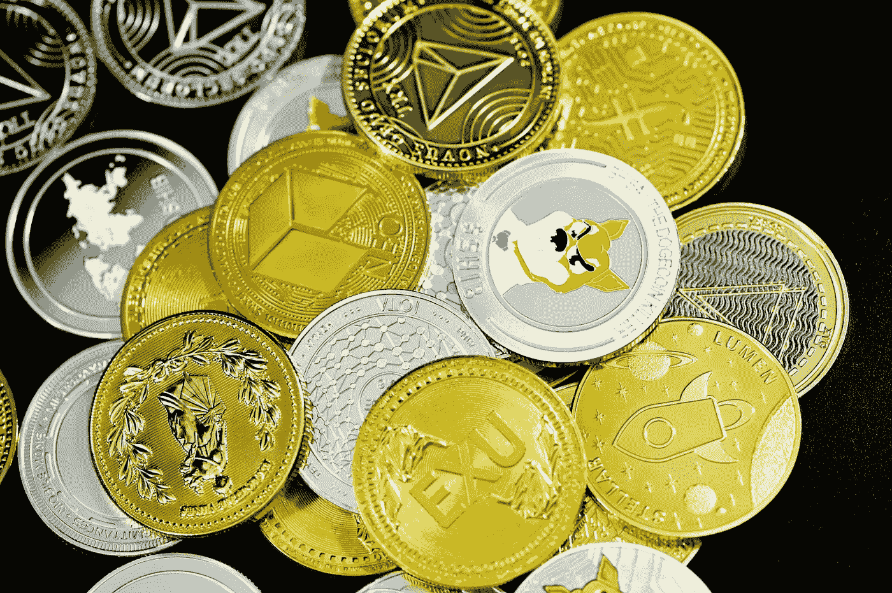

# 迷因币的复仇

> 原文：<https://medium.com/coinmonks/revenge-of-the-memecoins-a31b47d368f?source=collection_archive---------10----------------------->

故事+低价=文化价值

Photo by [Executium](https://unsplash.com/@executium?utm_source=unsplash&utm_medium=referral&utm_content=creditCopyText) on [Unsplash](https://unsplash.com/s/photos/shib?utm_source=unsplash&utm_medium=referral&utm_content=creditCopyText)

如果你关注主流媒体及其对加密货币的报道，你迟早会遇到“memecoins”。这些是“专家”声称应该没有价值的硬币和代币，是一个泡沫，将不可避免地走向文明的遗忘。最新的例子是紧随 T2 总督 T3 之后的 SHIB T1。

抛开歇斯底里不谈，在你嘲笑优越感或抵押你的房子进行投资之前，问问你自己:到底什么是**迷因**，为什么重要？

著名进化生物学家理查德·道金斯在他 1976 年的著作《自私的基因》中创造了“迷因”一词。从最基本的定义来看，模因是思想、意识形态或时代精神的最小单位，可以在人类文化和时间中复制。

> 模因的例子有曲调、想法、流行语、服装时尚、制作罐子或建造拱门的方法。正如基因在基因库中通过精子或卵子从一个身体跳到另一个身体来传播自己一样，迷因在迷因库中通过从一个大脑跳到另一个大脑来传播自己，从广义上来说，这一过程可以被称为模仿。
> 
> 理查德·道金斯

因此，Memecoins 应该被视为加密货币(硬币或代币)，不仅可以在区块链上自由交易，而且是一种思想、图像、流行语或流行趋势的数字表示。这就引出了一个问题:像 SHIB 这样的代币怎么可能在一年内增长 200 万，这意味着什么？为什么*会有人*投资它？

## 还记得比特币没有价值的时候吗？

根据你的年龄和你在加密领域的时间长短，你可能很难想象一个时代，即使是加密市场最具主导地位的比特币也没有什么价值，被视为数字的虚无。

我清楚地记得 2014 年[我发现比特币的时候，一整枚硬币才 300 美元](https://www.investopedia.com/articles/forex/121815/bitcoins-price-history.asp)。在写这篇文章的时候，它现在大约是 66，000 美元。不幸的是，当我遇到 BTC 的时候，我还没有 300 美元，但从那以后，这个时刻就一直吸引着我，因为它不是失去了一个变得富有的机会，而是抓住了一个全新的、改变范式的东西。

那时候，我很难理解为什么有人会重视那些被扔来扔去的本质上是计算机代码的东西，但我也不理解基本原理。比特币独特的历史、无创始人的结构和安全激励特性使其从一个奇怪的赛博朋克文化变成了萨尔瓦多的法定货币。它很可能会继续增长，但没有人知道未来会发生什么。

## DOGE 证明了关于迷因的市场是错误的

Dogecoin 是历史上一个独特的案例，因为它不仅是首批 memecoins 之一，而且是第一个实现现实世界货币价值和意义的。现在交易价格约为 25 美分，这有点像比特币，试着记住不到一年前 DOGE 交易价格在零度以下。这是它度过大部分历史的地方，对密码界的大多数人来说，它被认为是一种有趣、可爱、无意义的硬币，除了作为一种独特的筹款工具之外，它永远不会做任何事情([还记得牙买加雪橇队吗？](https://www.dailydot.com/unclick/dogecoin-jamaica-bobsled-olympics/))因其粉丝基数小。

快进到 2021 年 1 月，当 GME 股票热潮、埃隆·马斯克的推特支持和新冠肺炎的失业困境都达到顶峰时，人们开始焦躁不安地寻找一些东西来为他们的银行账户和社交生活提供价值。DOGE 的价格和受欢迎程度似乎不知从何而来，最终在 2021 年 5 月 8 日达到 73 美分的历史高点。

Dogecoin 现在仍然保持着两位数的价值*并且似乎会一直保持下去，这个简单的事实应该足以证明市场在谈到迷因币时偶尔是错误的，但它也证明了迷因的力量可以出于各种原因在社会的大范围内复制。哪里价格低，哪里人气高，人们就会聚集起来形成集体行动。*

## *价格这么低，谁在乎呢？*

*一些经济学家和心理学家会让我们相信，人是完全理性的，绝不会在廉价的小饰品上浪费钱，不管是数码的还是其他的。如果是这样的话，那么美元树就不会存在，口香糖贩卖机也会在几十年前消失。*

*但事实是，大多数人并没有太多的可支配收入，任何时候只要有人能说服他们不费吹灰之力就有可能让自己的钱翻两三倍(比如彩票)，很多人都会冒这个险。即使是收入较高、受过良好教育的人也知道赌博对人类思维的影响:不费吹灰之力就获得更大价值的东西是原始的、令人陶醉的。*

*当某样东西的价格如此之低，以至于你看不到任何潜在的负面影响(如果趋势继续下去，很有可能真正发横财)，你会得到赌博、一元店经济和娱乐的完美结合。人们只需浏览一下 [r/SHIBArmy](https://www.reddit.com/r/SHIBArmy/) 或 [r/dogecoin](https://www.reddit.com/r/dogecoin/) 的子栏目，就可以看到，无论人们投资什么美元，他们都会立即收获其他人的回报，分享他们的兴奋，并从象征意义上和实际意义上推动价格行动和趋势上升。*

## *更聪明，而不是更难*

*如果你是比特币最大化主义者、铁杆金融极简主义者或只相信 IRA 和指数基金的传统投资类型，你可能会想，你如何才能把你爱的人从 memecoins 的边缘拉回来。我认为有两条路线可供选择。*

*一方面，你不能把人们从他们已经确信是真实的事情上拉回来。就像狂热的宗教运动和时尚将文化能量烧进人们的大脑一样，会有一种附带损害发生，在这种损害中，门外汉将不得不艰难地学习市场如何运作。有些人实际上会赚很多钱，这将进一步推迟课程。只有大量的金钱和时间的损失才能向这些人表明，许多替代性的金融活动可以产生金钱，但是“所有的投资都有风险”这句格言往往是正确的。*

*另一种方法是在数据驱动的基础上比较投资，以达成一致并进行培训。你可以承认，SHIB 可能在一年内上涨了数百万个百分点，但它是否会在同一时期进行交易还有待观察。加密市场充斥着高辛烷值硬币来来去去的故事，我们根本不知道它们的未来会走向何方。比特币和其他成熟的加密货币似乎更有可能长期存在，并且随着时间的推移，它们的巨大百分比收益值得投资，而不是昙花一现。*

> **交易新手？试试* [*加密交易机器人*](/coinmonks/crypto-trading-bot-c2ffce8acb2a) *或* [*复制交易*](/coinmonks/top-10-crypto-copy-trading-platforms-for-beginners-d0c37c7d698c) *上* [*最好的加密交易*](/coinmonks/crypto-exchange-dd2f9d6f3769)*

> *加入 Coinmonks [电报频道](https://t.me/coincodecap)和 [Youtube 频道](https://www.youtube.com/c/coinmonks/videos)获取每日[加密新闻](http://coincodecap.com/)*

# *另外，阅读*

*   *[免费加密信号](/coinmonks/free-crypto-signals-48b25e61a8da) | [加密交易机器人](/coinmonks/crypto-trading-bot-c2ffce8acb2a)*
*   *杠杆代币的终极指南*
*   *[16 款最佳折叠电动自行车](/coinmonks/top-17-folding-electric-bikes-5e296f0918cb)*
*   *[28 款最佳电动自行车点评](/coinmonks/the-28-best-electric-bikes-review-and-buying-guide-in-2023-7bb3146cb403)*
*   *前三名[币安期货交易机器人](/coinmonks/top-3-binance-futures-trading-bots-e6031f84b3f9)*