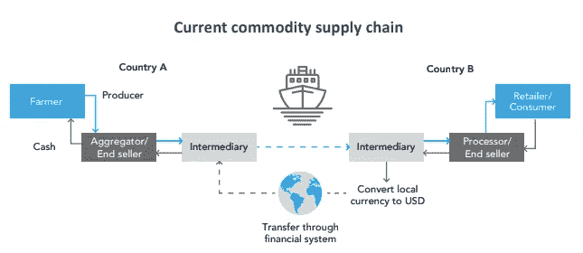
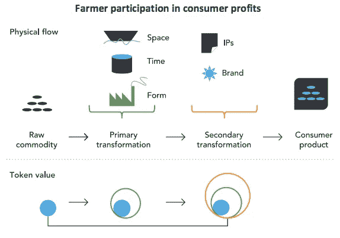
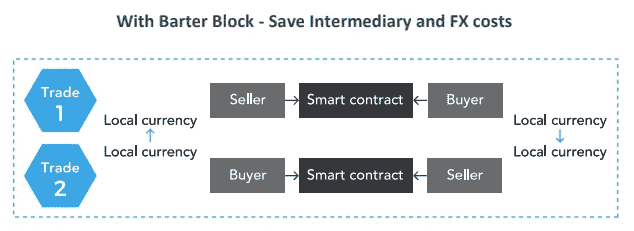
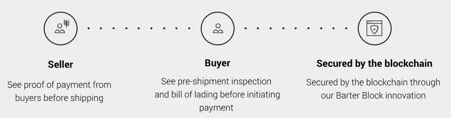
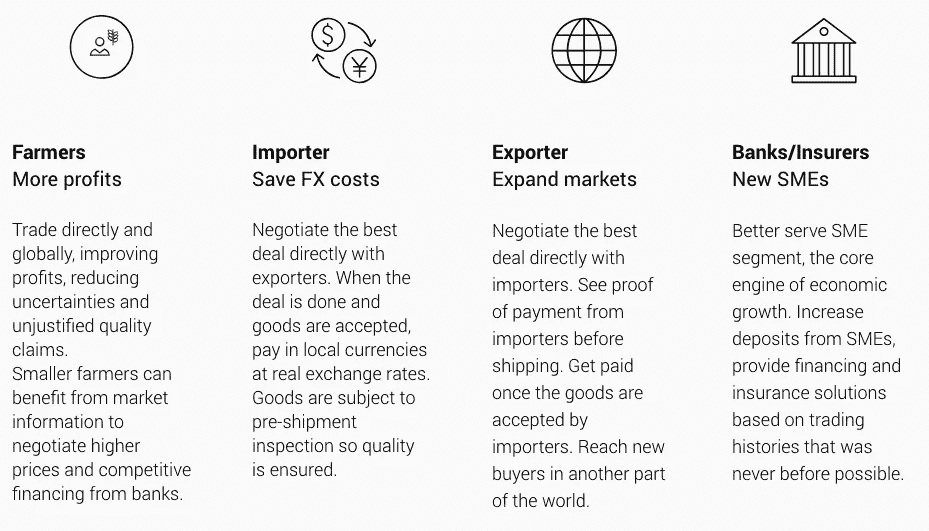
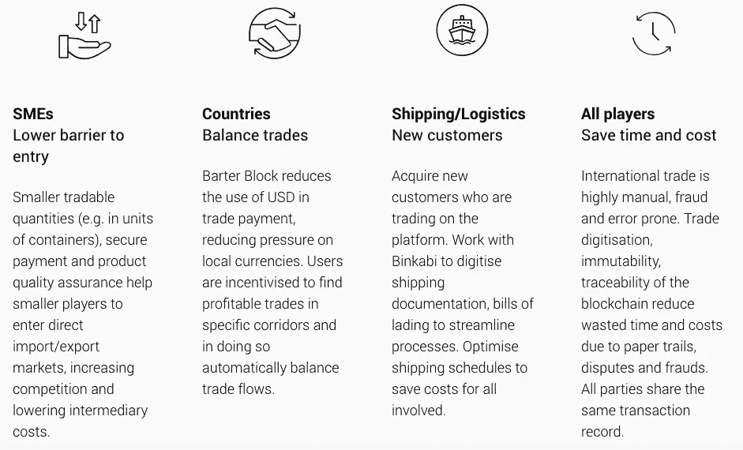
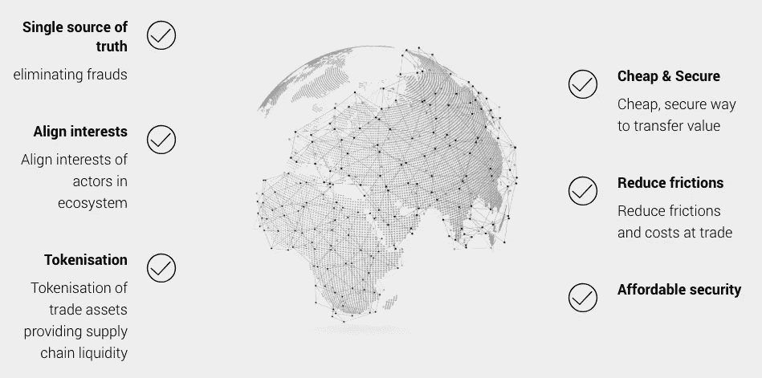

# 回顾 bin kabi——农业商品的公平智能易货解决方案

> 原文：<https://medium.com/coinmonks/review-binkabi-a-fair-smart-bartering-solution-for-agro-commodities-3f56fd8ecad9?source=collection_archive---------1----------------------->

对于普通农民和发展中国家来说，这是一个巨大的机会

因卡比正在处理一场无声的危机，这场危机影响到那些照顾我们日常食物的人。

农业市场让发展中国家的普通农民失望了。

这些普通农民生产了世界粮食的很大一部分，但往往只能勉强养活自己的家人。

Binkabi 基于区块链的解决方案旨在为那些为产品提供价值的人提供巨大的价值，并剔除那些不提供价值的人。

免责声明++这不是财务建议或税务建议。+++你是在自担风险投资！+++投资前先做好自己的调研！+++没有人付钱给我写这篇评论，我只是一个项目的粉丝，这个项目在很大程度上看到了让世界变得更美好的巨大潜力++

**1。** **一个紧迫的现实问题**

多年来，我们面临着严重的饥饿和营养不良问题:

“世界饥饿是一种全球性流行病。根据联合国的数据，今天有九分之一的人——全球有 8 . 15 亿人——缺乏健康生活方式所必需的食物。令人震惊的是，其中 98%生活在发展中国家，75%生活在以农业为生的农村地区。随着人口密度的增加和资源的减少，世界饥饿的持久影响似乎只会变得更糟。全球社区都在呼吁变革，无论是何种形式的变革，都是为了朝着正确的方向前进。”[文章](http://www.mhlnews.com/global-supply-chain/one-man-s-trash-how-blockchain-can-target-food-waste-help-end-world-hunger)

主要问题之一是食品价格。

发展中国家的一些人根本负担不起。

但是价格就是价格，由市场决定。因此，除了政府补贴之外，没什么可做的。正确吗？

不完全是。当你仔细观察价格时，你会发现并不是所有参与方都能给商品带来真正的价值。

以大米为例。全球 3.5 法案。人们以大米为主食。

稻农得到价格的 10%，甚至更少。另外 45%用于其他增值领域，如大米运输、工厂、包装、超市等。其余 45%用于金融中介和边境交易税:

发展中国家的贷款利率(如果农民能得到贷款的话)很高。在非洲，这一比例通常在 20%以上。

农民被迫在收获季节出售以偿还债权人。除非收成不好，否则每个人都在卖，所以价格很低。

如果农民甚至在收获前就需要钱，或者不想承担风险，他可以在收获前两到三个月以 20-30%的折扣预售。

该工厂还提前出售大米(期货)以获得流动性

中间商:由于缺乏信任，大多数国际贸易都是通过中间商进行的，根据供应链整合的程度，中间商通常收取 10-30%的费用。一些中介只是做背对背交易，赚取 10-15%的利润。其他拥有自己的仓储设施和分销网络的公司也能获得 15%至 30%的利润。

大米出口商经常延迟 3 个月才收到货款，而且必须把这笔钱计入他的价格中，因为他还要支付高额利息。16%和 3 个月的还要在价格上再加 4%。

进口商以美元/欧元付款，并将当地货币兑换成美元/欧元。这增加了 7-10%的外汇成本。对于货币出口受限的国家，这一比例甚至可能高达 20-25%。通常费用不会公开显示，而是隐藏在糟糕的汇率中。

出口商将把美元/欧元兑换成当地货币。这增加了额外的成本。

大约 75%的世界贸易是以美元或欧元进行的，而这两个经济集团之间的贸易仅占所有贸易的 40%。35%用于必须将本国货币兑换成美元/欧元进行国际贸易的国家，并且必须为这种兑换付款，这增加了货物的成本。

总的来说，一袋零售价格为 4.27 美元的大米平均有 2.37 美元的股权投资。这是从农民到零售店的每一方所增加的总价值。其余的都是金融中介费用和边境税等。，所有这些都没有增加产品本身的价值。

来源:播客[掌控未来#E17](https://castbox.fm/episode/E17%3A-Scott%2C-Sweetbridge-building-an-Economy-OS-and-spreading-the-wealth-id618090-id55957491)

另一个因素是国际现货市场上大米价格的波动。超市的价格保持不变，但农民的份额在很大程度上取决于国际大米市场及其投机行为:

[’https://d3fy651gv2fhd3.cloudfront.net/embed/?s=RR1&v=20180514184000&d1=19180101&d2=20181231&h=300&w=600'](’https://d3fy651gv2fhd3.cloudfront.net/embed/?s=RR1&v=20180514184000&d1=19180101&d2=20181231&h=300&w=600')

来源:[tradingeconomics.com](’https://tradingeconomics.com/commodity/rice')

来源:[https://tradingeconomics.com/commodity/rice](https://tradingeconomics.com/commodity/rice)

**2。****Binkabi 方法是什么？**

**整体方法**

Binkabi 正在通过将竞争从节点转移到网络来创建一个更公平的供应链利润分配模型。节点是供应链中特定阶段的参与者，而网络是整个供应链本身。

根据商品，围绕某一商品的位置和时间网络被优化形成，以与其他网络(如 ABCD 或 NOW)竞争。将供应链中的不同参与者视为一家大公司中的不同部门/部门。能够“看穿”供应链参与者的经营业绩，使得面向客户的节点能够形成最有效的供应链为客户服务。在确定其在整个网络利润池中的份额时，将根据其附加值与成本对该供应链中的每个成员进行评估。这将使宾卡比网络能够与没有共同股权结构的其他网络(如跨国公司)进行有效竞争。

农民和小玩家将分享网络利润池中更公平的部分。

**从易货区开始**

宾卡比开发了一个商品最终买方和最终卖方的市场。这将有助于减少贸易中介，在价值链中更广泛地分配利润。它由一个结算系统组成，买方通过易货区(一种智能的易货机制)以各自的当地货币付款，卖方接收。

宾卡比推动农业商品的象征性化，使其在区块链可以交易。宾卡比将重新构想农业供应链，使农民和供应链上的其他参与者能够获得更公平的利润分配。"

易货区是进口商和出口商见面的市场

a)每个出口商和进口商都希望使用当地货币，以避免兑换成美元/欧元的额外费用。连接这两个国家的进口商和出口商，引导资金流动，使其停留在各自的货币范围内。

b)提供一个安全交换货物和金融交易的系统。

c)为参与者增加附加值。

**a)** **连接出口商/进口商以避免外汇成本**

宾卡比易货区是世界上第一个在区块链的智能易货协议。它允许双边贸易以当地货币结算，节省了外汇成本，增加了国际贸易利润。

相反的交易被冻结在一起进行结算。易货交易可以在交易前或交易后形成，在一个出口贸易和一个进口贸易之间，或者在许多出口贸易和许多进口贸易之间，前提是在一个国家内，贸易净额下降到接近零，并且它们的结算日期接近。交易系统力求将外汇风险降至最低。

**b)** **提供交易安全系统**

Binkabi 在发货前向卖方提供了买方已付款的证明。在买方方面，Binkabi 提供了货物通过检验的证明和电子提单。一切都由一个区块链保护着，它是不可改变的，只会膨胀。

当然，工作流程比上面显示的更复杂。详细的解释可以在即将发布的白皮书中找到

**c)** **提供附加价值(建立强大的网络)**

Binkabi 支持供应链资产(如商品仓单)的令牌化。

对农民来说，这将确保更广泛的市场准入，使他们的产品获得更高的价格。农民也可以将代币作为抵押品，获得短期贷款，以支付生活费用，同时等待更高的价格出售。

代币交易将消除发展中国家建立昂贵的中央商品交易所的需要。利用区块链技术，Binkabi 将使银行能够获得关于资产、负债和交易历史的准确和及时的数据，使它们能够向 Binkabi 网络成员提供有竞争力的融资方案。

**3。** **区块链对宾卡比有意义吗？**

Binkabi 是一家供应链创业公司。他们的系统将为他们要创建的网络的“中间”伙伴而构建。因此，这是一家真正的区块链创业公司，它将区块链置于其流程的中心，以实现成功所需的非中介化和信任:

**4。** **有哪些值得期待的结果？**

**基于区块链的解决方案的一般优势**

不再有长纸痕迹

通过区块链的数字化、不变性和可追溯性减少浪费的时间和成本

由于所有相关方共享单一版本的真相，争议和欺诈大幅减少

商品的符号化为数字化和贷款提供了基础

**宾卡比易货解决方案的特殊优势**

降价 20%

为普通农民提供更好的价格

最小化双边贸易的外汇成本

更强的国家货币

中小企业可以直接进口或出口，不需要通过大型中间商

更多的玩家可以加入国际贸易

发展中国家间贸易的增长

有了能够将资产令牌化的适当系统，成本较低的保险产品将会出现，当然，系统中的贷款人会要求农民购买保险。但随着整个链条上的令牌化资产和透明度——加上无人机等其他验证技术——这种保险将以合理的成本提供。

**大局**

2013 年，世界经济论坛发表了论文“[促进贸易重视增长机会](http://www3.weforum.org/docs/WEF_SCT_EnablingTrade_Report_2013.pdf)”。他们估计，减少供应链贸易壁垒可以使 GDP 增长近 5%，贸易增长 15%。他们没有想到一个能最大限度降低外汇成本的易货解决方案。

**举几个例子**

如果你仔细看看一些[真实世界的例子](http://www.binkabi.io/cases)Binkabi 解决方案如何帮助农业贸易中的参与者，你会发现 bin kabi 将为参与的发展中国家做更多的事情:

**A.** **一家大型贸易公司因尼日利亚缺乏美元而受到影响** 在亚非走廊的大米贸易中，收入从一年 2 亿美元的峰值下降到几乎为零，原因是尼日利亚禁止使用美元进口大米。Binkabi 将帮助该公司和尼日利亚维持基本食品的进口，同时不花费该国因原油价格暴跌而减少的美元储备。

科特迪瓦。当地腰果贸易的现实情况科特迪瓦向越南出口价值 6 亿美元的腰果，进口价值约 1 . 5 亿美元的大米。目前，结算是按毛额进行的，最终导致农民的额外费用。有了 Binkabi，不仅可以节省大量外汇兑换成本，而且规模较小的企业也可以进入出口市场，而传统上，出口市场是为拥有既定联系、融资渠道和供应链专业知识的大型企业保留的。

**C.** **亚非商品交易的新来者** 作为芝麻、腰果、乳木果等商品空间交易的新来者，寻找买家是 Aethon 的首要任务。Aethon 将与 Binkabi 合作，寻找来自越南和东亚其他国家的买家。它还在寻找一种比背对背交易更可持续的模式，因为一旦最终买家和卖家相互识别，中间商就越来越多地被排除在未来交易之外。

**d .**越南。Loc Troi 直接向非洲出口
Loc Troi 是越南顶尖的农业综合企业，专门从事农作物保护分销和大米加工及出口。该组织与 40，000 个小农家庭合作，创造了 1 . 5 亿美元的大米收入。它正寻求将出口市场扩大到非洲。

**E.** **南非柑橘出口贸易**
南非柑橘产业每年出口约 1 亿箱柑橘，价值约 7 亿美元。大部分出口是由代理商经手的，他们收取港口交货价格的 7%左右，而没有承担太大的风险。小种植者必须相信他们的代理人会为他们做出最好的交易，但情况并非总是如此。结果，很多种植者都倒闭了。这是一个将卖家与全球买家直接联系起来的机会，也是一个将柑橘销售和营销转变为精益透明运营的机会。

**5。** **强势令牌经济学**

Binkabi 在中心有一个折扣代币(效用代币)来建立和发展 Binkabi 网络。该平台的用户需要持有宾卡比令牌(BKB)才能使用该平台上的服务。令牌的效用级别取决于有多少令牌被激活以及平台的使用级别。

BKB 鼓励在平台上的积极参与和良好行为:

a.**会员会带来新会员**，因为活跃用户越多，找到合适的交易对手的机会就越大，并节省外汇成本(7-10%)。

b.**易货交易奖励**当会员引入新会员形成易货交易时(在正常费用折扣的基础上进一步降低费用)，以 BKB 代币支付，为平台增长和 BKB 使用创造了病毒效应。

c.BKB 还将被用作**履约保证金**，激励各方按照合同履约(确保所有参与方进行实物现货交易或远期交易)。履约保证金与会员信誉等级动态挂钩。

d.**第三方提供商**(如银行、保险公司、仓库、航运公司、质量控制员、受托人、审计员)需要持有一定数量的 BKB 代币，才能在 Binkabi 平台上提供服务。Binkabi 获得收入分成。大部分收入进入折扣池，为会员提供折扣。

无论是费用折扣还是履约保证金，BKB 都需要被锁定或“激活”。这将降低 BKB 代币的流通速度。

BKB 代币持有者从使用代币中获得更多价值，而不仅仅是拥有它。这是由于使用 Binkabi 网络服务的折扣价值。

BKB 鼓励用户积极参与，因此它有一个内在的稳定性。使用的 BKB 代币越多，持有者获得的收益就越高。BKB 的内在价值很大程度上取决于用户对平台的参与。在某种意义上，BKB 是一个稳定的象征，但它的稳定性不是用美元或其他货币来衡量的，而是用会员在 Binkabi 网络上使用的服务的费用折扣来衡量的。

**6。** **团队、顾问和网络**

宾卡比的创始团队在国际农业贸易和高级金融领域有着长期的实战经验。他们在这一领域已经工作了 7 年，拥有客户和许多与相关参与者的额外联系，这些客户和联系将受益于 Binkabi 的解决方案。

领导团队:

**全乐(CEO)**——在普华永道做了 16 年的审计师后，他在 2011 年创立了 growmoreX，一家农业技术和工程公司。他们已经为投资者做了大约 30 个项目，这些投资者希望在水稻、木薯、番茄等主要可耕地上建立新项目。

[**曼瑞唐**](https://www.linkedin.com/in/manrui-tang-6a79aa28/) **【首席运营官】** —曼瑞是一名训练有素的注册会计师。她在伦敦为普华永道和国家电网工作了 9 年，从事并购交易。

[**安德鲁·内文博士**](https://www.linkedin.com/in/andrew-s-nevin-phd-9a525b2/) ( **首席经济学家**)——普华永道西非咨询合伙人、首席经济学家 6 年多。在担任普华永道金融服务战略咨询总监之前，他是香港和中国一家电子学习创业公司的创始人和董事长，也是中国一家医院集团的总裁兼总经理。和一些管理职位。

[**托马斯·巴克**](https://www.linkedin.com/in/thomasbarker/) **(首席架构师)**—2015 年初至今区块链专家。伦敦一家员工所有的软件开发和咨询公司的主管。关注金融科技和区块链，尤其是以太坊。在 BullionVault 金融科技领域工作 6 年前。从可视化 Javascript 效果到基于 PL/SQL 的结算会计。介绍了 BullionVault 的欧洲银行设施，并编写了如今处理 BullionVault 所有银行付款的逻辑；以及规划、购买和安装当前的数据中心。

您将在他们即将发布的白皮书中找到对该团队更详细的描述。

团队的动力，正如他们的名字 Binkabi 所描述的那样，这个名字的灵感来自于代表和平与和谐的西非符号“Bi Nka Bi ”:

“你实际上给他们的生活带来了真正的变化，他们可能一整年都在非常努力地工作，每天只能得到 3-4 美元，但他们仍然必须在作物季节开始时以目前的结构借款购买当季肥料，他们不能长时间保持他们的收成，他们必须立即出售以偿还他们的债务，由于同时出售所有这些东西，他们无法卖个好价钱……”(曼瑞)

“我们的愿景是，我们需要改变这种竞争的性质，因此，每个人都应该合作，而不是试图挤压链条上的下一个人。当然，每个人都需要增加价值，但他们需要合作，这样才能作为一个网络竞争。”(全)

**Sweetbridge 联盟的成员**

Binkabi 是 [Sweetbridge Alliance](https://sweetbridge.com/alliance) 的成员，该联盟是一个强大的全球网络，致力于将区块链的供应链解决方案推向世界。他们创造了一个折扣代币模型，看起来类似于宾卡比设想的模型，当然也影响了这个模型。

Sweetbridge 的首席执行官 [Scott Nelson](https://www.linkedin.com/in/scott-nelson-46025b73/) 是 Binkabi 的顾问委员会成员。他在供应链行业拥有超过 35 年的经验，自 1995 年以来，他已经与 50 家全球最大的公司和数亿美元的交易量一起解决了长期复杂合同的代码表示问题。此外，宾卡比的顾问委员会中还有亨利·贝林厄姆爵士，他是一位人脉广泛的前英国议会副国务大臣兼英联邦事务大臣。从区块链方面来说，这一点得到了罗布·奈特(Rob Knight)和维奈·古普塔(Vinay Gupta)的补充。Vinay 在 2015 年 7 月协调了区块链平台以太坊的发布，是区块链空间的知名人物。此外，[Long Vuong](https://www.linkedin.com/in/longvuong22/)(tomo chain 的创始人& CEO，NEM·区块链的前项目负责人)是 Binkabi 顾问委员会的成员。

**7。** **时间线**

宾卡比目前处于 MVP 阶段。

Binkabi 的目标是在 2018 年第三季度通过真实交易和真实客户进行易货交易的试点阶段，并在 2018 年第四季度进行测试。

Binkabi 计划在 2019 年初在平台上进行第一批实时交易。我们把重点放在已经存在的贸易流向相反的特定走廊上，特别是亚洲和非洲之间，以及越南和西非之间，例如越南-尼日利亚，越南-科特迪瓦，越南-加纳。

**8。** **该不该投资？**

当然，代币产品还没有推出，所以我可以非常宽泛地谈论未来的产品。

市场容量约为 2 万亿美元，当宾卡比解决的障碍消除后，市场容量肯定会快速增长。

两个潜在的交易对:

从科特迪瓦到越南的腰果，每年价值 6 亿美元

大米从越南运往科特迪瓦，每年价值 2 亿美元

到目前为止，每 100 万美元的交易都会产生 7-10 万美元的外汇成本。上述例子中外汇成本的总抵消将导致每年节省 1400 万到 2000 万美元。

这只是一对交易对手。这还没有考虑到 Binkabi 提供的所有其他服务:

**收入模式**

除了象征性的销售收入，宾卡比将获得

交易成功费，取决于
…商品类型
…交易走廊
…交易量
…支付选项(即智能易货或“正常”交易)
…会员身份/声誉(通过向信誉良好的玩家提供折扣来鼓励平台上的正确行为)

与平台上的第三方服务提供商如质检员、货代、船公司、银行、保险公司以及平台上的其他金融服务提供商的收入分成模式

**方法展开**

Binkabi 将专注于他们最熟悉的商品——食品/农业——以及他们最熟悉的贸易走廊——东亚/非洲。随着时间的推移，其他商品和其他走廊将通过内部建设的能力或通过分散模式增加。宾卡比网络将按走廊和商品逐一开发。他们将一次专注于一个国家，发展他们最相关的贸易走廊。一旦完成，它们将以类似的方式进行，其他国家的商品对或商品/非商品也将以同样的方式发展。

**将提供帮助的合作伙伴**

通过 Sweetbridge、Mattereum、TomoChain 和 Ecobank，Binkabi 选择了强大的合作伙伴，这些合作伙伴将提供良好的指导，并为他们提供吸引客户和提供高质量服务的更好机会。

你可能已经注意到了:我不是英国人。抱歉，有任何错误。:-)

如果你喜欢我的评论，请鼓掌 1，2，3..50 次。:-)

**更多深入挖掘的来源:**

网址:[http://www.binkabi.io/](http://www.binkabi.io/)

电报:[https://t.me/binkabi_io](https://t.me/binkabi_io)

推特:【https://twitter.com/binkabi_io 

https://www.facebook.com/binkabinetwork

视频:史考特·尼尔森采访全乐(CEO)和唐曼瑞(首席运营官)【https://youtu.be/rljOEz5-_nI】T2

中:【https://blog.binkabi.io/】T4(博客来自网站)

首席执行官全乐访谈:[谈国际供应链信任、智能易货、供应链从竞争到合作的转变](https://blog.binkabi.io/on-trust-in-international-supply-chains-smart-bartering-and-the-shift-from-competition-to-2652778c2bbb)

文章"[死亡之都的祸害——以及宾卡比解开它的使命](https://blog.binkabi.io/the-scourge-of-dead-capital-and-binkabis-mission-to-unlock-it-ba64c21c62e5) " (3 分钟。阅读)