# 回顾:快速 R-CNN(目标检测)

> 原文：<https://medium.com/coinmonks/review-fast-r-cnn-object-detection-a82e172e87ba?source=collection_archive---------0----------------------->

在 **这个故事中，快速基于区域的卷积网络方法(Fast R-CNN) [1]被回顾。它提高了训练和测试速度，也提高了检测精度。**

1.  **快速 R-CNN 训练非常深的 VGG-16 [2]比 R-CNN [3]快 9 倍，在测试时间快 213 倍**
2.  **PASCAL VOC 2012 上的高等地图**
3.  **与 SPPNet [4]相比，它训练 VGG-16 的速度快 3 倍，测试速度快 10 倍，而且更准确。**

这是一篇 **2015** **ICCV 论文**有**3000 多篇引用**当我在写这个故事的时候。( [Sik-Ho Tsang](https://medium.com/u/aff72a0c1243?source=post_page-----a82e172e87ba--------------------------------) @中)

# 涵盖哪些内容

1.  **现有技术的问题**
2.  **ROI 汇集层**
3.  **多任务损失**
4.  **其他一些消融研究**
5.  **与最先进结果的比较**

# **1。现有技术的问题**

## 1.1.多级流水线

R-CNN 和 SPPNet 首先为 softmax 分类器训练 CNN，然后使用特征向量训练包围盒回归器。因此， **R-CNN 和 SPPNet 不是端到端的训练。**

## 1.2.在空间和时间上都很昂贵

由于**特征向量存储在硬盘中，占用了几百千兆字节**，用于训练包围盒回归器。

## 1.3.慢速物体检测

**在测试时间，使用 VGG-16 的 R-CNN 需要使用 GPU 的每个图像 47 秒，这很慢。**

快速 R-CNN 解决了以上问题！

# 2. **ROI 汇集层**

这其实是 SPPNet 中 SPP 层的一个特例**，只使用了一个金字塔**。下面举例说明:

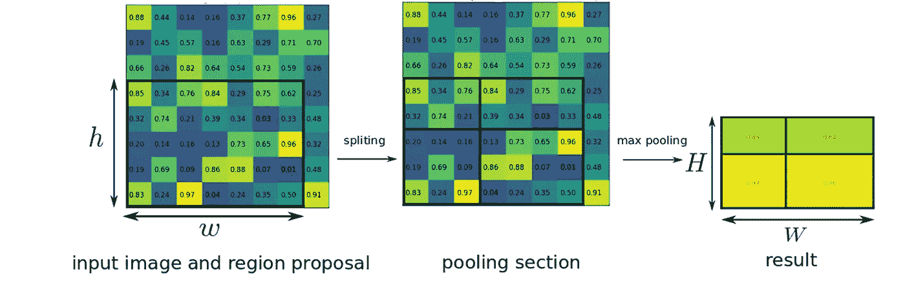

**ROI Pooling**

首先，输入图像通过 CNN 进行特征提取。

区域建议通过基于非深度学习的选择性搜索(SS)方法获得，这与先前的 R-CNN 相同。

每个区域方案产生自适应组合的 RoI，即 RoI 组合。

假设我们得到了带有 *h* × *w* 的**区域方案(左)，我们希望在合并后有一个 H×W** 大小的**输出层输出(右)。然后，每个公摊区的**面积(中间)=*H*/*H*×*W*/*W***。**

在上面的例子中，当**输入 ROI 为 5×7** ，而**输出为 2×2** 时，舍入后每个汇集区域的**面积为 2×3 或 3×3** 。

并且池窗口内的最大值被作为每个网格的输出值，这与传统的最大池层的思想相同。

# **3。多任务损失**

由于快速 R-CNN 是端到端学习架构(除了区域提议生成部分)来学习对象的类别以及相关联的包围盒位置和大小，因此损失是多任务损失。

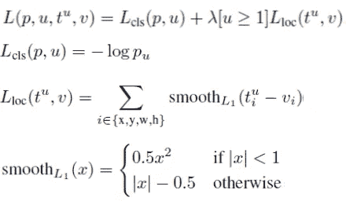

**Multi-task Loss**

***L_cls* 为真实类 *u* 的对数损失。
L_los 是边界框的损失。** 【u≥1】表示当 u≥1 时等于 1。(u=0 是背景类)

**与 OverFeat、R-CNN、SPPNet 相比，Fast R-CNN 采用多任务丢失实现端到端学习。**

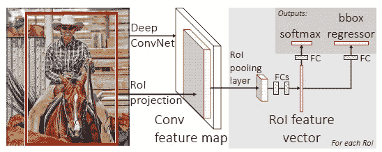

**Fast R-CNN**

对于多任务丢失，在输出端，我们有 softmax 和边界框回归量，如图右上方所示。

3 款评测:
**S = AlexNet 或 CaffeNet
M = VGG 式的更宽版 S
L = VGG-16**

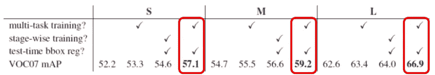

**Multi-task Loss Results**

**在多任务丢失的情况下，与阶段式训练(即 softmax 和边界框回归器的单独训练)相比，获得了更高的 mAP**。

# 4.一些其他消融研究

## 4.1 多规模培训和测试

使用 5 个标度测试输入图像。

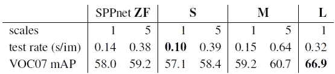

**1-Scale vs 5-Scale**

**使用 5-scale，以较大的测试速率(秒/图像)为代价，为每个模型获得较高的 mAP。**

## 4.2 SVM vs Softmax

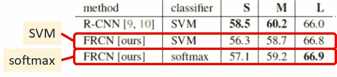

**SVM vs Softmax**

在快速 R-CNN (FRCN)， **softmax 比 SVM 好。**

此外，对于 SVM，特征向量需要在硬盘中存储数百千兆字节，并成为阶段式训练，而 softmax 可以实现端到端的学习，而无需将特征向量存储到硬盘中。

## 4.3 区域提案

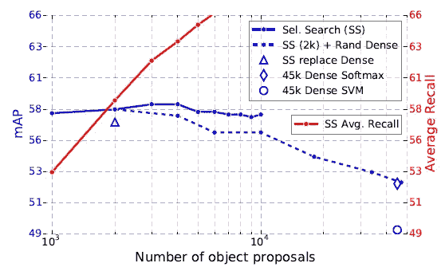

**Different Proposal Approaches**

发现**增加区域提案数量并不一定会增加 mAP。**

**使用选择性搜索(SS) [5]的备用集已经足够好了如上图所示(蓝色实线)(** SS [5]正在 R-CNN 中使用。)

快速 R-CNN 需要来自外部源的区域提议仍然是个问题。

## 4.4 截断奇异值分解，检测速度更快

测试时间的瓶颈之一在 FC 层。

**作者使用奇异向量分解(SVD)来减少连接数目，以减少测试时间。**

**FC6 层 25088×4096 矩阵的前 1024 个奇异值，**和**FC7 层 4096×4096 矩阵的前 256 个奇异值。**

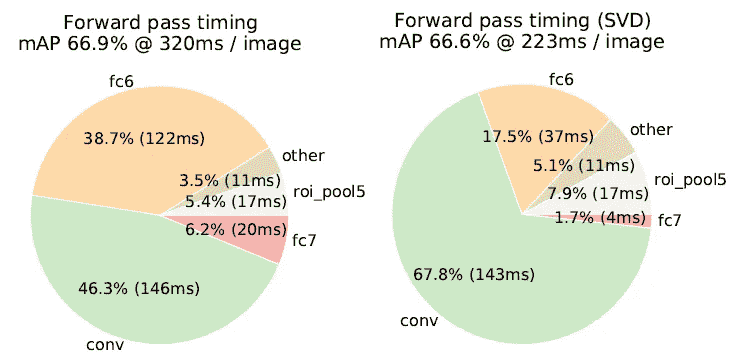

**Large Reduction of Test Time for FC6 and FC7 Layers**

# **5。与最先进结果的比较**

## 5.1 VOC 2007

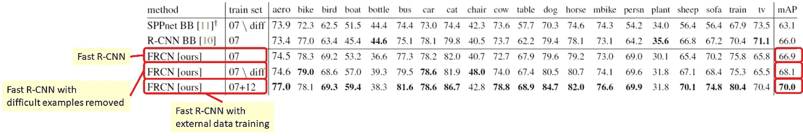

**VOC 2007 Results**

**快速 R-CNN: 66.9% mAP
快速 R-CNN 在训练过程中移除了困难示例(这是 SPPNet 的设置):68.1% mAP
快速 R-CNN 带外部 VOC 2012 训练:70.0% mAP**

## 5.2 VOC 2010

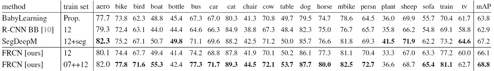

**VOC 2010 Results**

与 VOC 2007 相似，**用外部 VOC 2007 和 2012 训练的快速 R-CNN 最好，有 68.8%的 mAP。**

## 5.3 VOC 2012

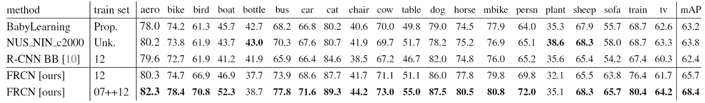

**VOC 2012 Results**

与 VOC 2007 相似，**用外部 VOC 2007 训练的快速 R-CNN 最好，有 68.4%的 mAP。**

## 5.4 培训和测试时间

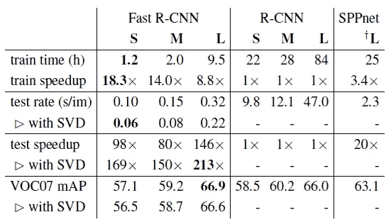

**Training and Testing Time**

如前所述，**快速 R-CNN 训练非常深的 VGG-16 [2]比 R-CNN [3]快 9 倍，测试时快 213 倍。**

与 SPPNet [4]相比，它训练 VGG-16 的速度快 3 倍，测试速度快 10 倍。

# 参考

1.  【2015 ICCV】【快速 R-CNN】
    [快速 R-CNN](https://www.cv-foundation.org/openaccess/content_iccv_2015/papers/Girshick_Fast_R-CNN_ICCV_2015_paper.pdf)
2.  【2015 ICLR】【VGGNet】
    [用于大规模图像识别的极深度卷积网络](https://arxiv.org/pdf/1409.1556)
3.  【2014 CVPR】【R-CNN】
    [丰富的特征层次，用于精确的对象检测和语义分割](https://arxiv.org/pdf/1311.2524)
4.  【2014 ECCV】【SPPNet】
    [用于视觉识别的深度卷积网络中的空间金字塔池](http://citeseerx.ist.psu.edu/viewdoc/download?doi=10.1.1.699.8052&rep=rep1&type=pdf)
5.  【2013 IJCV】【选择性搜索】
    [选择性搜索对象识别](http://www.huppelen.nl/publications/selectiveSearchDraft.pdf)

# 我的评论

1.  [回顾:R-CNN(物体检测)](/coinmonks/review-r-cnn-object-detection-b476aba290d1)
2.  [回顾 AlexNet，CaffeNet——2012 年 ILSVRC(图像分类)获奖者](/coinmonks/paper-review-of-alexnet-caffenet-winner-in-ilsvrc-2012-image-classification-b93598314160)
3.  [回顾:spp net—ils vrc 2014 亚军(目标检测)、季军(图像分类)](/coinmonks/review-sppnet-1st-runner-up-object-detection-2nd-runner-up-image-classification-in-ilsvrc-906da3753679)
4.  [点评:VGGNet—ils vrc 2014 亚军(图像分类)、冠军(本地化)](/coinmonks/paper-review-of-vggnet-1st-runner-up-of-ilsvlc-2014-image-classification-d02355543a11)
5.  [回顾:over feat——ils vrc 2013 定位任务(目标检测)冠军](/coinmonks/review-of-overfeat-winner-of-ilsvrc-2013-localization-task-object-detection-a6f8b9044754)

> 加入 Coinmonks [电报频道](https://t.me/coincodecap)和 [Youtube 频道](https://www.youtube.com/c/coinmonks/videos)获取每日[加密新闻](http://coincodecap.com/)

## 另外，阅读

*   [复制交易](/coinmonks/top-10-crypto-copy-trading-platforms-for-beginners-d0c37c7d698c) | [加密税务软件](/coinmonks/crypto-tax-software-ed4b4810e338)
*   [网格交易](https://coincodecap.com/grid-trading) | [加密硬件钱包](/coinmonks/the-best-cryptocurrency-hardware-wallets-of-2020-e28b1c124069)
*   [密码电报信号](http://Top 4 Telegram Channels for Crypto Traders) | [密码交易机器人](/coinmonks/crypto-trading-bot-c2ffce8acb2a)
*   [最佳加密交易所](/coinmonks/crypto-exchange-dd2f9d6f3769) | [印度最佳加密交易所](/coinmonks/bitcoin-exchange-in-india-7f1fe79715c9)
*   开发人员的最佳加密 API
*   最佳[密码借贷平台](/coinmonks/top-5-crypto-lending-platforms-in-2020-that-you-need-to-know-a1b675cec3fa)
*   [免费加密信号](/coinmonks/free-crypto-signals-48b25e61a8da) | [加密交易机器人](/coinmonks/crypto-trading-bot-c2ffce8acb2a)
*   [杠杆代币](/coinmonks/leveraged-token-3f5257808b22)终极指南