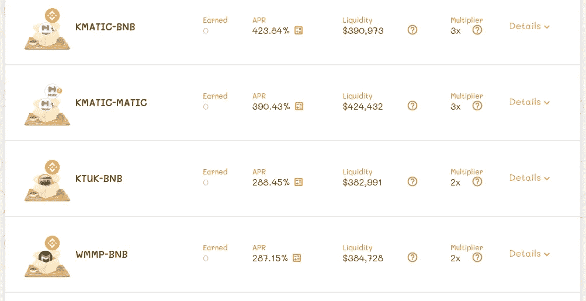

# 复习！！最具创新性的高产农业

> 原文：<https://medium.com/coinmonks/review-foodcourt-the-most-innovative-yield-farming-9f4123da1b01?source=collection_archive---------7----------------------->

在之前的帖子中，我写了关于币安智能链和多边形网络之间的跨链桥[北桥](https://maticdaily.news/killswitch-northbridge-the-best-bsc-to-matic-bridge-tools/)。然而，有一件事是每个过桥工具都必须面对的，那就是低流动性。因此，他们开始与其他金融平台合作来解决这个问题。同样，北桥与 [Foodcourt finance](https://foodcourt.finance/) 合作解决这个问题。在跟踪这个项目一段时间后，我发现这个金融平台不同于其他 PancakeSwap 克隆，它能够解决这个实际问题(低流动性)并引发全新的创新产品。这对我们来说是一个激动人心的时刻。

在这篇文章中，我列出并回顾了他们的产品，以便每个人都了解这些产品是关于什么的，以及它们是如何解决问题的。

# 美食广场产品

目前，Foodcourt finance 有三种独特的创造性的高产农业产品。

# 包装产量农业

Foodcourt 没有建造传统令牌的农场，而是通过将 Safemoon、SafeMars 等受欢迎的安全前缀令牌带到他们的产量农场，展示了他们在这一领域的创新。他们通过创建一个包装的令牌来表示原始令牌，以防止交易过程中的税收。

现在，农民只需要支付包装或打开代币的税。然后，wrap token 将使他们能够在 Foodcourt 生态系统中自由移动 wrap token。

不依赖于唯一的农场，农民可以用 Snackbar(池)来下注，如下图所示:

# 双标准产量农业

这种产量耕作协议是 Foodcourt 解决北桥流动性问题的另一种创新方法。农民们现在可以开始用双方的自动代币提供流动性，以降低非永久性损失。

*   **KMATIC** 表示多边形网络上 MATIC 记号的值。
*   **MATIC** 代表币安智能链上 MATIC 代币的价值。

通过将两个代币放在一起，农民可以从过桥费中获得额外的收益。

# 我最喜欢的食物

为治理令牌创造价值最简单的事情就是给线下世界带来价值。即使是这个市场上的大公司也不愿意这么做，结果也没有这么做。

过程很简单。为了加入投票活动，您需要购买优惠券并投票。然后，你会得到一张优惠券，可以用于不同的目的。

这里有一个例子可以帮助你更简单地理解:

*   Foodcourt 开始为新农场或泳池的名单投票。
*   你可以使用你拥有的优惠券来投票。
*   **您每投一张**优惠券，就会收到一张**特别优惠券，可用于美食广场合作。他们也有一个线下商店，在那里你可以使用特别优惠券。**
*   所有优惠券将被烧毁，团队将评估乘数。然后，将有一个过程来列出赢得投票的池。

更多可以兑换优惠券的使用案例和店铺，可以看看[官方文档](https://foodcourtofficial.gitbook.io/foodcourt/innovation/1-voting-list-food)。

# 结论

对于其他功能和信息，您可以浏览他们的网站。在这篇评论中，我强调了我发现的关于美食广场金融的一些最有趣和最惊人的特征。我希望这篇关于他们独特产品的评论也能让你感到兴趣和惊奇。

尽管他们提供了独特的功能，但还是被 Rugdoc 团队误解了。然而，他们已经向 Rugdoc 团队发送了一封关于他们所关注的问题的公开信。

> 加入 [Coinmonks 电报频道](https://t.me/coincodecap)，了解加密交易和投资

## 另外，阅读

*   [尤霍德勒 vs 科恩洛 vs 霍德诺特](/coinmonks/youhodler-vs-coinloan-vs-hodlnaut-b1050acde55a) | [Cryptohopper vs 哈斯博特](https://blog.coincodecap.com/cryptohopper-vs-haasbot)
*   [币安 vs 北海巨妖](https://blog.coincodecap.com/binance-vs-kraken) | [美元成本平均交易机器人](https://blog.coincodecap.com/pionex-dca-bot)
*   [如何在印度购买比特币？](/coinmonks/buy-bitcoin-in-india-feb50ddfef94) | [WazirX 评论](/coinmonks/wazirx-review-5c811b074f5b) | [BitMEX 评论](https://blog.coincodecap.com/bitmex-review)
*   [比特币主根](https://blog.coincodecap.com/bitcoin-taproot) | [Bitso 点评](https://blog.coincodecap.com/bitso-review) | [排名前 6 的比特币信用卡](/coinmonks/bitcoin-credit-card-bc8ab6f377c6)
*   [双子座 vs 比特币基地](https://blog.coincodecap.com/gemini-vs-coinbase) | [比特币基地 vs 北海巨妖](https://blog.coincodecap.com/kraken-vs-coinbase) | [硬币罐 vs 硬币点](https://blog.coincodecap.com/coinspot-vs-coinjar)
*   [顶级付费加密货币和区块链课程](https://blog.coincodecap.com/blockchain-courses) | [币安评论](/coinmonks/binance-review-ee10d3bf3b6e)
*   [在美国如何使用 BitMEX？](https://blog.coincodecap.com/use-bitmex-in-usa) | [BitMEX 回顾](https://blog.coincodecap.com/bitmex-review) | [币安 vs Bittrex](https://blog.coincodecap.com/binance-vs-bittrex)
*   [最佳免费加密信号](https://blog.coincodecap.com/free-crypto-signals) | [YoBit 评论](/coinmonks/yobit-review-175464162c62) | [Bitbns 评论](/coinmonks/bitbns-review-38256a07e161) | [OKEx 评论](/coinmonks/okex-review-6b369304110f)
*   [比特币基地跑马圈地](https://blog.coincodecap.com/coinbase-staking) | [Hotbit 点评](/coinmonks/hotbit-review-cd5bec41dafb) | [KuCoin 点评](https://blog.coincodecap.com/kucoin-review) | [期货交易机器人](/coinmonks/futures-trading-bots-5a282ccee3f5)
*   [最佳加密交易信号电报](/coinmonks/best-crypto-signals-telegram-5785cdbc4b2b) | [MoonXBT 评论](/coinmonks/moonxbt-review-6e4ab26d037)