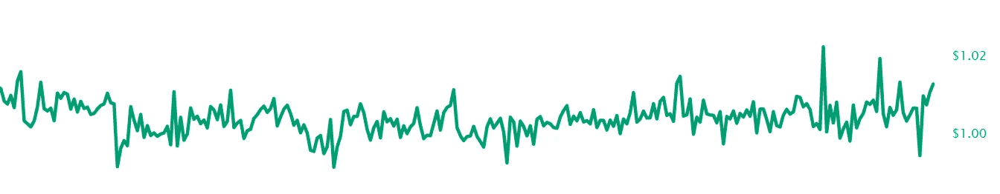

# 回顾:我的加密水晶球 2019-2020 年展望

> 原文：<https://medium.com/coinmonks/review-my-crypto-crystal-ball-2019-and-an-outlook-for-2020-9b2822c0ac08?source=collection_archive---------1----------------------->

一年前，我[发表了一篇关于 2019 年对](/swlh/my-crypto-crystal-ball-7-predictions-for-blockchain-adoption-in-2019-16f0977ab90f)[隐](https://medium.com/coinmonks/crypto/home)和[区块链](https://medium.com/coinmonks/blockchain/home)景观有什么期待的中型报道。结果是我太乐观了。虽然我仍然坚信我的预测的方向，但这些创新中的大多数显然需要更多的时间才能到达大众市场。

Photo by [Jude Beck](https://unsplash.com/@judebeck?utm_source=unsplash&utm_medium=referral&utm_content=creditCopyText) on [Unsplash](https://unsplash.com/s/photos/2020?utm_source=unsplash&utm_medium=referral&utm_content=creditCopyText)

但是让我们来看看不同的预测:

# 排名第一的移动加密钱包

> *预测:2019 年底，我们将在 iOS 应用商店的“金融”部分的前 20 名中看到至少 3 个移动加密钱包。*

Photo by [Jonas Leupe](https://unsplash.com/@jonasleupe?utm_source=unsplash&utm_medium=referral&utm_content=creditCopyText) on [Unsplash](https://unsplash.com/s/photos/mobile-paying?utm_source=unsplash&utm_medium=referral&utm_content=creditCopyText)

我完全失败了，至少从德国人的角度来看是这样。2019 年 Crypto 没有成为主流。2019 年底，苹果将[比特币基地](https://www.coinbase.com/)的应用列为金融领域的第 51 位， [Bison](https://www.bisonapp.com/en/) (博思图加特广受好评的加密应用)列为第 88 位， [BRD](https://brd.com/) 列为第 97 位。

从积极的一面来看，我们看到了 B2C 领域一些**伟大的 UX 进步**:钱包功能被集成到普通(d)应用中。大大改善了用户的登录。当你看到像 OST 的 Pepo 或 T21 这样的开创性应用时，你的第一份工作是写下你的 24 个单词的种子短语，这样的时代已经一去不复返了。像莱杰的 Nano X 这样的硬件设备有助于显著保护手机钱包。

如果你看看 Gnosis 和他们的[全新的多签名钱包](https://safe.gnosis.io/multisig/)，即使是多签名方法(公司或团体持有的基金)也有很大的改进。计划于 2020 年上市。机构级硬件解决方案，如谜语代码或分类账库也适用于移动解决方案。让我们看看 2020 年会发生什么…

# #2 稳定硬币

> *预测:2019 年底我们将在 coinmarketcap.com 看到至少 3 个* [*稳定币*](https://medium.com/coinmonks/stablecoins/home) *市值前 10。*

这次我做得还不错，但是又失败了。

首先是事实:
**泰瑟(USDT)目前在 Coinmarketcap.com 排名第 4，USDC 是第 20，帕克斯是第 31。**

MakerDAO 的[最近推出的](https://blog.makerdao.com/what-to-expect-with-the-launch-of-multi-collateral-dai/) (11/2019)多抵押品 DAI 在从 SAI(单抵押品 DAI)拆分后排名还不合适。你可以在 [DefiPulse](https://defipulse.com/) 或者[戴统计](https://daistats.com/)找到关于戴的有趣统计。在撰写本文时，3.4 亿美元的加密货币被锁定在 MakerDAO 的智能合约中。

2019 年对于[稳定币](https://medium.com/coinmonks/stablecoins/home)来说是重要的一年，尤其是在[脸书宣布了其天秤座项目](https://techcrunch.com/2019/06/18/facebook-libra/)之后——天秤座稳定币位于其前端和中心(见下一章)。稳定的硬币将继续存在——无论它们是由法定货币还是其他更不稳定的加密资产支持——如制造商的戴。

目前，稳定硬币主要用于加密交易。许多集中式交易所提供与 USDT 的替代硬币交易对。因此，交易者可以使用稳定的硬币来购买替代硬币，而不是通过 ETH 或 BTC。

但是，如果你生活在像阿根廷这样的高通胀国家，稳定硬币也有有趣的使用案例，正如 [Mariano Conti](/@nanexcool) 在大阪以太坊的 DevCon V 上令人印象深刻的演讲中解释的那样:

# #3 通过你最喜欢的信使发送(加密)钱

> *预测:脸书将紧随其后，在 2019 年底之前在 WhatsApp 或 Facebook Messenger 中提供加密支付功能——我们中的许多人将会使用它们。【也许他们甚至会推出自己的 FB Token 来赢回一些用户群的喜爱？】*

嗯，[脸书的 Libra 项目](https://www.facebook.com/LibraAssociation)无疑是 2019 年的新闻——即使它还没有启动。Libra 被设计成菲亚特支持的稳定硬币，成为主流媒体的头条新闻。许多政治家醒悟了。就连美国国会也在 7 月 27 日邀请了脸书的代表回答他们的问题——将 Libra 比作比特币——并讨论 Libra 对国家货币如美元的影响。在这些听证会上，人们可以真切地感受到对比特币去中心化设置的更多同情——比特币取得了多么大的成就啊…

因此，央行数字货币(CBDC)现在是热门话题——包括中国在内的几个国家觉得有必要响应脸书的做法，在数字货币方面进行创新，并利用区块链技术的优势——即使它远离比特币背后最初的去中心化思维。

但是当每个人都在猜测 Libra 的时候，其他的 messenger 项目已经在运行和发展了。例如 [**降落伞**](https://www.parachutetoken.com/) 使电报用户能够通过他们的 [ParJar](https://www.parjar.io/) 接口[通过聊天消息发送 40 种不同的加密令牌，包括像$BTC 和$ETH](https://www.parjar.io/coins) 这样的主要货币。其中一个最酷的功能是你可以用法定货币来表示金额，比如“/小费 10 美元 BTC”——把价值 10 美元的 BTC 送给一个朋友(在这里找到详细信息)。这就是未来的样子…

# #4 加密支持信用卡

> *预测:2019 年，我们将看到超过 100 万张加密借记卡&信用卡发行。
> 【我猜大部分会用在亚非拉南美的新兴国家。】*

Photo by [Ales Nesetril](https://unsplash.com/@alesnesetril?utm_source=unsplash&utm_medium=referral&utm_content=creditCopyText) on [Unsplash](https://unsplash.com/s/photos/credit-card?utm_source=unsplash&utm_medium=referral&utm_content=creditCopyText)

很难判断有多少人真正使用加密信用卡。确实有许多加密支持的借记卡和信用卡产品，但它们远非主流。主要原因是，由于以下几个原因，加密通常仍不用于支付:

1.  主要加密货币的波动性。
2.  交易成本太高。
3.  不明确的税务问题(大多数加密支付都是与税务相关的事件)
4.  交易的终结:加密交易的“结算”仍然需要几秒到几分钟(当然取决于协议)。

像[比特币的闪电网络](http://lightning.network/)这样的第二层协议即将消除交易成本和更快终结等问题，但让我们诚实地说:我们还没有到那一步，可能还需要几年时间才能实现“黄金时间”。大多数人仍然持有他们的加密资产，实际上并不使用它们来支付他们的比萨饼…

# 排名第五的 NFT 和加密收藏品

> *预测:至少有一个像* [*Maecenas*](https://blog.maecenas.co/picasso-auction-nem-0x-makerdao) *(图片)或* [*Ujo*](https://www.ujomusic.com/) *(音乐)这样的 NFT 艺术平台将在 2019 年获得关注，到 2019 年底注册用户将超过 100 万。*

Photo by [Daian Gan](https://www.pexels.com/@daiangan?utm_content=attributionCopyText&utm_medium=referral&utm_source=pexels) from [Pexels](https://www.pexels.com/photo/brush-painting-color-paint-102127/?utm_content=attributionCopyText&utm_medium=referral&utm_source=pexels)

我的这个预测完全错了。 NFT 艺术在 2019 年并不是一个大话题。Maecenas 在 2019 年没有发布任何重大更新，Ujo 也非常沉默——只是[尝试通过国家频道](https://blog.ujomusic.com/introducing-streaming-payments-for-ujo-with-connext-payment-channels-and-dai-16725929fe38)获得更便宜的支付。

但是不同领域的人们都在认真考虑利用 NFTs:
例如[海洋协议](https://oceanprotocol.com/)试图[在他们的数据经济中使用不可替代的数据令牌](https://blog.oceanprotocol.com/data-tokens-2-fungible-composable-54b6e0d28293)。像 Stryking 这样的公司与拜仁慕尼黑这样的品牌合作出售收藏品。像 OpenSea 这样的加密收藏品市场逐渐成熟。

# #6 基于代币的游戏

> *预测:我们将会看到至少 5 个成功的电脑游戏(每个> 500.000 用户)使用加密代币作为游戏内货币或 NFT 作为游戏内资产。*

Photo by [JESHOOTS.com](https://www.pexels.com/@jeshoots-com-147458?utm_content=attributionCopyText&utm_medium=referral&utm_source=pexels) from [Pexels](https://www.pexels.com/photo/blur-close-up-device-display-442576/?utm_content=attributionCopyText&utm_medium=referral&utm_source=pexels)

**又失败了。** [**诸神被解放**](https://godsunchained.com/) 是目前最杰出的加密游戏。它的创造者不可改变的[在 9 月份筹集了 1500 万美元](/@immutable/immutable-raises-15-million-for-gods-unchained-b235e1963fba)。该游戏使用以太坊的不可替代代币，根据以太坊的统计，目前约有 3200 名代币持有者。看到游戏产业的进一步发展将会很有趣。

2020 年将为 NFT 带来一些有趣的发展:体育收藏品的大玩家之一帕尼尼刚刚宣布[将 NFT 用于他们的体育明星收藏品。是的，我们会在区块链上看到科比和内马尔。](https://www.prnewswire.com/news-releases/panini-america-becomes-first-to-launch-collection-of-officially-licensed-trading-cards-featuring-blockchain-technology-300977851.html)

# #7 忠诚度计划

> *预测:2019 年，我们将看到至少 3 个重要的基于令牌的忠诚度系统，每个系统都拥有超过 100，000 名用户。*

**再次:还没到。**很明显，这个领域的许多项目仍然受到他们的区块链基础协议的缺点(速度、可伸缩性、UX)的困扰，你可以在[这篇 Carry Protocol](/carryprotocol/carry-protocol-project-update-report-november-ccc56ce049b4) 的文章中读到这一点。

其他项目如 [OST](https://ost.com/) 试图通过创建他们自己的第二层解决方案(在这种情况下是以太坊侧链)和[令牌和移动 SDK](https://platform.ost.com/)来规避这些技术问题。虽然 [OST](https://ost.com/) 在 2019 年确实取得了一些重大的发展进展，并推出了第一批忠诚度计划，如他们为大黄蜂推出的 [LGBT 令牌，但在进入主流使用之前还有一段路要走。](/ostdotcom/hornet-reaches-4400-mainnet-users-of-lgbt-tokens-powered-by-ost-ostdotcom-hornet-delivering-on-dafc4a30f0ca)

# 我没想到的是…

Photo by [Paul Hanaoka](https://unsplash.com/@paul_?utm_source=unsplash&utm_medium=referral&utm_content=creditCopyText) on [Unsplash](https://unsplash.com/s/photos/surprised?utm_source=unsplash&utm_medium=referral&utm_content=creditCopyText)

有些发展我肯定没想到会发展到那种程度。

例如，围绕[马克尔道](https://makerdao.com/en/)、[大院](https://compound.finance/)、 [dydx](https://dydx.exchange/) 或 [Synthetix](https://www.synthetix.io/) 的 **#DeFi 运动**将以太坊推向了一个新的叙事，并为去中心化金融创造了一个由积木组成的[整体生态系统。](https://defiprime.com/ethereum)

我也没想到 2019 年政治会那么多介入区块链。尤其是德国政府为区块链的收养奠定了重要的基础——有些人甚至宣布德国成为“地下天堂”。让我们看看会发生什么。目前，在德国有很多关于**安全令牌产品(sto)**的活动。

# 摘要

很明显，我真的不擅长预测未来——至少在可测量的数字方面。；-)
很多我喜欢的用例都需要更多的时间才能变成现实。

虽然像上面大多数这样的颠覆性创新是非常有趣的想法，但它们真的很难带给大众。创新的难点不在于拥有一个伟大的想法，而在于始终需要大量奉献和毅力的执行。

因此，可能是简单的、渐进的改进首先使区块链技术成为主流。主要的优势可能最终就像“摆脱纸张”一样简单。主要的变化可能发生在“幕后”——没有人会注意到。

***免责声明:*** *本文无意成为任何形式的投资建议。如果你打算投资本文提到的某个项目，自己做研究并寻求专业支持。*

***延伸阅读:*** *如果你喜欢这个故事，你可能还想看看我早期的作品* [*【数字化市场民主化】*](/swlh/democratizing-the-digital-markets-787b749b3405) *或者我的* [*【区块链 vNext 系列】*](/swlh/blockchain-vnext-a-series-ff5469aa1f22) *。*

也欢迎你在 [Twitter](https://twitter.com/sgrasmann) 上关注我，或者通过 [LinkedIn](https://www.linkedin.com/in/sgrasmann/) 联系我(但请告诉我你是通过媒介找到我的)。

> [在您的收件箱中直接获得最佳软件交易](https://coincodecap.com/?utm_source=coinmonks)

