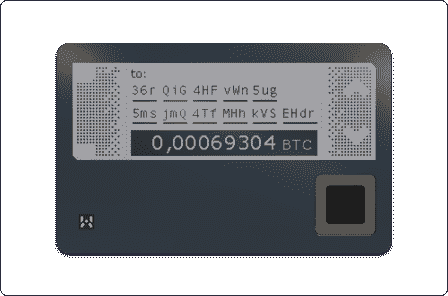
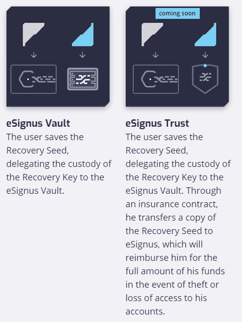

# eSignus 硬件钱包产品回顾

> 原文：<https://medium.com/coinmonks/review-of-esignus-hardware-wallet-offering-973ff9dd1c7b?source=collection_archive---------0----------------------->

## 引起关注的 HASHWallet“特性”

由 [@vicariousdrama](https://twitter.com/vicariousdrama)

654886–654896

# 介绍

我想事先说明，我没有这个硬件钱包，也没有对它进行物理检查。其中的所有陈述完全基于 eSignus 在其网站上提供的信息。因此，有些说法可能是基于误解。该设备尚未发布，因此发布后某些方面可能会发生变化。

如果你是这个设备的支持者，我恳求你做你自己的研究(DYOR ),不要盲目相信我自己或制造商。对于 eSignus 和 CardLab 团队来说，很明显一些决定在一开始就是有意的。我祝您在努力中好运，并强烈鼓励您采用标准来避免通过供应商锁定来滥用用户。

像往常一样，我不会回顾该设备的所有功能，而是选择一些特征来引起注意。

# 我喜欢的东西

如果我不承认这款设备的一些我确实喜欢的功能，那我就失职了。我想确保制造商知道我(可能还有其他人)想要什么，这样他们就能洞察如何将新设备推向市场

## **信用卡外形**

这个尺寸(85.6 毫米 x 54mm 毫米)非常适合放在现有的传统实体钱包中。厚度只有 1.5 毫米，不会过于笨重。

为什么重要:随着数字货币越来越多地被采用，[硬件钱包](/coinmonks/the-best-cryptocurrency-hardware-wallets-of-2020-e28b1c124069)与传统的借记卡、信用卡和感应卡具有相似的外形，更容易被用户随身携带，作为日常消费钱包。

## **大型电子墨水屏幕**

大屏幕很好。莱杰纳米最大的缺点之一是它的屏幕太小，需要大量的滚动。 [Trezor](https://blog.coincodecap.com/go/trezor) 和 [ColdCard](https://blog.coincodecap.com/go/coldcardwallet) 钱包屏幕较小，但仍需要分页交易信息。

为什么这很重要:设备上一次可以评估的信息越多越好。此外，它还可以提高更大字体的可访问性。

## **防水防尘**

它声称 IP-67。这意味着它可以防止接触有害灰尘，并且可以在 1 米深的水中浸泡 30 分钟。

为什么这很重要:具有信用卡外形的钱包不可避免地会出现在钱包、口袋等地方，并且可能会暴露在雨水中、意外地在游泳池中短暂浸泡等。

## **安全元件**

该网站并没有明确说明这一点，但似乎在这种情况下，安全元素是运行主软件的 Ambiq Apollo 3 微处理器，因为它在芯片上有安全的密钥存储([数据表](https://cdn.sparkfun.com/assets/learn_tutorials/9/0/9/Apollo3_Blue_MCU_Data_Sheet_v0_9_1.pdf)第 174 页第 4.4 节)。这种情况下的应用方式是有问题的，但所有硬件钱包都应该利用安全元素

为什么这很重要:安全密钥应该保存在专用的芯片中，以防止篡改。Trezor 和 Keepkey 的一个缺点是它们没有安全地存储私钥。

# Indiegogo 店面

这个项目始于 2018 年末，于 2020 年春天作为商店在 Indiegogo 上推出。在撰写本文时，它有 206 个支持者，平均支持金额为 293 美元。Indiegogo 上提供的额外津贴纯粹基于钱包的数量和有效折扣，定价从每件 161 美元到 234 美元不等。零售套装每台 261 美元，初始预购价格为 235 美元。Indiegogo 活动的优势在于，它向这些用户永久免费提供 eSignus Vault 服务

# 安全“特性”

一些陈述的优点，以及它们的缺点

> *“这是一个不可编程的设备。此功能为签署交易和保护密钥创建了一个真正安全的环境"*

这对于用户来说是很糟糕的，因为任何被识别的漏洞只能通过获得一个新的 HASHWallet 来缓解，该 hash wallet 具有在工厂刷新的固件。除了用户的额外费用(eSignus 可能会给予折扣)，没有迹象表明用户将如何确保他们拥有最新版本的固件。

> *“公钥/私钥在卡内通过随机过程生成，不可复制。不使用外部种子来生成密钥。*

这对于用户来说很糟糕，因为他们无法验证得到的地址是否独立于钱包而归他们所有。

> 你的指纹有你独有的图案。因为它们不可能被复制，所以只有通过触摸才能保证安全性"

这可能对用户不利，因为攻击者可能会切断他们的拇指或手指以永久使用。或者绑定用户，强迫他们签字。密码对解锁设备的控制要好得多。

无论如何，像这样的生物特征能力的使用消除了胁迫 pin 访问或密码/代码/短语级别保护的可能性。有关更多信息，该器件使用 FPC1321 芯片进行指纹读取。这是指纹卡 AB 的第一代产品。

# 恢复过程中的失误

恢复过程基于两个安全元素，加上可选的指纹集成。初始化时，有一个恢复密钥组件，它由用作加密密钥的一次性密码本和随机化的恢复种子组成。恢复密钥可能保存在 secure vault service 中或由您控制。

值得注意的是，复苏种子并不遵循久负盛名的 BIP-39 记忆标准，你可能对其他钱包很熟悉。**就个人而言，仅此一点就让它胎死腹中**，因为它不太符合现有的标准，并产生了不必要的风险，但它变得更糟。我只能假设，这在一定程度上是因为除了支持[比特币](https://blog.coincodecap.com/a-candid-explanation-of-bitcoin)之外，还希望支持其他数字资产。

根据他们的文件记载，这种卡“在无人知晓的情况下存储了私钥，甚至用户也不知道。从外部无法以任何方式访问该密钥。因此，该卡是无懈可击的，不能遭受外部攻击。”。相反，这使得它容易受到悲伤的攻击

水和火是您的备份面临的最常见的环境风险。如果纵火犯烧了你的房子怎么办？如果发生火灾，您可能会因高温融化或随后灭火过程中的水而丢失设备和备份恢复卡。确保您的备份解决方案能够经受住火灾。我推荐回顾一下 Jameson Lopp 的[金属比特币种子存储压力测试](https://jlopp.github.io/metal-bitcoin-storage-reviews/)的结果。

另一个问题是需要提前计划您的恢复，无论您是否使用指纹选项。开箱后的内容不允许指纹恢复，因为这需要一个单独的指纹恢复卡来支持它。在撰写本文时，网站上目前还没有关于这方面的定价，也没有额外的基本恢复卡，但用户应该记住这一点的总运营成本。

# eSignus 保险库服务

此处的[详细描述了该功能](https://gethashwallet.com/features/vault-service)，并声称“我们的恢复系统由您掌控”。花点时间重读一遍，理解它的含义。

该页面描述了此处引用的不同控制模型

**未分配**。恢复种子和恢复密钥存储在一张恢复卡上。实际上，这是一个二选一的恢复过程，相当于写下种子词或雕刻在金属板上以供保管。他们不推荐这个。如果我被迫使用这个钱包，这是我使用它的唯一方式。

**分发**。将种子和密钥保存在两个独立的恢复卡和不同的地方。这是一个二选二的恢复过程，是通过对半切割实现的。

**eSignus Vault** ，用户保存恢复种子，将恢复密钥的保管委托给 eSignus Vault。实际上，这使得你只能绝对控制一个棋子，而把另一个交给 eSignus。这真是个馊主意。

这项服务需要每年订阅，但对 Indiegogo 的支持者/购买者是免费的。好吧，我想至少只要埃西格纳斯还在运作。那里有什么保障？

**eSignus Trust** 。尚不存在，但意图是与 eSignus 建立保险合同，并转移恢复种子。如果账户被盗或无法进入，eSignus 将全额补偿用户资金。这种模式意味着，你要为一项服务付费，同时你也信任能在你的资金中充当中间人的提供商。

请注意，如果您从 eSignus Vault 开始，您已经委托了恢复密钥的托管权。转移到 eSignus 信托交出种子。这是荒谬的。

任何时候，如果将恢复分成多个部分，损失的风险就会大大增加。相反，如果它是真正的种子词分裂，这降低了安全性(见[https://youtu.be/p5nSibpfHYE](https://youtu.be/p5nSibpfHYE)复习)

# 最终用户验证

在撰写本文时，eSignus 已经[明确表示](https://support.esignus.com/hc/en-us/articles/360007230778-Is-HASHWallet-an-Open-Source-Project-)他们无意将固件或应用软件开源。

这意味着用户会完全相信 eSignus，他们不会对交易进行中间人攻击。为了澄清，用户在设备和应用程序上“签署他们所看到的”。如果用户希望将资金发送到地址 36 rq1 g 4 hfvwn 5 ug 5 msjmq 4 TFM hhkvsehdr，应用程序和 HASHWallet 都可以显示 36 rq1 g 4 hfvwn 5 ug 5 msjmq 4 TFM hhkvsehdr，但反过来会将交易准备为发送到 33 juhz 9 QM 5 ysemgkvvn 7 tfl 8 nlxupkijh。然后，用户认为他们签署了一项交易，但实际上是另一项交易，直到他们发现资金去了别处，他们才知道。这不仅限于地址，还包括金额和更改地址。用户无法验证他们所看到的实际上是正在签名的内容。

与此相关，由于恢复种子和密钥是专有的，所以无法在 [Electrum](https://electrum.org/) 、 [Sparrow Wallet](https://www.sparrowwallet.com/) 或 [Specter Desktop](https://github.com/cryptoadvance/specter-desktop/releases) 等外部钱包服务商中配置手表钱包。这也意味着没有现成的独立验证来确定地址是如何被接收的。

由于移动和桌面上的应用程序便于发送交易，用户对独立验证的控制有限。不幸的是，这导致了薄弱的保密性，因为 IP 地址和其他标识符将与交易相关联。即使硬件钱包本身是完全安全的，同样不能声称桌面或移动软件引入了新的攻击媒介。

# 摘要

今天使用这种硬件钱包在物理尺寸上提供了一些便利，并且具有一些我欣赏的功能。

但是安全性和隐私性相当薄弱。这相对于在交易所保管比特币来说是一个微小的进步，而且确实应该被认为是保管性的，因为没有独立的验证。所有交易都是通过第三方控制的软件进行的。没有能力验证它的真币，用户还不如使用贝宝。我不认为意图是用这个钱包存放大量资金。

对于 eSignus 来说，真正关心的是，团队中肯定至少有一个有安全意识的成员已经考虑到了内部表达的一些问题。也许他们认为他们正在提高安全性，并将提供独特的产品。但是在孤岛中创建专有解决方案是交付失败的一个好方法。

使用 HASHWallet，您无法控制。埃西格纳斯群岛。你只需要永远为此付出代价。