# 回顾:over feat——ils vrc 2013 本地化任务(目标检测)冠军

> 原文：<https://medium.com/coinmonks/review-of-overfeat-winner-of-ilsvrc-2013-localization-task-object-detection-a6f8b9044754?source=collection_archive---------0----------------------->

在 ILSVRC 2013 中有 3 项任务—分类、定位和检测。

**OverFeat [1]由一个 CNN 完成全部 3 个任务，在 ILSVRC (** [**ImageNet 大规模视觉识别竞赛**](http://www.image-net.org/challenges/LSVRC/) **) 2013 年[2]中获得定位任务，在当时的分类任务中获得 rank 4，在赛后工作中获得当时的检测任务 rank 1。**

对了，这是 LeNet [9]的发明者 Lecun 教授小组的作品，经典的深度学习研究作品。而且是我写这个故事的时候 **2014 ICLR** 论文**2000 多篇引用**。( [Sik-Ho Tsang](https://medium.com/u/aff72a0c1243?source=post_page-----a6f8b9044754--------------------------------) @中)

**分类**:对图像内的物体进行分类。
**定位**:对物体进行分类，通过图像内的包围盒对物体进行定位。
**检测**:类似于定位，我们也需要对物体进行分类，通过包围盒对物体进行定位，但是可以包含小的物体，评价指标也不同于定位。它还需要预测没有对象时的背景类。

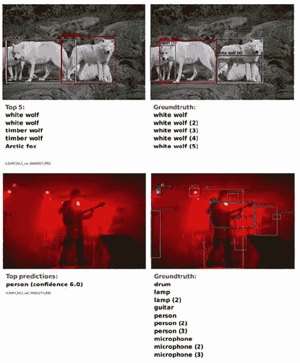

**Localization (Top) and Detection (Bottom)**

# 将涵盖哪些内容:

1.  由 AlexNet 修改的 CNN 模型(快速准确模型)
2.  精细步幅最大汇集
3.  多尺度分类
4.  分类结果
5.  用于定位/检测的回归网络

# 1.由 AlexNet 修改的 CNN 模型(快速准确模型)

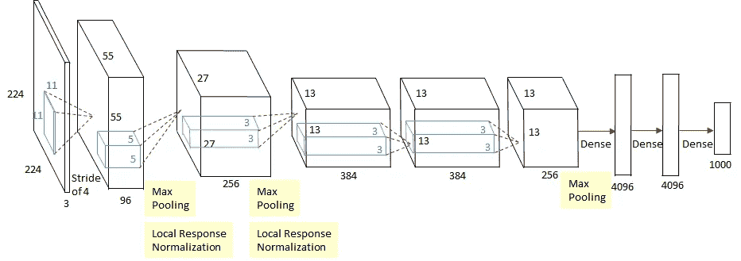

**The Original AlexNet (Single-GPU Version)**

以上是 AlexNet [3]单 GPU 版本。(如有兴趣请访问我的评论[4]。)作者将其修改为**快速**和**精确**型号如下:

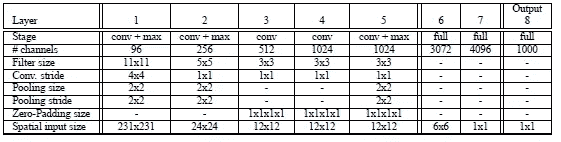

**Fast Model**

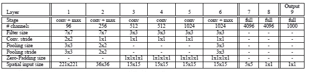

**Accurate Model**

简单地说，这两个模型在 AlexNet 上有一些修改，但在整体架构上没有大的变化。

例如，没有局部对比度标准化(LRN)。汇集层是不重叠的。由于使用较小的步幅 2，第 1 层和第 2 层的要素地图更大。ZFNet [5]已经证明了较小的步幅有助于通过可视化 CNN 层来提高精度。(如有兴趣，请访问我的评论[6]。)

# 2.精细步幅最大汇集

在修改后的网络的第 5 层中添加了一个精细的最大跨距池。

(b)在第 5 层，从{0，1，2}起，以不同的像素偏移**δx 和δy，多次进行 **3×3 最大汇集。****

(c) **进行 3×3 次最大合并**，共合并 9 张特征图。

(d)每个融合后的特征图**经过 FC 层 6、7、8** 得到**输出概率向量**。

(e)将所有矢量重新整形为**三维输出图**。

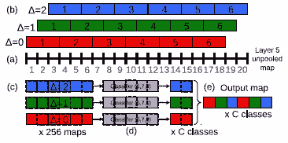

**Fine Stride Max Pooling**

如果对三维输出图进行平均，我们就可以得到预测。

# 3.多尺度分类

与 AlexNet 中使用 10 视图预测不同，OverFeat 输入整个图像以进行预测，比例为 6:

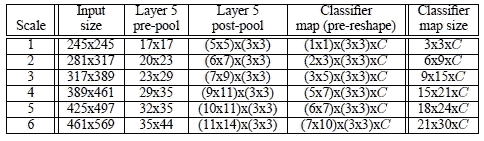

**6 Different Scales**

使用 6 种不同大小的输入图像，产生不同空间分辨率的第 5 层未冷却特征图，从而提高精度。

测试时，FC 层变为 1 **×** 1 conv 层。整个图像进入网络，得到一个类似 VGGNet 的类地图[7]。(如果有兴趣，请访问我的 VGGNet 评论[8]。)

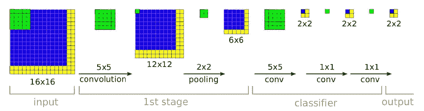

**Test Time**

# 4.分类结果

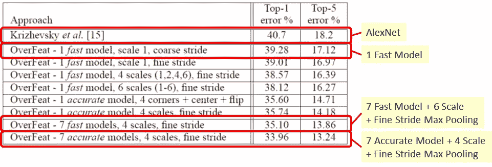

**Ablation Study of OverFeat**

消融研究如上所述进行。

**AlexNet** 获得 **18.2%** 前 5 位错误率。**快速模型**根据上述修改获得较好的 **17.12%** 错误率。(粗步幅表示使用传统的最大池。)

**7 快模式+ 4 秤+精步最大汇集**后，错误率大大降低到 **13.86%** 。这 7 个模型实际上是在 VGGNet、ZFNet、AlexNet、LeNet 中已经普遍使用的增强技术或集成方法[3，5，7，9]。(如果感兴趣，请访问我对这些模型的评论。[4,6,8,10])

**7 个精确模型+ 4 个比例尺+精细跨步最大汇集后，**错误率大大降低到了 **13.24%** 。

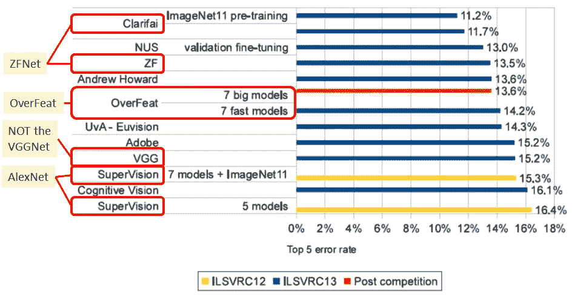

**Comparison with State-of-the-art Approaches**

在 ILSVRC 2013 中， **ZFNet** 获得最佳结果，错误率 **11.2%。
**过食**获得 **13.6%的错误率**，与安德鲁·霍华德在**排名第 4 位**时相同，但为赛后结果。OverFeat 的结果比 ILSVRC 2012 的冠军 AlexNet 好得多。**

# 5.用于定位/检测的回归网络

有一个**回归网络**连接在 CNN 的第五层。使用 2 个 FC 层(大小为 4096 和 1024)对边界框边缘的坐标进行回归预测。示例如下:

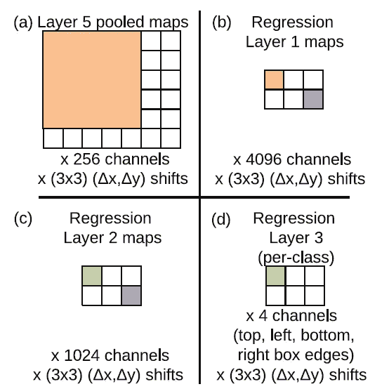

**Application of the regression network to layer 5 features, at scale 2, for example.**

(a)该比例尺的回归器为 6 **×** 7 像素，每班 256 个通道。
(b)回归网的第 1 层连接到第 5 层地图中的 5 **×** 5 空间邻域，以及所有 256 个通道。
(三)第二回归层有 1024 个单元，完全连通。
(d)回归网络的输出为 4 向量。

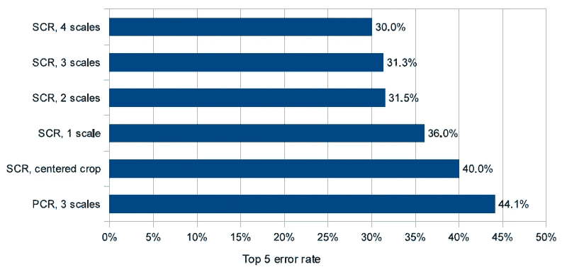

**Ablation Study for Localization in ILSVRC 2012**

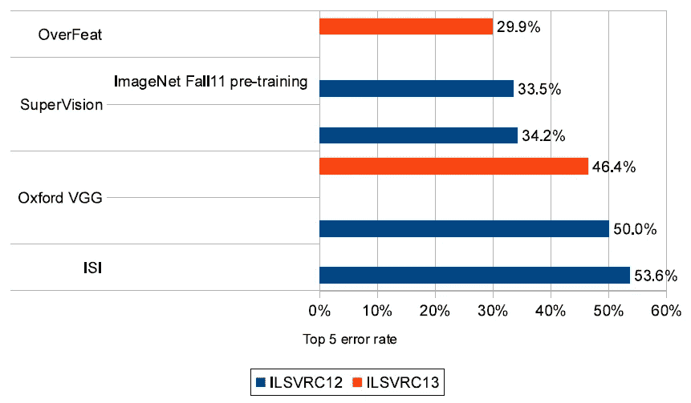

**Comparison with State-of-the-art Approaches for Localization Task**

作者尝试了多种组合，每类回归(PCR)效果不好，错误率为 44.1%。**单类回归(SCR)和 4 个量表在验证集
上实现了
-** 30.0%的错误率，在测试集、
-**上实现了 **29.9%的错误率，在 ILSVRC 2013** 上完成了本地化任务。**

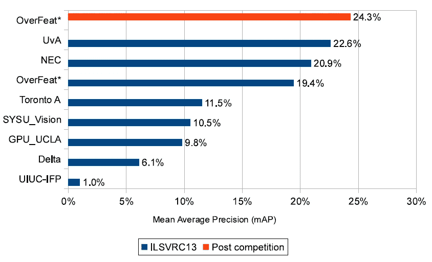

**Comparison with State-of-the-art Approaches for Detection Task**

对于检测，主要的区别是评估度量以及在没有对象时预测背景类别的必要性。对于检测任务，OverFeat 也获得了 **24.3%的 mAP(均值预测)，在赛后时刻优于其他方法。**

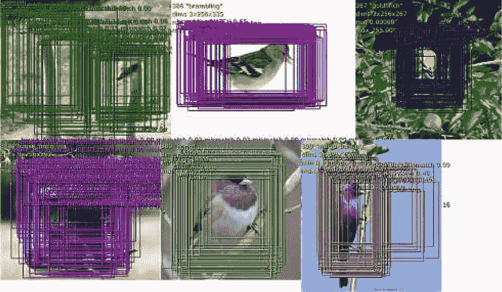

**Some Bounding boxes Prediction Examples**

这里显示了一些边界框预测的例子。正如我们所见，有许多重叠的包围盒浪费了计算。

然而，本文在图像分类和目标检测等领域启发了许多新的深度学习方法。

稍后，我将介绍其他最新的对象检测方法。请继续关注。

# 参考

1.  【2014 ICLR】【过吃】
    [过吃:使用卷积网络的综合识别、定位和检测](https://arxiv.org/pdf/1312.6229)
2.  ILSVRC 2013 年结果
    [http://www.image-net.org/challenges/LSVRC/2013/results.php](http://www.image-net.org/challenges/LSVRC/2013/results.php)
3.  【2012 NIPS】【Alex net】
    [使用深度卷积神经网络的 ImageNet 分类](https://papers.nips.cc/paper/4824-imagenet-classification-with-deep-convolutional-neural-networks.pdf)
4.  [2012 年国际影像分类奖得主 AlexNet、CaffeNet 综述](/coinmonks/paper-review-of-alexnet-caffenet-winner-in-ilsvrc-2012-image-classification-b93598314160)
5.  【2014 ECCV】【ZFNet】
    [可视化和理解卷积网络](https://cs.nyu.edu/~fergus/papers/zeilerECCV2014.pdf)
6.  [2013 年 ILSVRC(图像分类)获奖者 ZFNet 点评](/coinmonks/paper-review-of-zfnet-the-winner-of-ilsvlc-2013-image-classification-d1a5a0c45103)
7.  【2015 ICLR】【VGGNet】
    [用于大规模图像识别的极深度卷积网络](https://arxiv.org/pdf/1409.1556)
8.  [VG gnet 回顾——ils VLC 2014(影像分类)亚军](/coinmonks/paper-review-of-vggnet-1st-runner-up-of-ilsvlc-2014-image-classification-d02355543a11)
9.  [1998 年 Proc。IEEE] [LeNet-1，LeNet-4，LeNet-5，Boosted LeNet-4]
    [基于梯度的学习应用于文档识别](http://yann.lecun.com/exdb/publis/pdf/lecun-01a.pdf)
10.  [审查 LeNet-1、LeNet-4、LeNet-5、Boosted LeNet-4(图像分类)](/@sh.tsang/paper-brief-review-of-lenet-1-lenet-4-lenet-5-boosted-lenet-4-image-classification-1f5f809dbf17)

> [直接在您的收件箱中获得最佳软件交易](https://coincodecap.com/?utm_source=coinmonks)

