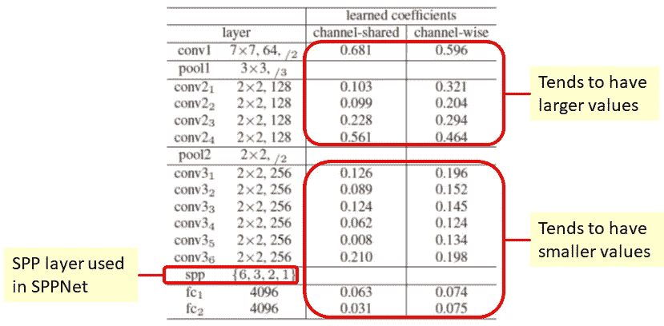

# 回顾:PReLU-Net——第一个在 ILSVRC 2015(图像分类)中超越人类水平的性能

> 原文：<https://medium.com/coinmonks/review-prelu-net-the-first-to-surpass-human-level-performance-in-ilsvrc-2015-image-f619dddd5617?source=collection_archive---------0----------------------->

在这个故事中，**PReLU-Net**【1】进行了回顾。**参数整流线性单元(PReLU)** 是对传统整流单元(ReLU)的推广。这是深度学习方法，在 ILSVRC (ImageNet 大规模视觉识别挑战)**图像分类中**首次超过人类水平的性能。**此外，**提出了整流器**的更好的权重初始化，这有助于直接从零开始训练的深度模型(30 层)**的收敛。****

****最终，PReLU-Net 在测试集上获得了 4.94%的 top-5 错误率，优于 5.1%的人类水平性能，也优于 6.66%的 GoogLeNet！！！****

**这是 2015 年 ICCV 的论文，在我写这篇文章的时候，它被引用了大约 3000 次。([曾植和](https://medium.com/u/aff72a0c1243?source=post_page-----f619dddd5617--------------------------------) @中)**

# **资料组**

****分类**:超过 1500 万张带标签的高分辨率图像，约 22000 个类别。ILSVRC 使用 ImageNet 的一个子集，在 **1000 个类别**的每个类别中包含大约 1000 幅图像。总共大约有 **1.3M/50k/100k 图像**用于**训练/验证/测试集。****

# **涵盖哪些内容**

1.  ****参数整流线性单元(PReLU)****
2.  ****整流器更好的权重初始化****
3.  ****22 层深度学习模型****
4.  ****与最先进方法的比较****
5.  ****利用快速 R-CNN 进行物体检测****

# ****1。参数校正线性单元(PReLU)****

**在 AlexNet [2]中，ReLU 建议如下，其中只有正值会通过 ReLU 激活函数，而所有负值都设置为零。并且由于在 1 处不饱和，ReLU 以快得多的训练速度胜过 Tanh。**

****

****PReLU****

**PReLU 建议对负值应该有惩罚，并且应该是参数化的。**

**注意**当 *a* = 0 时，为 ReLU** 。
**当 *a* = 0.01 时，为泄漏 ReLU** 。
**现在 *a* 的值可以学习**，因此成为**广义 ReLU** 。**

**在反向传播期间，我们可以估计梯度:**

****

****Backpropagation, gradient from deep layer (Left), gradient of the activation (Right)****

**我们可以从深层(左)估算梯度，活化的**梯度**(右)。我们可以看到，它是特征图(通道方向)所有位置的**之和。如果是**通道共享**变体，则是该层所有通道的**总和。**没有重量衰减应用于 *a* 。****

****

****The average value of *a* over all channels for each layer****

**观察到两个有趣的现象:**

1.  ****首先，第一 conv 层(conv1)的系数(0.681 和 0.596)明显大于 0。**由于 conv1 的滤波器大多是类似 Gabor 的滤波器，如边缘或纹理检测器，**学习结果显示滤波器的正负响应都受到重视**。**
2.  **对于**通道方式**版本，较深的 conv 层通常具有**较小的系数**。随着深度的增加，激活逐渐变得“更加非线性”。换句话说，学习的模型倾向于在早期阶段保留更多的信息，并在更深的阶段变得更具辨别能力。**

# ****2。整流器更好的重量初始化****

**良好的权重初始化对于**不要让网络以指数方式减少或放大输入信号**至关重要。因为权重初始化取决于均值为 0 的高斯分布，而不同的方差取决于 Xavier 之类的算法。因此，通过考虑输入和输出网络大小，建议了更好的权重初始化。**

**将 L 层放在一起，方差为(左):**

****

****Variance of L layers (Left), and sufficient condition (right)****

**如果满足右边的充分条件，网络可以变得稳定。因此，最后，方差应该是 2/n_l，其中 n_l 是第 l 层中的连接数。**

**(在反向传播情况下也有证明。有趣的是，它也提出了同样的充分条件。但我只是不想在这里表现出来。)**

****

****Red (Ours) and Blue (Xavier), 22-layer (Left) and 30-layer (Right)****

**如上图所示，**建议权重初始化收敛更快。**而泽维尔甚至在从零开始训练的时候都无法收敛到右边更深的一层。**

# ****3。22 层深度学习模型****

****

****PReLU-Net: Model A, B, C****

****SPP 层:4 级 SPP net[3–4]{ 7×7，3×3，2×2，1×1}****

****A 型**:比 VGG-19 [5]效果更好的一种型号**

****B 型**:比 A 型深的型号**

****型号 C** :比型号 B 更宽的型号(更多过滤器)**

****

****Model A using PReLU is better than the one using ReLU****

****

****Model A: PReLU converges faster****

# ****4。与最先进方法的比较****

****

****Single model, 10-view****

**仅使用单个模型和 10 个视图，模型 C 具有 7.38%的错误率。**

****

****Single model, Multi-view, Multi-scale****

****多视角多尺度，模型 C 误差率 5.71%。**这一结果甚至优于 SPPNet[3–4]、VGGNet [5]和 GoogLeNet [6]的多模型。**

****

****Multi-model, Multi-view, Multi-scale****

**用多模型，即 **6 个模型预网络，得到 4.94%的错误率**。
相对于 GoogLeNet，这个数字提高了 26%!！！**

# ****5。使用快速 R-CNN 进行目标检测****

****PReLU-Net 使用快速 R-CNN [7]实现**在 PASCAL VOC 2007 数据集中进行对象检测。**

****

****Model C + PReLU-Net has the best mAP result****

**通过 imagenet 预训练模型和在 VOC 2007 数据集上的微调，模型 C 获得了比 VGG-16 更好的结果。**

**由于深度学习网络的训练需要大量的时间，并且为了公平的比较或消融研究，实际上，有许多知识或技术是从大量的现有技术中构建的。如果感兴趣，请访问我对 AlexNet、VGGNet、SPPNet 和 GoogLeNet 等其他网络的评论(底部的链接)。:)**

# **参考**

1.  **【2015 ICCV】【PReLU-Net】
    [深入挖掘整流器:在 ImageNet 分类上超越人类水平的表现](https://arxiv.org/pdf/1502.01852)**
2.  **【2012 NIPS】【Alex net】
    [使用深度卷积神经网络的 ImageNet 分类](https://papers.nips.cc/paper/4824-imagenet-classification-with-deep-convolutional-neural-networks.pdf)**
3.  **【2014 ECCV】【sp pnet】
    [用于视觉识别的深度卷积网络中的空间金字塔池](http://citeseerx.ist.psu.edu/viewdoc/download?doi=10.1.1.699.8052&rep=rep1&type=pdf)**
4.  **【2015 TPAMI】【SPPNet】
    [用于视觉识别的深度卷积网络中的空间金字塔池](https://arxiv.org/pdf/1406.4729.pdf)**
5.  **【2015 ICLR】【VGGNet】
    [用于大规模图像识别的极深度卷积网络](https://arxiv.org/pdf/1409.1556)**
6.  **【2015】【CVPR】【谷歌网】
    [用回旋更深入](https://www.cs.unc.edu/~wliu/papers/GoogLeNet.pdf)**
7.  **【2015 ICCV】【快速 R-CNN】
    [快速 R-CNN](https://www.cv-foundation.org/openaccess/content_iccv_2015/papers/Girshick_Fast_R-CNN_ICCV_2015_paper.pdf)**

# **我的评论**

1.  **[回顾 AlexNet，CaffeNet—ils vrc 2012 获奖者(图像分类)](/coinmonks/paper-review-of-alexnet-caffenet-winner-in-ilsvrc-2012-image-classification-b93598314160)**
2.  **[回顾:spp net—ils vrc 2014 亚军(物体检测)，季军(图像分类)](/coinmonks/review-sppnet-1st-runner-up-object-detection-2nd-runner-up-image-classification-in-ilsvrc-906da3753679)**
3.  **[点评:VGGNet—ILSVRC 2014 亚军(图像分类)，冠军(本地化)](/coinmonks/paper-review-of-vggnet-1st-runner-up-of-ilsvlc-2014-image-classification-d02355543a11)**
4.  **[点评:谷歌网(Inception v1)——2014 年 ILSVRC(图像分类)获奖者](/coinmonks/paper-review-of-googlenet-inception-v1-winner-of-ilsvlc-2014-image-classification-c2b3565a64e7)**