# 回顾:R-CNN(目标检测)

> 原文：<https://medium.com/coinmonks/review-r-cnn-object-detection-b476aba290d1?source=collection_archive---------0----------------------->

**Region-CNN(R-CNN)**【1】是最先进的**基于 CNN 的深度学习对象检测方法**之一。基于此，有**快速 R-CNN** 和**快速 R-CNN** 用于更快速度的对象检测，以及**掩模 R-CNN** 用于对象实例分割。另一方面，也有其他的物体检测方法，如 **YOLO** 和 **SSD** 。

为了更好地了解深度学习对象检测方法，R-CNN 是必读书。这是一篇 **2014 年的 CVPR 论文，在我写这篇文章的时候被引用了大约 6000 次。( [Sik-Ho Tsang](https://medium.com/u/aff72a0c1243?source=post_page-----b476aba290d1--------------------------------) @中)**

**为了进行对象检测，我们需要知道对象的类别以及边界框的大小和位置**。

通常，对于每个图像，有一个**滑动窗口**来搜索图像内的每个位置，如下所示。这是一个简单的解决方案。然而，不同的物体甚至同一种类的物体可以有**不同的长宽比和大小**，这取决于物体的大小和与摄像机的距离。并且**不同的图像尺寸**也会影响有效窗口尺寸。这个过程会**极其缓慢**如果我们在每个位置使用深度学习 CNN 进行图像分类。

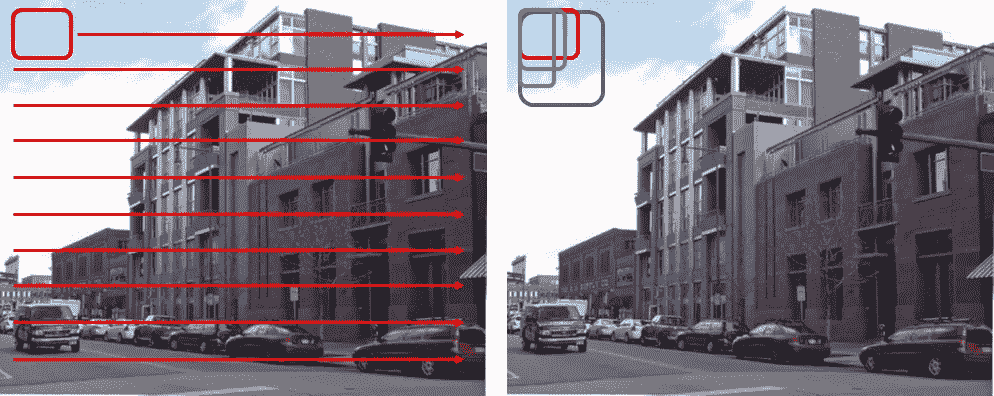

**Illustration of Sliding Window (Left) with Different Aspect Ratios and Sizes (Right)**

1.  首先，R-CNN 使用选择性搜索 by [2]来**生成大约 2K 个区域提议**，即用于图像分类的包围盒。
2.  然后，对于每个包围盒，通过 CNN 进行图像分类。
3.  最后，可以使用回归来细化每个边界框。

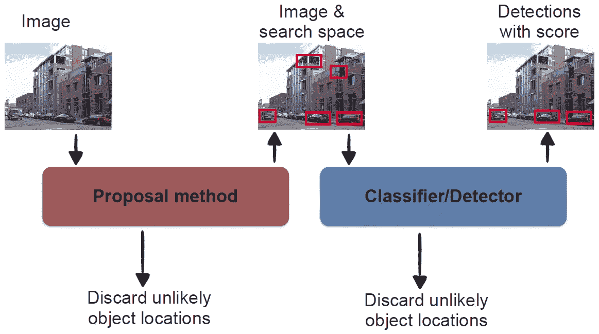

**R-CNN Flowchart**

# 将涵盖哪些内容:

1.  选择性搜索
2.  基于 CNN 的分类和评分
3.  结果

# 1.选择性搜索

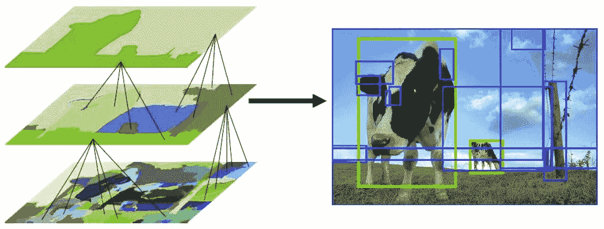

**Selective Search**

选择性搜索是由[2]提出的。

1.  首先，颜色相似性、纹理相似性、区域大小和区域填充被用作**非基于对象的分割**。因此，我们得到了许多小的分割区域，如上图左下方所示。
2.  然后，使用自下而上的方法，将**小的分割区域合并在一起，形成更大的分割区域。**
3.  因此，如图所示，生成了大约 2K 个 **区域提议(边界框候选)**。

# 2.基于 CNN 的分类和评分

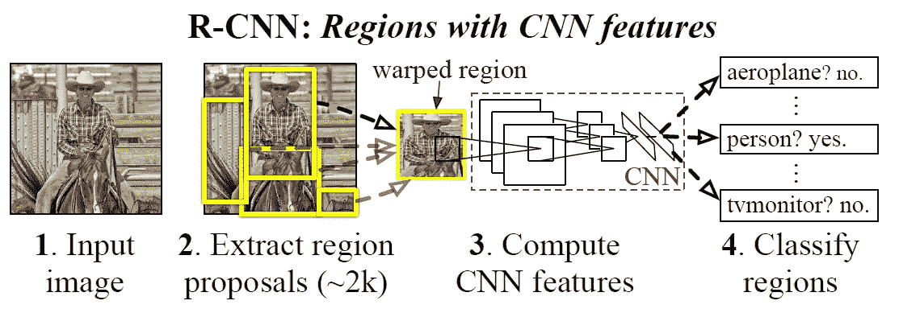

**R-CNN Flowchart with More Details**

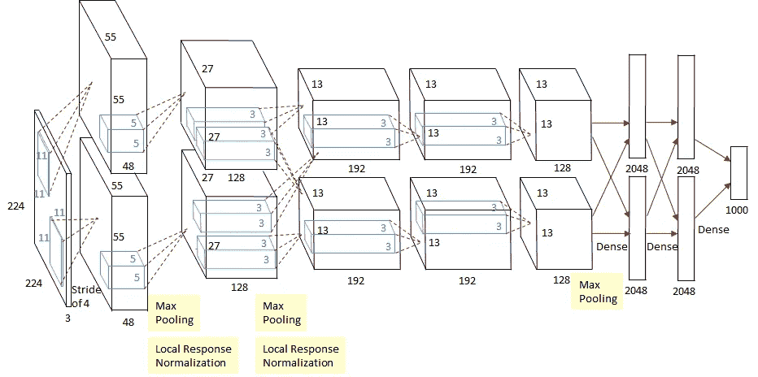

**Original AlexNet**

**AlexNet [3]用于提取 CNN 特征。**

**对于每个提议，通过五个卷积层和两个全连接层向前传播减去平均值的 227×227 RGB 图像，计算 4096 维特征向量**。

输入具有 227×227 的固定大小，而边界框具有各种形状和大小。因此，**一个紧密包围盒中的所有像素被扭曲成 227×227 的大小。**

**特征向量由为每一类训练的 SVM** 评分。

对于每个类，**高 IoU(交集/并集)重叠包围盒被拒绝**，因为它们包围相同的对象。

**预测包围盒** **可以通过另一个包围盒回归器进一步微调**。

# 3.结果

## **3.1 VOC 2010**

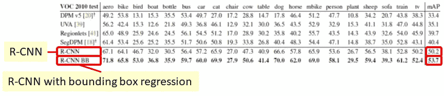

**VOC 2010**

R-CNN 和 R-CNN BB 获得最高的 mAP(均值平均预测)。

## 3.2 ILSVRC 2013

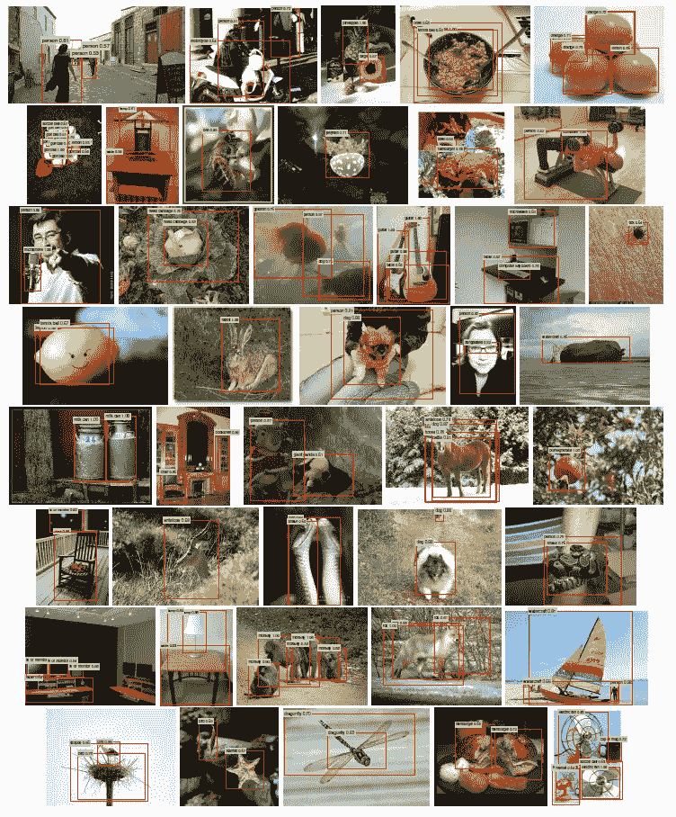

**Some Amazing ILSVRC 2013 Results**

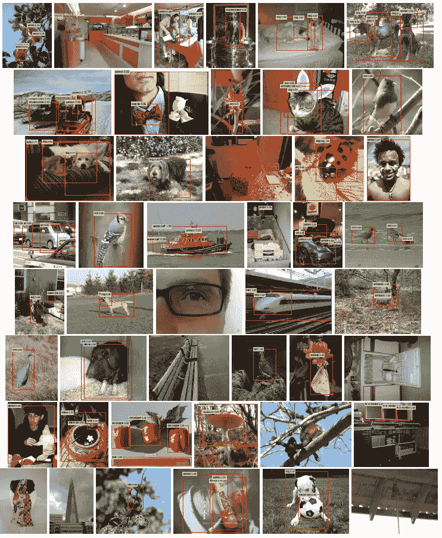

**Some ILSVRC 2013 Results with Some Missing Detections**

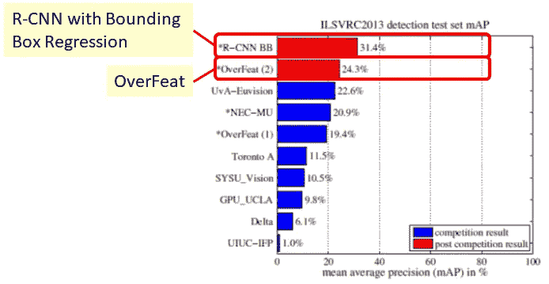

**ILSVRC 2013**

R-CNN BB 甚至胜过 OverFeat [4]，是 ILSVRC 2013 本地化任务的赢家！

## **3.3 VOC 2007**

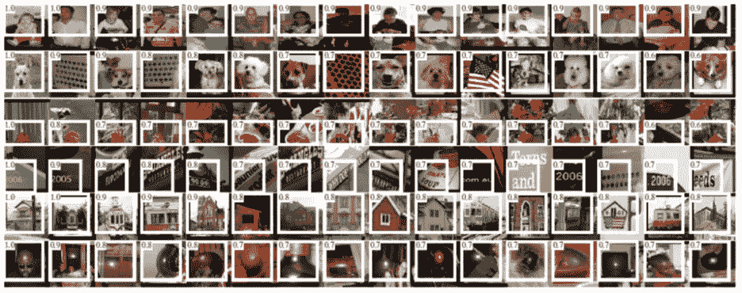

**Some examples with high activations in VOC 2007**

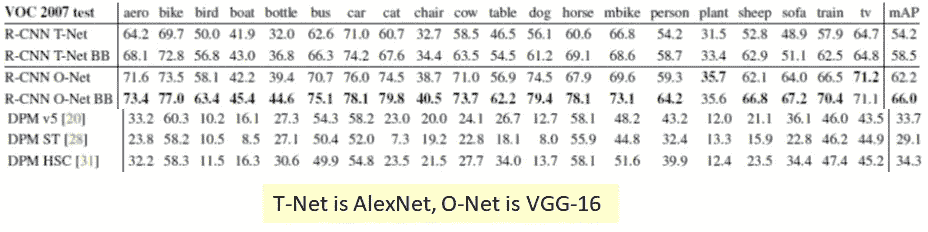

**VOC 2007**

大家可能已经知道了，**R-CNN 中使用的 CNN 可以改成任何图像分类中使用的 CNN。**

**当 R-CNN BB 使用 16 层 VGGNet 的 VGG-16 [5]时，mAP 甚至提高到 66.0%** 。

如果感兴趣，请阅读我对 AlexNet、VGGNet 和 OverFeat 的评论。(底部的链接)

我会为其他先进的深度学习方法写更多的评论。

# 参考

1.  【2014 CVPR】【R-CNN】
    [丰富的特征层次，用于精确的对象检测和语义分割](https://arxiv.org/pdf/1311.2524)
2.  【2013 IJCV】【选择性搜索】
    [选择性搜索对象识别](http://www.huppelen.nl/publications/selectiveSearchDraft.pdf)
3.  【2012 NIPS】【Alex net】
    [使用深度卷积神经网络的 ImageNet 分类](https://papers.nips.cc/paper/4824-imagenet-classification-with-deep-convolutional-neural-networks.pdf)
4.  【2014 ICLR】【过吃】
    [过吃:使用卷积网络的综合识别、定位和检测](https://arxiv.org/pdf/1312.6229)
5.  【2015 ICLR】【VGGNet】
    [用于大规模图像识别的极深度卷积网络](https://arxiv.org/pdf/1409.1556)

# **我的评论**

1.  [回顾:AlexNet，CaffeNet——ils vrc 2012(图像分类)获奖者](/coinmonks/paper-review-of-alexnet-caffenet-winner-in-ilsvrc-2012-image-classification-b93598314160)
2.  [回顾:over feat——ils vrc 2013 定位任务(目标检测)冠军](/coinmonks/review-of-overfeat-winner-of-ilsvrc-2013-localization-task-object-detection-a6f8b9044754)
3.  [点评:VGGNet—ils vrc 2014(影像分类)亚军](/coinmonks/paper-review-of-vggnet-1st-runner-up-of-ilsvlc-2014-image-classification-d02355543a11)

> 加入 Coinmonks [电报频道](https://t.me/coincodecap)和 [Youtube 频道](https://www.youtube.com/c/coinmonks/videos)获取每日[加密新闻](http://coincodecap.com/)

## 另外，阅读

*   [复制交易](/coinmonks/top-10-crypto-copy-trading-platforms-for-beginners-d0c37c7d698c) | [加密税务软件](/coinmonks/crypto-tax-software-ed4b4810e338)
*   [网格交易](https://coincodecap.com/grid-trading) | [加密硬件钱包](/coinmonks/the-best-cryptocurrency-hardware-wallets-of-2020-e28b1c124069)
*   [密码电报信号](http://Top 4 Telegram Channels for Crypto Traders) | [密码交易机器人](/coinmonks/crypto-trading-bot-c2ffce8acb2a)
*   [有哪些交易信号？](https://coincodecap.com/trading-signal) | [比特斯坦普 vs 比特币基地](https://coincodecap.com/bitstamp-coinbase)
*   [ProfitFarmers 回顾](https://coincodecap.com/profitfarmers-review) | [如何使用 Cornix Trading Bot](https://coincodecap.com/cornix-trading-bot)
*   [如何在势不可挡的域名上购买域名？](https://coincodecap.com/buy-domain-on-unstoppable-domains)
*   [印度的加密税](https://coincodecap.com/crypto-tax-india) | [altFINS 审核](https://coincodecap.com/altfins-review) | [Prokey 审核](/coinmonks/prokey-review-26611173c13c)
*   [最佳加密交易所](/coinmonks/crypto-exchange-dd2f9d6f3769) | [印度最佳加密交易所](/coinmonks/bitcoin-exchange-in-india-7f1fe79715c9)
*   面向开发者的最佳加密 API
*   最佳[密码借贷平台](/coinmonks/top-5-crypto-lending-platforms-in-2020-that-you-need-to-know-a1b675cec3fa)
*   [杠杆代币的终极指南](/coinmonks/leveraged-token-3f5257808b22)