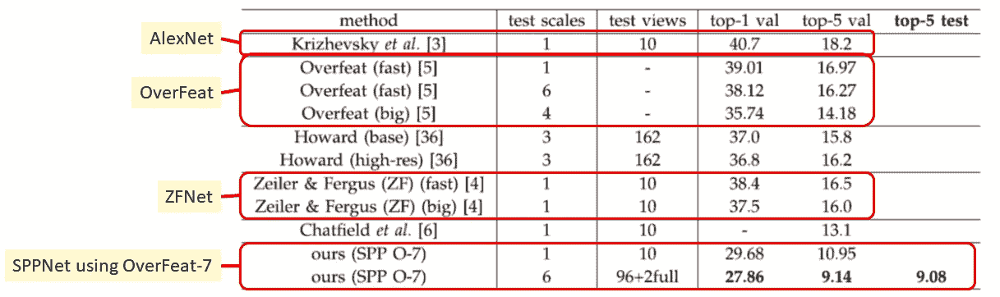

# 回顾:sp pnet—2014 年 ILSVRC 亚军(目标检测)，季军(图像分类)

> 原文：<https://medium.com/coinmonks/review-sppnet-1st-runner-up-object-detection-2nd-runner-up-image-classification-in-ilsvrc-906da3753679?source=collection_archive---------1----------------------->

在这个故事中，SPPNet 被回顾。SPPNet 在 CNN 引入了一种新技术，称为**空间金字塔池(SPP)** ，位于卷积层和全连接层的过渡处。这是来自**微软**的作品。

在 **ILSVRC 2014** 中，SPPNet 在目标检测中获得**亚军，在图像分类**中获得**亚军，在定位任务**中获得**第五名。在 **2014 年 ECCV【1】和 2015 年 TPAMI【2】**分别有 2 篇论文**被引用超过 1000 次和 600 次**。由此可见，SPPNet 是值得一读的深度学习论文之一。( [Sik-Ho Tsang](https://medium.com/u/aff72a0c1243?source=post_page-----906da3753679--------------------------------) @中)**

# 资料组

**分类**:超过 1500 万张带标签的高分辨率图像，约 22000 个类别。ILSVRC 使用 ImageNet 的一个子集，在 **1000 个类别**的每个类别中包含大约 1000 幅图像。总共大约有 **1.3M/50k/100k 图像**用于**训练/验证/测试集**

**检测** : **200 类**。 **450k/20k/40k** 图像用于**训练/验证/测试集**

# 涵盖哪些内容

1.  **空间金字塔池**
2.  **多尺寸训练**
3.  **完整图像表示**
4.  **多视角测试**
5.  **与最先进方法的比较(分类)**
6.  **物体检测中的 spp net**
7.  **与最先进方法的比较(检测)**

# **1。空间金字塔池(SPP)**

**Three-Level Spatial Pyramid Pooling (SPP) in SPPNet with Pyramid {4×4, 2×2, 1×1}.**

传统上，在 conv 层和 FC 层的过渡处，只有一个池层或者甚至没有池层。在 SPPNet 中，建议使用**不同规模的多个池层**。

上图中使用了 **3 级 SPP** 。假设 conv5 层有 256 个特征地图。然后在 SPP 层，

1.  首先，将每个特征图**汇集成一个值(灰色)**，从而形成 **256-d 向量**。
2.  然后，将每个特征图**汇集成 4 个值(绿色)**，形成一个 **4×256-d 矢量**。
3.  类似地，每个特征图**汇集成 16 个值(蓝色)**，形成一个 **16×256 维向量**。
4.  上述 3 个矢量的**被连接起来形成一个一维矢量**。
5.  最后，这个一维向量像往常一样进入 FC 层。

有了 SPP，在进入 CNN 之前，我们不需要像 AlexNet 那样将图像裁剪成固定大小。**可以输入任何图像尺寸。**

# **2。多尺寸训练**

**SPPNet supports any sizes due to the use of SPP**

对于 SPP，可变大小被接受作为输入，不同的大小应该被输入到网络中以增加网络在训练期间的鲁棒性。

然而，为了训练过程的有效性，**仅使用 224×224 和 180×180 图像作为输入。**两个网络，180-网络和 240-网络使用共享参数进行训练。

作者复制了 ZFNet [3]、AlexNet [4]和 Overfeat [5]，并做了如下修改(其后的数字是 conv 层数):

**Replicated Model as Baseline**

**Top-5 Error Rates for SPP and Multi-Size Training**

**4 级 SPPNet** 这里用的是金字塔 **{6×6，3×3，2×2，1×1}。**

如上所示，**仅使用 SPP，所有型号的错误率均有所改善。通过多尺寸训练，错误率进一步提高。**(10-视图表示从【四个角+ 1 个中心】开始的 10 次裁剪测试以及相应的水平翻转)

# **3。完整图像表示**

由于使用 SPP 也可以将完整图像输入 CNN，作者**将完整图像输入** **与仅使用 1 个中心裁剪输入**进行比较:

**Top-1 Error Rates for Full Image Representation**

使用完整图像作为输入，Top-1 错误率都得到改善。

# **4。多视图测试**

通过使用 SPP 提供完整的图像支持，可以轻松实现多视图测试。

1.  作者将图像调整到 6 种比例:{224，256，300，360，448，560}
2.  对于每个比例，**生成 18 个视图:{1 个中心，4 个角，每边中间 4 个}和相应的翻转。**
    这样，总共有**96 个视图**。
3.  还包括 **2 个全图视图和相应的翻转**。

**Error Rates in ILSVRC 2012 (All are Single Model Results)**

**SPPNet 使用 OverFeat-7 在验证/测试集上获得 9.14/9.08%** 的前 5 名错误率，是**表中唯一一个低于 10%** 的错误率。

# **5。与最先进方法的比较(分类)**

**测试中使用了 11 种型号的 SPPNet。输出被平均以获得更精确的预测。这是一种在许多 CNN 模型中使用的增强或集合技术，如 LeNet、AlexNet、ZFNet。**

**2nd Runner Up in Image Classification (ILSVRC 2014)**

得到了 8.06%的错误率。遗憾的是，VGGNet 和 GoogLeNet 在使用深度模型的情况下性能更好。**最后，SPPNet 在分类任务中只能获得亚军。**

# **6。物体检测中的 spp net**

1.  **选择性搜索[6]用于生成大约 2k 个区域提议(边界框)，就像 R-CNN [7]中一样。**
2.  **输入图像仅使用 ZFNet 通过 SPPNet 一次。**
3.  **在最后一个 conv 层，由每个区域提议界定的特征地图将进入 SPP 层，然后进入 FC 层**，如下所示:

**SPPNet for Object Detection**

与 R-CNN 相比， **SPPNet 只对 conv 层的图像处理一次，而 R-CNN 对 conv 层的图像处理了 2k 次**，因为有 2k 个区域提案。下图说明了这个想法:

**R-CNN (Left) and SPPet (Right)**

在每个包围盒的 FC 层之后，还需要 SVM 和包围盒回归器，这不是端到端的学习架构。

# **7。与最先进方法的比较(检测)**

## 7.1 VOC 2007

**VOC 2007 Results**

**Some Amazing Results in VOC 2017**

如上图 VOC 2007 中，**与 R-CNN 相比，5 个尺度的 SPPNet 获得了更高的 mAP 59.2%。**

## 7.2 ILSVRC 2014

**SPPNet got 1st Runner-Up in ILSVRC 2014 Object Detection**

**在 ILSVRC 2014 中，SPPNet 获得 35.1%的 mAP，在物体检测任务中获得亚军。**

事实上，微软后来在 ILSVRC 中贡献了许多最先进的深度学习方法，如 PReLUNet 和 ResNet。我稍后会回顾它们！

当然，其他网络也将被审查，请保持关注！！！！

# **参考文献**

1.  【2014 ECCV】【sp pnet】
    [用于视觉识别的深度卷积网络中的空间金字塔池](http://citeseerx.ist.psu.edu/viewdoc/download?doi=10.1.1.699.8052&rep=rep1&type=pdf)
2.  【2015 TPAMI】【SPPNet】
    [用于视觉识别的深度卷积网络中的空间金字塔池](https://arxiv.org/pdf/1406.4729.pdf)
3.  【2014 ECCV】【ZFNet】
    [可视化和理解卷积网络](https://cs.nyu.edu/~fergus/papers/zeilerECCV2014.pdf)
4.  【2012 NIPS】【Alex net】
    [使用深度卷积神经网络的 ImageNet 分类](https://papers.nips.cc/paper/4824-imagenet-classification-with-deep-convolutional-neural-networks.pdf)
5.  【2014 ICLR】【过吃】
    [过吃:使用卷积网络的综合识别、定位和检测](https://arxiv.org/pdf/1312.6229)
6.  【2013 IJCV】【选择性搜索】
    [选择性搜索对象识别](http://www.huppelen.nl/publications/selectiveSearchDraft.pdf)
7.  【2014 CVPR】【R-CNN】
    [丰富的特征层次，用于精确的对象检测和语义分割](https://arxiv.org/pdf/1311.2524)

# 我的评论

1.  【2013 年 ILSVRC(图像分类)获奖者 ZFNet 点评
2.  [回顾:AlexNet，CaffeNet——ils vrc 2012(图像分类)获奖者](/coinmonks/paper-review-of-alexnet-caffenet-winner-in-ilsvrc-2012-image-classification-b93598314160)
3.  [回顾:over feat——ils vrc 2013 定位任务(目标检测)冠军](/coinmonks/review-of-overfeat-winner-of-ilsvrc-2013-localization-task-object-detection-a6f8b9044754)
4.  [回顾:R-CNN(目标检测)](/coinmonks/review-r-cnn-object-detection-b476aba290d1)

> 加入 Coinmonks [电报频道](https://t.me/coincodecap)和 [Youtube 频道](https://www.youtube.com/c/coinmonks/videos)获取每日[加密新闻](http://coincodecap.com/)

## 另外，阅读

*   [复制交易](/coinmonks/top-10-crypto-copy-trading-platforms-for-beginners-d0c37c7d698c) | [加密税务软件](/coinmonks/crypto-tax-software-ed4b4810e338)
*   [网格交易](https://coincodecap.com/grid-trading) | [加密硬件钱包](/coinmonks/the-best-cryptocurrency-hardware-wallets-of-2020-e28b1c124069)
*   [密码电报信号](http://Top 4 Telegram Channels for Crypto Traders) | [密码交易机器人](/coinmonks/crypto-trading-bot-c2ffce8acb2a)
*   [最佳加密交易所](/coinmonks/crypto-exchange-dd2f9d6f3769) | [印度最佳加密交易所](/coinmonks/bitcoin-exchange-in-india-7f1fe79715c9)
*   [面向开发人员的最佳加密 API](/coinmonks/best-crypto-apis-for-developers-5efe3a597a9f)
*   最佳[密码借贷平台](/coinmonks/top-5-crypto-lending-platforms-in-2020-that-you-need-to-know-a1b675cec3fa)
*   [免费加密信号](/coinmonks/free-crypto-signals-48b25e61a8da) | [加密交易机器人](/coinmonks/crypto-trading-bot-c2ffce8acb2a)
*   [杠杆代币的终极指南](/coinmonks/leveraged-token-3f5257808b22)