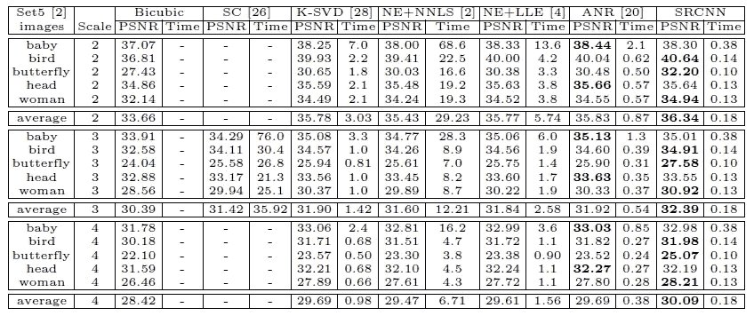

# 回顾:SRCNN(超分辨率)

> 原文：<https://medium.com/coinmonks/review-srcnn-super-resolution-3cb3a4f67a7c?source=collection_archive---------1----------------------->

在这个故事中，回顾了一种非常经典的超分辨率技术，**超分辨率卷积神经网络(Sr CNN)**[1–2]。在深度学习或者卷积神经网络(CNN)中，我们通常使用 CNN 进行图像分类。在 SRCNN 中，用于**单幅图像超分辨率(SR)** 这是计算机视觉中的经典问题。

简而言之，通过更好的超分辨率方法，我们可以获得更高质量的大图像，即使我们最初只能获得小图像。

**SRCNN**

从上图中我们可以看出，使用 SRCNN 可以获得 27.58 dB 的 PSNR，这比经典的基于非学习的双三次稀疏编码(SC)要好得多，SC 过去是，现在仍然是一个非常热门的研究课题。

SRCNN 发表在**2014 ECCV**【1】和**2016 TPAMI**【2】**论文中，都是关于我写这个故事的时候 **1000 次引用**。( [Sik-Ho Tsang](https://medium.com/u/aff72a0c1243?source=post_page-----3cb3a4f67a7c--------------------------------) @中)**

# **涵盖哪些内容**

1.  ****美国有线电视新闻网****
2.  ****损失函数****
3.  ****与稀疏编码的关系****
4.  ****与最先进方法的比较****
5.  ****消融研究****

# ****1。SRCNN 网络****

**在 SRCNN，其实人脉并不深。只有 3 个部分，面片提取和表示，非线性映射和重建，如下图所示:**

****

****SRCNN Network****

## **1.1 补丁提取和表示**

**重要的是要知道**在输入到 SRCNN 网络之前，低分辨率输入首先使用双三次插值**放大到所需大小。因此，
**X** :地面真实高分辨率图像
**Y** :低分辨率图像的双三次增采样版本**

**并且第一层使用 Relu 执行标准 conv 以获得 F1(Y)。**

****

****The first Layer****

****W1 的尺寸:c×f1×f1×n1
B1 的尺寸:n1****

**其中 c 是图像的通道数，f1 是滤镜大小，n1 是滤镜数量。B1 是 n1 维偏置向量，仅用于将自由度增加 1。**

**这种情况下， **c=1，f1=9，n1=64** 。**

## **1.2 非线性映射**

**之后，执行非线性映射。**

****

****The second layer****

****W2 尺寸:n1×1×1×N2
B2 尺寸:n2****

**它是 n1 维向量到 n2 维向量的映射。当 n1>n2 时，我们可以想象类似 PCA 的东西，但以非线性的方式。**

**在这种情况下， **n2=32。****

**这个 1 **×** 1 实际上也是 Network In Network (NIN) [3]中建议的 1 **×** 1 卷积。在 NIN 中，建议使用 1 **×** 1 卷积来引入更多的非线性以提高精度。GoogLeNet [4]中也建议减少连接数。(有兴趣请访问我在 GoogLeNet 上对 1 **×** 1 卷积的评论。)**

**这里，它用于将低分辨率矢量映射到高分辨率矢量。**

## **1.3 重建**

**映射后，我们需要重建图像。因此，我们再次做 conv。**

****

****The third layer****

****W3 的尺寸:N2×F3×F3×c
B3 的尺寸:c****

# ****2。损失函数****

****

****Loss function****

**对于超分辨率，损失函数 *L* 是训练样本(n)的均方误差(MSE)的平均值，这是一种标准损失函数。**

# **3.与稀疏编码的关系**

****

****Sparse Coding****

**对于稀疏编码(SC ),从卷积的角度来看，输入图像被 f1 conv 并投影到 n1 维字典上。n1=n2 通常是 SC 的情况。那么 n1 到 n2 的映射是以相同的维数进行的，没有减少。这就像低分辨率矢量到高分辨率矢量的映射。然后由 f3 重构每个面片。并且重叠的小块被平均，而不是通过卷积用不同的权重相加。**

# ****4。与最先进方法的比较****

**91 幅训练图像提供了大约 24，800 幅具有步幅 14 和高斯模糊的子图像。并花 3 天时间在带 8×10⁸ 反向传播的 GTX 770 GPU 上进行训练。**

**测试了从 2 到 4 的不同标度。**

****

****PSNR for Set15 dataset****

****

****PSNR for Set14 dataset****

**SRCNN 获得最高的平均 PSNR。**

****

****PSNR against Time****

****越右，越快，越高，质量越好。**
和 **SRCNN 在右上角**表现最好。**

****

****Visualization of first-layer filters****

**一些视觉品质:**

****************

# **5.**消融研究****

****

****Training from ImageNet vs Training from 91 images****

**如果使用部分来自 ILSVRC 2013 ImageNet 检测训练数据集**的 395，909 张图像**来训练 **SRCNN，则结果比仅从 91 张图像训练**更好。******

****

****Different number of n1 and n2, Trained from ImageNet and Test on Set5****

**n1 和 n2 越大，PSNR 越高。这是正常的，因为更多的过滤器，它应该会更好。**

**此外，较大的过滤器尺寸，也导致了一点点更好的结果。(但实际上只有 3 层，不足以证明这一点。他们也应该增加层数。如果层数较多，较大的滤镜可以用几个小滤镜代替。)**

**SRCNN 只包含 3 层。这是一份容易且值得阅读的文件。所以，它也是一篇论文，作为学习深度学习或 CNN 的起点！:)**

# **参考**

1.  **【2014 ECCV】【Sr CNN】
    [学习图像超分辨率的深度卷积网络](https://arxiv.org/pdf/1501.00092)**
2.  **【2016 TPAMI】【Sr CNN】
    [利用深度卷积网络的图像超分辨率](https://ieeexplore.ieee.org/document/7115171/)**
3.  **【2014 ICLR】【NIN】
    [网络中的网络](https://arxiv.org/pdf/1312.4400.pdf)**
4.  **【2015】【CVPR】【谷歌网】
    [用回旋更深入](https://www.cs.unc.edu/~wliu/papers/GoogLeNet.pdf)**

# **我的评论**

1.  **[回顾:Google net(Inception v1)——ILSVRC 2014(图像分类)获奖者](/coinmonks/paper-review-of-googlenet-inception-v1-winner-of-ilsvlc-2014-image-classification-c2b3565a64e7)**

> **加入 Coinmonks [电报频道](https://t.me/coincodecap)和 [Youtube 频道](https://www.youtube.com/c/coinmonks/videos)获取每日[加密新闻](http://coincodecap.com/)**

## **另外，阅读**

*   **[复制交易](/coinmonks/top-10-crypto-copy-trading-platforms-for-beginners-d0c37c7d698c) | [加密税务软件](/coinmonks/crypto-tax-software-ed4b4810e338)**
*   **[网格交易](https://coincodecap.com/grid-trading) | [加密硬件钱包](/coinmonks/the-best-cryptocurrency-hardware-wallets-of-2020-e28b1c124069)**
*   **[最佳加密交易所](/coinmonks/crypto-exchange-dd2f9d6f3769) | [印度最佳加密交易所](/coinmonks/bitcoin-exchange-in-india-7f1fe79715c9)**
*   **[面向开发人员的最佳加密 API](/coinmonks/best-crypto-apis-for-developers-5efe3a597a9f)**
*   **[密码电报信号](http://Top 4 Telegram Channels for Crypto Traders) | [密码交易机器人](/coinmonks/crypto-trading-bot-c2ffce8acb2a)**
*   **最佳[密码借贷平台](/coinmonks/top-5-crypto-lending-platforms-in-2020-that-you-need-to-know-a1b675cec3fa)**
*   **[杠杆代币](/coinmonks/leveraged-token-3f5257808b22)终极指南**
*   **[最佳加密交易 VPN](https://coincodecap.com/best-vpns-for-crypto-trading)**
*   **[火币的加密交易信号](https://coincodecap.com/huobi-crypto-trading-signals) | [HitBTC 审核](/coinmonks/hitbtc-review-c5143c5d53c2)**
*   **[TraderWagon 回顾](https://coincodecap.com/traderwagon-review) | [北海巨妖 vs 双子星 vs BitYard](https://coincodecap.com/kraken-vs-gemini-vs-bityard)**
*   **[如何在 FTX 交易所交易期货](https://coincodecap.com/ftx-futures-trading)**
*   **[OKEx vs KuCoin](https://coincodecap.com/okex-kucoin) | [摄氏替代品](https://coincodecap.com/celsius-alternatives) | [如何购买 VeChain](https://coincodecap.com/buy-vechain)**
*   **[3 commas vs . Pionex vs . crypto hopper](https://coincodecap.com/3commas-vs-pionex-vs-cryptohopper)**
*   **[如何使用 Cornix 交易机器人](https://coincodecap.com/cornix-trading-bot)**
*   **[Bitget 评论](https://coincodecap.com/bitget-review) | [双子星 vs BlockFi](https://coincodecap.com/gemini-vs-blockfi) cmd| [OKEx 期货交易](https://coincodecap.com/okex-futures-trading)**
*   **[用信用卡购买密码的 10 个最佳地点](https://coincodecap.com/buy-crypto-with-credit-card)**