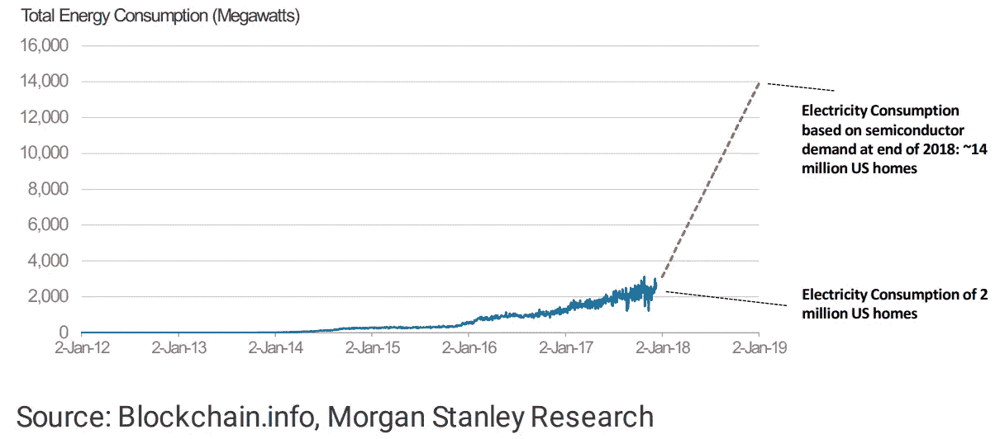

# 查看摩根士丹利的比特币研究报告

> 原文：<https://medium.com/coinmonks/reviewing-morgan-stanleys-bitcoin-research-reports-add2477b6a34?source=collection_archive---------1----------------------->

**Click to Find blockchain Jobs**

`[Find blockchain jobs using Coinmonks jobs portal](https://coinmonks.com)`

`[***Get published on Coinmonks***](https://medium.com/coinmonks/contribute/home)`

*(以下文章摘自* [*mrb 的博客*](http://blog.zorinaq.com/) *，经作者*[*Marc Bevand*](http://www.zorinaq.com/)*许可转载)。原贴* [*此处*](http://blog.zorinaq.com/morgan-stanley-bitcoin-research-reports/) *于*2018 年 02 月 06 日 *)*

Marc 回顾了摩根士丹利(Morgan Stanley)分析师发表的以下两篇关于比特币用电的研究报告:

1.  [比特币 ASIC 生产充实用电；指向即将到来的跳跃](https://ny.matrix.ms.com/eqr/article/webapp/b974be48-effb-11e7-8cdb-6e28b48ebbd3)，作者詹姆斯·E·福塞特等人，2018 年 1 月 3 日
2.  [比特币需求> EV 需求？](https://ny.matrix.ms.com/eqr/article/webapp/11d8a6c8-f081-11e7-8cdb-6e28b48ebbd3)，作者尼古拉斯·J·阿什沃斯等人，2018 年 1 月 10 日

第一份报告估计目前的用电量为 2500 MW，与我自己估计的截至 2018 年 1 月 11 日的 [1620/2100/3136 MW](http://blog.zorinaq.com/bitcoin-electricity-consumption/#summary) (下限/最佳猜测/上限)一致:

然而，我发现了一些错误。

*   1.[数学错误(乘法而不是除法)](/p/add2477b6a34/#b70ff)
*   2.[矿区农场的 PUE 低至 1.03–1.33](/p/add2477b6a34/#6e23)
*   3.[PUE 数学不一致](/p/add2477b6a34/#7a64)
*   4.[哈希拉特方法做出乐观和悲观的假设](/p/add2477b6a34/#fdc4)
*   5.[鄂尔多斯农场只有一小部分开采比特币](/p/add2477b6a34/#ed3c)
*   6. [Antminer S9 称霸市场](/p/add2477b6a34/#843f)
*   7.[电费](/p/add2477b6a34/#f321)
*   8.[比特大陆的直销模式:全球一价](/p/add2477b6a34/#c6bb)
*   9.[未入账的交易费用](/p/add2477b6a34/#020a)
*   脚注

# 1.数学错误(用乘法代替除法)

分析师试图预测从现在起 12 个月内的未来消费量(约。2019 年 1 月)，并声称它可能“*超过 13500[原文如此]兆瓦*。”

根据 TSMC 每月 1.5 万至 2 万片 300 毫米比特币专用集成电路的生产订单，他们估计“*可能会增加多达 500 万至 750 万个新设备*”。他们声称根据 650 万英镑计算用电量，但他们的数字只与上限 750 万英镑相符:

7.5 米× 1300 瓦× 1.4 瓦(效率提高)= 13 650 兆瓦

乘以 1.4 是为了说明新钻机带来了" *40%的效率提升*"，这是他们的错误:他们乘而不是除。 [1](http://blog.zorinaq.com/morgan-stanley-bitcoin-research-reports/#fn:eff) 给定体积的晶圆/芯片更节能，每毫米芯片面积消耗更少，而不是更多。当修正这个误差时，我们得到了 6950 MW 的估计值，大约是他们公布的数字(13 500 MW)的一半。)

# 2.矿区的 PUE 低至 1.03-1.33

摩根士丹利分析师假定" *60%的直接用电量(即总用电量的 40%用于冷却、网络设备等非哈希操作。)*“在数据中心行话中，这被称为 100/60 = 1.67 的 [PUE](https://en.wikipedia.org/wiki/Power_usage_effectiveness) 。

然而，没有研究支持采矿业如此可怕的 PUE 价值。 [2](http://blog.zorinaq.com/morgan-stanley-bitcoin-research-reports/#fn:sourceVavilov) 实际上，大多数采矿场都在积极优化他们的 PUE:

*   Gigawatt Mining 建造了 PUE 为 1.03-1.05 的风冷采矿场。 [3](http://blog.zorinaq.com/morgan-stanley-bitcoin-research-reports/#fn:sourceGW)
*   Bitfury 数据中心能效极高；例如，他们 40 兆瓦的挪威数据中心的 PUE 为 1.05， [4](http://blog.zorinaq.com/morgan-stanley-bitcoin-research-reports/#fn:moirana) ，他们的首席执行官强调冰岛数据中心的 PUE 并不高。 [2](http://blog.zorinaq.com/morgan-stanley-bitcoin-research-reports/#fn:sourceVavilov)
*   据报道，著名的比特大陆鄂尔多斯煤矿的 PUE [要么是 1.11，要么是 1.33](https://plus.google.com/+MarcBevand/posts/Fg8i66ATzhU) (取决于哪个记者的数据可信。)

谷歌优化了他们的数据中心 PUE，低至 1.06 [5](http://blog.zorinaq.com/morgan-stanley-bitcoin-research-reports/#fn:googlePUE) ，电力甚至不是他们的主要成本之一。因此，找到处于相同范围的矿工是完全有意义的，对他们来说，电力*是*他们的主要成本之一。

# 3.不一致的 PUE 数学

根据他们对未来能耗的估计和 PUE 的估计，最终的全球能耗应为 13500 × 1.67 = 22 500 MW × 90%利用率= 20 250 MW。但是他们计算出*将近 16 000 兆瓦*

20500 ≠ 16000.数学是不一致的。

修正它们的数学和参数得到 6950 × 1.11(或 1.33) × 90% = 6950(或 8300) MW。

总之，摩根士丹利的第一份报告预测了消费 ca。2019 年 1 月将是**13500–16000 兆瓦(年化 120–140 兆瓦时)**然而，修正多个误差实际预测**6950–8300 兆瓦(年化 60–75 兆瓦时)。**

# 4.哈希拉特方法作出乐观和悲观的假设

该报告声称“*散列率方法使用了一套相当乐观的效率假设*”这不是真的。也许他们参考了其他人的 hashrate 方法。但是正如简介中的[所解释的，mine 做出了乐观**和悲观**的假设(矿工使用最低效或最高效的 ASICs。)](http://blog.zorinaq.com/bitcoin-electricity-consumption/#summary)

# 5.只有一小部分鄂尔多斯农场开采比特币

该报告继续试图推断鄂尔多斯煤矿的全球电力消耗:

*   他们没有考虑到只有 7/8 的农场开采比特币的事实。其余八分之一开采莱特币。
*   媒体公布的功耗数据略有不同，暗示比特币钻机的功耗为 29.2 MW 或 35 MW(取决于记者)。)
*   他们的计算是建立在对其哈希值的粗略估计上的(“约 600 万 TH/s 的 4%”)，但可以更精确地计算，因为我们知道有 21k 个比特币平台(~263k TH/s)

当纠正这些错误时，根据记者的说法，该矿的全球功耗比例为 1520 万瓦时/秒，这意味着全球功耗为 1690 或 2020 兆瓦(14.8 或 17.7 太瓦时/年)。这大大低于分析师的 **2700 兆瓦** (23 兆瓦时/年。)

# 6.Antminer S9 主导市场

该报告指出“*比特大陆在其设施中使用的最高效的采矿钻机[Antminer S9/T9]尚未广泛提供*”，并暗示如果没有这些钻机，一般的钻机肯定是另一种效率较低的型号。

分析师们有效地将*市场*与*市场份额*混为一谈。

比特大陆声称他们在 2017 年年中拥有 70%的市场份额。所有迹象都表明，今天的失业率甚至更高。Antminer S9/T9 是比特大陆在过去 20 个月里出售的唯一一台比特币采矿设备。成千上万的批次在 shop.bitmain.com 几分钟内销售一空。比特大陆每月购买约 20，000 片 16 纳米晶圆，可以说占了摩根士丹利分析师自 2017 年 3 季度以来每月约 10，000 片晶圆的大部分。

每月生产约 10k 晶圆= ~270k S9 = **~3.6 EH/s** 。

这比 2017 年第 3 季度和 2017 年第 4 季度全球每月新增的**1–3eh/s**还要多(从晶圆生产到开采需要几个月的时间。)比特大陆钻井平台构成了迄今为止部署的几乎所有的 hashrate。

# 7.电费

至于摩根士丹利的第二份报告，它只是引用了第一份报告中有缺陷的 120-140 TWh/年的预测。2019 年 1 月。除此之外，它的质量一般都比第一种好。我的批评涉及相对次要的几点。

在这份报告中，分析师通过假设电力成本在每千瓦时 6 到 8 美元之间来计算开采一个比特币的成本。其来源是整个地理区域的环境影响评估数据。

矿商不支付平均价格。他们选择这些地区较便宜的电力设施。

例如，分析师对华盛顿州的报价为 **7.46** (见他们的图表 5)，位于该州的一个采矿场[千兆瓦](https://giga-watt.com/)，实际支付 **2.8** 。在我看来，行业平均水平大概在 5 左右。

# 8.比特大陆的直销模式:全球统一价格

他们在计算开采一枚比特币的成本时做出的另一个假设是，在中国以外，一枚蚂蚁金服 S9 的价格为 7000 美元。事实上，在易贝等第三方网站上，只有个人零售额能达到这么高的价格。代表一般采矿场的大型矿商，甚至在中国以外，都支付同样的价格:比特大陆的直接销售价格是 2320 美元，大约在报告撰写时售出。

# 9.交易费用未入账

最后，他们暗示开采一个比特币的成本是一个“*盈亏平衡点*”，但这并不完全正确。例如，在报告发布时，矿工收取的交易费平均超过每日[600 BTC](https://blockchain.info/charts/transaction-fees?daysAverageString=7)，使他们的全球每日收入增加了 1.33 倍(1800 到 2400 BTC)，因此真正的盈亏平衡点低了 1.33 倍。

纠正这些错误，电力成本为 0.05 美元/千瓦时，全球销售价格相同，以及 12 月/1 月的(异常)高费用期，真正的盈亏平衡点为 2300 美元，大大低于分析师的数字(3000 美元至 7000 美元)。)

# 脚注

1.  我认为乘法和除法都是不正确的。新芯片每*硅栅*消耗的能量比每*毫米芯片面积*消耗的能量少。每毫米的功耗在两代不同的芯片之间大致相同，因为每毫米的门电路功耗更低，但可以封装更多。例如，镭龙 R9 390 和镭龙 RX Vega 64(大约相同的芯片面积:438 和 486 毫米)是在两个非常不同的工艺节点(28 纳米和 14 纳米)制造的，但它们具有相同的约 300 W TDP。尽管如此，我还是按照分析师的观点继续留在了这个部门。 [↩](http://blog.zorinaq.com/morgan-stanley-bitcoin-research-reports/#fnref:eff)
2.  Bitfury 首席执行官瓦列里·瓦维洛夫在一次采访中随口说道:“全球许多数据中心有 30%到 40%的电力成本用于冷却，这相当于 1.43 到 1.67 的 PUE”，这句话经常被误解。显然，他指的是采矿业以外的传统数据中心。事实上，他强调“T14 这种[高 PUE]在我们的冰岛数据中心不是问题 T15。”[↩](http://blog.zorinaq.com/morgan-stanley-bitcoin-research-reports/#fnref:sourceVavilov)t18】↩2
3.  来源:与首席执行官戴夫·卡尔森的个人讨论。 [↩](http://blog.zorinaq.com/morgan-stanley-bitcoin-research-reports/#fnref:sourceGW)
4.  Bitfury 位于挪威的 40 MW Mo i Rana 数据中心的 [PUE 为 1.05 或更低](http://bitfury.com/content/4-press/03_20_18_bitfury_norway_datacenter_release.pdf) [↩](http://blog.zorinaq.com/morgan-stanley-bitcoin-research-reports/#fnref:moirana)
5.  来源:[效率:我们是如何做到的](https://www.google.com/about/datacenters/efficiency/internal/) [↩](http://blog.zorinaq.com/morgan-stanley-bitcoin-research-reports/#fnref:googlePUE)