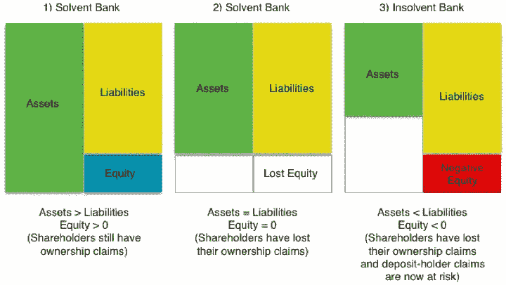
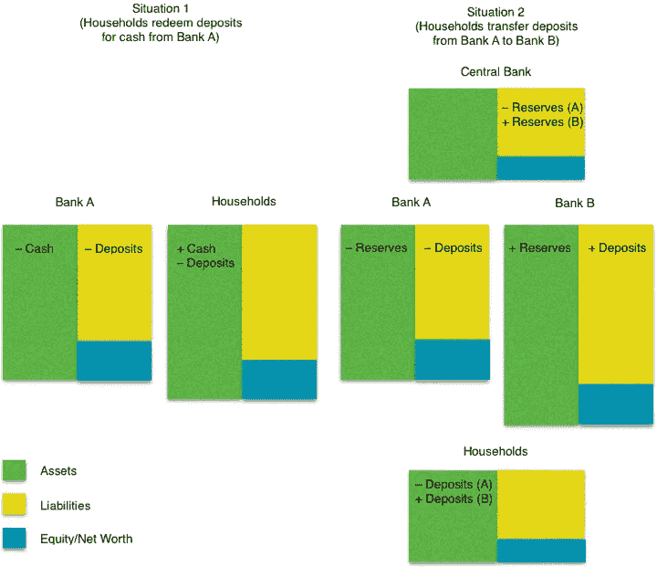

# 重温雷曼兄弟的倒闭

> 原文：<https://medium.com/coinmonks/revisiting-the-lehman-brothers-collapse-fb18769d6cf8?source=collection_archive---------0----------------------->

**银行业的业务及其内在危机**

*为了理解我们的经济，有必要对银行业进行批判性的、非理性的审视。它是一种破坏性力量，往往会诱发和加剧不稳定，即使它是为投资和经济增长提供资金的一个重要因素。”*

—海曼·明斯基在*稳定不稳定的经济* ( [1986](http://digamo.free.fr/minsky86.pdf) )

一家拥有 158 年历史、拥有数十亿美元资产的美国投资银行是如何突然崩溃的？海曼·明斯基的上面几行包含了一个线索。

2008 年夏末雷曼兄弟的破产以及随之而来的金融动荡通常被称为“明斯基时刻”。它揭示了金融系统固有的不稳定性，而随后对众多其他银行和金融机构的救助表明了美国政府对银行系统的重视，认为它是为投资和经济增长融资的重要因素。按照明斯基的建议，我们必须以一种非理性的眼光看待银行业，这将引导我们审视银行业的商业模式及其固有的危机。

**首先，说一下救助计划**

如果你的印象是银行创造货币，正如我所展示的([这里](/@mattdjohnston92/canadian-banks-create-money-too-6c69e2c3d8f5))，那么你可能会感到有点困惑。我认为，银行每次发放贷款时，都会通过在资产负债表上同时创造贷款资产和存款负债来创造货币。(如果你想快速回顾一下这个观点，可以看看下面的前国际货币基金组织经济学家迈克尔·库姆霍夫(Michael Kumhof)。

Source: YouTube

所以问题来了:如果银行创造了货币，他们为什么需要救助？答案当然可以在我之前讨论过的其他东西中找到——金钱的等级制度。

正如我刚才提到的，银行创造的货币以存款的形式出现，这是发行银行的负债。存款只是借条，请注意，借条可以用来支付和清偿债务，这就是为什么它们被认为是钱。作为借据，它们是支付的承诺。*承诺付出什么？你可能想知道。它们是支付现金的承诺，现金是政府发行的货币。现金为王。*

私人银行发行的货币在货币层级上低于政府发行的货币，这意味着银行面临两种独立但相关的潜在危机——流动性危机和偿付能力危机。我们将逐一探讨，在此过程中，我将回答我在上一篇文章结尾留下的一个问题，即，到底是什么限制了银行的货币创造？

**流动性和偿付能力**

流动性和偿付能力都与一个人偿还债务的能力有关。然而，区分这两者并不容易，正如伦敦政治经济学院教授查尔斯·古德哈特[写道](http://www.lse.ac.uk/fmg/documents/specialPapers/2007/sp175.pdf)“流动性和偿付能力是银行业的孪生兄弟，通常难以区分。一家流动性不足的银行可能会迅速破产，而破产的银行又会变得流动性不足。”让我们看看他是什么意思。

流动性就是在需要的时候能够获得现金。如果你能轻松解决当前的债务，你就有了流动性。如果你的债务即将到期，而你没有现金来偿还，那么你就遇到了流动性危机。可以肯定的是，在这种情况下，存款账户和现金差不多，因为它可以根据需要兑换成现金，也可以用来支付各种各样的款项，而无需先兑换成现金。对家庭来说，现金和存款的流动性和资产差不多。

假设你的这两种流动资产中的任何一种都快用完了，你可以试着卖掉一些你的贵重物品，比如你的车，或者你的高档手表，甚至你的旧棒球卡收藏。问题在于，这些物品在紧要关头不容易卖出(你或许可以很快卖出，但你可能不得不提供低得离谱的价格)，这恰恰是这些贵重物品与现金相比缺乏流动性的原因。

然而，你有贵重物品可以出售的事实表明你可能仍然有偿付能力，这意味着你拥有的比你欠的多。换句话说，你的资产总值等于或大于你的负债总值。你所面临的流动性问题是，你所拥有的资产不是现金形式的，可能需要一段时间才能转换成现金。但是你的债务现在到期了。

要理解这对银行意味着什么，思考一下银行业务模式的本质是有帮助的；也就是说，银行为了盈利而做的事情。请记住，银行不仅仅是通过帮助人们和企业为他们的各种努力提供资金来创造货币；他们这样做的原因和任何企业提供产品或服务的原因一样——为了利润。

银行业的基本商业模式是发行短期负债，以获取长期资产。银行发行的主要负债是存款，通常可以随时赎回，通常向存款人支付少量利息。银行获得的资产是贷款，如汽车贷款、信用卡贷款或抵押贷款，这些贷款将在一段时间内偿还，但其利率高于存款利率。银行贷款利率和存款利率之间的差异是银行利润的主要来源。

但是，请注意赎回存款和偿还贷款之间的时间差。存款可以在短期内赎回，而贷款要在更长的时间内偿还。这就是业内所说的成熟转型，但也正是这一点让银行业的业务存在内在风险。要了解原因，让我们回到偿付能力的概念。

如果一家银行的资产总值等于或大于其负债总值，那么它就是有偿付能力的。我们可以用最基本的会计恒等式来表示这种偿付能力状况:资产=负债+权益。银行所拥有的资产的总价值，正好等于银行所欠的债务，即负债和权益。负债可以被认为是银行欠存款人和其他贷款人的，而权益可以被认为是银行欠股东的。

根据上面的等式，有三种可能的情况，其中两种产生偿付能力的情况，一种产生破产的情况:1)如果资产>负债，那么权益> 0，银行是有偿付能力的；2)如果资产=负债，那么权益= 0，银行有偿付能力；3)如果资产< Liabilities, then Equity < 0 and the bank is insolvent. The three scenarios are illustrated below.

Despite the three scenarios, the fact that we can reduce a bank’s condition down to solvency or insolvency makes it seem as though the whole notion of solvency is a binary condition. Reality, however, is much more complex, which is why Matthew C. Klein at the *金融时报* [写道](https://ftalphaville.ft.com/2014/09/30/1988932/illiquid-insolvent-whats-the-difference/)“银行凭借其不寻常的商业模式，存在于偿付能力和破产之间的冥界。”

**偿付能力和破产之间的地狱**

在考虑一家银行如何可能从有偿付能力的状况转变为无偿付能力的状况时，有必要花点时间考虑不同类型的银行资产及其相对流动性。银行最具流动性的资产是现金和储备。有时，储备这个词的用法包括现金，但这个词更具体的用法是描述个体银行在中央银行持有的存款账户(中央银行是私人银行的银行)。流动性稍差的资产是政府证券(即政府债券)，尽管不是很多。然后是对私营部门的贷款，包括企业和家庭。最后，还有银行的实物资产，比如它拥有的房产和建筑物。

> [在您的收件箱中直接获得最佳软件交易](https://coincodecap.com/?utm_source=coinmonks)

现在，假设一种情况:假设由于某种原因，异常数量的储户将他们的存款赎回现金或将他们的存款转移到另一家银行。在第一种情况下，银行将支付现金，在第二种情况下，银行将通过中央银行的资产负债表将储备转移到另一家银行(如下图所示)。不管是哪种情况，这家银行的流动资产都在减少。

在情况 1 中，我们有家庭将他们在银行 A 的存款兑换成现金。这在上文中被描述为银行 A 存款负债的减少与银行 A 现金持有量的减少相匹配；对于家庭，我们有资产互换(即家庭将存款换成现金)。

在情况 2 中，家庭再次交换资产，但这一次是以在银行 A 的存款交换在银行 B 的存款的形式。因此，银行 A 的存款负债被消除，而银行 B 的存款负债增加。但是，故事还没有结束。请记住，虽然家庭可能把银行的负债视为金钱，但银行把彼此的负债视为信用。这意味着银行 A 现在欠了银行 B 的债，必须用货币层级中更高的一种货币形式来偿还这笔债务(请注意，该图显示中央银行在最上面，表明一种反映货币层级的机构层级)。因此，债务通过央行资产负债表上的储备转移来解决。甲银行在中央银行的账户被借记，乙银行的账户被贷记。

情况 1 或情况 2，或两者的组合，导致银行 a 的流动性减少。如果存款赎回发生的规模足够大，这可能导致流动性严重不足，并可能出现流动性危机。

流动性短缺的银行可以考虑几个选择。一种选择是出售其他流动性相对较高的资产，比如政府债券。然而，通常情况下，资产的流动性越强，银行获得的利息收入就越少，因此银行倾向于将这些流动性资产保持在最低水平。如果储户赎回的金额超过这些流动性相对较高的资产，那么银行可能不得不出售流动性较低的资产。但是，试图出售流动性较低的资产的问题恰恰在于它们的流动性较低，这意味着银行可能不得不以低于公平价格的价格出售它们，以便在如此短的时间内将其转换为现金。

这就是银行的问题所在。如果它以低于其在银行资产负债表上的当前价值的“甩卖”价格出售其非流动性资产，那么银行的资产负债表将受到打击。如果受到足够多这样的打击，银行的资产价值可能会跌破银行的负债价值，导致股东权益受损，银行陷入资不抵债的境地。

当然，银行可以考虑其他选择。其中之一是，该行可以尝试用非流动性资产作为抵押，在货币市场上借款，比如从另一家银行借款，而不是出售这些资产。这种选择允许银行获得必要的流动性，而不必承担以低于理想价格出售资产的损失。这里唯一的问题是，潜在的货币市场贷款人必须愿意接受作为抵押品提供的资产。如果他们有理由质疑这些资产的质量，比如说，因为这些资产可能是由一个不太可能偿还的借款人支持的，那么他们可能会要求更高的补偿，或者干脆拒绝放贷。另一方面，如果银行的偿付能力有问题，那么他们可能无法获得贷款，即使抵押质量更高。

值得暂时倒退一下。我开始这个例子时，假设有异常数量的储户在银行赎回他们的存款，却没有解释为什么会发生这种异常。这里有一个可能的原因:市场参与者质疑银行的资产质量，并开始担心银行可能资不抵债；对银行资不抵债的担忧导致储户急于将钱取出。这就是你所谓的经典挤兑。

古德哈特教授关于流动性差的银行很快就会破产，而破产的银行很快就会变得流动性差的说法，现在可能开始变得更有道理了。但是，还有另一个选择——从中央银行借款。

在我的上一篇文章中，我说银行做出贷款决定，然后寻找准备金，中央银行根据银行系统的需求提供准备金。嗯，对于存在短期流动性问题的银行来说，这恰恰是央行被设计来执行的功能之一。然而，有一个问题。虽然央行不介意将提供准备金作为其货币政策目标的一部分，以管理利率或帮助银行摆脱暂时的流动性危机，但它们通常不喜欢向资不抵债的银行提供准备金。

根据《T2 时报》的报道，雷曼兄弟在近十年前就遭遇了这样的现实，尽管银行自己认为它“资产超过负债 284 亿美元”。其他人不同意。美国银行的首席执行官当时断言，投资银行亏空 660 亿美元。雷曼发现自己处于偿付能力和破产之间的地狱，而作为该行最后希望的美联储宣布了破产裁决。就这样，一家有着 158 年历史的美国银行倒闭了，这家银行通过向客户贷款来创造货币，以润滑商业的车轮。

**银行创造的货币的固有限制**

从雷曼兄弟吸取的教训是，尽管银行创造了货币，但人们不应该认为这意味着它们会不情愿地创造货币。银行确实面临某些限制。我一直强调的这一点是由银行业务模式本身的性质决定的。

正如我提到的，银行的业务是盈利。他们有成本，如支付存款账户的利息，他们有收入，这是他们从贷款中获得的回报。他们的成本或多或少是确定的，但他们的收入取决于贷款是否偿还。由于收入的不确定性，银行不得不小心贷款对象，因为无法偿还的贷款最终会变成一文不值的资产。无价值的资产不会带来收入，如果你收购了足够多的资产，你可能会走向破产。

这是所有银行都面临的创造货币的固有极限，然而竞争的力量不断将银行推向这一极限。没有人想制造不良贷款，但过于谨慎意味着落后于竞争对手。在金融危机最严重的时候，高盛首席执行官劳埃德·布兰克费恩在 2009 年写了一篇关于他的职业的文章，“作为竞争对手，我们保护和扩大市场份额的自我利益有时会蒙蔽我们的双眼——尤其是在繁荣达到顶峰的时候。”除了提及自身利益和竞争之外，关于繁荣的观点也很重要。当经济繁荣时，人们通常会发现更容易偿还债务。如果人们很容易偿还债务，那么给他们更多有什么坏处呢？

虽然雷曼兄弟(Lehman Brothers)艰难地发现了危害所在，但很难知道美国银行业整体是否吸取了同样的教训。雷曼破产后笼罩金融市场的恐惧无疑会导致其他银行遭受类似的命运，美联储也知道这一点。随着整个银行业面临风险，无论是否有偿付能力，美联储都不会让整个金融体系在其监管下崩溃。

那么，当政府对你在经济中扮演的角色给予如此高的溢价，让你可以说是“[太大而不能倒](https://www.bloomberg.com/quicktake/big-fail)”时，发放更多贷款有什么坏处呢？如果你太大而不能倒，那么创造货币的明显固有限制似乎是一个软限制。由于银行在危机时期得到政府的隐性担保，盈利的私人银行将会试探这种担保的限度。这只是经济学家所说的道德风险的一个例子，正是由于这种道德风险的原因，政府通常认为施加一些外部限制是明智的。但是，这是一个解释，将不得不等待另一个职位。