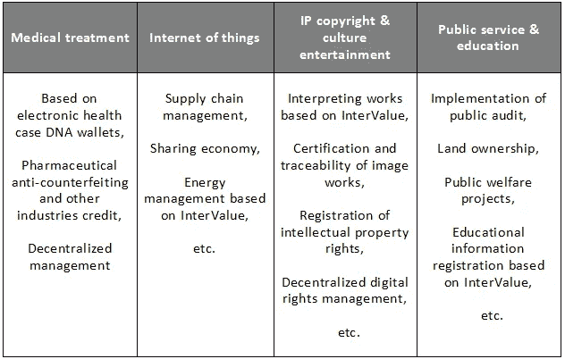
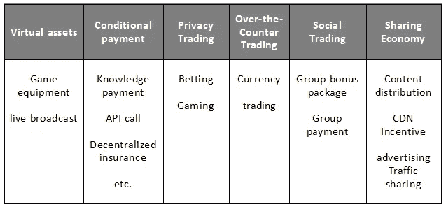
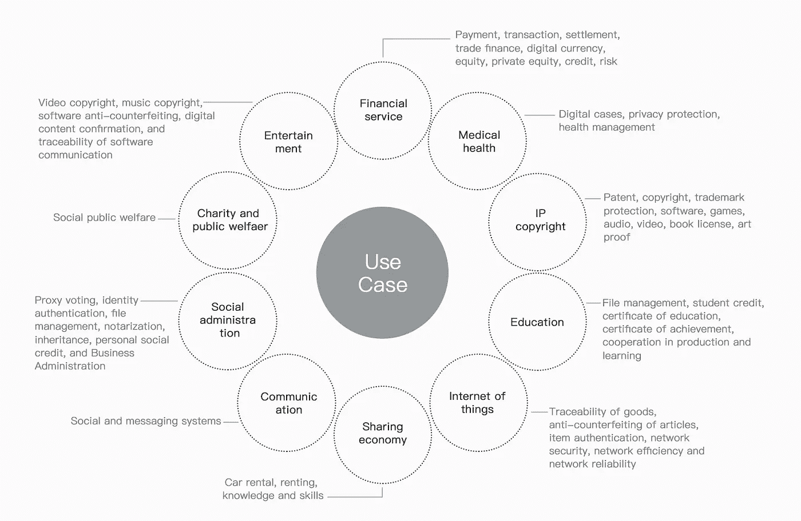

# 区间值应用狂想曲

> 原文：<https://medium.com/coinmonks/rhapsody-of-intervalue-application-974420dac36?source=collection_archive---------9----------------------->

了解区块链的人应该知道，区块链技术从 2008 年提出到现在已经经历了几次迭代。从区块链的开始到区块链的发展，从 1.0 时代到 3.0 时代，然而，无论技术如何发展，区块链都离不开应用的实现。它就像一把被打磨过的利剑。如果不出现在战场上，那就只能是一块没用的废铁。最多只能放在家里作为装饰。因此，需要应用区块链技术来实现其价值。应用越广泛，区块链的价值就越大。

**区块链 1.0 到区块链 3.0 的方式**

区块链 1.0 是以比特币为代表的加密货币应用。2009 年初，比特币网络正式上线。作为一种虚拟货币体系，比特币的总量受到网络共识协议的限制，任何个人或机构都不能随意修改供应量和交易记录。支撑比特币运行的底层技术——实际上区块链是一种极其巧妙的分布式共享账本和点对点价值传输技术。其对金融乃至各种行业的潜在影响不亚于复式记账发明。这一时期的应用场景包括支付、流通等货币功能。

区块链 2.0 加密货币与智能合约相结合，因此是更广泛的金融场景和改进进展的应用。2014 年前后，业界开始认识到区块链技术的重要性，并试图创建一个通用的技术平台，为开发者提供 BaaS(区块链即服务)，大幅提高交易速度，减少资源消耗，支持 PoW、PoS 和 DPoS 等多种共识算法。区块链 2.0 可用于登记、确认和转换各种财产和合同，如金融交易、公共记录和个人记录等。这使得整个市场更加分散。

区块链 3.0，它进一步淹没了经济领域，可用于实现全球范围内日益自动化的物理资源和人力资产分配，促进科学、健康、教育等领域的大规模合作。在 2015 年左右，随着基于 DAG 数据结构的 byteball 和 IOTA 等区块链 3.0 技术的推出，区块链系统更加高效、可扩展、高度互操作，用户体验也比以前更好。其应用进一步扩展到医疗保健、知识产权、教育、物联网、共享经济、通信、社会管理、慈善、文化娱乐等更广泛的领域。

**区块链 4.0 应用奇观**

一个货币从 1.0 到 3.0 的多行业应用，区块链技术的价值已经从纵向发展到横向，因此其应用在未来也充满了可能性。人们期望建立基于区块链的价值转移网络，进一步促进社会生产力的解放，从而更多的行业将被改变。

区块链如何实现 4.0 时代的应用？

作为以英特威尔为代表的技术领导者，支持各种应用，包括匿名网络通信、电源共享、存储空间共享、带宽共享、信誉共享(信用担保)。它为第三方应用程序开发提供了开放接口。通过连接各种应用场景，英特威尔与各种服务提供商和应用提供商合作，支持商业机构或政府机构根据业务特点和需求建立公共、联盟或特许连锁应用系统。tives。我们以 JSON-RPC 的形式设计了大量的工业通用接口，满足不同的场景，如流通支付、数据传输、数据查询和合同调用。

InterValue 的主要场景有:(1)数字货币；(2)广泛的金融应用；(3)非金融应用。应用程序。

数字货币

数字货币的主要应用场景如下:第三方

资产发行；众筹。

广泛的金融应用

数字货币的主要应用场景如下:跨

边境支付、供应链金融、数字票据；资产证券化，银行

参考，保险。

InterValue 可以实现多点之间的直接交易和所有信息处理，提高效率，节约交易成本，创造信用，有助于非金融应用的发展。可变现的非金融应用主要有医疗、物联网、IP 版权和文化、娱乐、公共服务和教育。

当前的应用实例主要包括虚拟资产应用、有条件支付应用、私人交易应用、场外交易应用、社交交易应用和共享经济。同时，已经进入实质性规划和开发的两个典型的区间值链应用是:分布式社交网络应用和基于区间值的全局存储网格应用。

InterValue blockchain application ecosystem

价值间区块链应用生态系统

区块链技术的应用是必然的，我们相信未来我们的生活会因为区块链而变得更安全、更方便、更美好。所以，请跟随 InterValue 的步伐。

我们一定会实施区块链应用，我们相信有一天我们的生活会因为区块链而变得更加安全、便捷和丰富多彩。所以，让我们期待 InterValue 的进步。

可以了解更多:[http://www.inve.one/](http://www.inve.one/)

你可以加入我们的电报:【https://t.me/InterValueProject