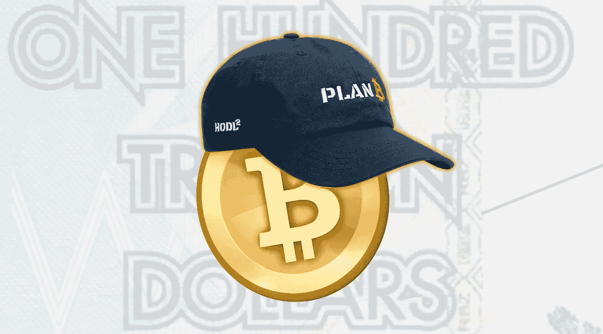

# 风险、不确定性、模型和比特币

> 原文：<https://medium.com/coinmonks/risk-uncertainty-models-and-bitcoin-d40f055406da?source=collection_archive---------8----------------------->

11 月已经结束，12 月的第一周还没有带来比特币新高的希望，这可能会将加密货币推至历史性的 98，000 美元，正如 PlanB 的笔名 100 万亿美元 Twitter 账户所预测的那样。

PlanB 曾经因准确的预测而受到钦佩，现在面临着几千名 Twitter 粉丝的愤怒，他们相信他的精确记录，对理解这位 100 万亿美元的人用来推测比特币价格的模型毫无兴趣，比特币是有史以来最令人兴奋和最不稳定的资产。

根据著名统计学家乔治·博克斯的名言“所有模型都是错误的，但有些是有用的”，甚至不适合指责模型不正确或计划明显失败。至少在从经济角度理解风险和不确定性之间的区别之前不会。所以，让我们暂时忘记模型，直接面对事实。

从前，有一个名叫艾萨克·牛顿的英国人，他在 1687 年出版了他最著名的著作《自然哲学的数学原理》。在他的工作中，牛顿通过强大的数学计算表达了运动定律。这本书还有三个版本，最后一个版本出版于 1726 年，也就是他 84 岁去世的那一年。

牛顿的出版物在物理领域之外产生了共鸣，影响了其他知识分支。它影响了一大批思想家，主要是因为在欧洲面临量化、资源管理和过程效率问题的时候，牛顿方法具有非凡的解释力。因此，这种新的方法论是现代经济思想的基石。然而，近半个世纪后，随着亚当·斯密的《国富论》的问世，经济学才被认为是一门科学——一门政治科学。

在接下来的几年里，出现了几个经济思想流派，它们通过叙述来构建自己的思想，有时还得到越来越复杂和精密的数学模型的支持。就这样，“政治”这个词被搁置一边，数理逻辑从政治话语中接管过来统治经济主流。政治经济学让位于经济学。

这种重心的转移对新的社会结构至关重要。工业生产增加，国际贸易大幅发展，资本市场成倍增长。如果没有牛顿和他的前辈们的推理，这是不可能的。

经济学家的错误在于，他们认为几个世纪前发现的对社会产生积极影响的普遍平稳定律可以永远作为非平稳经济的模型。

虽然宇宙法则在数百万年内保持不变，但经济会通过大笔一挥、一次政治演讲、一枚导弹，甚至一条简单的推特发生变化。认为其他一切都可以用类似于静态模型的精确度来衡量的观点很快证明了它的弱点。

从北到南，从东到西，世界经济遭受了无数次危机，而这些模型却无法纠正甚至识别这种扭曲。经济学不是一成不变的，也不是一门精确的科学，就像风险不等同于不确定性一样。

## **风险、不确定性和模型**

《剑桥词典》将风险定义为“坏事发生的可能性”，但这只是对风险的简单定义。在经济、商业和金融领域，风险有双重含义，既可以指有益的东西，也可以指有害的东西。

例如，一个企业可能向投资者提供有利的风险(如果成功)和不利的风险(如果失败)。风险取决于发生的概率，其影响可以评估。本质上，风险是一种可测量的不确定性。

两位著名的英国经济学家梅尔文·金(Mervin Kyng)和约翰·凯是《*极端不确定性:未知未来的决策》一书的作者，他们将不确定性定义为“我们对世界不完全了解的结果，或者我们目前的行动和未来结果之间的联系。”*

> **金和凯分别将风险和不确定性区分为可解决的和彻底的不确定性。他们强调了他们所谓的极端不确定性的维度:“…模糊；无知；含糊不清；暧昧；定义不清的问题；和缺乏信息，在某些情况下，但不是所有情况下，我们可能希望在未来纠正。不确定性的这些方面是日常经验的素材。”**

与风险相反，不确定性不能通过概率来设想，因此，其影响也不能预先推测。不确定性是不受价格影响的。

模型是现实的简化表示，用于解释社会经济现象。模型通常是描述性的，使用数学和图形表示来表达概念。

行业使用模型来检查生产过程是否达到了预期的结果，从而评估增加或减少生产、削减成本、雇佣更多员工甚至减少员工数量的需求。著名的供求模型解释了经济活动中的短期波动。许多其他模型被用于微观经济学或宏观经济学的各种目的。

模型的本质是通过一个数学结构，为一个可以按一定规律观察到的现象建立证据。PlanB 的模型正是为了预测比特币的价值。

但是 PlanB 的地板模型哪里出了问题？

意想不到的。模型只是模型，有其简化和不完美之处。模型已经准备好应对尽可能多的风险，但无法轻松应对不确定性。

正如 B 计划所报道的，地板模型十年来的第一次“失败”,不仅仅是模型本身的失败，更重要的是，它代表了我们处理不确定性的无能。

而如果说“需要模特才能打败模特”，S2F 就走对了。

***推特:***[***@ GandaraMarcio***](https://twitter.com/GandaraMarcio)

> 加入 Coinmonks [电报频道](https://t.me/coincodecap)和 [Youtube 频道](https://www.youtube.com/c/coinmonks/videos)了解加密交易和投资

## 也阅读

 [## 杠杆代币[多头代币]终极指南

### 杠杆化令牌是具有杠杆化风险敞口的 ERC20 令牌，不考虑保证金、要求、管理…

medium.com](/coinmonks/leveraged-token-3f5257808b22)  [## 最佳加密交易所| 2021 年十大加密货币交易所

### 加密货币交易所的加密交易需要了解市场，这可以帮助你获得利润。之前…

blog.coincodecap.com](https://blog.coincodecap.com/crypto-exchange)  [## 2021 年最佳加密借贷平台| 6 大比特币借贷平台

### 获得比特币和其他加密货币的最佳贷款利率

medium.com](/coinmonks/top-5-crypto-lending-platforms-in-2020-that-you-need-to-know-a1b675cec3fa)  [## 2021 年最佳免费加密交易机器人

### 2021 年币安、比特币基地、库币和其他密码交易所的最佳密码交易机器人。四进制，位间隙…

medium.com](/coinmonks/crypto-trading-bot-c2ffce8acb2a)  [## 最佳 4 个加密交易信号电报通道

### 这是乏味的找到正确的加密交易信号提供商。因此，在本文中，我们将讨论最好的…

medium.com](/coinmonks/best-crypto-signals-telegram-5785cdbc4b2b)  [## 获取信号、交易机器人和套利

### 在本文中，我们将回顾 Bitsgap，这是一个满足您所有交易需求的一站式加密交易平台。它…

blog.coincodecap.com](https://blog.coincodecap.com/bitsgap-review)  [## 5 个最佳社交交易平台[2021] | CoinCodeCap

### 困惑于社交交易和副本交易哪个平台最好？本文将带您了解各种…

blog.coincodecap.com](https://blog.coincodecap.com/best-social-trading-platforms)  [## BlockFi 评论 2021:利弊和利率| CoinCodeCap

### 今天，我们提出了一个全面的 BlockFi 评论，这是一个成立于 2017 年的加密贷款平台，拥有其…

blog.coincodecap.com](https://blog.coincodecap.com/blockfi-review)  [## 如何在印度购买比特币？2021 年购买比特币的 7 款最佳应用[手机版]

### 如何使用移动应用程序购买比特币印度

medium.com](/coinmonks/buy-bitcoin-in-india-feb50ddfef94)  [## 加密税务软件——五大最佳比特币税务计算器[2021]

### 不管你是刚接触加密还是已经在这个领域呆了一段时间，你都需要交税。

medium.com](/coinmonks/best-crypto-tax-tool-for-my-money-72d4b430816b)  [## 存储比特币的最佳加密硬件钱包[2021] | CoinCodeCap

### 保管您的数字资产很容易，但找到正确的存储方式却是一项繁琐的任务。在线钱包有一个风险…

blog.coincodecap.com](https://blog.coincodecap.com/best-hardware-wallet-bitcoin)  [## Pionex 评论 2021 |免费加密交易机器人和交换

### Pionex 是为交易自动化提供工具的后起之秀。Pionex 上提供了 9 个加密交易机器人…

medium.com](/coinmonks/pionex-review-exchange-with-crypto-trading-bot-1e459d0191ea)