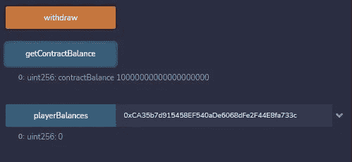

# 石头、剪子、布在坚固中|第 1 部分

> 原文：<https://medium.com/coinmonks/rock-paper-scissors-in-solidity-part-1-9d7c5d8a316e?source=collection_archive---------0----------------------->


Photo by [Marcus Wallis](https://unsplash.com/@marcus_wallis?utm_source=medium&utm_medium=referral) on [Unsplash](https://unsplash.com?utm_source=medium&utm_medium=referral)

如果我们基于 [React 示例](https://github.com/nathan-websculpt/reactsolidity_frontend/blob/master/src/components/RPS.js)的石头、剪子、布的实体版本，我们会有一些问题。

React 代码

*   有一个随机的对手选择(石头、布或剪刀)
*   利用字符串连接来组合两个玩家的选择
*   和字符串比较来确定获胜者

这是过渡到可靠性的一个好方法，因为 React 代码中的逻辑根本不会过渡到可靠性。

制作一个真实世界的玩家对战电脑游戏比看起来要困难得多。

引入问题:

*   坚固性的随机性
*   串并置
*   字符串比较

## **坚实度字符串比较**

如果你从其他编码语言来到 Solidity——你应该知道 Solidity 不提供你习惯使用`string`的功能。字符串与`==`的比较会抛出编译器错误。


Comparison does not work with string calldata


Comparison isn’t working in an IF statement


Comparison isn’t working with string memory

***如何比较字符串***

```
keccak256(abi.encodePacked(_inputOne)) == keccak256(abi.encodePacked(_inputTwo))
```

请注意，这将编译+工作，以及…

```
keccak256(bytes(_inputOne)) == keccak256(bytes(_inputTwo))
```

看起来很复杂，其实不然。`keccak256`是一个哈希函数，它计算输入的*Keccak-256*T21 哈希。这个*散列*有一些复杂的用例，但是现在——它允许我们使用`==`比较两个输入。

`abi.encodePacked()`是 Solidity 对**非标准打包模式**的支持，在这种模式下，一切都就地编码，像`string`或`bytes`这样的动态大小类型编码时没有长度字段。

## **实度中的字符串串联**

所以，现在你知道字符串需要一些*自己动手*，让我们看看我们将如何连接字符串，就像我们在 [React 代码](https://github.com/nathan-websculpt/reactsolidity_frontend/blob/master/src/components/RPS.js)中所做的那样。

以下是在 Solidity 中实现这一点的几种方法:

```
abi.encodePacked(_inputOne, _inputTwo)
```

*和:*

```
bytes.concat(bytes(_inputOne), bytes(_inputTwo))
```

*   **ABI . encode packed(*string*)**正在复制内存
*   **字节(*字符串* )** 只是对指针类型进行造型

因此，为了实现这种级联，我们将两个输入从`string`变为`bytes`。

你可以在 [Remix](https://remix.ethereum.org/) 里玩玩这段代码，自己看看:

## **坚固性的随机性**

在像我们的石头、剪子、布这样的游戏中——为了和“*电脑*”对抗，你需要一些*随机*。好吧，因为几个不同的原因，坚固性不能提供这一点。

在计算世界中，这是一个大得多的、近乎哲学的讨论，但算法不可能真的产生一个“随机”数。对我们来说没什么大不了的，因为我们的游戏只有 3 个选择(石头、布或剪刀)。为了学习一些简单的可靠性方面的知识，我们只是想要一些可以玩的代码。

但是，你应该知道:

*   产生随机性的复杂算法成本太高
*   可靠性代码*应该是确定性的(因为它将在多个节点上运行)*
*   该算法将需要生成随机数*一次*，该随机数将在其他节点上使用
*   如果有人知道你是如何产生随机性的，他们就能预测结果

要做到这一点， ***【正确的方式】***(mainnet 上的一个真实世界的 dapp 这可能会变得相当复杂。一种方法是提供链外的随机性，但是这里也有一些 T21。

出于我们的目的，我们将只测试逻辑的功能，所以我们将通过 calldata 发送两个值(玩家的选择和计算机的选择)。这将模拟一个已经产生随机性的场景，或者两个不同的玩家在玩游戏。

# **代码**

我们希望测试和验证:

*   游戏可以转移赌注的价值
*   *不是*进入*就是*脱离玩家的平衡
*   **基于**:结果

游戏的结果将会:

*   演示*字符串连接*
*   和，*字符串比较*

**为了测试—我们将违反合同:**

*   你需要为合约提供资金(这样它就有钱来做空你)
*   更改帐户
*   并存入资金(这样你就有钱下注了)

Very basic representation of Rock, Paper Scissors logic on Solidity

你可以通过用 Ether 资助合同，交换账户，进行*存款*来测试。将帐户地址复制到“ *playerBalances* 中，查看您的资金。你用小写字符串玩这个游戏:*石头，布，剪刀*


玩完后，再次检查余额—请注意，您的赢和输都会反映在您的余额中。


因为*摇滚*击败*剪刀*，我们涨了 1，但是现在让我们来测试一个损失……*纸*会输给*剪刀。*


现在点击“取款”按钮，你的资金将会回到你的账户。



我选择这个游戏(石头、剪子、布)作为向新手展示稳健的一种方式，因为它在反应上非常简单，但在变得稳健时提供了许多*可教的时刻*。这个小合同显示了区块链代码和开发人员习惯的代码之间的直接差异。它也建立在[关于发送以太和攻击契约的 4 部分系列](/@websculpt/sending-ether-without-getting-hacked-ca366a0678f5)之上。

在这个游戏的未来版本中，我们可以重新进入托管状态，让用户彼此对战…我们需要隐藏和显示玩家选择的方法，我们将能够推进逻辑，使之更接近真实世界的 dapp。

下一篇文章将是关于把这个游戏转移到[直播应用](https://nervous-tereshkova-aa8032.netlify.app/)上。

# 如何支持更多这样的帖子

如果你想看更多这方面的内容，请在这里捐赠 ETH 或 ERC-20 代币:0xd 6355 a6b 745985342 ebf 168 E1 EC 965 DC 612704 b 1