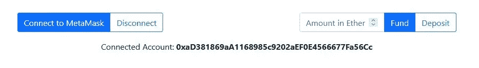

# 安全中的石头、剪子、布|第二部分| Web3 和浏览器

> 原文：<https://medium.com/coinmonks/rock-paper-scissors-in-solidity-part-2-web3-and-the-browser-79df179e8cd?source=collection_archive---------4----------------------->


Photo by [Hitesh Choudhary](https://unsplash.com/@hiteshchoudhary?utm_source=medium&utm_medium=referral) on [Unsplash](https://unsplash.com?utm_source=medium&utm_medium=referral)

在[之前的帖子](/@websculpt/rock-paper-scissors-in-solidity-part-1-9d7c5d8a316e)中，我们测试了混音版的石头剪子布合约。在 remix 中，我们有按钮来运行合同的功能…现在我将演示如何在浏览器中做到这一点。

为此，我们需要一个本地的区块链。看看[松露组曲](https://www.trufflesuite.com/ganache)。

为了准确地跟踪这个项目，你需要 node、react、truffle、ganache 和 web3-react。要了解更多信息，您可以查看 live app 上的[构建笔记。](https://nervous-tereshkova-aa8032.netlify.app/)

在我们部署到一个测试网并允许两个玩家互相对战之前——让我们让我们的合同在本地生效。请记住，它并不完美——它只是展示了一个玩家违反合同的例子(就像*玩家对电脑*的场景)。

# **使用块菌和加纳切**

[Ganache](https://www.trufflesuite.com/docs/ganache/overview) 是个人(本地)区块链，[松露](https://www.trufflesuite.com/docs/truffle/overview)是开发环境。

您将在终端(或 cmd)中使用 Truffle 来部署您的合同，Ganache 将提供一种查看帐户的简单方法。

要将区块链开发的必需品添加到 React 应用程序中，请转到终端并运行:

```
truffle init
```

你会得到 *truffle-config.js* 文件和 3 个文件夹:*合同*、*迁移*和*测试*。

进入 truffle-config 文件并更改编译器版本——我的版本是`0.8.7`

转到终端并运行:

```
truffle compile
```

`truffle compile`是检查编译错误的方法。

我们将使用 OpenZeppelin(现在使用一点，以后会大量使用)，所以让我们通过运行以下命令来添加这些合同:

```
npm install [@openzeppelin/contracts](http://twitter.com/openzeppelin/contracts)
```

你可以在 *node_modules* 中找到 OpenZeppelin 文件。

现在将[新的 Solidity Smart Contract](https://github.com/nathan-websculpt/reactsolidity_frontend/blob/master/contracts/RPSv1.sol) 引入你的代码库(你可以再次`truffle compile`来检查它是否编译)。

现在打开 Ganache，使用 *truffle-config.js* 文件创建一个新的工作空间


Ganache _> New Work Space

加纳切会给你提供一个地址列表…


现在您可以使用 *truffle-config.js* 文件将(开发)*主机*、*端口*和*网络 id* 设置为与 Ganache 实例相同的值…


## **松露和加纳切的一些注意事项**

现在，我们有了可以部署合同的对象，并且有了可以测试的地址。这个例子使用元掩码，您需要将元掩码链接到您的本地环境。

**连接元掩码**

*   点击*网络*下拉菜单
*   点击*自定义 RPC*
*   使用带有**链 ID**1337 的 **RPC URL** 添加您的新网络

*注意:*你将使用本地环境，所以确保你的应用程序中的`InjectedConnector`支持 *1337* 。([查看我的文件](https://github.com/nathan-websculpt/reactsolidity_frontend/blob/master/src/components/wallet/Connectors.js))

现在你的新网络已经添加，你可以切换到它…但你仍然需要一个帐户。

如果您返回到 Ganache 并查看地址表，您会看到每条记录都显示一个地址、一个余额、一个索引，并且在索引的右侧有一个小键。

如果您单击密钥，则可以查看该地址的公钥和私钥。要使用其中一个帐户，我们将把私钥导入元掩码

*   打开元蒙版
*   (您应该连接到您的本地网络，如果没有，请切换到它)
*   点击右上角的圆圈查看您的帐户
*   点击*导入账户*
*   将您的一个测试私钥复制/粘贴到
*   添加帐户

# **迁移**

现在，我们已经拥有了在自己的区块链上测试所需的一切，但是新的智能合约还没有部署。

让我们回到`truffle init`添加的*迁移*文件夹，看看其中的文件。重要的是，它的名称以数字 *1* 开始……迁移将按照从 *1* 到 *2* 到 *3* 等的顺序运行，因此我们需要 **RPSv1.sol** 契约的迁移以 *2* 开始。

我的名字叫做`2_rpsv1_migration.js`，它看起来像这样:

```
const RPSv1 = artifacts.require("RPSv1");
module.exports = function (deployer) {
     deployer.deploy(RPSv1);
};
```

现在在终端中运行:

```
truffle migrate
```

这将输出您的迁移结果(包括石头、布、剪刀契约……***的地址，将其复制到某个地方供以后使用*** )。

注意:你也可以从那里运行`truffle console`和`migrate`。

当对合同进行更改时，您可以运行`truffle migrate --reset`来替换合同。

## **ABI**

要在浏览器上运行，我们需要 ABI。

ABI 是契约接口的描述，它定义了用于与二进制契约交互的方法和结构。像 Solidity 这样的高级语言需要用 EVM 可执行字节码编译。部署智能合约时，该字节码存储在区块链上。

现在我们运行了一个迁移，我们应该在`/build/contracts`中有一个新契约的 json 文件。将*的 ABI 值复制到一个 js 文件中，供 React 应用程序使用。注意，ABI 将是一个数组。*

然后，我们将使用 ABI、RPSv1 的地址和 web3 来创建合同实例。

## **web3 和 web3-react**

要了解这个正在进行的项目的更多信息，[您可以查看 Live 应用程序并阅读构建说明](https://nervous-tereshkova-aa8032.netlify.app/)。它使用 web3-react，但让我们来分解一下:

*   **InjectedConnector** 是元掩码逻辑之上的抽象层

```
import { InjectedConnector } from "@web3-react/injected-connector";export const Injected = new InjectedConnector({ 
    supportedChainIds: [1, 3, 4, 5, 42, 1337],
})
```

*   [*App.js*](https://github.com/nathan-websculpt/reactsolidity_frontend/blob/master/src/App.js) 正在用 **Web3ReactProvider** 包装应用
*   其中使用提供程序创建了一个新的 web3 对象
*   然后，我们将通过这个`const library`访问 web3 功能

```
import { useWeb3React } from '@web3-react/core';const { active, account, library, connector, activate, deactivate } = useWeb3React();
```

*   因此，我们可以像这样创建一个契约实例:

```
library.eth.Contract( ABI_variable , 'address')
```

*   我们也可以使用`library`来处理数字/以太转换，如下所示:

```
library.utils.toWei(library.utils.toBN(etherAmount), 'ether')
```

[查看组件，了解更多信息。](https://github.com/nathan-websculpt/reactsolidity_frontend/blob/master/src/components/RPSETH_simple.js)

## **合同实例**

我们越来越接近从浏览器调用我们的智能合约。`contractInstance`将公开**方法**对象，这将允许我们调用智能合约的功能。契约对象作为 javascript 中的嵌套对象存在——函数调用存储在**方法**对象中。

`.call()`适用于视图函数(不会对区块链进行更改)——**getcontractballance()**就是一个很好的例子，因为它只返回余额:

```
contractInstance.methods.**getContractBalance()**.call()
```

`.send()`适用于会改变区块链状态的函数:

```
contractInstance.methods.**deposit()**.send({ from: account, value: etherBalance})
```

# **在浏览器上测试**

如果您正在使用来自 Github 的代码，它应该是这样的:


您应该做的第一件事是连接到您的一个测试帐户:



然后使用右边的字段为合同提供资金(这样它就可以对你下注)，并作为玩家存入一些以太(这样你就有东西可以下注了)。然后检查测试按钮，以确保您有资金和合同有资金。注意，可以使用 ***试玩*** 按钮赢取 1 以太。


当你玩游戏时，检查你的玩家余额——当你玩完后退出，并确保在他们与你的合同互动时观察你的 Ganache 帐户。


*免责声明:这个游戏还没有为 mainnet 准备好，因为生成的“计算机选择”可以在调用合同之前被操纵。这只是一个如何调用契约函数的例子。*

# 如何支持更多这样的帖子

如果你想看更多这方面的内容，请在这里捐赠 ETH 或 ERC-20 代币:0xd 6355 a6b 745985342 ebf 168 E1 EC 965 DC 612704 b 1

> 加入 Coinmonks [电报频道](https://t.me/coincodecap)和 [Youtube 频道](https://www.youtube.com/c/coinmonks/videos)了解加密交易和投资

## 也阅读

[](https://blog.coincodecap.com/crypto-exchange) [## 最佳加密交易所| 2021 年十大加密货币交易所

### ICON _ PLACEHOLDEREstimated 预计阅读时间:28 分钟加密货币交易所的加密交易需要知识…

blog.coincodecap.com](https://blog.coincodecap.com/crypto-exchange) [](https://blog.coincodecap.com/crypto-lending) [## 2021 年 10 大最佳加密贷款平台| CoinCodeCap

### 当谈到加密货币贷款时，大量因素等同于良好的收入状况。此外，借款的一部分…

blog.coincodecap.com](https://blog.coincodecap.com/crypto-lending) [](/coinmonks/crypto-trading-bot-c2ffce8acb2a) [## 2021 年最佳免费加密交易机器人

### 2021 年币安、比特币基地、库币和其他密码交易所的最佳密码交易机器人。四进制，位间隙…

medium.com](/coinmonks/crypto-trading-bot-c2ffce8acb2a) [](/coinmonks/best-crypto-signals-telegram-5785cdbc4b2b) [## 最佳 4 个加密交易信号电报通道

### 这是乏味的找到正确的加密交易信号提供商。因此，在本文中，我们将讨论最好的…

medium.com](/coinmonks/best-crypto-signals-telegram-5785cdbc4b2b) [](https://blog.coincodecap.com/blockfi-review) [## BlockFi 评论 2021:利弊和利率| CoinCodeCap

### 今天，我们提出了一个全面的 BlockFi 评论，这是一个成立于 2017 年的加密贷款平台，拥有其…

blog.coincodecap.com](https://blog.coincodecap.com/blockfi-review) [](/coinmonks/buy-bitcoin-in-india-feb50ddfef94) [## 如何在印度购买比特币？2021 年购买比特币的 7 款最佳应用[手机版]

### 如何使用移动应用程序购买比特币印度

medium.com](/coinmonks/buy-bitcoin-in-india-feb50ddfef94) [](/coinmonks/best-crypto-tax-tool-for-my-money-72d4b430816b) [## 加密税务软件——五大最佳比特币税务计算器[2021]

### 不管你是刚接触加密还是已经在这个领域呆了一段时间，你都需要交税。

medium.com](/coinmonks/best-crypto-tax-tool-for-my-money-72d4b430816b) [](https://blog.coincodecap.com/best-hardware-wallet-bitcoin) [## 存储比特币的最佳加密硬件钱包[2021] | CoinCodeCap

### 保管您的数字资产很容易，但找到正确的存储方式却是一项繁琐的任务。在线钱包有一个风险…

blog.coincodecap.com](https://blog.coincodecap.com/best-hardware-wallet-bitcoin)