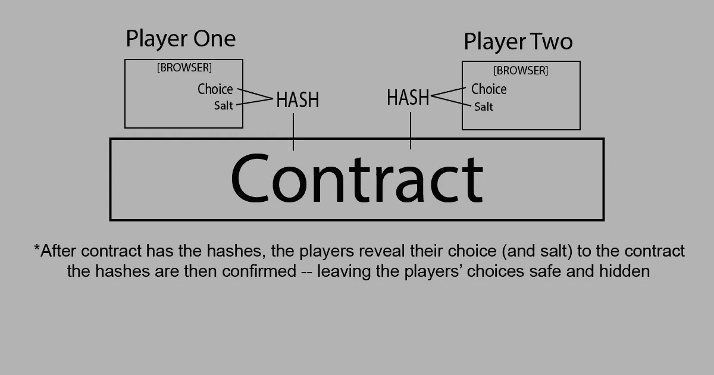
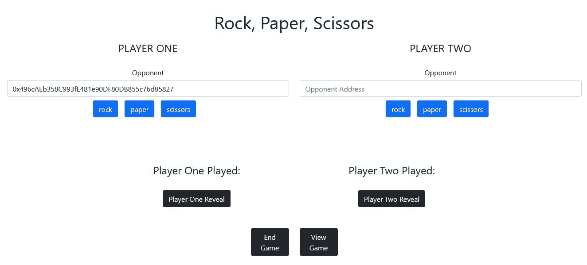
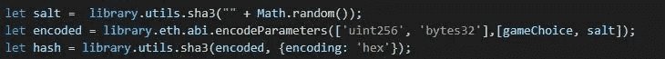
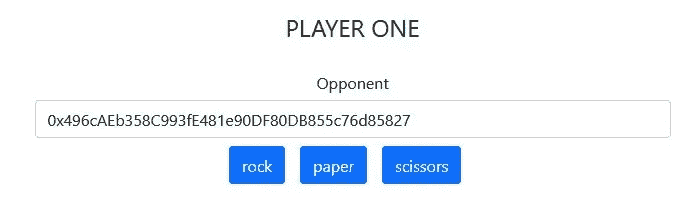
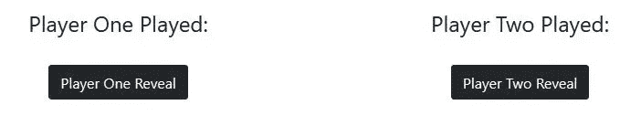

# 石头，纸，剪刀在坚实|第 3 部分|承诺-揭示

> 原文：<https://medium.com/coinmonks/rock-paper-scissors-in-solidity-part-3-commit-reveal-4d56a84cbe97?source=collection_archive---------2----------------------->


Photo by [Markus Spiske](https://unsplash.com/@markusspiske?utm_source=medium&utm_medium=referral) on [Unsplash](https://unsplash.com?utm_source=medium&utm_medium=referral)

## 保守秘密

这个游戏不能实时玩。在“石头、纸、剪刀”的游戏中，玩家无法预测另一个玩家要玩什么。但是，如果玩家没有在完全相同的时间进行游戏，整个场景就会改变。

想象一下，如果两个人玩一个石头、纸和剪刀的游戏，间隔 30 分钟。让玩家保持诚实的最好方法是让玩家在类似投票亭的地方提交他们的选择——在那里，数据是安全的，并且被第三方隐藏起来。如果二号玩家可以看到一号玩家的选择，整个游戏就会分崩离析。

当这个过程链上移动，它变得有点麻烦。我们必须对玩家的选择保密，直到两个选择都锁定。

## 提交-显示

通过散列函数发送选择将是不够的，因为选择将总是产生相同的散列；因此，玩家二可以在做出选择之前看到玩家一的选择。

我们需要一个秘密，所以每个玩家都有自己的选择，以及一个独特的 *Salt* 。然后 *Salt* 将被用于允许每个玩家透露他们的选择。当他们重新提交他们的`choice + salt`时，他们的选择可以与之前的散列进行核对。这将释放他们的实际选择的游戏，然后价值可以检查赢家。

因此，我们将*提交*一个散列，而*揭示*的选择，当它是安全的。

## 石头、纸张、剪刀

> 这个例子的代码使用了一个[reaction Component](https://github.com/nathan-websculpt/reactsolidity_frontend/blob/master/src/components/RPSETH_v2.js)，这个组件的代码可以帮助你轻松地交换钱包地址，并作为两个玩家进行测试。

整个过程是一号玩家*开始*游戏，二号玩家*参与*一号玩家所创造的游戏。

玩家选择和 Salt 变成了一个散列，智能合约将保存到游戏中。



在两个玩家都将自己的杂凑*提交*后，玩家将*显示*自己的选择。您可以使用*查看游戏*按钮查看一个`console.log`的整个游戏过程。点击*结束游戏*，确定赢家。



# 进入代码

*   [Github 项目](https://github.com/nathan-websculpt/reactsolidity_frontend)
*   [实体文件](https://github.com/nathan-websculpt/reactsolidity_frontend/blob/master/contracts/RPSv2.sol)
*   [反应部件](https://github.com/nathan-websculpt/reactsolidity_frontend/blob/master/src/components/RPSETH_v2.js)
*   用途[加纳切&松露](https://www.trufflesuite.com/ganache)
*   用途 [web3-react](https://github.com/NoahZinsmeister/web3-react)
*   React 应用程序[在 live 应用程序上构建注释](https://nervous-tereshkova-aa8032.netlify.app/)

如果你不知道如何使用松露或加纳切，请查看第 2 部分。

[](/@websculpt/rock-paper-scissors-in-solidity-part-2-web3-and-the-browser-79df179e8cd) [## 安全中的石头、剪子、布|第二部分| Web3 和浏览器

### 查看如何使用 Web3、Truffle 和 Ganache 在浏览器中与 Solidity Smart Contract 进行交互。

medium.com](/@websculpt/rock-paper-scissors-in-solidity-part-2-web3-and-the-browser-79df179e8cd) 

# 这段代码是如何工作的。

盐将会是每个玩家的秘密。您当然可以使它比这更复杂，但这实际上是您产生可以链上复制的散列(在浏览器上)所需的一切。

*注意:这是 web3-react，所以`library`提供对 web3 的访问。

```
**The Salt**: library.utils.sha3(“” + Math.random());**ABI Encoded Params:** library.eth.abi.encodeParameters(['uint256', 'bytes32'],[gameChoice, salt]);**The Hash:** library.utils.sha3(encoded, {encoding: 'hex'});
```

产生的散列足以让玩家进入游戏，而无需将他们的选择(以纯文本形式)发送到合同中。



## 开始游戏

使用文本框输入玩家 2 的地址，然后单击石头、布或剪刀。



这个 javascript 将把*散列*、玩家二的地址和游戏赌注(硬编码为 1 Ether)发送给合同。

```
await contractInstance.methods.
startGame(hash, playerTwoAddress, bet).
send({ from: account }).then(function(receipt){ ....}).catch(err => console.log(err));
```

这将把一个游戏添加到契约上的游戏列表中，玩家一将拥有用于以后更新游戏的地址。

```
mapping (address => Game) public games;
```

这是游戏结构。

```
struct Game {
   address playerOne;
   address playerTwo;
   uint stake;
   uint  playerOneChoice;
   uint  playerTwoChoice;
   bytes32 playerOneHash;
   bytes32 playerTwoHash;
   GameStatus  status;
   GameOutcome outcome;
}
```

然后，玩家二通过发送玩家一的地址以及他们自己的散列来进入游戏。

```
await contractInstance.methods.
participateGame(hash, playerOneAddress).
send({ from: account }).
then(function(receipt){ ....}).catch(err => console.log(err));
```

当一号玩家开始游戏时，他们的选择还没有确定——契约只有一个散列。这样，没有盐参与人 2 就不知道参与人 1 的选择。打败这个游戏的方法是了解玩家一的盐。

玩家选择的值直到揭示该游戏的时候才被发送到区块链。当`choice + salt`被散列时——提交时的散列将与显示时的散列相同。

理想情况下，每个玩家在之后发送敏感数据*是安全的。他们也在确认自己做了某个选择(看到对方玩家的选择后无法改变主意)。*

玩家必须透露他们的选择，而且必须是他们最初的选择。



on-chain reveal 使用内部函数来重新创建散列。

```
function getSaltedHash(
   uint answer, 
   bytes32 salt) 
     internal pure returns (bytes32) { return keccak256(abi.encodePacked(answer, salt));}
```

# 这是合同

# 如何支持更多这样的帖子

如果你想看更多这方面的内容，请在这里捐赠 ETH 或 ERC-20 代币:0xd 6355 a6b 745985342 ebf 168 E1 EC 965 DC 612704 b 1