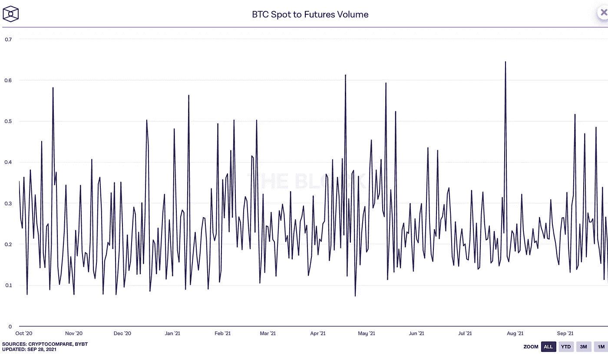
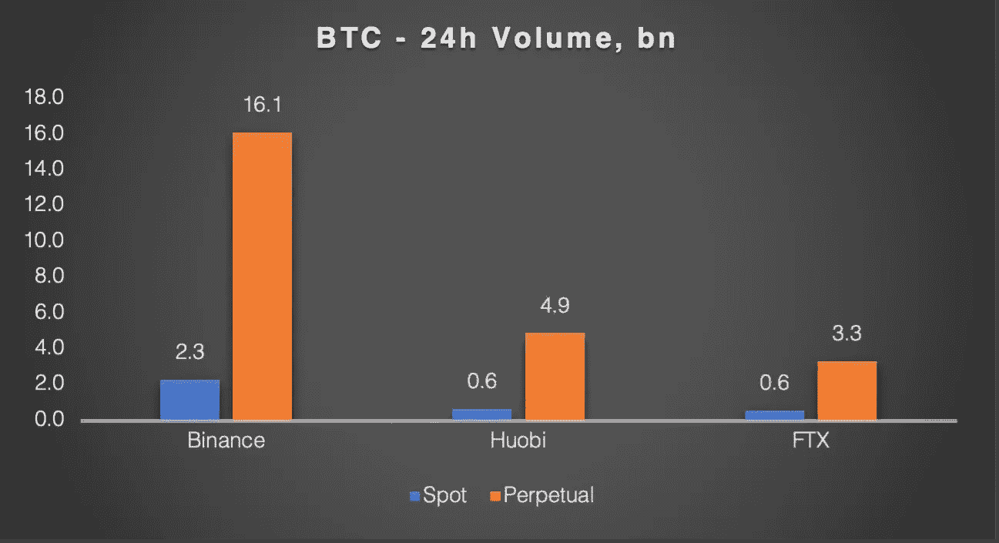
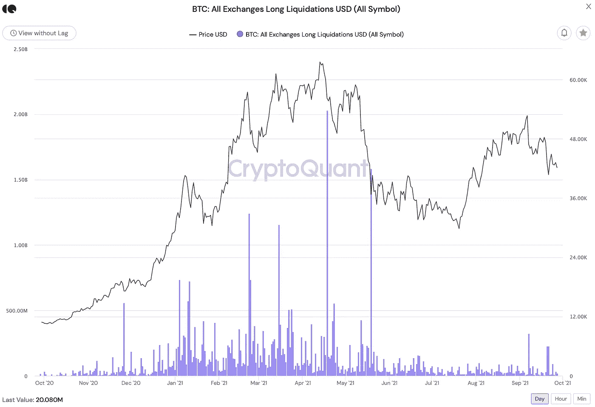
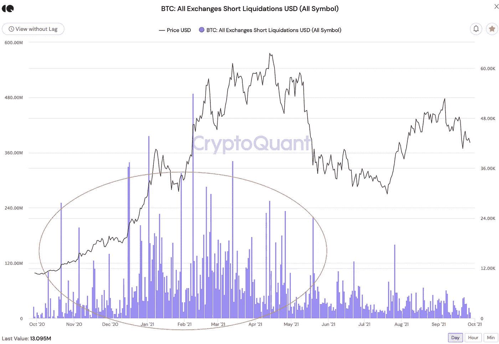
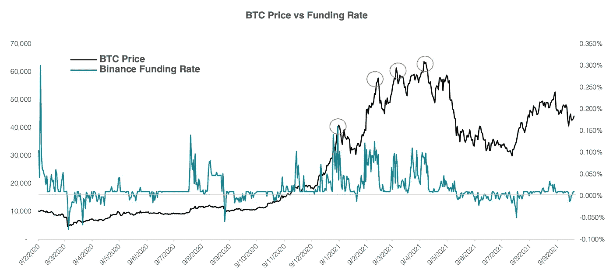
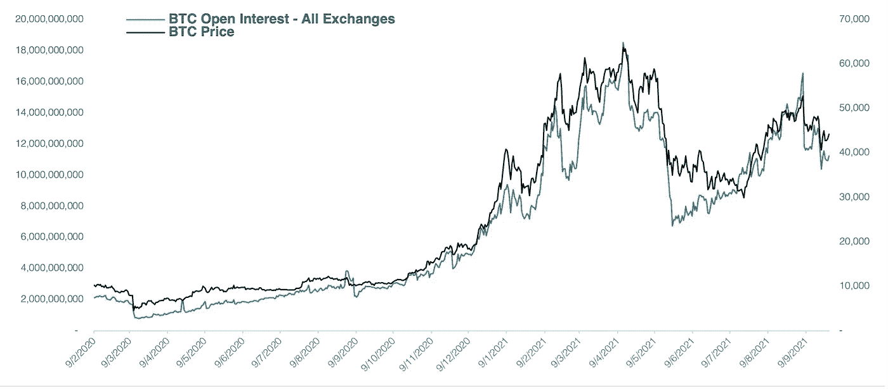
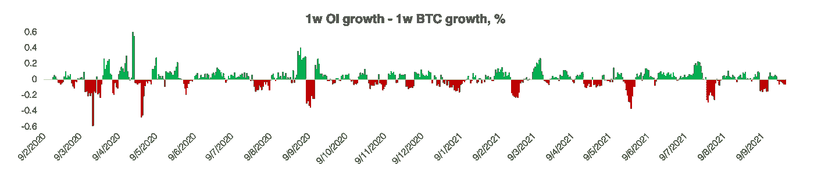

# 衍生品在加密市场中的作用

> 原文：<https://medium.com/coinmonks/role-of-derivatives-in-crypto-markets-3ea2c855ef0e?source=collection_archive---------3----------------------->

## 3 个必看指标

> 文章作者 [Lesia M.](https://twitter.com/LesiaMrch)

Photo: [André François McKenzie](https://unsplash.com/@silverhousehd) | [Viktor Forgacs](https://unsplash.com/@sonance) | [unsplash.com](http://Unsplash.com)

近年来，加密货币衍生品市场呈爆炸式增长，其重要性不言而喻。在本文中，我们解释了它们的主要区别特征，同时集中讨论了以下问题:

加密衍生品在基础市场中扮演什么角色？

衍生品能揭示底层加密市场的现状吗？

# 传统市场

衍生合约是复杂的金融工具，其价值来自基础资产的价格，在交易时允许更大的灵活性和控制力。可以把衍生品合约看作是投资者对标的价格朝不利方向移动的保护。或者在投资者对他们的预测非常有信心并寻求扩大他们的利润的情况下，作为对标的未来价格的赌注。

随着市场对衍生品交易的需求获得主流关注，很明显，它们对基础资产产生了一定的价格影响。即使基础价格趋向于与相对衍生合约均衡以避免套利机会，市场也不总是有效的，尤其是在短期内。

关于传统衍生品市场对基础资产的影响，有三种流行的理论观点:

1.根据第一个理论，由于多种因素:低保证金要求、卖空便利、动态对冲等，衍生品在现货市场引发了过度波动*。*

*2.第二种理论认为，通过在不确定时期为对冲投资者提供内心平静，衍生品实际上有助于基础市场的*稳定性；以及为受到过度买入或卖出压力威胁的市场增加流动性。**

*3.第三种理论认为，有组织的期货和期权市场会加速对基础资产的现货调整，以回应市场中的新信息。[1]*

*此外，随着衍生合约的引入，金融分析师获得了更多的工具，通过衡量看涨或看跌衍生合约的优势来评估市场情绪。*

# ***加密衍生品的作用***

*加密衍生品的规模确实令人印象深刻。该区块的数据显示，仅 BTC 期货交易量就平均比加密货币的现货交易量大 5 倍。*

**

*Source: theblockcrypto.com*

*最受欢迎的加密衍生品是期货、期权和永久合同。虽然前两者与传统市场上交易的合约相同，但永久合约值得进一步介绍。*

## ****永久合同****

*永久合约在加密衍生品中占有最大的市场份额。事实上，它们占据了全部加密衍生品市场份额的 85%以上。在撰写本文时，币安 24 小时永久 BTC 合约的交易量大约是该交易所 24 小时 BTC 现货交易量的 7 倍。*

**

*Source: JKL Research*

*事实上，加密永久资产是没有到期日的期货合约，但在法律上，它们是掉期合约。永久合约的价格倾向于与基于定期“融资支付”的指数(现货)价格趋同，允许交易者维持他们的头寸而不展期。基本上，一个基于保证金的现货市场。*

## ****底层加密资产的利弊****

*加密衍生品对基础资产的利弊与传统工具非常相似。*

*通过他们的**优势**、*对冲风险和波动保护*肯定是最重要的。与传统的期权和期货市场一样，对冲头寸通过为交易者提供针对加密货币知名价格波动的保护，降低了恐慌性抛售的威胁。反过来，从长远来看，投资者对冲其头寸会降低基础资产的波动性。双赢。*

*受监管的加密衍生品也为传统机构和被法规禁止进行加密投资的机构投资者提供加密货币*敞口。受监管的加密货币衍生品的推出，开启了机构对这一资产类别的更广泛采用。**

*对受监管加密产品的需求，已经部分通过 CFTC 监管的在 CME 上市的比特币和以太坊期货合约得到满足，部分通过今年早些时候在加拿大推出的比特币交易所交易基金得到满足，部分通过美国大型银行为其财富管理客户提供加密产品得到满足。尽管如此，对不太复杂的机构友好的加密产品的需求继续以更快的速度增长。*

*现在大家期待了一段时间的 Crypto 产品是一个美国注册的比特币 ETF。虽然迄今为止，没有一个提交的申请被 SEC 批准，但其主席暗示可能批准在芝加哥商品交易所[2]追踪 BTC 期货的比特币期货交易所交易基金 T10。*

*加密衍生品对现货市场最有害的影响可能是它们在市场崩盘时放大下行压力的趋势。在过度杠杆化的环境中，这一点尤其明显。在这种环境中，基础资产相对较小的下跌就可能导致价值数十亿美元的长期清算。导致加密价格暴跌，增加了市场的整体波动性。*

# ***三个必看衍生指标***

## ***1。** **多头/空头清算***

*说到强制平仓，这可以很好地反映当前交易者的情绪。在加密市场，衍生品的保证金交易比现货交易便宜得多，因此大多数强制平仓都与衍生品账户有关。*

*几乎每一次加密市场的重大崩盘都被归咎于强制长期平仓——在投资者的头寸未能达到保证金要求后，强制出售其账户内的资产。在市场下跌期间，经纪人有权通过抛售和平仓来清算投资者的多头保证金头寸。这包括出售投资者账户上的密码，将下跌的价格推得更低。*

**

*Source: CryptoQuant.com*

*例如，创纪录的 20 亿美元杠杆多头合约在 4 月 18 日的市场崩盘中被清算，一天之内抹去了比特币价值的 16%。类似的清算可以在许多重大的市场调整中找到。最近的一次发生在 9 月 7 日，当时 BTC 损失了大约 20%的价值。*

*与多头平仓相反的情况是*空头挤压*——在不断增长的市场中强制平仓以避免损失，当卖空者带着买入订单退出头寸时，这加速了基础资产的反弹。反过来，超卖资产价格的上涨会吸引多头投资者，而多头投资者与惊慌失措的卖空者的结合，为强劲的上行奠定了基础。*

**

*Source: CryptoQuant.com*

*比特币的牛市从去年年底开始，一直持续到 2021 年 5 月中旬，这在很大程度上是由短期清算推动的。例如，2021 年 2 月 8 日，近 5 亿美元的空头清算导致 BTC 价格一天内上涨超过 20%。*

*值得注意的是，虽然 10 月 20 日至 5 月 21 日的反弹因短暂挤压而丰富，但从 7 月底开始的最近一轮牛市却不是这样。事实上，自 5 月中旬市场崩盘以来，多头和空头平仓都大幅减少，表明系统中的杠杆率较低，因此限制了不受控制的下行趋势的机会。*

## ***2。** **资助率***

*融资利率是永久合同的一方向另一方支付的费用。正融资利率意味着衍生品交易者的看涨倾向，即 BTC 多头合约支付 BTC 空头。当融资利率为负时，BTC 空头合约支付 BTC 多头合约。BTC 价格行为与其融资利率之间的相关性只有在强牛市/熊市条件下，当衍生品交易员试图驾驭趋势时才显而易见。*

**

*Source: JKL Research | app.intotheblock.com*

*从历史上看，长期的融资利率膨胀不会给比特币带来积极的前景。事实上，随着衍生品交易员变得过度看涨，BTC 本地顶部往往与融资利率峰值重合。*

*将融资利率视为加密市场情绪的一个指标，应该警惕长期的昂贵融资。在一个过热的牛市中，任何微小的调整都会被大规模平仓放大，导致重大逆转。*

## ***3。** **未平仓利息***

*考虑到过度杠杆化市场的毁灭性潜力，我们使用未平仓合约作为当前杠杆水平的指标。*

*OI 本身并不能很好地代表投资者的情绪，因为它只显示未平仓衍生合约的总数。然而，结合当前的融资利率，可以得出新的兴趣是从多头还是空头进入市场的结论(正融资利率+增长的 OI =新的杠杆多头进入市场)。*

**

*Source: JKL Research | app.intotheblock.com*

*在传统市场中，价格上涨和未平仓合约增加通常反映了新的头寸。这被视为一个看涨的信号，假设 OI 的增加是由多头头寸推动的。在加密市场中，未结权益头寸通常由实物资产持有。也就是说，投资头寸的美元价值会随着其基础资产的价格波动而自然增加或减少。*

*因此，查看其他投资头寸的美元价值不足以确定过度杠杆化的加密市场。我们需要将 BTC 的增长率与未平仓合约的增长率进行比较。*

**

*Source: JKL Research*

*在上图中，我们比较了比特币未平仓头寸的每周(过去 7 天)变化率和 BTC 价格的每周变化率。在牛市中，OI 以比 BTC 更快的速度增长意味着新的杠杆进入市场，反之亦然。*

***结论***

*衍生品对加密市场的影响是双重的:一方面，为交易者提供对冲工具降低了恐慌性抛售的风险，并从长期来看改善了基础资产的波动性。另一方面，高杠杆水平增加了被迫平仓的风险，增加了短期内在波动性。*

*其中一个很大的优势——特别是受监管的加密衍生品——是它们的桥梁作用，为机构参与者提供了进入加密空间的途径。从长远来看，机构采用加密货币将提供新的资本流入，增加流动性，并降低该领域众所周知的波动性。*

*通过衍生品交易的棱镜来分析秘密市场，需要对多个指标进行仔细审查，这些指标通常是相辅相成的。投资者应该观察现有的杠杆率水平，杠杆率的上升可能预示着即将到来的短期价格调整。未平仓利率是衡量加密领域杠杆的一个很好的指标，而融资利率提供了投资者情绪的一个概念；以及未平仓合约是作为多头还是空头头寸进入市场。*

*从历史上看，过度杠杆化的市场并不是 cryptos 的盟友，这再次证明了沃伦巴菲特(Warren Buffet)的规则:“当别人贪婪时要恐惧，当别人恐惧时要贪婪”。*

*[1] B. H .科恩(1996 年)。*衍生品和资产价格波动。**

*[2][https://www . Bloomberg . com/news/articles/2021-08-03/sec-s-gensler-signals-pathway-for-a-bit coin-ETF-with-tough-rules](https://www.bloomberg.com/news/articles/2021-08-03/sec-s-gensler-signals-pathway-for-a-bitcoin-etf-with-tough-rules)*

> *加入 Coinmonks [电报频道](https://t.me/coincodecap)和 [Youtube 频道](https://www.youtube.com/c/coinmonks/videos)了解加密交易和投资*

## *也阅读*

* [## 最佳加密交易所| 2021 年十大加密货币交易所

### ICON _ PLACEHOLDEREstimated 预计阅读时间:28 分钟加密货币交易所的加密交易需要知识…

blog.coincodecap.com](https://blog.coincodecap.com/crypto-exchange)  [## 2021 年 10 大最佳加密贷款平台| CoinCodeCap

### 当谈到加密货币贷款时，大量因素等同于良好的收入状况。此外，借款的一部分…

blog.coincodecap.com](https://blog.coincodecap.com/crypto-lending)  [## 2021 年最佳免费加密交易机器人

### 2021 年币安、比特币基地、库币和其他密码交易所的最佳密码交易机器人。四进制，位间隙…

medium.com](/coinmonks/crypto-trading-bot-c2ffce8acb2a)  [## 最佳 4 个加密交易信号电报通道

### 这是乏味的找到正确的加密交易信号提供商。因此，在本文中，我们将讨论最好的…

medium.com](/coinmonks/best-crypto-signals-telegram-5785cdbc4b2b)  [## BlockFi 评论 2021:利弊和利率| CoinCodeCap

### 今天，我们提出了一个全面的 BlockFi 评论，这是一个成立于 2017 年的加密贷款平台，拥有其…

blog.coincodecap.com](https://blog.coincodecap.com/blockfi-review)  [## 如何在印度购买比特币？2021 年购买比特币的 7 款最佳应用[手机版]

### 如何使用移动应用程序购买比特币印度

medium.com](/coinmonks/buy-bitcoin-in-india-feb50ddfef94)  [## 加密税务软件——五大最佳比特币税务计算器[2021]

### 不管你是刚接触加密还是已经在这个领域呆了一段时间，你都需要交税。

medium.com](/coinmonks/best-crypto-tax-tool-for-my-money-72d4b430816b)  [## 存储比特币的最佳加密硬件钱包[2021] | CoinCodeCap

### 保管您的数字资产很容易，但找到正确的存储方式却是一项繁琐的任务。在线钱包有一个风险…

blog.coincodecap.com](https://blog.coincodecap.com/best-hardware-wallet-bitcoin)*