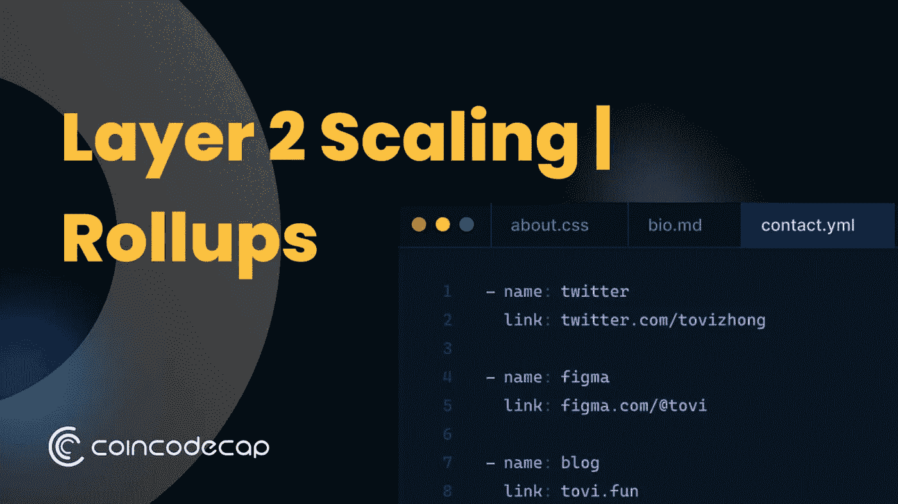
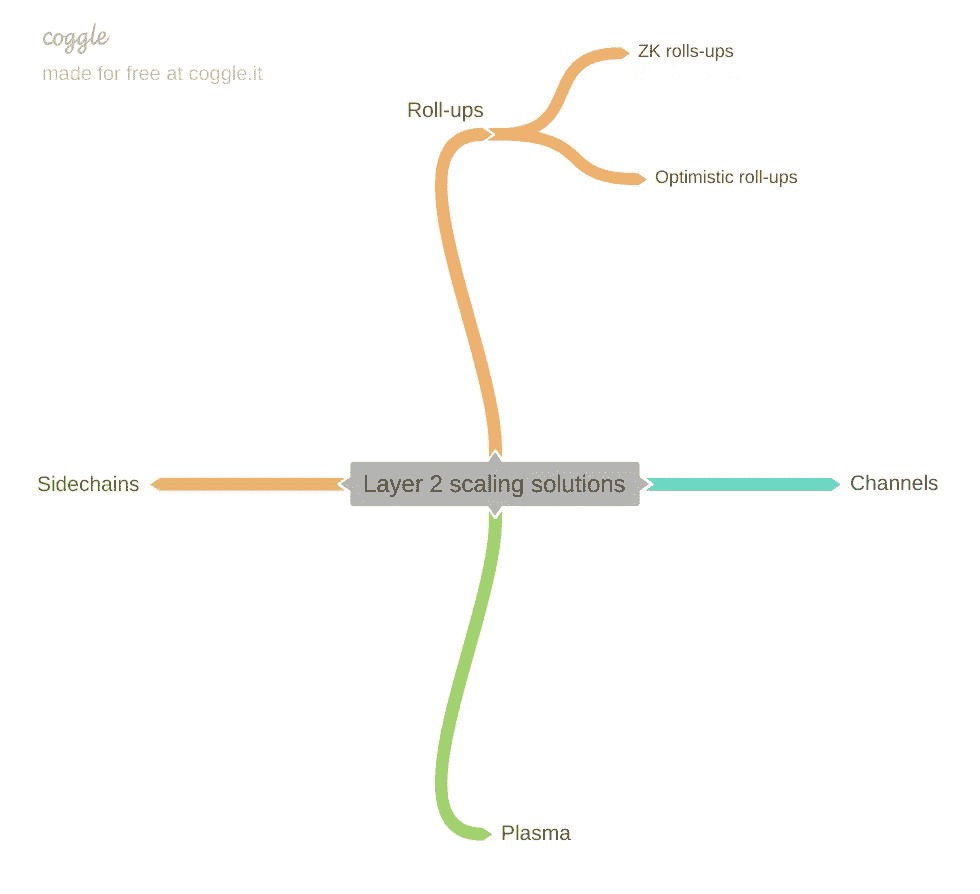
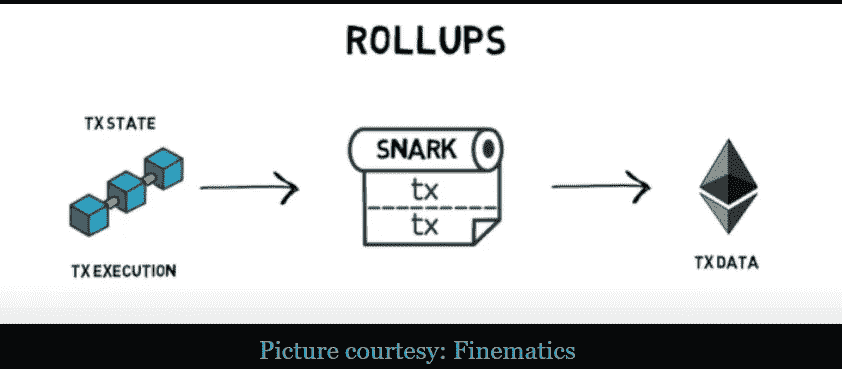

# 汇总—第 2 层扩展|它是下一个大事件吗？CoinCodeCap

> 原文：<https://medium.com/coinmonks/rollups-layer-2-scaling-is-it-the-next-big-thing-coincodecap-f87fe3a14b95?source=collection_archive---------10----------------------->

在 2017 年的加密牛市中，关于以太坊网络拥塞的争论升温。臭名昭著的密码猫与 ICOs 一起封锁了整个以太坊网络，导致了显著的汽油费上涨。同样在 2020 年，随着 DeFi T1 和 T2 T3 的兴起，网络拥堵在更重要的意义上受到冲击。高达 500+ Gwei 的天然气费不足以使交易生效。这就是以太坊可伸缩性的问题所在。

# 什么是可伸缩性？

可扩展性是指区块链网络支持高交易吞吐量和未来增长的能力。从技术角度来说，将吞吐量(系统每秒可以处理的事务数量)和延迟(处理一个事务所需的时间)超线性地扩展到运行系统的成本的能力定义了可伸缩性。

# 攀登以太坊的方法。

当谈到攀登以太坊或任何其他[区块链](https://blog.coincodecap.com/what-is-blockchain-a-simple-guide-for-dummies)时，通常有两种主要方法可以使用:

1.  通过缩放基本层(层 1)本身，或者
2.  通过将部分工作卸载到另一层(第 2 层)来扩展网络。

# 什么是第一层？

第 1 层是基本的共识层，目前几乎所有的交易都在这里结算。比如以太坊、[比特币](https://blog.coincodecap.com/a-candid-explanation-of-bitcoin)，莱特币，都是第一层区块链。

第 1 层可以通过以下方式提高可扩展性:

1.  增加每个块中包含的数据量，或者
2.  通过增加块被确认的速率。

因此，第一种方法可以通过将工作证明(PoW)替换为[利益证明](https://blog.coincodecap.com/proof-of-stake-explained) (PoS)来实现。PoW 要求矿工使用强大的计算能力来解决加密算法。虽然电源是安全，但相对来说速度较慢。而 PoS 系统根据网络参与者对抵押品的[下注](https://blog.coincodecap.com/staking-crypto)来处理和验证新的交易数据块。工作一致性验证算法限制了可以生成的新数据块的数量。例如，矿工每 10 分钟只能创建一个比特币(BTC)区块，而 PoS 不遵守任何限制。

第二种方法可以通过实现称为分片的过程来实现。[分片](https://blog.coincodecap.com/sharding-in-ethereum)是将整个区块链网络的状态分解成称为“分片”的不同数据集的过程，这使得维护网络成为一项更易于管理的任务。确保这些碎片能够相互通信至关重要，因为网络用户应该能够访问存储在区块链中的所有信息。

# 什么是第二层？

第 2 层组装在第 1 层之上。因此，第 2 层是一个集合术语，旨在通过处理以太坊主网(第 1 层)之外的事务来帮助扩展以太坊网络。这里有一些值得注意的重点:

第二层不需要第一层的任何进展。第 2 层使用现有元素，如智能合约，构建在第 1 层之上

1.  第 2 层也使用第 1 层的安全性，将其状态保护到第 1 层。
2.  以太坊可以在其基础层上处理 15tx/秒。但是第 2 层提供的扩展解决方案大幅提高到 2 4K Tx/秒。

# 第 2 层扩展解决方案

现有的扩展解决方案有多种选择，如下图所示。然而，以太坊社区主要通过汇总和以太坊 2.0 第一阶段数据分片进行扩展。

Various scaling solutions for Layer 2

> ***本文的重点将放在*** 上

汇总是一种扩展解决方案，其中事务在第 1 层之外执行，但事务数据在第 1 层发布

由于所有的计算工作都是离线完成的，因此第 1 层变得轻松了。这允许处理更多的交易，但是只有少数适合以太坊块。所以基本上，一个侧链形成了，所有的事务都被处理，并且一个特定的 EVM 被用来运行它们。然后，这些交易被捆绑起来，并发布到以太坊链中。

将上述解释编译成如下步骤:

1.  离线执行事务。
2.  以交易数据为例。
3.  压缩交易数据。
4.  将交易转入单个批次
5.  把它们贴到以太坊主链上。

这里出现了一个问题，“如何验证数据没有被篡改或者恶意用户没有提交数据？”我们将通过探索两种不同类型的汇总来研究解决方案:乐观汇总和 [ZK 汇总](https://blog.coincodecap.com/zero-knowledge-proofs-explained)。

对于乐观汇总，防欺诈确保有效性，而对于 ZK 汇总，通过零知识证明来确认有效性。

# 乐观累计

乐观汇总是 2019–2021 时代最值得期待的扩展解决方案。这是有充分理由的，因为它是以太坊社区多年研究过程的最终产物。乐观汇总的目标是减少延迟和增加事务吞吐量，从而减少汽油费用。

如果聚合器发布的数据没有任何错误，就不需要证明。只有在欺诈的情况下才需要证据。因此，在真实数据的情况下，乐观汇总不必做额外的工作。

可能存在提交无效交易的情况；在这种情况下，系统必须识别它，恢复正确的状态，并惩罚提供这种交易的一方。为了实现这一点，乐观汇总实施了一个争议解决系统，可以验证欺诈证据，检测欺诈交易，并阻止不良行为者提交其他无效交易。

实现乐观汇总的主要项目之一是“乐观”。

这是乐观汇总的基本概述。我将在接下来的文章中深入探讨。对于这篇文章，我保持简短和精确。

# ZK 汇总

ZK 汇总旨在降低计算和存储成本。在 ZK-Rollup 中，为每个状态转换生成一个简洁的零知识证明( [SNARK](https://blog.coincodecap.com/snarks-vs-starks-difference) ),由主链上的 Rollup 契约验证。该标记证明了一系列由所有者正确签名的交易，这些交易正确地更新了帐户余额。因此，对于操作员来说，提交无效或被操纵的状态是不可能的任务。

ZK 汇总比乐观汇总更快，但它没有为智能合约迁移到第 2 层提供简单的方法。

而乐观汇总运行称为 OVM(乐观虚拟机)的 EVM 兼容虚拟机，它允许执行与主链上可执行的相同的智能合约。

少数使用 ZK 汇总的分散式交换机是 Loopring、DeversiFi 等。

点击这里的链接查看我的文章“[用多边形](/coinmonks/minting-your-first-nft-using-the-polygon-nft-minter-uncryptd-1d6a104536dc)铸造你的第一个 NFT”。

*原载于 2021 年 9 月 8 日 https://blog.coincodecap.com***。**