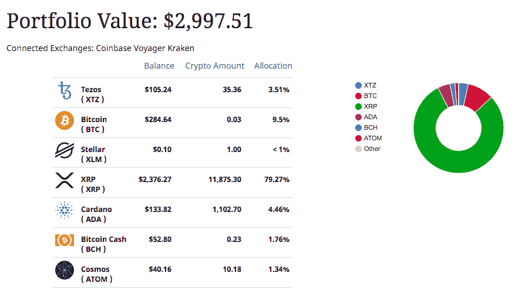

# RoundlyX 评论——比特币美元成本平均法

> 原文：<https://medium.com/coinmonks/roundlyx-review-bitcoin-dollar-cost-averaging-148681942fc9?source=collection_archive---------1----------------------->

[RoundlyX](https://www.roundlyx.com/?utm_source=coincodecap) 取你每天购买的东西，四舍五入到最接近的美元，然后把剩下的零钱投资到你选择的比特币和其他数字资产中。

过去，将美元成本平均化到 T2、比特币和其他数字资产是很困难的。人们必须定期手动购买加密货币，这需要时间、精力和更多费用。 [RoundlyX](https://www.roundlyx.com/accounts/signup/?utm_source=coincodecap) 简化了这个过程。

“Crypto”需要一种安全可靠的投资工具来进一步推动主流应用。RoundlyX 可能就是它。

> [***阅读 CoinCodeCap 上的 RoundlyX 评论***](https://coincodecap.com/product/roundlyx-5)

## 利弊

**优点**

*   再也不用单独登录您的所有加密帐户来检查余额和进行购买！
*   没有 FOMO(害怕错过)和负责任的美元成本平均。
*   在日常购物时积累您最喜爱的数字资产。

**缺点**

*   RoundlyX 仍然不是国际性的(仅限美国),但正在进行国际发布。

## 特征

将顶级数字资产交易所连接到 RoundlyX，在一个地方查看和管理您的所有数字资产，而没有安全风险。

在几个顶级交易所中任何一个或所有交易所中，将多余的交易转换成不同的(或仅仅一个)数字资产。

免费访问数字资产空间中策划的新闻/分析/服务。

## 它是如何工作的

*   在 RoundlyX.com[报名](https://www.roundlyx.com/?utm_source=coincodecap)
*   通过格子连接您的银行/信用卡账户。
*   连接您的数字资产交换帐户。
*   …您可以正常运行了。

整个过程不到 5 分钟。当您使用连接的银行帐户/卡进行日常购物时，Roundups 将开始填充到您的 Roundup Tracker 中。根据您连接的交易所，一旦累积的综述达到一定的阈值，就会为您预先选择的资产分配(比特币、以太坊…超过 30 种不同的替代币)发出购买订单。

## 与其他产品的比较

它很像 Acorns 应用程序，但用于数字资产投资。

如果你在科技或金融行业呆过一段时间，你很可能听说过 [Acorns](https://www.acorns.com/) 。Acorns 应用程序将你每天购买的东西四舍五入到最接近的美元，并定期将多余的零钱投资到投资组合中。这种投资方法被称为“[平均成本法](https://en.wikipedia.org/wiki/Dollar_cost_averaging)

美元成本平均投资策略的一个优点是，当市场(密码或股票)波动时，它可以保护你免受 FOMO(害怕错过)的影响。

RoundlyX 对于加密就像橡子对于股票一样重要。

## 用户体验

在一个地方查看您所有关联的 exchange 余额…

通过 RoundlyX 仪表板管理每个连接的 exchange 帐户，没有安全风险…

## 性能和安全性

与实际的加密货币交易所不同，RoundlyX 不会持有您的资产。这些资产都存储在您已连接到 RoundlyX(比特币基地、航海家、北海巨妖、币安等)的现有 exchange 帐户中。).因此，如果黑客进入了你的 RoundlyX 账户，他们就无法窃取你的资产。这是最酷的部分。你可以保留当前交易中最好的部分，但也可以通过 RoundlyX 获得一个安全的综述和投资组合聚合工具。

## 定价

每月 1 美元的统一价格。通过 RoundlyX 购买 100 美元的密码后，获得 4 美元的比特币。[注册时使用 COINCODECAP 代码即可获得资格。](https://coincodecap.com/product/roundlyx-5)

## 结论

交易所仍在寻找可以构建的大工具(期货、期权等)。)但是 RoundlyX 专注于用一个坚固的 roundup 工具粉碎基本的东西。

它仍处于该领域的早期，但这家初创公司肯定是以客户为中心的，并在一个不稳定但令人兴奋的资产类别中提供有价值的服务。

*原载于 2020 年 7 月 23 日 https://blog.coincodecap.com**[*。*](https://blog.coincodecap.com/roundlyx-review-bitcoin-dollar-cost-averaging)*

> *[*在您的收件箱中直接获得最佳软件交易*](https://coincodecap.com/?utm_source=coinmonks)*

**