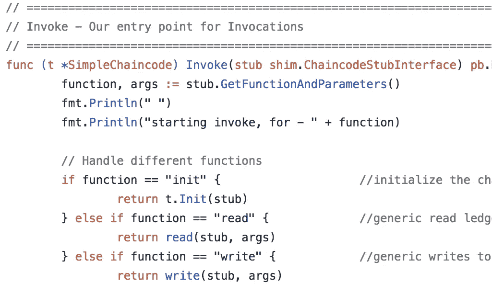

# cc kit:Hyperledger Fabric Golang chain code 的路由和中间件

> 原文：<https://medium.com/coinmonks/routing-and-middleware-for-developing-hyperledger-fabric-chaincode-written-in-go-90913951bf08?source=collection_archive---------2----------------------->

有很多关于 Hyperledger Fabric chaincode 开发的例子和教程。本文描述了通过使用 [CCKit](https://github.com/s7techlab/cckit/) 库简化和加速链代码开发的方法，包括实现基本的链代码构建组件——路由、中间件和链代码调用上下文，以及提供链代码测试实用程序。

# 链码组件

[Chaincode](http://hyperledger-fabric.readthedocs.io/en/release-1.1/chaincode4ade.html) 是一个程序，用 [Go](https://golang.org/) ，Javascript 或者 Java 编写。chain code(Fabric world 中的智能合约)实现一些业务逻辑(例如， [ERC20 令牌功能](/coinmonks/erc20-token-as-hyperledger-fabric-golang-chaincode-d09dfd16a339))并与共享分类帐交互。链码必须实现规定的`Chaincode interface`。

当 chaincode 接收到一个`instantiate`或`upgrade`事务时，就会调用`Init`方法。`Init`方法可以执行任何必要的初始化，包括设置默认的应用程序状态。响应于接收到处理交易提议的`invoke`交易，调用`Invoke`方法。

chaincode“shim”API 中的另一个接口是`[ChaincodeStubInterface](https://godoc.org/github.com/hyperledger/fabric/core/chaincode/shim#ChaincodeStubInterface)` ，用于访问和修改分类帐，并在 chain code 之间进行调用。

# 链码示例

除了 [Hyperledger Fabric 文档](http://hyperledger-fabric.readthedocs.io/en/release-1.1/chaincode4ade.html#pulling-it-all-together)之外，还提供了几个链码示例:

*   [区块链保险 app](https://developer.ibm.com/code/patterns/build-a-blockchain-insurance-app/) (2018)
*   [弹珠](https://github.com/hyperledger/fabric/blob/release-1.1/examples/chaincode/go/marbles02/marbles_chaincode.go)
*   [汽车租赁演示](https://github.com/IBM-Blockchain-Archive/car-lease-demo/blob/master/Chaincode/src/vehicle_code/vehicles.go) (2017)

它们都非常冗长，包含大量函数切换逻辑(某种“路由”)、参数号验证、json 编组/解组等

Invoke hell

# 链码方法路由库简介

为了简化链代码开发，我们尝试在单个库 [CCKit](https://github.com/s7techlab/cckit) 中组合常见的软件开发模式，如**路由、中间件**和**调用上下文**:

***路由*** 指的是确定应用程序如何响应客户端对特定端点的请求。链码路由器使用有关如何将链码调用映射到特定处理程序的规则，以及在请求期间需要使用哪种中间件，例如如何将传入参数从`[]byte`转换为目标类型(`string`、`struct`等)

**调用** [**上下文**](https://github.com/s7techlab/cckit/blob/master/router/context.go) 是 ChaincodeStubInterface 的抽象，代表当前 chaincode 调用的上下文。它保存请求、响应和客户端(身份)引用、转换后的参数以及状态和日志引用。由于`Context`是一个接口，很容易用自定义方法扩展它。

***中间件*** 函数是在链码的调用-响应循环中访问调用上下文、调用结果和下一个中间件函数的函数。下一个中间件功能通常用一个名为`next`的变量来表示。

中间件功能可以执行以下任务:

*   将输入参数从字节片转换为所需的类型
*   检查访问控制要求
*   结束请求-响应循环。
*   调用堆栈中的下一个中间件函数。

[**cc kit**](https://github.com/s7techlab/cckit)**库包含了这些模式的实现并提供了:**

*   **集中式链代码调用处理**
*   **中间件支持**
*   **链码方法访问控制**
*   **自动 json 编组/解组，条目密钥生成**
*   **测试工具(扩展版 [MockStub](https://github.com/hyperledger/fabric/blob/release-1.1/core/chaincode/shim/mockstub.go) )**

# **简单资产链代码—汽车注册示例**

**我们将通过实现一个管理简单“资产”——汽车——的简单链码应用程序来演示路由器和中间件的使用。在本例中，只有一个机构可以注册汽车，所有机构都可以查看注册汽车的信息**

# **【CCKit 入门**

**在开始之前，请确保从 github.com 获得 CCkit:**

> **git 克隆[git@github.com](mailto:git@github.com):s7techlab/cc kit . git**

**并使用 *dep* 命令获取依赖关系:**

> **dep 确保-仅供应商**

# **实现链码接口**

**与每个链码一样，它实现了[链码接口](https://godoc.org/github.com/hyperledger/fabric/core/chaincode/shim#Chaincode)，特别是`Init`和`Invoke`功能**

**在我们的例子中，这个函数非常简单——在`Init`函数中，我们放入用户的链码状态标识符，用户实例化链码(“所有者”)。在`Invoke`中，我们将链码方法调用的处理委托给路由器。**

# **链码资产**

**正如许多其他示例所示，资产可以表示为复杂的结构(Golang structs)。在键/值对设置中，链码本身可以将数据存储为字符串。因此，我们将在进入 chaincode 状态之前将 struct 封送到 JSON 字符串，并在从状态中获取后解组。**

**汽车的属性:**

1.  **id(唯一字符串，将用作密钥)**
2.  **标题(字符串)**
3.  **所有者(字符串)**

**我们还为汽车注册信息创建了有效载荷结构。它只包含字段，允许传递给链码。**

# **定义链码方法**

**在链码创建函数中，我们可以确定链码函数及其参数。在这个例子中，链码具有三个功能:**

*   ****carList** ，返回`Car`结构的切片**
*   ****carList** ，获取汽车 id 并返回`Car` struct**
*   ****carRegister** ，取`CarPayload`结构，返回汽车注册结果。只有链码所有者才允许访问此方法，访问控制是使用`owner.Only`中间件实现的**

# **链代码方法实现**

**路由器处理的 Chaincode 方法以`Context`为参数，返回`interface{}`和`error`。**

**`func (router.Context) (interface{}, error)`**

**返回值将自动转换为`Pb.response` : `interface{}`将被整理为【字节】，响应状态将根据`error`值为`shim.OK`或`shim.Error`。**

**路由器中定义的方法参数将自动从字节片转换成所需的类型(`string`或`CarPayload` struct)**

**Chaincode 函数也使用`State`方法，这简化了与 chaincode 状态的交互。**

# **一起**

> **[https://github . com/s7techlab/cc kit/blob/master/examples/cars/cars . go](https://github.com/s7techlab/cckit/blob/master/examples/cars/cars.go)**

# **链码主文件**

**最后，我们需要创建带有`main`函数的主包，它将调用[垫片。启动](https://godoc.org/github.com/hyperledger/fabric/core/chaincode/shim#Start)功能。**

> **[https://github . com/s7techlab/cc kit/blob/master/examples/cars/bin/cars/main . go](https://github.com/s7techlab/cckit/blob/master/examples/cars/bin/cars/main.go)**

# **没有访问控制**

**有了路由器，你可以很容易地改变访问控制逻辑，你只需要改变或删除路由器定义中的中间件调用。例如没有`carRegister`功能的访问控制的链码。我们只修改了两段代码——路由器中的 Init 函数和注册`carRegister`函数，而`carRegister`函数体保持不变。**

> **[https://github . com/s7techlab/cc kit/blob/master/examples/cars/cars _ no acces _ control . go](https://github.com/s7techlab/cckit/blob/master/examples/cars/cars_noacces_control.go)**

**和无访问控制链接代码主文件**

> **[https://github . com/s7techlab/cc kit/blob/master/examples/cars/bin/cars _ noac/main . go](https://github.com/s7techlab/cckit/blob/master/examples/cars/bin/cars_noac/main.go)**

# **测试链码**

**为了测试，我们使用了`MockStub`的扩展版本，我们添加了`Creator`嘲讽和一些方法调用的糖。**

**关于链码测试的更多内容将在下一篇文章中介绍**