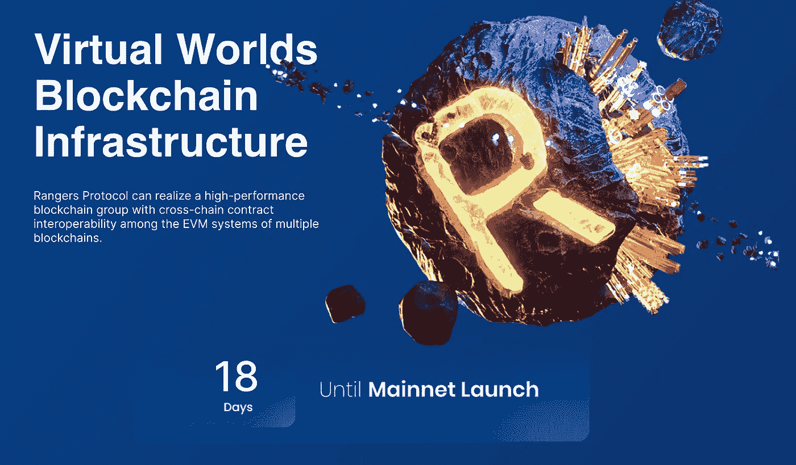

# 火箭推进榴弹在 EVM 发射月球

> 原文：<https://medium.com/coinmonks/rpg-mooning-on-evm-launch-3c754d2be4bf?source=collection_archive---------7----------------------->

Rangers Protocol is a blockchain infrastructure project that will allow developers to build and interconnect metaverse and NFTs.

随着元宇宙变得越来越普遍，一直低调的虚拟世界区块链开始浮出水面。看看这个有趣的加密突击队员的气体协议，或称 RPG。

在我进入 RPG 是什么之前，让我把这只猫从袋子里放出来，让你看看它已经走了多远: