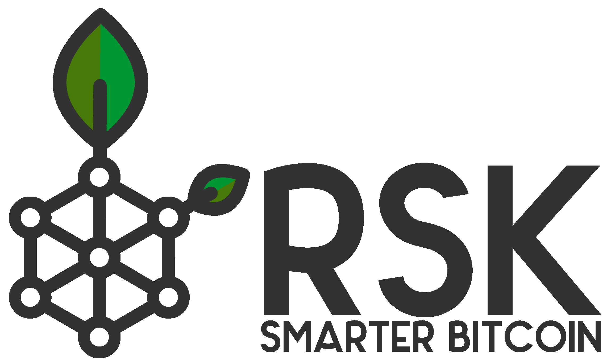

# RSK:比特币智能合约(EN)

> 原文：<https://medium.com/coinmonks/rsk-bitcoin-smart-contracts-en-5b474ce87cd6?source=collection_archive---------6----------------------->

比特币允许智能合约。智能合约的一些例子是 multisig wallet 和 HTLC(两者都被闪电网络使用)。比特币的杀手级应用是数字货币。因此，它的语言(脚本)是有限的([图灵不完整的](https://en.wikipedia.org/wiki/Turing_completeness))和更安全的，因为它允许在他们的合同上出现编程错误的可能性更小。

由于认为需要一个专注于作为构建去中心化应用程序(除了仅用于金融交易之外)的平台的区块链，Vitalik Buterin 创建了以太坊平台。



根茎是一个对比特币的生态系统执行智能合约(图灵完成)的项目。这是一个侧链，使用 SBTC(智能 BTC)作为货币，可与比特币(双向挂钩)1: 1 兑换。这种货币之间的转换是通过 RSK 联盟完成的，该联盟主要由受尊敬的社区成员组成(例如:Xapo、Bitpay、Jaxx、BitGo、OKCoin、Zeppelin 等)。

每当有 BTC 转移到 RSK 网络时，这些 BTC 会卡在联盟钱包中，相同数量的 SBTCs 会转移到您的 RSK 钱包中(反之亦然)。

该解决方案的一个有趣的特点是，它与以太坊虚拟机(EVM)兼容，其合同也是用 Solidity 编写的。

RSK 主网已经开始运行，但暂时不对预先批准的参与者(白名单)开放。
在本帖中，我们将运行一个 RSK 测试网络节点，执行智能合同部署并进行一些交易。

***观察:*** *我用的是全新的 Ubuntu 16.04 (Xenial)安装。*

```
$ sudo add-apt-repository ppa:rsksmart/rskj
$ sudo apt-get update
$ sudo apt-get install rskj
```

确保为 testnet 网络配置了您的节点。链接/etc/rsk/node.conf 应该指向/etc/rsk/testnet.conf 文件。

```
$ ls /etc/rsk/node.conf -l
lrwxrwxrwx 1 root root 21 Jul 3 17:57 /etc/rsk/node.conf -> /etc/rsk/testnet.conf
```

要运行 RSK 节点，请使用:

```
$ sudo service rsk start
```

节点正在同步，现在安装 [rsk-utilities](https://github.com/rsksmart/utilities) 项目。它将允许访问节点抛出控制台。如果你没有，安装 NPM 和 NodeJs，因为两者都是必要的。

```
$ sudo apt-get install npm
$ curl -sL https://deb.nodesource.com/setup_8.x | sudo -E bash -
$ sudo apt-get install -y nodejs$ mkdir ~/rsk-utils
$ cd ~/srk-utils
$ wget [https://github.com/rsksmart/utilities/archive/master.zip](https://github.com/rsksmart/utilities/archive/master.zip)
$ unzip master.zip
$ cd utilities-master/console
$ npm install
```

现在使用控制台访问节点:

```
$ node ~/rsk-utils/utilities-master/console/console.js
RSK > web3.eth.syncing
**{ startingBlock: 0, currentBlock: 48527, highestBlock: 52416 }**
```

Console.js 是一个使用以太坊 web3.js 的包装器，所以 RSK 控制台非常类似于以太坊客户端的控制台(例如 geth)。

现在，您应该等待节点同步。要检查最后一个程序块，使用 [rsk testnet explorer](https://explorer.testnet.rsk.co) 。

当区块链更新时，命令 **web3.eth.syncing** 将返回 false，命令 **web3.eth.blockNumber** 将返回与 explorer 中的最新块相同的块。

使用最新的节点，创建两个帐户，以便在它们之间进行交易。

```
**$ java -cp /usr/share/rsk/rsk.jar co.rsk.GenNodeKeyId**
{
 "privateKey": "1ec575c11c227059b6c438f22773261f5876cdea60e83b607467e68ee1f2e6ff",
 "publicKey": "0490894e27b5663954aa5f595417ac6ea447a577f7ec58534c789fefb1d2920e995ca366912887a6fcfdd9694d94743d6eb7d6355c14aa5f70c534ef31628e2737",
 "publicKeyCompressed": "0390894e27b5663954aa5f595417ac6ea447a577f7ec58534c789fefb1d2920e99",
 "address": "54aaa49f761dc048df63e81378054bcad2604230",
 "nodeId": "90894e27b5663954aa5f595417ac6ea447a577f7ec58534c789fefb1d2920e995ca366912887a6fcfdd9694d94743d6eb7d6355c14aa5f70c534ef31628e2737"
}
**$ java -cp /usr/share/rsk/rsk.jar co.rsk.GenNodeKeyId**
{
 "privateKey": "3489806ce2af94a6c227fe35de457242fc92f71a211b0b966970fab8d191d9cc",
 "publicKey": "0412e7a4d0420f636ff114414395a77c157a6116fab9887488b6e40ee6cd5551df4d48fb7ae44e705c13a3bb7d102039a79427dcd31ec77a0553e3d712ba7d396b",
 "publicKeyCompressed": "0312e7a4d0420f636ff114414395a77c157a6116fab9887488b6e40ee6cd5551df",
 "address": "9c46863dda60dd78aa628330347167caf0ba0dfc",
 "nodeId": "12e7a4d0420f636ff114414395a77c157a6116fab9887488b6e40ee6cd5551df4d48fb7ae44e705c13a3bb7d102039a79427dcd31ec77a0553e3d712ba7d396b"
}
```

现在，您需要在 RSK 配置文件中添加帐户，并启用节点的 wallet 功能，默认情况下该功能是禁用的。在配置文件(/etc/rsk/node.conf)中查找 wallet 部分，并添加以下行:

```
$ sudo vi /etc/rsk/node.confwallet {
 **enabled = true**
 accounts = [
 **{
 privateKey = "1ec575c11c227059b6c438f22773261f5876cdea60e83b607467e68ee1f2e6ff",
 publicKey = "0490894e27b5663954aa5f595417ac6ea447a577f7ec58534c789fefb1d2920e995ca366912887a6fcfdd9694d94743d6eb7d6355c14aa5f70c534ef31628e2737",
 address = "54aaa49f761dc048df63e81378054bcad2604230"
 },
 {
 privateKey = "3489806ce2af94a6c227fe35de457242fc92f71a211b0b966970fab8d191d9cc",
 publicKey = "0412e7a4d0420f636ff114414395a77c157a6116fab9887488b6e40ee6cd5551df4d48fb7ae44e705c13a3bb7d102039a79427dcd31ec77a0553e3d712ba7d396b",
 address = "9c46863dda60dd78aa628330347167caf0ba0dfc"****}**
    ]
}$ sudo service rsk restart
```

现在，您将需要一些智能 BTC 来测试转让和智能合同。我们可以通过该项目为 testnet 提供的[水龙头](https://faucet.testnet.rsk.co)得到它们。

几秒钟后，您的账户将会有余额:

```
RSK > web3.fromWei(web3.eth.getBalance(web3.eth.accounts[0]), 'ether').toString();
**0.001**
```

现在，在账户之间进行交易:

```
RSK > web3.eth.sendTransaction({from: web3.eth.accounts[0], to: web3.eth.accounts[1], value: web3.toWei('0.0001','ether')});
**0xffc7aac1d83d3ffd1c516e62058bd48cc3df530e24ee216c6474850d2e4f91d1**
```

检查余额:

```
RSK > ana = web3.eth.accounts[0];
**0x54aaa49f761dc048df63e81378054bcad2604230**
RSK > bob = web3.eth.accounts[1];
0x9c46863dda60dd78aa628330347167caf0ba0dfc
RSK > web3.fromWei(web3.eth.getBalance(ana), 'ether').toString();
**0.0009**
RSK > web3.fromWei(web3.eth.getBalance(bob), 'ether').toString();
**0.0001**
```

用 [OpenZeppelin](/@marcelomorgado/openzeppelin-biblioteca-solidity-9416f3f629f5) 库创建一个[松露](/@marcelomorgado/utilizando-truffle-para-desenvolvimento-de-smart-contracts-deb7332ee201)项目:

```
$ mkdir ~/rsk_erc20
$ cd ~/rsk_erc20
$ truffle init
$ vi truffle.jsmodule.exports = {
  networks: {
    rsk: {
      from: "**0x54aaa49f761dc048df63e81378054bcad2604230**",
      gasPrice: 1,
      gas: 6732000,
      host: "localhost",
      port: 4444,
      network_id: "*" // Match any network id
    }
  }
};$ npm init -y
$ npm install -E openzeppelin-solidity
```

***观察:*** *用您之前创建的地址替换地址。*

然后创建一个标准合同 ERC20:

```
$ vi contracts/RSKToken.solpragma solidity ^0.4.23;import 'openzeppelin-solidity/contracts/token/ERC20/BasicToken.sol';contract RSKToken is BasicToken {

 string public constant name = "RSKToken";
 string public constant symbol = "RSKT";
 uint8 public constant decimals = 18;

 constructor() public {
   totalSupply_ = 100 * (10 ** uint256(decimals));
   balances[msg.sender] = totalSupply_;
 }
}
```

在 RSK 网络上部署合同:

```
$ sed s/Migrations/RSKToken/g migrations/1_initial_migration.js > migrations/2_rsktoken.js
$ truffle compile
$ truffle migrate --network rsk
```

随着合同的实施，可以在账户之间进行代币转移:

```
$ truffle console --network rsk
truffle(rsk)> RSKToken.deployed().then(function(c) { erc20 = c });
truffle(rsk)> ana = web3.eth.accounts[0];
**'0x54aaa49f761dc048df63e81378054bcad2604230'**
truffle(rsk)> bob = web3.eth.accounts[1];
**'0x9c46863dda60dd78aa628330347167caf0ba0dfc'**
truffle(rsk)> erc20.balanceOf(ana).then(function(a){ return web3.fromWei(a.toString(),'ether'); });
**'100'**
truffle(rsk)> erc20.balanceOf(bob).then(function(b){ return web3.fromWei(b.toString(),'ether'); });
**'0'** truffle(rsk)> erc20.transfer(bob, web3.toWei(10,'ether'), {from: ana})
**{ tx: '0x65f68dc534ece096d5ce00aa4c78d823b812aa71e14924405ec5fc42076eded5',
 receipt: 
 { transactionHash: '0x65f68dc534ece096d5ce00aa4c78d823b812aa71e14924405ec5fc42076eded5',
 transactionIndex: 0,
 blockHash: '0x991422cea4de1c0a72493cdbc3161b09163253ac8df05bf946829297aab59077',
 blockNumber: 627946,
 cumulativeGasUsed: 51801,
 gasUsed: 51801,
 contractAddress: null,
 logs: [ [Object] ],
 from: '0x54aaa49f761dc048df63e81378054bcad2604230',
 to: '0x6ab06a95fdbc0855b9bcc4bafbc37aec7b070d2d',
 root: '0x01',
 status: '0x01' },
 logs: 
 [ { logIndex: 0,
 blockNumber: 627946,
 blockHash: '0x991422cea4de1c0a72493cdbc3161b09163253ac8df05bf946829297aab59077',
 transactionHash: '0x65f68dc534ece096d5ce00aa4c78d823b812aa71e14924405ec5fc42076eded5',
 transactionIndex: 0,
 address: '0x6ab06a95fdbc0855b9bcc4bafbc37aec7b070d2d',
 event: 'Transfer',
 args: [Object] } ] }** truffle(rsk)> erc20.balanceOf(ana).then(function(a){ return web3.fromWei(a.toString(),'ether'); });
**'90'**
truffle(rsk)> erc20.balanceOf(bob).then(function(b){ return web3.fromWei(b.toString(),'ether'); });
**'10'**
```

准备好了。ERC20 令牌成功转移到 RSK 网络！

# 结论

在这篇文章中，我展示了如何运行 RSK 节点 sidechain，它将使用比特币执行智能合约。因为它与 EVM 兼容，所以它在运行为以太坊编写的代码方面有很大的优势。

正如闪电网络，其重点是通过引入新的层/网络来实现微交易的即时大规模执行，RSK 是一种通过不同的协议实现智能合同执行的解决方案。