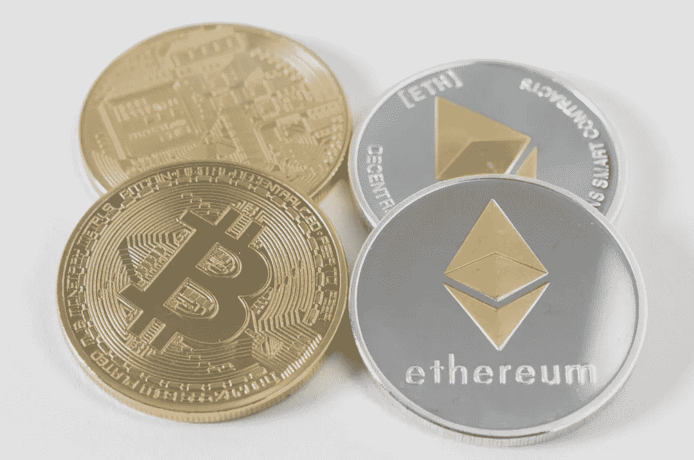

# 统治还是被统治:密码规则与创新

> 原文：<https://medium.com/coinmonks/rule-or-be-ruled-crypto-regulation-and-innovation-83f9d2e9b764?source=collection_archive---------9----------------------->

> 自我监管将永远是一个挑战，但如果有人要负责，那也可能是我——丹尼尔·阿克斯特

***我们不需要没有臭味的规则***

不管你是否同意这个想法，越来越多的法规正在进入加密领域。美国的金融监管机构已经在进行打击，美国证券交易委员会(SEC)和纽约州金融服务局(NYSDFS)走在了前面。他们这样做是因为很大比例的加密项目已经因为它们的*功能而受到严格监管。*

虽然加密推广者可能会将一项投资描述为一个令牌、一个生态系统或一个平台，但 SEC 听到的是“投资合同”。待售物品是否属于投资合同是由豪威测试决定的(在美国)。豪威标准来自 1946 年的案例 [*SEC 诉豪威公司*](https://supreme.justia.com/cases/federal/us/328/293/) *，*在该案中，一个柑橘种植者将土地出售给拜访种植者拥有的度假酒店的外地买家。

> …很大一部分加密项目已经受到严格监管…

如果一个游客购买了土地和 10 年的服务合同(种植、照管和收获水果),他们将从地块内的收获中获得一定比例的利润。美国证券交易委员会提起诉讼，豪威测试由此诞生。测试的三个要点是:

1.  金钱的投资
2.  在一个共同的企业中
3.  对从他人的努力中获得利润有合理的期望

这是法院在豪威(重点是我的)一案中所说的:

> 因此，追求利润的商业风险的所有要素都在这里。**投资者提供资本并分享收益和利润；发起人管理、控制和经营企业。由此可见，表明投资者利益的安排**涉及** **投资合同，而不管这种合同披着什么法律术语****。在这种情况下，投资合同采取土地销售合同、担保契约和服务合同的形式，由被告提供给潜在投资者。被告在提供此类产品时未能遵守法律和行政法规，即使此类未能遵守是由于对法律的善意错误造成的，也不会受到该法案的制裁。****

**这个案子被提交到最高法院。下级法院倾向于同意这一观点，即投资的形式是土地销售和服务合同，因此它们应受不动产和合同法的管辖。不管你是否同意最高法院的观点，这个案件为美国证券交易委员会和今天的加密资产的功能监管奠定了基础。他们没有休息，看看最近 SEC 采取的所有与加密相关的执法行动。这个列表只会越来越长，但不一定。**

*****多谢，你移动太快，你弄坏了东西*****

**马克·扎克伯格的名言“快速行动，打破常规”代表了互联网时代。从出租车到唱片公司，再到电视工作室，一切都突然发现自己被科技颠覆了。消费者获得了明显的改善，但我们只是刚刚开始理解其代价，更不用说支付了。与此同时，技术创新者变成了企业巨头，现在与传统企业利益完全一致。换句话说，科技公司成为了他们声称要解决的问题的一部分，并在许多方面使世界变得更糟。**

**考虑到这一点，现在密码领域正处于十字路口。crypto 的早期先驱们似乎信奉“快速突破事物”的咒语，他们也确实做到了。现在，我可以登录比特币基地，购买早期种子轮和风险资本投资合同(加密资产)，没有收入资格，同时接受最少的披露，几乎没有监管监督。上一次我能够在美国做类似的事情是在 20 世纪 20 年代。**

> **科技公司成了他们声称要解决的问题的一部分**

**当时，他们不称之为“代币”,但股票交易非常普遍，就像今天的加密空间一样充满了欺诈和虚假承诺。然而，就像今天一样，监管者看到了通过市场机制筹集资金的价值。这就是股票交易没有被彻底禁止的原因。这也是股票交易者现在生活的监管框架产生的地方。**

**可以肯定的是，监管并没有阻止欺诈，只是让欺诈变得更加困难。至少，监管者希望确保潜在投资者:1)能够承受损失；2)在投资前获得诚实、可信的信息；以及 3)能够从国家当局寻求法律补救。在美国证券交易委员会成立之前，各州的“蓝天”法律(以出售“蓝天”的欺诈者的名字命名)管理股票销售。**

**但会发生的是，股票推销商会在一个州出售假股票，当当局追捕他们时，他们会转移到另一个州。一旦进入新州，前一个州的监管机构就不能动他们，所以他们可以自由地从头再来设置骗局。这场猫捉老鼠的游戏被美国证交会(SEC)国家权威部门叫停。**

**就像当时的股市一样，我认为监管机构显然看到了加密资产的价值。证券交易委员会的负责人有一个专门的电子邮件地址，让 DeFi 的开发者可以联系她，嗯，*任何事情。她是这样说的:***

> **在最近的一次演讲中，我向数字资产市场的参与者征求意见(引用从略)。不幸的是，这还没有得到社区的太多回应，他们经常说缺乏 SEC 等机构的必要指导。我的大门一直敞开着，我欢迎你的想法。为此，我创建了一个专用邮箱:crenshaw-defi@sec.gov。**

**我认为，加密先驱与审慎监管机构合作至关重要。我的意思是，想想看…证券交易委员会的头给了他们一个公开的邀请！为什么不呢？任何其他路线都近乎疯狂。**

**听着，互联网永远改变了世界，也打破了很多东西。加密数字账簿、加密货币、不可替代代币(NFT)、去中心化自治组织(DAO)、人工智能(AI)以及所有其他即将到来的创新将使互联网看起来像蒸汽机车。互联网改变了世界，而且不总是变得更好。如果加密先驱不小心，他们可能会粉碎它。**

**或者，他们可以修复它...**

*****快速移动，搞定事情*****

**请记住，美国证券交易委员会并不是唯一参与加密的监管机构。财政部和金融犯罪执法网络(FinCEN)、货币监理署、商品期货交易委员会(CFTC)和国税局(IRS)都在插手加密领域。从本质上讲，这些监管机构想要确保的是加密空间没有犯罪、欺诈和肮脏交易。当然，除了国税局……他们只是想分一杯羹。**

**请想一想迄今为止不受监管的加密市场给了我们什么。仅举一个例子，可能有几千条' T0 '鲸鱼能够改变市场，或者真的创造或破坏新的项目。一群分散在全球各地的伪匿名、完全不受监管的个人控制着数百万密码持有者和他们手中项目的命运，这在某种程度上比美联储或一群银行家更好(或更安全)，我不清楚。这还没有考虑到[系绳和 USDC](https://onlinelibrary.wiley.com/doi/full/10.1111/jofi.12903) 的重大问题，这些问题绝对会很快给加密投资者带来重大干扰和损失。**

**毫无疑问，这两个例子是重大的、潜在的灾难性问题。我也相信在某人的头脑中，在某个地方，存在着解决这些问题的技术方案。同样，我认为欺诈是一个问题。我也相信有人，在某个地方也有解决这个问题的技术方案。金融犯罪、逃税、公司渎职、政府腐败和其他许多事情也是如此。最大的问题是:密码先锋会激励这些解决方案吗？或者，他们会刺激不断扩大的问题吗？**

*****也许只是一两条规则……*****

**请记住，在过去，银行和金融法规是针对欺诈、犯罪和不公平交易的解决方案。它们非常不完美——以至于它们已经成为今天风险的主要来源。但是，创造这些解决方案的人没有我们拥有的技术。现在，加密有可能摧毁旧系统，只是希望新出现的系统会更好。或者，crypto 可以重新调整自己的方向，优先考虑并激励比我们的前辈提出的解决方案更好的解决方案。**

**这并不容易。但那又怎样？我相信加密代表了人类有史以来第一个、最好的、合法的机会，让这个世界对每个人都公平公正。我们现在拥有无限的潜力。我只希望我们不要为了寻宝而把它都烧掉。**

**然而，这一进程必须从自我监管开始。无论是分散的、自主的监管功能，还是通过关联进行的人为监管，或者其他什么，密码先锋都必须开始考虑这些问题。如果他们能够为这些问题创造出合法、公平、可行、可扩展的解决方案，并且比监管者所能提供的更好，那么监管者将会靠边站，这个空间将会蓬勃发展。如果他们继续遵循“快速行动，打破常规”的座右铭，监管者将会强加秩序。这一空间仍将增长，但几乎肯定会以牺牲其他所有人的利益为代价，让企业受益。**

**统治或被统治。创新和打破，或者创新和修复。这是你我以及所有参与 crypto 的人的选择。问题是，我们该怎么办？**

> **加入 Coinmonks [电报频道](https://t.me/coincodecap)和 [Youtube 频道](https://www.youtube.com/c/coinmonks/videos)了解加密交易和投资**

## **也阅读**

** [## 杠杆代币[多头代币]终极指南

### 杠杆化令牌是具有杠杆化风险敞口的 ERC20 令牌，不考虑保证金、要求、管理…

medium.com](/coinmonks/leveraged-token-3f5257808b22)  [## 最佳加密交易所| 2021 年十大加密货币交易所

### 加密货币交易所的加密交易需要了解市场，这可以帮助你获得利润。之前…

blog.coincodecap.com](https://blog.coincodecap.com/crypto-exchange)  [## 2021 年最佳加密借贷平台| 6 大比特币借贷平台

### 获得比特币和其他加密货币的最佳贷款利率

medium.com](/coinmonks/top-5-crypto-lending-platforms-in-2020-that-you-need-to-know-a1b675cec3fa)  [## 2021 年最佳免费加密交易机器人

### 2021 年币安、比特币基地、库币和其他密码交易所的最佳密码交易机器人。四进制，位间隙…

medium.com](/coinmonks/crypto-trading-bot-c2ffce8acb2a)  [## 最佳 4 个加密交易信号电报通道

### 这是乏味的找到正确的加密交易信号提供商。因此，在本文中，我们将讨论最好的…

medium.com](/coinmonks/best-crypto-signals-telegram-5785cdbc4b2b)  [## 获取信号、交易机器人和套利

### 在本文中，我们将回顾 Bitsgap，这是一个满足您所有交易需求的一站式加密交易平台。它…

blog.coincodecap.com](https://blog.coincodecap.com/bitsgap-review)  [## 5 个最佳社交交易平台[2021] | CoinCodeCap

### 困惑于社交交易和副本交易哪个平台最好？本文将带您了解各种…

blog.coincodecap.com](https://blog.coincodecap.com/best-social-trading-platforms)  [## BlockFi 评论 2021:利弊和利率| CoinCodeCap

### 今天，我们提出了一个全面的 BlockFi 评论，这是一个成立于 2017 年的加密贷款平台，拥有其…

blog.coincodecap.com](https://blog.coincodecap.com/blockfi-review)  [## 如何在印度购买比特币？2021 年购买比特币的 7 款最佳应用[手机版]

### 如何使用移动应用程序购买比特币印度

medium.com](/coinmonks/buy-bitcoin-in-india-feb50ddfef94)  [## 加密税务软件——五大最佳比特币税务计算器[2021]

### 不管你是刚接触加密还是已经在这个领域呆了一段时间，你都需要交税。

medium.com](/coinmonks/best-crypto-tax-tool-for-my-money-72d4b430816b)  [## 存储比特币的最佳加密硬件钱包[2021] | CoinCodeCap

### 保管您的数字资产很容易，但找到正确的存储方式却是一项繁琐的任务。在线钱包有一个风险…

blog.coincodecap.com](https://blog.coincodecap.com/best-hardware-wallet-bitcoin)  [## Pionex 评论 2021 |免费加密交易机器人和交换

### Pionex 是为交易自动化提供工具的后起之秀。Pionex 上提供了 9 个加密交易机器人…

medium.com](/coinmonks/pionex-review-exchange-with-crypto-trading-bot-1e459d0191ea)**