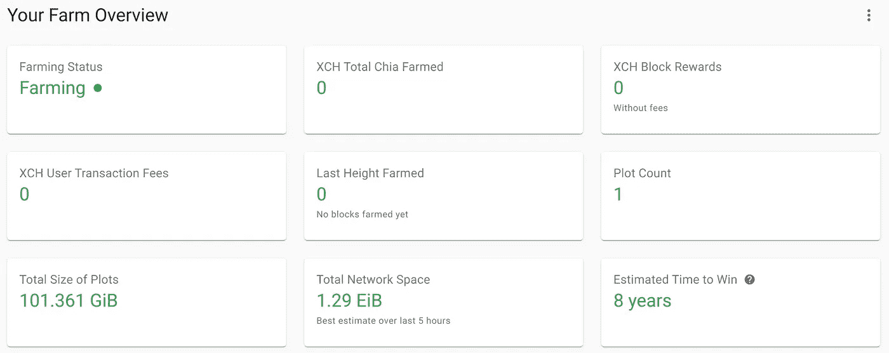

# 运行 Chia 节点

> 原文：<https://medium.com/coinmonks/run-a-chia-node-d2383dcb16?source=collection_archive---------0----------------------->

最近，Chia 网络因其新的*空间*共识证明而变得流行。

在本文中，我们将向您展示在您的计算机上运行 Chia 节点的步骤。

[](https://www.chia.net/) [## 家园网络

### 我们认为加密货币应该比现金更容易使用，更难丢失，几乎不可能被盗…

www.chia.net](https://www.chia.net/) 

在开始之前，如果你有时间，你可以阅读更多关于绘图(采矿)的基础知识。

[](https://www.chia.net/2021/02/22/plotting-basics.html) [## Chia 绘图基础

### 首先，重要的是要知道作为一个农民有两个非常不同的部分。有创造了…

www.chia.net](https://www.chia.net/2021/02/22/plotting-basics.html) 

如果你想了解更多关于如何利用你的免费空间赚钱的信息，你可以查看下面的文章:

[](https://aruno14.medium.com/mining-using-your-disks-free-space-8af9d2d100a0) [## 使用磁盘可用空间进行挖掘

### 这篇文章列出并比较了一些方法来货币化你的计算机磁盘可用空间。

aruno14.medium.com](https://aruno14.medium.com/mining-using-your-disks-free-space-8af9d2d100a0) 

# 装置

安装很简单，你只要按照项目的安装说明就可以了。然而，记住你将需要超过 **3 *00Gb 的空闲空间*来运行最简单的节点(**你肯定不会用它赚很多钱**)。**

[](https://github.com/Chia-Network/chia-blockchain/wiki/INSTALL) [## 中国网络/中国区块链

### 要安装 chia-区块链，请根据您的操作系统遵循说明。安装后，请遵循…

github.com](https://github.com/Chia-Network/chia-blockchain/wiki/INSTALL) 

# 设置

安装后午餐的 GUI。

```
cd chia-blockchain-gui
npm run electron &
```


Chia GUI


然后，添加一个图并设置它。

要运行一个 101.4GIB 的节点，您将需要 300GB 以上的可用空间。如果磁盘已满，绘图将停止；如果你增加更多的自由空间，你应该能够继续绘图。但是，在我的例子中，磁盘满了以后，绘图就不再进行了。


Setup plot

绘图大约需要一天的时间。

绘图完成后，您可以将结果绘图保存到另一个磁盘，如较慢的硬盘。


Resulting plotting log


Full node status


Result after plotting finished



Farm overview

预计赢得比赛的时间是 8 年。)据说实际上要长 2 到 3 倍。所以大概 20 年才能赚到东西…


With two plots


Dialog to add plot

您也可以添加以前生成的图。


My setup for farming

# 结论

启动一个 Chia 节点非常容易，但是要花费(许多)时间。除非你有充足的自由空间，否则你是赚不到钱的。GPU 采矿看起来是一个更好更快的用你的电脑赚钱的方法。

在尝试之前，你应该使用下面的工具估算你的奖励:

[https://chiacalculator.com/](https://chiacalculator.com/)

> 加入 Coinmonks [电报频道](https://t.me/coincodecap)和 [Youtube 频道](https://www.youtube.com/c/coinmonks/videos)获取每日[加密新闻](http://coincodecap.com/)

## 另外，阅读

*   [复制交易](/coinmonks/top-10-crypto-copy-trading-platforms-for-beginners-d0c37c7d698c) | [加密税务软件](/coinmonks/crypto-tax-software-ed4b4810e338)
*   [网格交易](https://coincodecap.com/grid-trading) | [加密硬件钱包](/coinmonks/the-best-cryptocurrency-hardware-wallets-of-2020-e28b1c124069)
*   [密码电报信号](http://Top 4 Telegram Channels for Crypto Traders) | [密码交易机器人](/coinmonks/crypto-trading-bot-c2ffce8acb2a)
*   [最佳加密交易所](/coinmonks/crypto-exchange-dd2f9d6f3769) | [印度最佳加密交易所](/coinmonks/bitcoin-exchange-in-india-7f1fe79715c9)
*   [开发人员的最佳加密 API](/coinmonks/best-crypto-apis-for-developers-5efe3a597a9f)
*   最佳[密码借贷平台](/coinmonks/top-5-crypto-lending-platforms-in-2020-that-you-need-to-know-a1b675cec3fa)
*   [免费加密信号](/coinmonks/free-crypto-signals-48b25e61a8da) | [加密交易机器人](/coinmonks/crypto-trading-bot-c2ffce8acb2a)
*   杠杆代币的终极指南