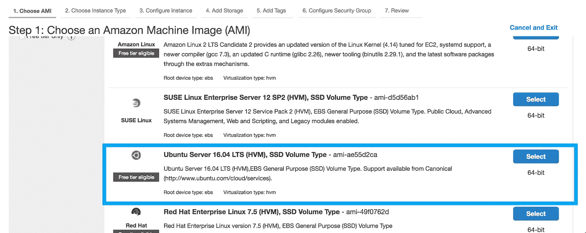
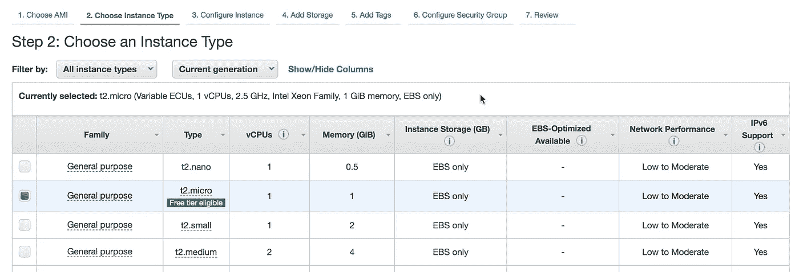
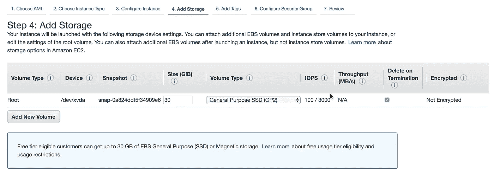
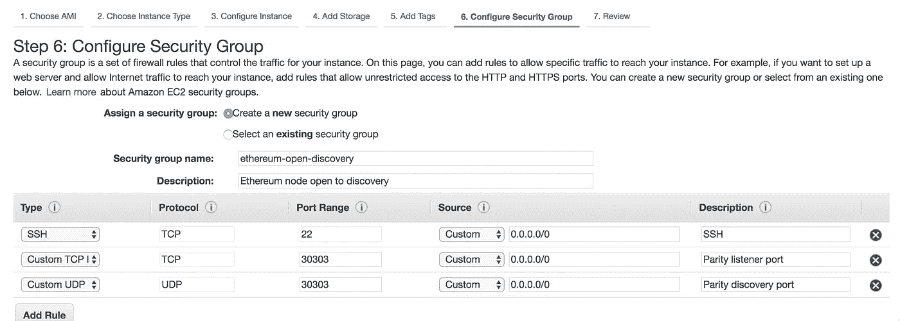

# 免费在 AWS 上运行以太坊节点

> 原文：<https://medium.com/coinmonks/run-an-ethereum-node-on-aws-for-free-afca27f253ed?source=collection_archive---------1----------------------->


想运行以太坊节点但不想管理基础设施？想创建一个与以太网接口的服务吗？有很多理由在 AWS 上运行以太坊节点。

为了保持自由，我们将使用[奇偶校验](https://www.parity.io/)来运行我们的以太坊节点，因为奇偶校验支持[状态树修剪](https://blog.ethereum.org/2015/06/26/state-tree-pruning/)，这将保持我们的存储需求较低。

> 交易新手？试试[密码交易机器人](/coinmonks/crypto-trading-bot-c2ffce8acb2a)或[复制交易](/coinmonks/top-10-crypto-copy-trading-platforms-for-beginners-d0c37c7d698c)

如果您还没有 AWS 帐户，[继续操作并打开一个](https://aws.amazon.com/free)，您将自动访问免费层。

# 启动实例

首先，我们将启动一个 EC2 实例。我们将选择自由层合格的 Ubuntu 实例，因为奇偶校验的 Debian 版本很容易设置。



接下来，我们选择符合自由层条件的 t2.micro 实例。这个硬件足以运行以太坊节点。



然后我们指定我们的磁盘大小。由于我们使用奇偶校验的状态树修剪，我们不必担心区块链大小增长过快，我们可以保持在分配给空闲层的 30GB 以内。



最后，如果我们想让我们的节点可被发现，我们将在端口 30303 上公开 TCP 和 UDP，这是用于节点发现的默认端口。



如果您计划让任何令牌或以太网由奇偶校验管理，或者不想被封闭，请不要暴露端口 8545。端口 8545 用于 JSON-RPC，但是对于公共访问是不安全的。有一个[机器人](https://etherscan.io/address/0x957cd4ff9b3894fc78b5134a8dc72b032ffbc464)四处游荡，向 8545 端口发送撤回请求，当你解锁你的账户时，它会偷走你的硬币。如果你需要访问 JSON-RPC，你可以[添加某种形式的认证层](https://tokenmarket.net/blog/protecting-ethereum-json-rpc-api-with-password/)或者在虚拟私有云中运行一切。

检查配置后，启动实例，然后等待一分钟，让 AWS 完成配置。

# 安装奇偶校验

SSH 到您的新 EC2 实例。

```
ssh -i <your ssh-key for this instance> ubuntu@<your instance's public IP>
```

要安装 Parity 的最新稳定版本，我们可以运行他们的安装脚本。

```
bash <(curl [https://get.parity.io](https://get.parity.io/) -Lk) -r stable
```

就是这样！现在，我们可以通过运行以下命令开始快速同步我们的节点:

```
parity
```

或者，如果我们想在开发环境中尝试，奇偶校验提供了预先配置的开发网络配置，只需运行:

```
parity --chain=dev
```

# 包扎

我们已经成功建立了自己的以太坊节点。现在我们可以开始编写与网络或各种 DApps 交互的服务。

这可能是一系列文章中的第一篇！如果您对关于使用 Web3 创建这种服务后续文章感兴趣，请告诉我！

# **关于作者**

章典是[稳定区块链实验室](https://www.stably.io/)的联合创始人兼首席技术官。

[在 Twitter 上关注我](https://twitter.com/dazhengzhang)了解科技、区块链和市场的最新动态

[](http://bit.ly/2G71Sp7)