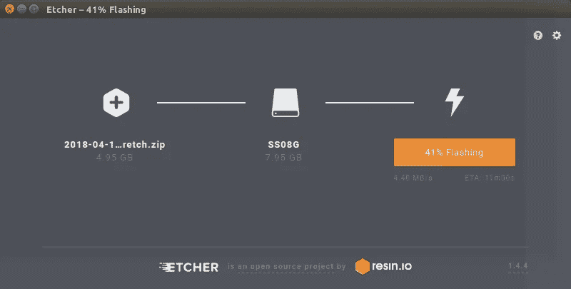
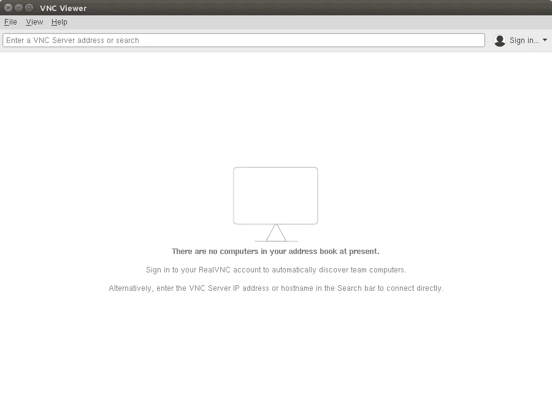
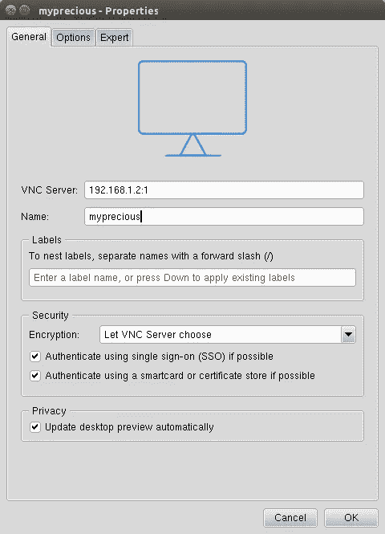

# 以真正的无头模式运行 Raspberry pi

> 原文：<https://medium.com/coinmonks/run-raspberry-pi-in-a-true-headless-state-cfb3431667de?source=collection_archive---------0----------------------->


比方说，我刚买了一个树莓派，想试试它的工作原理。但我只有我的笔记本电脑，Pi，一个微型 SD 卡和我的无线网络。我如何连接和控制 Pi？

以下是尼克如何成为无头尼克的故事

**更新:现在你可以通过互联网轻松地以图形方式远程控制 Pi，增加了这样做的步骤。**

**1 —下载 Raspbian**

你的 Pi 需要一个操作系统。从 Raspberrypi.org 的下载部分下载 Raspbian:[https://www.raspberrypi.org/downloads/raspbian/](https://www.raspberrypi.org/downloads/raspbian/)

**2 —将其闪存到 SD 卡上**

你需要把这个下载的图像刷新到微型 SD 卡上。假设你的笔记本电脑有 SD 卡插槽，你需要一个像 etcher 这样的闪存软件。请从[https://etcher.io/](https://etcher.io/)下载



**3—配置 WiFi**

如果两个设备在同一个网络中，就更容易让它们相互通信。以太网电缆可以很容易地使您的笔记本电脑的网络可供 Pi 使用。但是我们没有。因此，我们将向 SD 卡添加一个文件，以便 Pi 使用预先配置的 wifi 启动。

SD 卡安装为两个卷`boot`和`rootfs`。打开`boot`卷，在 RPi 引导时创建一个名为`wpa_supplicant.conf`的文件，这个文件会被复制到`/rootfs`分区的`/etc/wpa_supplicant`目录下。复制的文件告诉 Pi WiFi 设置信息。这将覆盖任何现有的 wifi 配置，因此如果您已经在 pi 上配置了 wifi，则该配置将被覆盖。

典型的`wpa_supplicant.conf`文件如下

```
ctrl_interface=DIR=/var/run/wpa_supplicant GROUP=netdev
update_config=1
country=«your_ISO-3166-1_two-letter_country_code»

network={
    ssid="«your_SSID»"
    psk="«your_PSK»"
    key_mgmt=WPA-PSK
}
```

你的 SSID 就是你的 wifi 的名字。要在 ubuntu 上找到 SSID，可以使用`iwgetid`命令。psk 是 wifi 密码，您的国家代码可以在这里找到:[https://www . wiki wand . com/en/ISO _ 3166-1 _ alpha-2 #/official _ assigned _ code _ elements](https://www.wikiwand.com/en/ISO_3166-1_alpha-2#/Officially_assigned_code_elements)

因此，替换上述文本中的所有`«item»`字段

**4 —启用 SSH**

我们稍后将使用安全 shell (SSH)访问 Pi，SSH 在 raspbian 中是默认禁用的。要启用 SSH，在`boot`分区中创建一个名为`ssh`的文件。如果您在 linux 上，使用`touch`命令来完成。

**5 —查找 Pi 的 IP 地址**

在打开您的 raspberry pi 之前，我们需要找出连接到网络的现有设备。确保您的笔记本电脑连接到与您在上述 pi 上配置的 wifi 网络相同的 wifi 网络。

运行命令`hostname -I`找出你的笔记本电脑的 IP 地址。假设它是`192.168.1.8`，那么当连接时，你的 pi 的 ip 将是`192.168.1.x`

运行命令`nmap -sn 192.168.1.0/24`找出 ipaddress 最后一部分的网络中 0 到 24 范围内的现有设备。我明白了

```
Starting Nmap 7.01 ( [https://nmap.org](https://nmap.org) ) at 2018-07-03 18:39 IST
Nmap scan report for 192.168.1.1
Host is up (0.0020s latency).
Nmap scan report for 192.168.1.8
Host is up (0.000097s latency).
Nmap done: 256 IP addresses (5 hosts up) scanned in 2.58 seconds
```

从笔记本电脑中取出 micro SD 卡，并将其插入 Pi。使用电源(5v 普通安卓充电器)给它加电，然后再次尝试`nmap -sn 192.168.1.0/24`，看看哪个 IP 地址是新出现的

```
Starting Nmap 7.01 ( [https://nmap.org](https://nmap.org) ) at 2018-07-03 18:39 IST
Nmap scan report for 192.168.1.1
Host is up (0.0020s latency).
Nmap scan report for 192.168.1.2
Host is up (0.040s latency).
Nmap scan report for 192.168.1.8
Host is up (0.000097s latency).
Nmap done: 256 IP addresses (5 hosts up) scanned in 2.58 seconds
```

所以`192.168.1.2`应该是 pi 的 ip 地址。

**6— SSH 进入 Pi**

为了创建一个安全的 shell 连接，在 linux 中我们可以使用`ssh`命令。如果你用的是 windows，试着从 https://www.putty.org/下载 PuttY

要连接到 Pi，您需要设备的默认用户名和密码。第一次启动时，用户名和密码如下。

用户名:`pi`
密码:`raspberry`

现在你可以做

```
ssh pi@192.168.1.2
```

当询问您是否确定继续连接设备时，输入`y`。然后当询问密码时，输入密码。

你现在应该在 Pi 的 SSH 里面了。微笑:)我们应该品味这样的小胜利

**7—更改默认密码**

将密码更改为其他密码是一个很好的做法。您可以使用`passwd`命令来完成这项工作。

```
pi@raspberrypi:~ $ passwd
Changing password for pi.
(current) UNIX password: raspberry
Enter new UNIX password: iwonttellyou
Retype new UNIX password: iwonttellyou
passwd: password updated successfully
```

**8 —见屏幕**

如果我们不能使用鼠标，有时会感觉不太好。为此，我们需要研究 Raspbian 桌面。

我们需要设置 VNC(虚拟网络连接)来图形化地查看和控制 Pi。就这么办吧。

```
sudo apt-get update
sudo apt-get install -y realvnc-vnc-server realvnc-vnc-viewer
```

这些命令将更新 Pi 的软件并安装 realvnc，realvnc 将用于设置远程会话。

**9—远程访问 Pi**

在 raspberry pi 的 ssh 提示符下，键入`vncserver`来启动服务。这将打印一个 IP 地址，您可以远程访问桌面，请注意。我的写着

```
New desktop is raspberrypi:1 (192.168.1.2:1)
```

要访问远程桌面，您的笔记本电脑需要一个 vncviewer(客户端)。幸运的是，RealVNC 可用于许多操作系统，从 https://www.realvnc.com/en/connect/download/viewer/[选择一个适合你的操作系统](https://www.realvnc.com/en/connect/download/viewer/)

如果你在 debian/ubuntu 上，你可能需要在下载可执行文件后做一些额外的步骤。

```
cd ~/Downloads
chmod +x VNC-Viewer-6.17.1113-Linux-x64
mv VNC-Viewer-6.17.1113-Linux-x64 ~
cd ~
./VNC-Viewer-6.17.1113-Linux-x64
```



RealVNC viewer



在这里，我们正在更改下载的可执行文件的文件模式，使其可以安装。我们还将可执行文件从下载文件夹移动到主文件夹。

安装 RealVNC viewer 后，将 raspberry pi 设备添加到连接中(文件>新建连接)。输入 pi 的桌面标识符(`192.168.1.2:1`)，给它一个友好的名称，点击 Ok。出现提示时，输入 pi 的用户名和密码。就这样，你现在应该看到桌面了。给我一个五！


Raspberry Pi’s Remote desktop

**10 —从互联网进行远程控制**

没有更多的端口转发和摆弄路由器设置，团队浏览器发布了一个基于 Arm 的设备版本，我们将使用它。耶！

从进入你的无头设备开始，从终端开始

```
wget [https://download.teamviewer.com/download/linux/teamviewer-host_armhf.deb](https://download.teamviewer.com/download/linux/teamviewer-host_armhf.deb)
```

下载后，您可以使用以下方式安装它:

```
sudo apt install teamviewer-host_armhf.deb
```

您可以在安装后`rm`teamviewer deb 文件。

现在，我该如何用它建立一个远程会话呢？

安装后，我们应该在 pi 上安装一个`teamviewer` cli 工具。让我们检查 teamviewer 守护进程是否正在运行。

```
teamviewer daemon status
```

应该会返回大量的文本，你会发现“活跃(运行)”在其中。

如果你找不到，试试看

```
sudo teamviewer daemon start
```

一旦完成，让我们做设置。您需要一个 teamview 帐户。如果你没有，去[https://login.teamviewer.com/LogOn#register](https://login.teamviewer.com/LogOn#register)创建一个。在那之后输入

```
sudo teamviewer setup
```

接受任何许可条款，并输入您在注册过程中提供的电子邮件 id 和密码。由于这是您第一次尝试从该帐户远程控制该设备，您应该会收到一封电子邮件，发送至**将设备添加至可信列表**

点击电子邮件中的链接即可。如果需要，再次尝试 setup 命令，最终您应该会得到这个漂亮的文本

> *****您已成功将这台电脑添加到您的电脑的&联系人中。现在，您只需在电脑的&联系人列表中双击即可访问它。*****

在笔记本电脑中打开(或安装)team viewer。签到。您应该会看到“您的电脑”下列出了 Raspberry Pi 设备。只需双击并开始通过互联网控制它。

不要告诉任何人，它甚至可以在你重启 pi 后工作😉

💥 💥 💥

**参考文献:**

准备`wpa_supplicant.conf`文件

[](https://raspberrypi.stackexchange.com/questions/10251/prepare-sd-card-for-wifi-on-headless-pi) [## 为无头 Pi 上的 Wifi 准备 SD 卡

### 我需要通过 wifi SSH 我的 Pi，但是因为它是 A 型板(使用 usb 集线器是不可能的——永远不可能),而且我没有…

raspberrypi.stackexchange.com](https://raspberrypi.stackexchange.com/questions/10251/prepare-sd-card-for-wifi-on-headless-pi) 

查找 wifi ssid

[](https://askubuntu.com/questions/117065/how-do-i-find-out-the-name-of-the-ssid-im-connected-to-from-the-command-line) [## 如何从命令行找到我所连接的 SSID 的名称？

### 本网站使用 cookies 来提供我们的服务，并向您显示相关的广告和工作列表。通过使用我们的网站，您…

askubuntu.com](https://askubuntu.com/questions/117065/how-do-i-find-out-the-name-of-the-ssid-im-connected-to-from-the-command-line) 

查找 pi 的 IP 地址

[](https://www.raspberrypi.org/documentation/remote-access/ip-address.md) [## IP 地址- Raspberry Pi 文档

### 需要访问一个树莓派，但没有显示器备用？本节提供了设置…的基本说明

www.raspberrypi.org](https://www.raspberrypi.org/documentation/remote-access/ip-address.md) 

为 Arm 设备安装 teamviewer

[](https://community.teamviewer.com/t5/Knowledge-Base/How-to-install-TeamViewer-for-Linux/ta-p/6318) [## 如何安装 TeamViewer for Linux

### 本文适用于所有许可证中的 Linux 用户。系统要求 TeamViewer for Linux 需要 Linux 2.6.27…

community.teamviewer.com](https://community.teamviewer.com/t5/Knowledge-Base/How-to-install-TeamViewer-for-Linux/ta-p/6318) 

> 加入 Coinmonks [电报频道](https://t.me/coincodecap)和 [Youtube 频道](https://www.youtube.com/c/coinmonks/videos)获取每日[加密新闻](http://coincodecap.com/)

## 另外，阅读

*   [复制交易](/coinmonks/top-10-crypto-copy-trading-platforms-for-beginners-d0c37c7d698c) | [加密税务软件](/coinmonks/crypto-tax-software-ed4b4810e338)
*   [网格交易](https://coincodecap.com/grid-trading) | [加密硬件钱包](/coinmonks/the-best-cryptocurrency-hardware-wallets-of-2020-e28b1c124069)
*   [密码电报信号](http://Top 4 Telegram Channels for Crypto Traders) | [密码交易机器人](/coinmonks/crypto-trading-bot-c2ffce8acb2a)
*   [最佳加密交易所](/coinmonks/crypto-exchange-dd2f9d6f3769) | [印度最佳加密交易所](/coinmonks/bitcoin-exchange-in-india-7f1fe79715c9)
*   开发人员的最佳加密 API
*   最佳[密码借贷平台](/coinmonks/top-5-crypto-lending-platforms-in-2020-that-you-need-to-know-a1b675cec3fa)
*   杠杆代币的终极指南
*   [7 个最佳零费用加密交易平台](https://coincodecap.com/zero-fee-crypto-exchanges)
*   [最佳网上赌场](https://coincodecap.com/best-online-casinos) | [期货交易机器人](/coinmonks/futures-trading-bots-5a282ccee3f5)
*   [分散交易所](https://coincodecap.com/what-are-decentralized-exchanges) | [比特 FIP](https://coincodecap.com/bitbns-fip)
*   [用信用卡购买密码的 10 个最佳地点](https://coincodecap.com/buy-crypto-with-credit-card)
*   [加拿大最佳加密交易机器人](https://coincodecap.com/5-best-crypto-trading-bots-in-canada) | [Bybit vs 币安](https://coincodecap.com/bybit-binance-moonxbt)