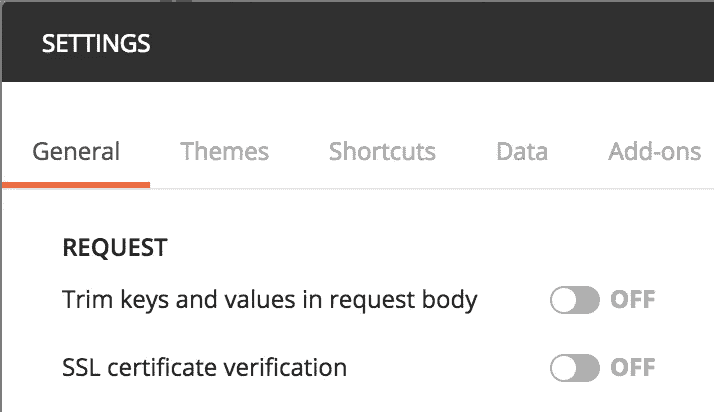

# 用 Docker 运行 Cardano 节点

> 原文：<https://medium.com/coinmonks/running-a-cardano-node-with-docker-f03c4c13cbd3?source=collection_archive---------4----------------------->

Cardano 是一个加密货币和智能合约平台，在我看来，这是该领域最低调的项目之一。cardano 的超级学术团队保持低调，创造高质量的软件。不幸的是，弄清楚如何使用它是一个反复试验的过程，因为与 Ethereum 或 EOS 相比，几乎没有关于它的文档或开发人员社区。今年早些时候，我写了几篇关于 Cardano testnets 和 CLI 工具的文章。

[卡尔达诺智能合约 101 —测试网](/coinmonks/cardano-smart-contracts-101-testnets-f9dc7ac24635)

[卡尔达诺 101 号——你的第一份合同](/coinmonks/cardano-101-your-first-contract-ab22ec32e870)

不幸的是，当我开始研究与 Cardano mainnet 的连接时，我发现 Mallet 只是用于即将到来的 kevm 和 iele 测试网。我必须弄清楚如何连接到 mainnet，并通过自定义 Node.js 客户机向 cardano 节点发送自定义 RPC 调用。

**要求**

*   乌班图——OSX 不适合我；（
*   饭桶
*   码头工人

## 肥胖的钱包

我发现我可以下载并安装代达罗斯钱包应用程序，并连接到 mainnet 相当容易。钱包在后台运行一个 cardano-sl 节点，可以通过 RESTful 接口访问该节点。在盲目地在远程服务器上安装 docker 镜像之前，在本地安装并试验一下这可能是个好主意。

[代达罗斯钱包- Windows/OSX 版](https://daedaluswallet.io/#download)

下载并同步钱包后，继续通过 GUI 添加钱包。如果你想的话，你需要写下助记符和密码。

## **邮递员**

我建议你在这里下载 *Postman* 应用[，在这里](https://www.getpostman.com/apps)导入下面的 swagger 定义[。为了让您的邮递员查询在本地使用您的代达罗斯钱包，您需要关闭 ssl 证书验证，因为钱包使用自签名证书。](https://cardanodocs.com/technical/wallet/api/v1/swagger.json)



摆弄一下 cardano 提供的 postman 集合，您会对 wallet => account => address 关系和模型的其他微妙方面有所了解。

## 码头工人

**选项**
您可以构建映像或使用预构建的映像。下面介绍了这两个选项，但是您需要创建数据目录。

**创建数据目录**

```
$ mkdir cardano && cd cardano
$ mkdir data && chmod 777 data
```

**建筑形象**

```
$ git clone [https://github.com/cipherzzz/cardano-node](https://github.com/cipherzzz/cardano-node)$ cd cardano-node# Build the image locally
$ docker build -t cardano-node .
```

**更新图像**

```
# Login to docker hub
$ docker login# Tag the local build with a remote tag
$ docker tag cardano-node cipherz/cardano-node# Push the new tag to the remote
$ docker push cipherz/cardano-node
```

**使用现有图像**

```
# Pull the remote built image
$ docker pull cipherz/cardano-node
```

**运行构建/提取的映像**

```
# Get image id below
$ docker images# Create and run the container
$ docker run -d — name=cardano-node -v ~/cardano/data:/home/cardano/cardano-sl/state-wallet-mainnet:Z -p 127.0.0.1:8090:443 <image id>
```

**验证**

```
# Curl Wallet API 
$ curl -k 
[https://127.0.0.1:8090/api/v1/node-info](https://127.0.0.1:8090/api/v1/node-info)# Verify wallet /data dir
$ ls ../data# Peek at Node logs
$ docker logs -f cardano-node
```

**维修**

```
# Start/Stop Container
$ docker stop cardano-node
$ docker start cardano-node# Remove Container
$ docker ps
$ docker container rm -f <container id>
```

**打造钱包**

一旦您验证了节点正在运行，我们需要在其上创建一个 wallet。运行以下命令在节点上创建 wallet，并根据需要编辑参数。

```
curl -k -X POST [https://127.0.0.1:8090/api/v1/wallets](https://127.0.0.1:8090/api/v1/wallets) \
 -d ‘{ “operation”: “create”, “backupPhrase”: [<12 word mnemonic>], “assuranceLevel”: “normal”, “name”: “Test Wallet” }’ \
 -H “Accept: application/json; charset=utf-8” \
 -H “Content-Type: application/json; charset=utf-8”
```

现在您已经创建了一个钱包，让我们为我们的节点列出钱包。从该响应中找到并记下钱包的 *id* 参数。

```
curl -k [https://127.0.0.1:8090/api/v1/wallets](https://127.0.0.1:8090/api/v1/wallets)
```

现在我们需要获得钱包 id 为 T8 的账户索引。用 id*参数*的替换执行下面的 curl。您将从下面的回答中找到一系列客户。记下*账户索引*参数。

```
curl -k [https://localhost:8090/api/v1/wallets/](https://localhost:8090/api/v1/wallets/)<wallet id>/accounts
```

我们已经创建了一个 wallet，并记下了 wallet id*和默认 wallet *accountIndex* 。我们将需要这些来与我们的钱包交互，以完成诸如生成地址和发送交易之类的事情。*

请注意，您可能希望将一些 ADA 转移到此帐户。您将会看到一个由前面的*地址*组成的数组

## 摘要

如果你愿意，你可以在这里下载这个项目。我希望这对您有所帮助，并期待在不久的将来能够使用 Mallet CLI！

*我的回购是从【这里】(*[*https://github.com/TheDevKnight/cardano-sl-wallet*](https://github.com/TheDevKnight/cardano-sl-wallet)*)分叉的，感谢*[*@ the dev knight*](http://twitter.com/TheDevKnight)*的帮助，让我起程。我还借用了[这里]的配置内容(*[*【https://github.com/EmurgoVN/cardano_docker】*](https://github.com/EmurgoVN/cardano_docker)*)。*

> [在您的收件箱中直接获得最佳软件交易](https://coincodecap.com/?utm_source=coinmonks)

[](https://coincodecap.com/?utm_source=coinmonks)