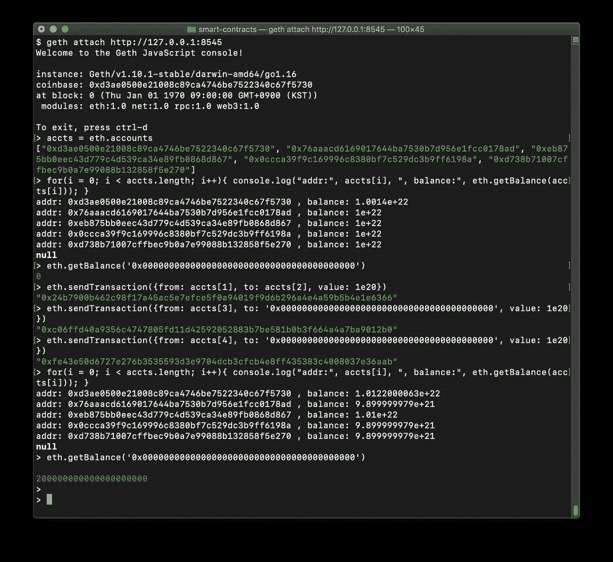

# 出于非生产目的运行独立的私有 Geth 节点

> 原文：<https://medium.com/coinmonks/running-a-standalone-private-geth-node-for-non-production-purpose-d6e0ff226150?source=collection_archive---------4----------------------->

## 以最少的步骤导入具有足够预分配余额的预定义密钥。


Photos by [XPS](https://unsplash.com/@xps) from [Unsplash](https://unsplash.com/)

# 介绍

一个简单的以太坊节点对于测试或概念验证是必要的。虽然有众所周知的 [Ganache](https://github.com/trufflesuite/ganache) 或者 [Ganache CLI](https://github.com/trufflesuite/ganache-cli) (正式名称为 TestRPC)，但是有时候你可能想要在测试或者更早的环境中 Geth。

以太网最昂贵的任务之一是保证账户安全(保护私钥不被泄露)。但是在**非生产**环境中，对账户的安全性要求不是很高，而是优选使用根本不安全的预定义密钥，以使提供初始余额的任务更加简单和可编程。在这些情况下，以下特征是有利的。

*   **使用预定义的密钥自动创建预定义的账户。**
*   **预定义账户从一开始就自动解锁。**
*   **预定义账户有巨额余额。**(为以后的特定应用账户提供足够的资金)
*   **更少的节点甚至只有一个节点就足够了。**

Geth 是传播最广泛的以太坊客户端软件，提供了许多强大的功能。这些特性似乎更侧重于生产环境，因此应用上述非面向生产的需求会相当复杂。
对于 Ganache CLI，只需使用`--account`和`--unlock`选项，即可满足上述要求。
尽管 Geth 并不那么简单，但您仍然可以使用脚本预加载和 genesis 配置来满足这些要求。

# 准备钥匙

下面显示了 5 个私钥和后面使用的相应地址。对于开发或测试环境，使用预定义的键没有问题，甚至是有利可图的。
你可以通过在线生成器或像 Python 中的`[eth-account](https://eth-account.readthedocs.io/en/stable/)`这样的库轻松获得新的密钥和地址。

```
[
[ ba75c5fd16ae1151dc9f961e94e219994c6335a5b4148c624142243fb76306d6,
  d3ae0500e21008c89ca4746be7522340c67f5730 ],
[ 097dd6aedb87b3b5e541cfb9ef8d4beb7a66084dd80d99c2e51aeabeae320980,
  76aaacd6169017644ba7530b7d956e1fcc0178ad ],
[ abae82647f5881a398f7eede8910803d65470a7cbaee9ddda90dcdcdc8dcdacf,
  eb875bb0eec43d779c4d539ca34e89fb0868d867 ],
[ cc1af47cbc9de0c9a1e1049c1a62ddb9e08440d16093803d74e93f1cea3458ee,
  0ccca39f9c169996c8380bf7c529dc3b9ff6198a ],
[ 3e48c4e748b8f5baf6f870c5c4d2a0147390c94e778a9ca67de945bffeb2f72a,
  d738b71007cffbec9b0a7e99088b132858f5e270 ],
]
```

# 生成生成块

对于 Geth，在启动新网络(即使是只有一个节点的专用网络)之前，应该使用如下 genesis 配置创建一个 genesis 块。

起源配置可以定义特定账户的预付余额。下面的配置将为先前准备的每个帐户分配 10 个 wei。
该配置仅提供余额，但不会在服务器端创建这些帐户。您可以稍后在服务器或客户端(如 MetaMask)上创建这些帐户。甚至它们已经在别处被创造出来了。不管怎样，这些账户在这个网络中会有巨大的余额。

```
{
  "config": {
    "chainId": 2021,
    "homesteadBlock": 0,
    "eip150Block": 0,
    "eip155Block": 0,
    "eip158Block": 0,
    "byzantiumBlock": 0,
    "constantinopleBlock": 0,
    "petersburgBlock": 0,
    "istanbulBlock": 0,    
    "muirglacierblock": 0,
    "ethash": {
      "fixeddifficulty": 100
    }
  },
  "nonce": "0x0",
  "difficulty": "0x60",
  "gasLimit": "0x1fffffffffffff",
  "coinbase": "0x0000000000000000000000000000000000000000",
  "alloc": {
 **"d3ae0500e21008c89ca4746be7522340c67f5730": 
      { "balance": "10000000000000000000000" },
    "76aaacd6169017644ba7530b7d956e1fcc0178ad":
      { "balance": "10000000000000000000000" },
    "eb875bb0eec43d779c4d539ca34e89fb0868d867":
      { "balance": "10000000000000000000000" },
    "0ccca39f9c169996c8380bf7c529dc3b9ff6198a":
      { "balance": "10000000000000000000000" },
    "d738b71007cffbec9b0a7e99088b132858f5e270":
      { "balance": "10000000000000000000000" }**  }
}
```

要生成一个 genesis 块，执行`geth init`命令。该命令将只创建一个 genesis 块，而不启动服务器进程。

```
$ geth --datadir ./data **init genesis.json**
```

# 启动独立 Geth 节点

初始余额是分配的，所以在服务器上创建帐户并解锁它们就剩下了。即使在测试环境中，解锁几个有巨大余额的帐户也会造成无意的麻烦，尤其是对于有大量成员的项目。但是，在开发和测试时，它会方便得多。此外，如果网络只处理天然气，而不是货币，这些平衡不会产生严重的问题。
当然，这些账户只能用于将必要的以太网分发到其他账户进行应用。预定义帐户不应直接用作应用程序帐户，应用程序帐户可能在智能合同上具有特殊角色和权限。

Geth 不提供命令行选项来自动导入密钥/账户，尽管它有`--unlock`选项和`-password`选项来解锁已经创建的账户。所有这些情况都使得导入帐户和自动解锁帐户变得困难。
但是，有一种方法可以在使用`**--preload**`或`--exec`选项启动 Geth 时执行脚本。

下面是一个脚本导入密钥，解锁帐户，然后用第一个帐户启动一个 miner 线程。该脚本使用 Geth 的控制台 API，包括`[**personal.listAccounts**](https://geth.ethereum.org/docs/rpc/ns-personal#personal_listaccounts)`、`[**personal.importRawKey()**](https://geth.ethereum.org/docs/rpc/ns-personal#personal_importrawkey)`、`[**personal.unlockAccount()**](https://geth.ethereum.org/docs/rpc/ns-personal#personal_unlockaccount)`、`[**miner.setEtherbase()**](https://geth.ethereum.org/docs/rpc/ns-miner#miner_setetherbase)`、`[**miner.start()**](https://geth.ethereum.org/docs/rpc/ns-miner#miner_start)`函数。这些是 Geth 的原生函数，可以用比标准`web3.js`更少的输入在 Geth 控制台中使用。

`**personal.importRawKey()**`函数导入指定的密钥，并用它创建一个新账户。这是持久的，因此足以被调用一次。但是，`**personal.unlockAccount()**`不是**持久而是只在当前 Geth 实例下有效。因此，无论何时启动 Geth 进程，都需要调用解锁。**

从 1.9 版本开始，Geth 控制台基于 ECMAScript 5.1 的纯 Go 实现。因此，ECMAScript 的最新特性，如`await` / `async`语句、`let` / `const`语句和`for...of`循环，还没有包括在内。

下面的命令行将启动一个独立的 Geth 实例来预处理上面的脚本。

```
$ geth --datadir ./data --nodiscover --verbosity 2 --maxpeers 0 \
       **--allow-insecure-unlock** \
       **--preload ./scripts/geth-setup-accounts.js** \
       --http --http.addr localhost --http.port 8545 \
       console >> geth.log 2>&1
```

# 快速试验

Geth 实例启动后，您可以通过`**geth attach**`命令从其他终端访问该流程。

下面是一个快速测试，显示一切正常。当重复自己时，在发送事务后需要一点时间。

