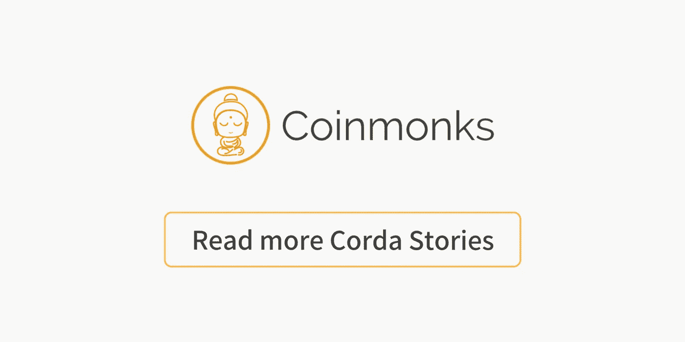

# 在没有货币和现金的情况下运行 Corda

> 原文：<https://medium.com/coinmonks/running-corda-without-currency-andcash-24a7c567f44a?source=collection_archive---------6----------------------->

由于 R3 Corda 声称它可以用于比金融界更广泛的用途，我决定尝试将它用于我自己的案例。

> “Corda 是一个分布式分类账平台，他们有一个非常清晰的思维方式:*确保你与你的交易伙伴保持完美的同步，这自然而明显地映射到现实世界的想法，并且任何人都可以理解*。”

他们的思维方式在[这里](https://www.corda.net/2017/02/corda-way-thinking/)有进一步的解释。

我的用例。我工作的公司要求我设计和创建一个系统，用来奖励我们最忠诚的客户。我们的顾问每为该客户工作一个小时，他/她就可以获得几分钟的免费创新咨询时间。目前，这意味着 IOT、人工智能、大数据、云战略，当然还有 DLT 的创新。

Corda 在他们的文档中提供了一个很好的[借据示例](https://docs.corda.net/tutorial-cordapp.html)，虽然我的用例与“我欠你的”非常相似，但它没有使用货币或现金。所以我开始研究他们的 API。经过一些研究，我发现了商品契约，它被描述为

> *商品合约代表某种商品的数量，在分布式分类账上进行跟踪。本合同的设计有意类似于* [*现金*](https://docs.corda.net/api/kotlin/corda/net.corda.finance.contracts.asset/-cash/index.html) *合同，应用相同的命令(发出、移动、退出)，区别在于底层商品的表现*

我敢说这是 100%匹配。

然后，该合同持有代表商品的“*类商品，作为等同于* [*货币*](http://docs.oracle.com/javase/8/docs/api/java/util/Currency.html)*类商品，再次与我的“创新合同纪要”100%匹配。在我的项目中实现这些类非常容易。*

*所以现在我正忙着完成服务器应用程序，其中也包括一个 [Spring Boot](https://projects.spring.io/spring-boot/) 服务器，之后我会写一个简单的[角度材质 UI](https://material.angular.io/) 。最终我想开源这个解决方案/例子。*

*现在，我惊喜地发现，在金融环境之外使用 Corda 是多么容易。*

*罗纳德·费尔梅雷*

*全栈开发者和 DLT 爱好者/专家@ [Heroes](https://heroes.nl/) 。*

*

Click to read more Corda Stories*