# 使用 AC inq/艾克蕾尔在一台设备上运行多个 lightning 节点，并在 lightning 网络上接收付款

> 原文：<https://medium.com/coinmonks/running-multiple-lightning-nodes-on-one-device-using-acinq-eclair-and-receiving-payments-on-the-a85157ca0109?source=collection_archive---------2----------------------->

闪电网络的挑战之一是在接收端创造流动性。大多数时候，发送支付似乎是无缝的，因为人们可以连接到他们想要支付的节点，但接收支付需要一个空的通道或有一些空间。这是一个有趣的问题，可以简单地通过与你自己创建空频道并在后者上接收付款来解决。解决方案是简单地在一个设备上托管两个 lightning 节点，并通过相应的通道为网络创造流动性和更好的连接性。在这篇文章中，我将创建一个分步指南，介绍如何在一个设备上创建多个节点，在这些节点之间创建通道，并通过空通道接收付款，而不是等待先花费并在现有通道中创建空间。这个指南是给 linux 用户的，如果人们感兴趣的话，我会接着写一个 windows 指南。

**要求:**

1.  下载、安装、同步比特币核心完整节点(bitcoin.org)—这将需要一段时间(数小时至数天，取决于您的下载速度)
2.  下载最新版本的 ACINQ/艾克蕾尔()最好用 GUI 版本([**eclair-node-GUI-0.2-beta 6–3 fc5 da 0 . jar**](https://github.com/ACINQ/eclair/releases/download/v0.2-beta6/eclair-node-gui-0.2-beta6-3fc5da0.jar)**)**

**第一步:**

找到你的比特币核心完整节点文件的位置(文件系统→tmp→比特币)，除非你在最初启动第一个节点时创建了自己的文件夹。

进入比特币文件夹后，打开 **bitcoin.conf** 并输入以下内容，这些是 mainnet 指令:

**rpcuser** 和 **rpcpassword** 可以是你喜欢的任何东西，你以后会需要它们的。

```
testnet=0
server=1
rpcuser=foo 
rpcpassword=bar 
txindex=1
zmqpubrawblock=tcp://127.0.0.1:29000
zmqpubrawtx=tcp://127.0.0.1:29000
addresstype=p2sh-segwit
```

这里是你应该看的视觉效果。

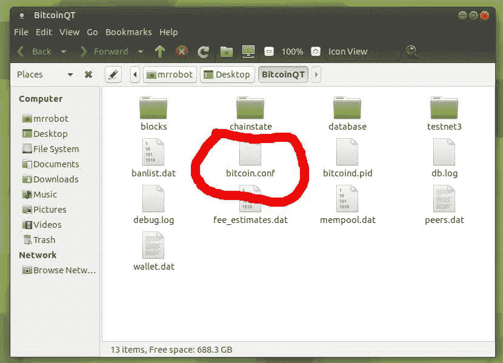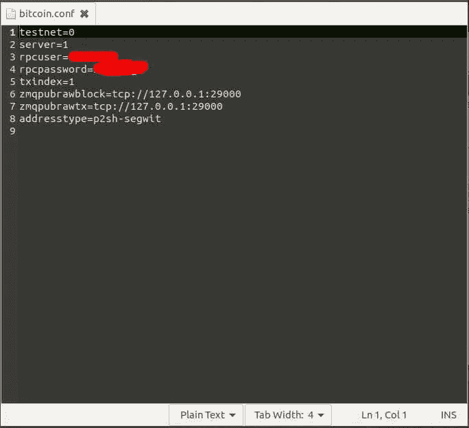

保存文件并退出。我们差不多完成了。

**第二步。**

确保你的比特币核心在运行，打开一个终端。打开下载:

```
cd Downloads
```

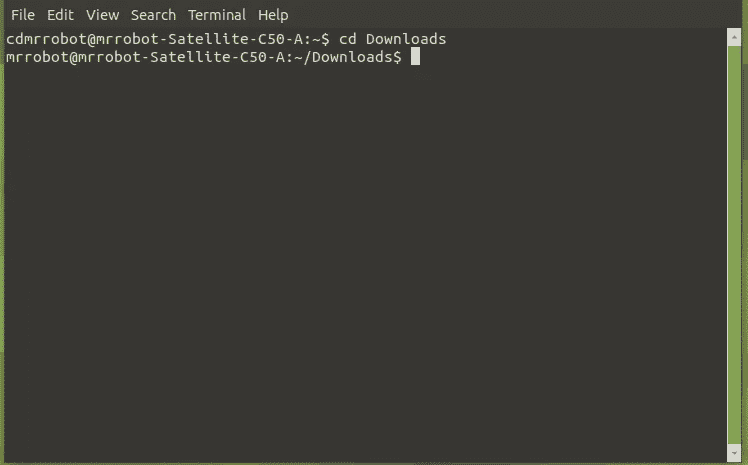

第一次打开你的闪电节点，它不会马上工作你会得到一个错误，这将在后面解释:

```
java -Declair.datadir=/**tmp/node1** -jar eclair-node-gui-0.2-beta6-3fc5da0.jar
```

注意 **tmp** 和**节点 1** 。记住这一点很重要。您可能需要等待一段时间，等待节点启动并向您显示错误。

这是你应该看到的。你看到这个的原因是因为你的闪电节点没有连接到你的比特币核心全节点:

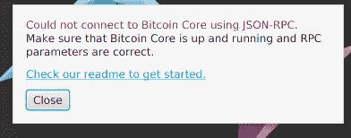

**第三步:**

还记得 **tmp** 和 **node1** 当我们运行运行艾克蕾尔的命令时，我们将打开这些文件夹，在大多数 linux 设备上文件系统→tmp →node1。当您之前运行该命令时，它会为您创建该文件夹。

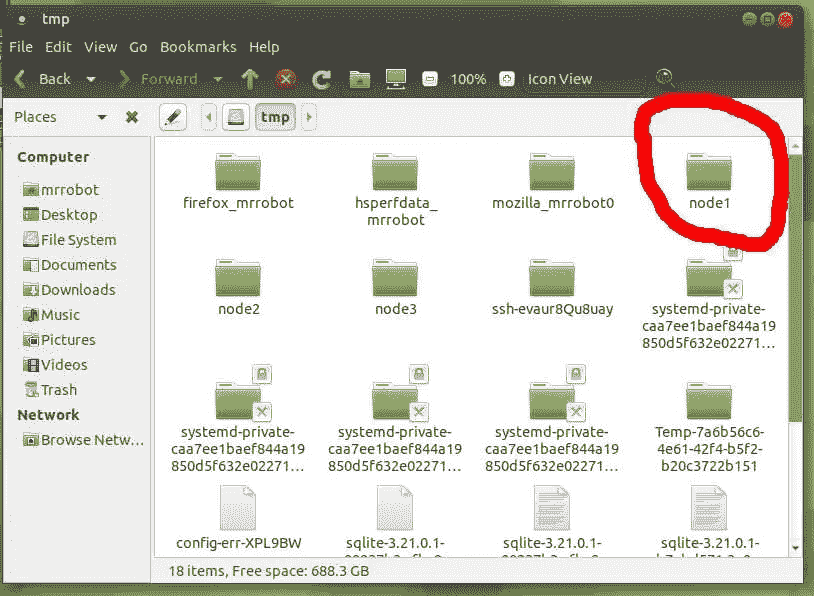

一旦你进入那个文件夹，右击并创建一个空文件，命名为 **eclair.conf**

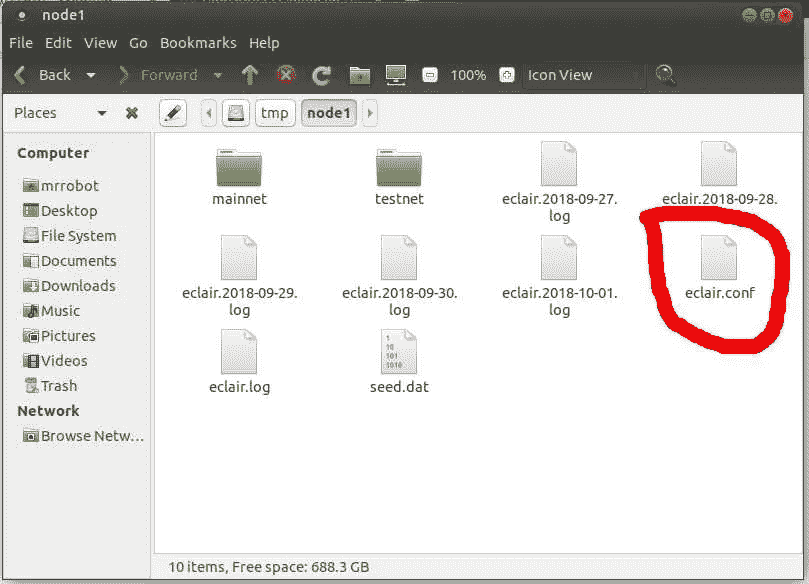

打开 **eclair.conf** 并输入以下内容:

```
eclair.chain=mainnet
eclair.server.port=48001
eclair.bitcoind.rpcport=8332
eclair.bitcoind.rpcuser="foo"
eclair.bitcoind.rpcpassword="bar"#the rpcuser and rpcpassword must be in "" and have to be the same as in your bitcoin.conf file that you edited earlier
```

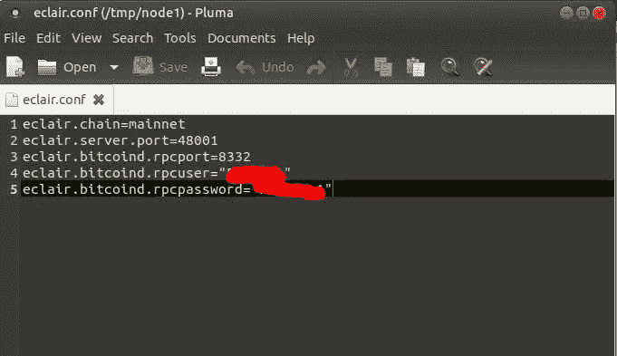

保存文件并退出。

**第四步:**

现在，您可以使用我们之前使用的相同命令来运行第一个节点了:

```
java -Declair.datadir=/tmp/node1 -jar eclair-node-gui-0.2-beta6-3fc5da0.jar
```

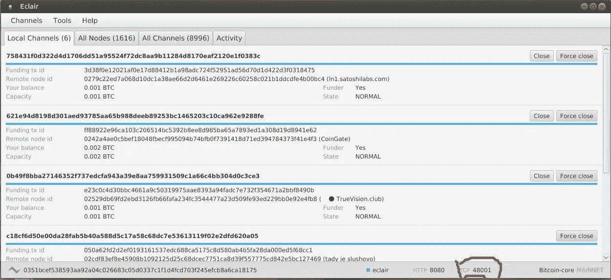

This is my first node, I already have channels open, you should just see a blank page. Notice the **tcp 48001**

**第五步:**

对于要运行的每个新节点，打开一个新的终端，使用我们之前运行第一个节点时使用的相同命令，但要更改一个小细节。

将**节点 1** 改为**节点 2** 。这将在您的 **tmp** 文件中创建一个新文件夹。如果您想要第三个和第四个节点，那么只需打开新的终端，运行带有**节点 3** 和**节点 4** 的命令，依此类推。

```
java -Declair.datadir=/tmp/**node2** -jar eclair-node-gui-0.2-beta6-3fc5da0.jarjava -Declair.datadir=/tmp/**node3** -jar eclair-node-gui-0.2-beta6-3fc5da0.jar#etc
```

对于您运行的每个命令，您都会得到以下错误:


在您的 **tmp** 文件中应该还有两个新文件夹:

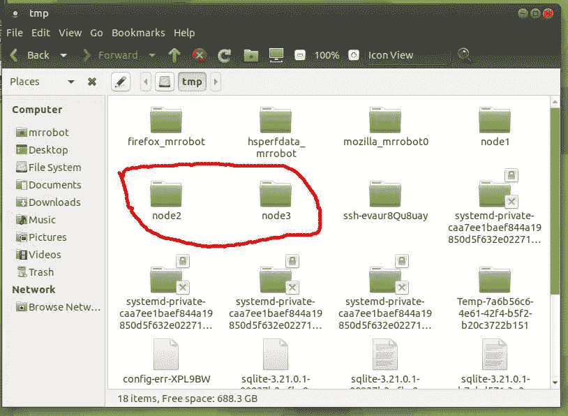

我们现在必须重复我们在**步骤 3** 中所做的，在每个新文件夹中创建 **eclair.conf** 文件。

**第六步:**

在第一个节点的 **eclair.conf** 文件中，我们输入以下内容:

```
eclair.chain=mainnet
eclair.server.port=48001 
eclair.bitcoind.rpcport=8332
eclair.bitcoind.rpcuser="foo"
eclair.bitcoind.rpcpassword="bar"#the rpcuser and rpcpassword must be in "" and have to be the same as in your bitcoin.conf file that you edited earlier
```

对于之后的每个节点，除了**eclair . server . port = 48001**之外，其他都保持不变

对于第二个节点，将该部分更改为**eclair . server . port = 48002**

对于第三个节点，将其更改为**eclair . server . port = 48003**

以及 48004、48005 等之后的每个新节点。

**第七步:**

此时，您的第一个节点应该已经在运行了。现在是启动第二个和第三个节点的时候了。只需为每个打开新的终端，并运行我们之前运行的命令:

```
#startnode2cd Downloadsjava -Declair.datadir=/**tmp/node2** -jar eclair-node-gui-0.2-beta6-3fc5da0.jar#startnode3cd Downloadsjava -Declair.datadir=/**tmp/node3** -jar eclair-node-gui-0.2-beta6-3fc5da0.jar#remember to run from the folder your eclair is in, for most people it should be the Downloads folder unless you installed it somewhere else
```

完成了。

**结论**

我的第一个节点打开了六个通道，我从第一个节点到第二个节点打开了一个通道。如您所见，第二个节点的容量为 0.001BTC，但余额为 0。这是我在使用第一个节点和通道发送付款时可以接收付款的节点和通道。我还使用我的第一个节点创建了与其他更多连接的集线器的通道，以确保我的 txs 在找到路由时没有问题。

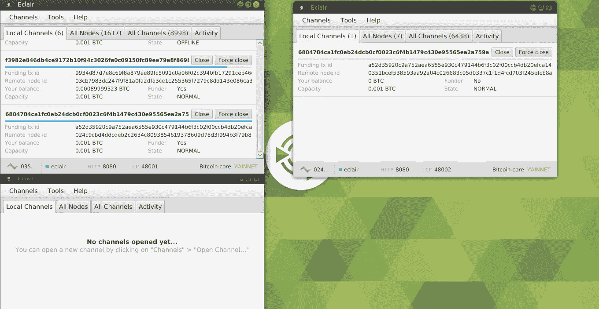

**收款:**

在这里，我收到了对我的第二个节点中的空通道的付款，这是我通过从我的第一个节点打开一个通道而创建的。

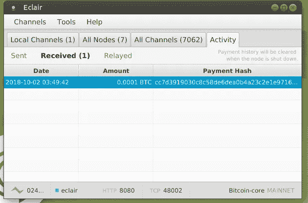

希望这个指南能帮助每个人，尤其是在收款端，创建应用程序和路由支付。如果我有任何错误，请评论，以便我可以纠正他们。

https://github.com/ACINQ/eclair/blob/master/README.md 的 a cinq/艾克蕾尔指南和命令:

在推特上关注我更多比特币相关的事情:【https://twitter.com/cvpitvlist T2

如果您觉得本指南有帮助，请随时提示 BTC:3 q 7 umf 6 qswjfmhft 7 imgfuoy 1 ypvqqnqkt

> [在您的收件箱中直接获得最佳软件交易](https://coincodecap.com/?utm_source=coinmonks)

[](https://coincodecap.com/?utm_source=coinmonks)