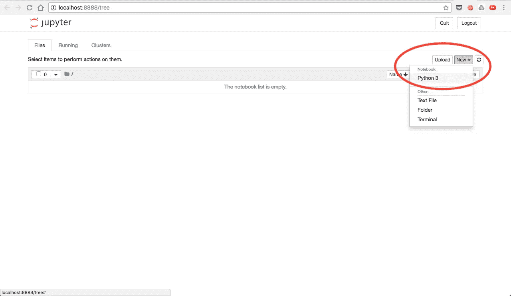
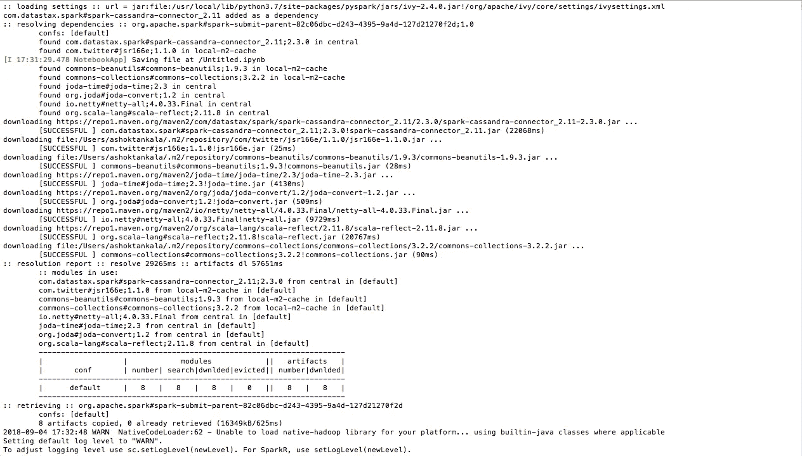
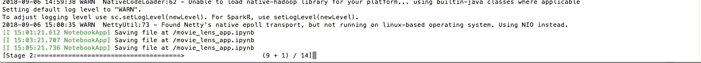

# 在 Jupyter 笔记本中使用 spark-cassandra-connector 运行 PySpark 和 Cassandra

> 原文：<https://medium.com/coinmonks/running-pyspark-with-cassandra-using-spark-cassandra-connector-in-jupyter-notebook-9f1dc45e8dc9?source=collection_archive---------0----------------------->


当我们对 DB Cassandra 集群中的大数据进行操作时，我们面临着几个内存不足的问题。所以我们决定最好使用 Spark 来解决这个问题。

对我们来说，这是一个艰难而有趣的旅程，因为我们作为一个团队做出了一个决定，那就是我们希望在我们的后端项目中最多使用两种语言，即 Node.js 和 Python。据我们所说，这两个工具是解决这个项目问题的合适工具。因为所有的数据收集和转换问题都将由 Node.js 轻松处理，所有其他东西，如大数据操作、人工智能/机器学习问题都将使用 Python 解决。你可能会奇怪，在多语言微服务架构的时代，我们为什么要设置这种限制。

使用多种语言工作很有趣，我曾经是一名 Java 开发人员，后来根据项目要求转到 Node.js，然后转到 Python，这在构建时也很有意义，但很难维护它们或找到懂多种语言的合适人员，或者有时招聘一名精通某种语言的开发人员来维护一个模块是没有意义的。

由于多语言编程，许多团队或公司都面临着问题。他们中的几个人也表达了他们的担忧。

一旦我开始在 PySpark 上工作，一切都很顺利，直到我想到使用 Cassandra。由于我使用了几个与 **PySpark** 相关的例子和几个与 **Scala** 相关的例子，所以可用的文档或例子非常少。用这些我开始了我的旅程。

如果你没有安装 PySpark & Jupyter，你可以参考[我以前的文章](/@ashok.tankala/run-your-first-spark-program-using-pyspark-and-jupyter-notebook-3b1281765169)。不要浪费太多时间，让我们把手弄脏。

我们需要一些好的数据来研究它。所以，我为此选择[电影镜头数据](http://grouplens.org/datasets/movielens/)。你可以在[这里](https://grouplens.org/datasets/movielens/latest/)获得最新数据。我选择 ml-latest.zip 而不是 ml-latest-small.zip，这样我们就可以处理相当大的数据。

让我们首先将这些数据加载到 Cassandra 数据库中。打开您的 cqlsh shell。为此创建一个密钥空间。我创建了 movie_lens 键空间，并开始使用下面的命令。

```
CREATE KEYSPACE movie_lens WITH replication = {'class': 'SimpleStrategy', 'replication_factor': 1};use movie_lens;
```

然后，我用下面的命令创建了电影和评级表。

```
CREATE TABLE movies(movie_id int PRIMARY KEY, title text, genres text);CREATE TABLE ratings(user_id int, movie_id int, rating double, timestamp bigint, primary key((user_id), movie_id));
```

使用以下命令加载数据。

```
COPY movies(movie_id, title, genres) FROM '../ml-latest/movies.csv' WITH HEADER = true;COPY ratings(user_id, movie_id, rating, timestamp) FROM '../ml-latest/ratings.csv' WITH HEADER = true;
```

然后你会得到这样的输出

```
cqlsh:movie_lens> COPY movies(movie_id, title, genres) FROM '../ml-latest/movies.csv' WITH HEADER = true;
Reading options from the command line: {'header': 'true'}
Using 3 child processesStarting copy of movie_lens.movies with columns [movie_id, title, genres].
Processed: 45843 rows; Rate:   12664 rows/s; Avg. rate:   11930 rows/s
45843 rows imported from 1 files in 3.843 seconds (0 skipped).cqlsh:movie_lens> COPY ratings(user_id, movie_id, rating, timestamp) FROM '../ml-latest/ratings.csv' WITH HEADER = true;
Reading options from the command line: {'header': 'true'}
Using 3 child processesStarting copy of movie_lens.ratings with columns [user_id, movie_id, rating, timestamp].
Processed: 26024289 rows; Rate:    9378 rows/s; Avg. rate:   22557 rows/s
26024289 rows imported from 1 files in 19 minutes and 13.714 seconds (0 skipped).
```

一切就绪。是时候做编码了。

使用下面的命令启动你的 **Jupyter 笔记本**。

```
jupyter notebook
```

创建新笔记本。



> 首先，我们需要设置一些参数或配置来确保 PySpark 连接到我们的 Cassandra 节点集群。

```
# Configuratins related to Cassandra connector & Cluster
import os
os.environ['PYSPARK_SUBMIT_ARGS'] = '--packages com.datastax.spark:spark-cassandra-connector_2.11:2.3.0 --conf spark.cassandra.connection.host=127.0.0.1 pyspark-shell'
```

> 这里我们说使用 spark-cassandra-connector 连接到我们的 cassandra 集群，它的主机名是 127.0.0.1。就是这样。例如，在 Cassandra 集群中有多个节点，那么在主机配置中，我们需要给出它们的所有 IP。举个例子，

```
# Configuratins related to Cassandra connector & Cluster
import os
os.environ['PYSPARK_SUBMIT_ARGS'] = '--packages com.datastax.spark:spark-cassandra-connector_2.11:2.3.0 --conf spark.cassandra.connection.host=192.168.0.123,192.168.0.124 pyspark-shell'
```

当你第一次运行它的时候，需要花一些时间，因为它需要下载 jar 并连接到我们的 Cassandra 集群。您将得到这样的输出



> 然后我们需要创建 Spark 上下文。

```
# Creating PySpark Context
from pyspark import SparkContext
sc = SparkContext("local", "movie lens app")
```

> 在这之后，我们需要创建 SQL 上下文来对我们的数据进行 SQL 操作。

```
# Creating PySpark SQL Context
from pyspark.sql import SQLContext
sqlContext = SQLContext(sc)
```

> 我们将在多个表上工作，所以需要它们的数据框来保存一些代码行创建了一个函数，它为一个表加载数据框，包括给定的键空间

```
# Loads and returns data frame for a table including key space given
def load_and_get_table_df(keys_space_name, table_name):
    table_df = sqlContext.read\
        .format("org.apache.spark.sql.cassandra")\
        .options(table=table_name, keyspace=keys_space_name)\
        .load()
    return table_df
```

> 让我们加载电影，收视率数据框。

```
# Loading movies & ratings table data frames
movies = load_and_get_table_df("movie_lens", "movies")
ratings = load_and_get_table_df("movie_lens", "ratings")
```

> 现在，我们来了解一下数据。首先，让我们看看电影数据是什么样子的。

```
# First 20 rows of movies table
movies.show()
```

然后你会得到这样的数据

```
+--------+--------------------+--------------------+
|movie_id|              genres|               title|
+--------+--------------------+--------------------+
|  166048|       Drama|Romance|Happy Birthday (2...|
|   99572|               Drama|     Cornelis (2010)|
|   96638|         Documentary|    Klitschko (2011)|
|  146455|       Drama|Fantasy|      Hallway (2015)|
|   87258|Crime|Drama|Film-...|    The Thief (1952)|
|   69227|     Children|Comedy|Ernest Rides Agai...|
|     678|      Drama|Thriller|Some Folks Call I...|
|  154214|    Children|Fantasy|Barbara the Fair ...|
|   71675|              Comedy|    Hiroshima (2009)|
|  139918|     Documentary|War|The Ghost Army (2...|
|  164753|             Romance|Anything for Love...|
|  168310|  (no genres listed)|Μαριχουάνα Στοπ !...|
|   93952|     Horror|Thriller|Silent House, The...|
|  118204|Adventure|Documen...|     McConkey (2013)|
|  168678|              Comedy|     Devolved (2010)|
|  111852|         Documentary|Generation Iron (...|
|   43333|       Drama|Romance|        Water (2005)|
|  106026|      Comedy|Musical|Folies Bergere de...|
|  105926|              Horror| Barrio Tales (2012)|
|   36477|Comedy|Drama|Romance|  Baxter, The (2005)|
+--------+--------------------+--------------------+
only showing top 20 rows
```

> 然后让我们看看收视率数据是什么样的。

```
# First 20 rows of ratings table
ratings.show()
```

然后你会得到这样的数据

```
+-------+--------+------+----------+
|user_id|movie_id|rating| timestamp|
+-------+--------+------+----------+
| 117752|     340|   5.0|1004221564|
| 117752|    1275|   5.0|1004221564|
| 117752|    1760|   5.0|1004221564|
| 117752|    2028|   5.0|1004221564|
| 117752|    2268|   5.0|1004221564|
| 117752|    2643|   5.0|1004221564|
| 117752|    3204|   5.0|1004221564|
| 117752|    3677|   5.0|1004221564|
| 117752|    4143|   4.0|1004221564|
| 117752|    4565|   5.0|1004221564|
| 122430|       1|   4.0| 832302134|
| 122430|      25|   5.0| 850195697|
| 122430|      34|   4.0| 832302184|
| 122430|      50|   5.0| 832302207|
| 122430|      52|   3.0| 850195768|
| 122430|      69|   4.0| 832303477|
| 122430|     110|   3.0| 832302172|
| 122430|     111|   3.0| 832302229|
| 122430|     122|   4.0| 832302922|
| 122430|     145|   3.0| 832302767|
+-------+--------+------+----------+
only showing top 20 rows
```

> 现在，想看看排名前 20 的评论者给出的评分吗

```
# Top 20 reviewers in terms of number of ratings given
ratings.groupBy("user_id").count().orderBy('count', ascending=False).show()
```

得到这样的数据

```
+-------+-----+
|user_id|count|
+-------+-----+
|  45811|18276|
|   8659| 9279|
| 270123| 7638|
| 179792| 7515|
| 228291| 7410|
| 243443| 6320|
|  98415| 6094|
| 229879| 6024|
|  98787| 5814|
| 172224| 5701|
| 230417| 5619|
|  70648| 5356|
| 194690| 5206|
| 107720| 5169|
|  24025| 4946|
| 165352| 4921|
| 101276| 4834|
| 243331| 4834|
|  74275| 4815|
|  41190| 4785|
+-------+-----+
only showing top 20 rows
```

在上面的查询运行和数据处理的时候，你会在命令提示符下看到你从哪里启动了 **Jupyter** Notebook。



这意味着它从 DB(Cassandra Cluster)流式传输数据，并在其上进行操作。

在这里，我想选择 2 个用户，并想看看他们有多少相似的电影评级，以及他们中的任何一个人审查了多少独特的电影。

> 为了做到这一点，让我们看看评级数据框架的模式是什么样子的。

```
#Schema of ratings data frame
ratings.printSchema()
```

> 现在让我们选择每个用户评价的电影。

```
# Selecting 2 users rated movies
firstUserMovies = ratings.where(ratings["user_id"] == 45811).select("movie_id")
secondUserMovies = ratings.where(ratings["user_id"] == 98415).select("movie_id")
```

此时 spark 不查询任何数据。Spark 以一种懒惰的方式工作，除非你想做一些与数据相关的事情，否则只有它会得到数据。对于每个操作，它都将获取数据，为了避免这种情况，我们可以缓存它。每当它第一次获得数据时，它只是缓存它，并在下次从缓存中使用它，而不是再次从数据库中获取。

> 让我们缓存数据帧。

```
# Caching the data frames of users
firstUserMovies = firstUserMovies.cache()
secondUserMovies = secondUserMovies.cache()
```

> 现在，一切都准备好了，我们需要让两个用户评论一些电影

```
# 20 common movies both users reviewed
firstUserMovies.intersect(secondUserMovies).show()
```

它会给出这样的数据

```
+--------+
|movie_id|
+--------+
|     471|
|    1088|
|    1238|
|    1342|
|    1580|
|    1645|
|    1959|
|    2122|
|    2366|
|    2866|
|    3175|
|    3918|
|    5300|
|    6357|
|    6466|
|    6620|
|    6658|
|    7253|
|    7982|
|    8638|
+--------+
only showing top 20 rows
```

我想核实一下，或者只是确认一下我做得对不对。所以，选一部电影，检查一下。在这种情况下，我选择 id 为 3918 的电影，并检查。

> 检查第一个用户是否审阅过

```
# Verifying wether first user reviewed these movies or not
firstUserMovies.where(firstUserMovies["movie_id"] == 3918).show()
```

输出:

```
+--------+
|movie_id|
+--------+
|    3918|
+--------+
```

> 要检查第二个用户是否检查过

```
# Verifying wether second user reviewed these movies or not
secondUserMovies.where(secondUserMovies["movie_id"] == 3918).show()
```

输出:

```
+--------+
|movie_id|
+--------+
|    3918|
+--------+
```

> 为了知道两个用户评论的电影数量

```
firstUserMovies.intersect(secondUserMovies).count()
```

输出:

```
4488
```

> 知道他们总共评论了多少独特的电影

```
# In total How many unique movies they reviewed
firstUserMovies.union(secondUserMovies).distinct().count()
```

输出:

```
19882
```

> 一旦你不希望数据被保留在缓存中，那么

```
# Removing data frame from Cache
firstUserMovies.unpersist()
secondUserMovies.unpersist()
```

> 如果您想关闭 PySpark 上下文，那么

```
# Shutdowning PySpark Context
sc.stop()
```

你可以在[我的 GitHub 库](https://github.com/tankala/spark-examples)找到这个 Jupyter 笔记本。

和平。快乐编码。
[这里看我的原创文章。](https://blog.tanka.la/2018/09/06/running-pyspark-with-cassandra-using-spark-cassandra-connector-in-jupyter-notebook/)

> 一些好的参考资料:

[](https://github.com/datastax/spark-cassandra-connector/blob/master/doc/15_python.md) [## datastax/spark-Cassandra-连接器

### DataStax 火花卡珊德拉连接器。创建一个帐户，为 datastax/spark-Cassandra-connector 开发做贡献…

github.com](https://github.com/datastax/spark-cassandra-connector/blob/master/doc/15_python.md) [](/@amirziai/running-pyspark-with-cassandra-in-jupyter-2bf5e95c319) [## 和卡桑德拉一起在朱庇特经营 PySpark

### Apache Cassandra 是一个开源的分布式数据库系统。使用 Python 与 Cassandra 进行交互…

medium.com](/@amirziai/running-pyspark-with-cassandra-in-jupyter-2bf5e95c319) 

> [在您的收件箱中直接获得最佳软件交易](https://coincodecap.com/?utm_source=coinmonks)

[](https://coincodecap.com/?utm_source=coinmonks)