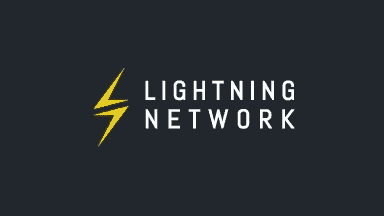

# 在乌姆贝尔上运行你的闪电节点

> 原文：<https://medium.com/coinmonks/running-your-lightning-node-on-umbrel-7758719abbfb?source=collection_archive---------1----------------------->

希望你以前读过我的博客“如何运行比特币和闪电节点”(链接在底部)，现在你的 Umbrel 节点已经启动并运行了。如果是这样，你和我一样，你是说

> “好吧那太好了！但是现在我该怎么办？”

好了，在让你的比特币和闪电网络节点启动并运行之后，让我们在你的闪电网络上创建一个通道。