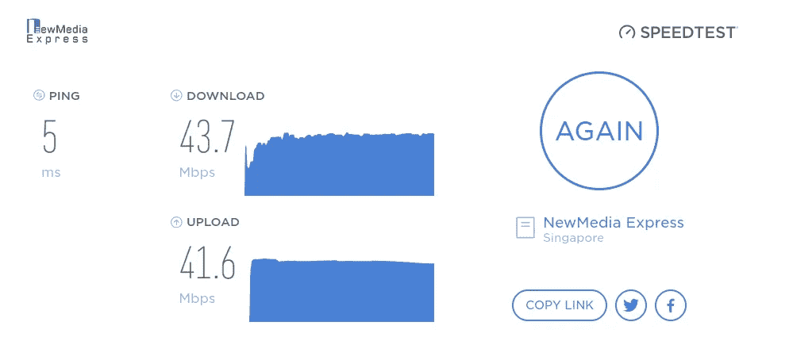
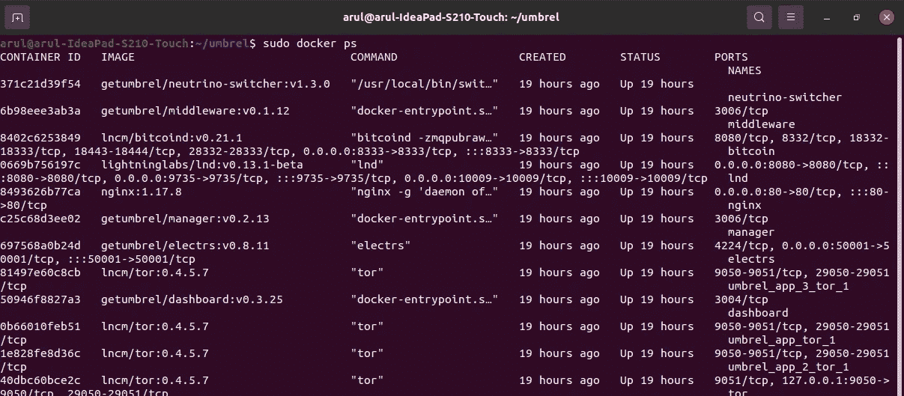
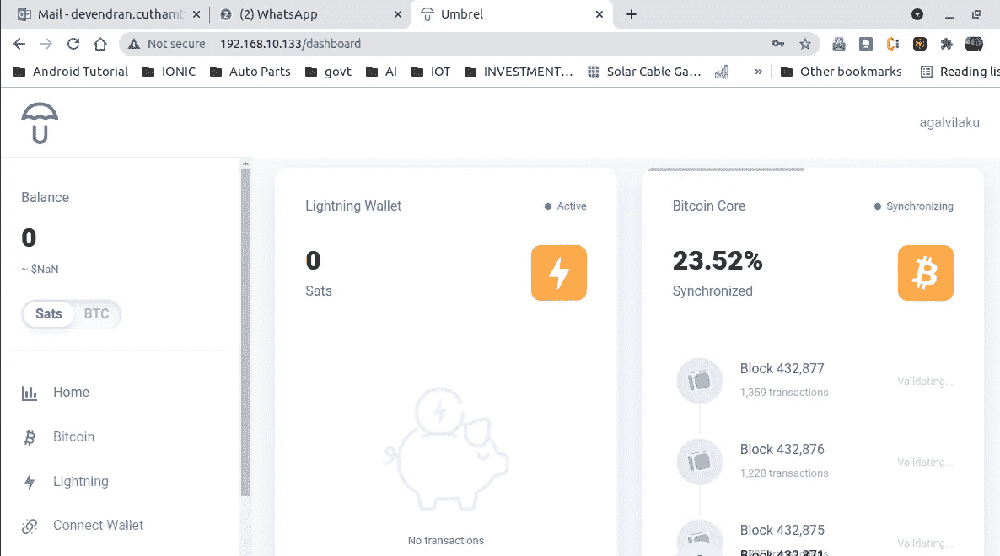

# 运行自己的比特币节点。

> 原文：<https://medium.com/coinmonks/running-your-own-bitcoin-node-6590935f6790?source=collection_archive---------7----------------------->

上周，当[杰克·多西](https://medium.com/u/ab69c5472679?source=post_page-----6590935f6790--------------------------------)提到他们通过@twitter 成功地通过 Lighting Network 完成了一笔比特币交易时，人们对 Lighting Network 产生了浓厚的兴趣。专家们不看好比特币，认为它不可能成为大众通用的交易媒介，因为它每秒的交易量有限。即 7/秒。但是，照明网络和其他类似的区块链项目挑战这些神话，并表示这是可能的。

有什么比拥有自己的比特币节点，并创建发送/接收比特币的通道更好的方式？这导致在运行 Ubuntu 20.04 的九年旧笔记本电脑上安装了 Umbrel node。虽然，Umbrel 建议在装有 Umbrel 操作系统(ubuntu x64)的 Raspberry pi 上运行他们的软件包，但我们仍然可以把它安装在 ubuntu 操作系统上并尝试一下。

***免责声明:在撰写本文时，乌姆贝尔仍处于测试阶段，用他们自己的话说“乌姆贝尔仍处于测试开发阶段，不应被视为安全。*** [***阅读我们对现今存在的安全权衡***](https://github.com/getumbrel/umbrel/blob/master/SECURITY.md) ***的综述所以，不要把你所有的比特币都转移到 node，而是使用一个月或更长时间来熟悉它，一旦你适应了，再决定怎么处理它。***

好了，不再赘述，让我们直接进入先决条件和安装步骤。

# 推荐的先决条件:

1.  基本的 ubuntu 浏览和打字技能。
2.  任何像样的旧笔记本电脑或台式机。我用的是英特尔 i3，4300 几乎 10 岁的笔记本电脑。
3.  内存 4 gb。但是，我的笔记本电脑有 12 GB，可以运行很多其他的东西。
4.  硬盘:至少，1 TB。1TB 的原因是因为在开始验证任何更新的交易之前，所有的比特币区块链交易都将被下载并在本地验证。从字面上看，它将下载 2009 年以来的所有交易。最好购买一个专门用于此用途的外置硬盘。
5.  互联网连接:良好的互联网连接(不间断)，最好通过 RJ45 连接到局域网。

# **安装:**

1.  进入 Ubuntu 终端或者按 ***Ctrl+Alt+T***
2.  创建一个你选择的目录，在我的例子中，我把它命名为 um brel
    ***mkdir um brel***
3.  切换到新创建的目录作为工作目录。
    ***CD umbrel***
4.  通过 curl 从 [Umbrel](https://getumbrel.com/#start) 下载安装包。当您运行以下命令时，运行 Umbrel 所需的所有软件包都将下载到该文件夹中。在执行以下命令之前，确保您已经进入正确的新创建的文件夹是很重要的。

    ***curl-L***[***https://github.com/getumbrel/umbrel/archive/v0.4.2.tar.gz***](https://github.com/getumbrel/umbrel/archive/v0.4.2.tar.gz)***| tar-xz—strip-components = 1***
5.  安装 Docker。如果你已经有 Docker，跳过第 5 步到第 9 步，直接进入第 10 步。在我的情况下，我没有 Docker 在我安装的机器上。所以继续安装 Docker。

    先更新你的 ubuntu 包…

    ***sudo apt-get 更新***

    安装 Docker 及其他依赖

    **sudo apt 安装 Docker . io
    sudo apt-get install-y fs watch
    sudo apt-get install jq**
6.  通过运行下面的命令来验证 Docker 的安装，这将给出已安装的 Docker 版本。

    ***docker —版本***
7.  下载 Docker 编写安装程序。
    ***sudo curl-L "***[***https://github . com/docker/compose/releases/download/1 . 27 . 4/docker-compose-$(uname***](https://github.com/docker/compose/releases/download/1.27.4/docker-compose-$(uname)***-s)-$(uname-m)"-o/usr/local/bin/docker-compose***
8.  授予 docker 合成足够的权限来执行 docker 映像。
    ***sudo chmod+x/usr/local/bin/docker-compose***
9.  验证安装

***docker-compose —版本***

10.我们已经准备好运行 umbrel 安装程序。运行下面的命令，耐心等待。安装完成后，它会自动向您显示访问本地安装的 Umbrel 节点的 url。

***须藤。/scripts/start***

11.验证 Umbrel docker 图像状态。运行以下命令来检查哪些 Umbrel docker 容器正在运行以及在哪个端口。

***sudo docker ps***

12.启动浏览器并键入您的主机名或键入 127.0.0.1

13.用您喜欢的用户名和密码注册到 Umbrel。

不要忘记写下种子短语来恢复您的节点，之后您的结果将如下…

等到你的比特币核心同步完成。这可能需要几个小时到几天，取决于您的计算机和互联网速度。

快乐的等待，我们将在下一篇文章中再次见面，讨论如何设置闪电网络钱包，打开频道，连接到另一个钱包等。

PS:我不是专家，只是个初学者。

**免责声明**:本文旨在探索比特币和区块链的技术前景。任何手段都不应被视为投资建议。

> 加入 Coinmonks [电报频道](https://t.me/coincodecap)和 [Youtube 频道](https://www.youtube.com/c/coinmonks/videos)了解加密交易和投资

## 也阅读

 [## 最佳加密交易所| 2021 年十大加密货币交易所

### ICON _ PLACEHOLDEREstimated 预计阅读时间:28 分钟加密货币交易所的加密交易需要知识…

blog.coincodecap.com](https://blog.coincodecap.com/crypto-exchange)  [## 2021 年 10 大最佳加密贷款平台| CoinCodeCap

### 当谈到加密货币贷款时，大量因素等同于良好的收入状况。此外，借款的一部分…

blog.coincodecap.com](https://blog.coincodecap.com/crypto-lending)  [## 2021 年最佳免费加密交易机器人

### 2021 年币安、比特币基地、库币和其他密码交易所的最佳密码交易机器人。四进制，位间隙…

medium.com](/coinmonks/crypto-trading-bot-c2ffce8acb2a)  [## 最佳 4 个加密交易信号电报通道

### 这是乏味的找到正确的加密交易信号提供商。因此，在本文中，我们将讨论最好的…

medium.com](/coinmonks/best-crypto-signals-telegram-5785cdbc4b2b)  [## BlockFi 评论 2021:利弊和利率| CoinCodeCap

### 今天，我们提出了一个全面的 BlockFi 评论，这是一个成立于 2017 年的加密贷款平台，拥有其…

blog.coincodecap.com](https://blog.coincodecap.com/blockfi-review)  [## 如何在印度购买比特币？2021 年购买比特币的 7 款最佳应用[手机版]

### 如何使用移动应用程序购买比特币印度

medium.com](/coinmonks/buy-bitcoin-in-india-feb50ddfef94)  [## 加密税务软件——五大最佳比特币税务计算器[2021]

### 不管你是刚接触加密还是已经在这个领域呆了一段时间，你都需要交税。

medium.com](/coinmonks/best-crypto-tax-tool-for-my-money-72d4b430816b)  [## 存储比特币的最佳加密硬件钱包[2021] | CoinCodeCap

### 保管您的数字资产很容易，但找到正确的存储方式却是一项繁琐的任务。在线钱包有一个风险…

blog.coincodecap.com](https://blog.coincodecap.com/best-hardware-wallet-bitcoin)