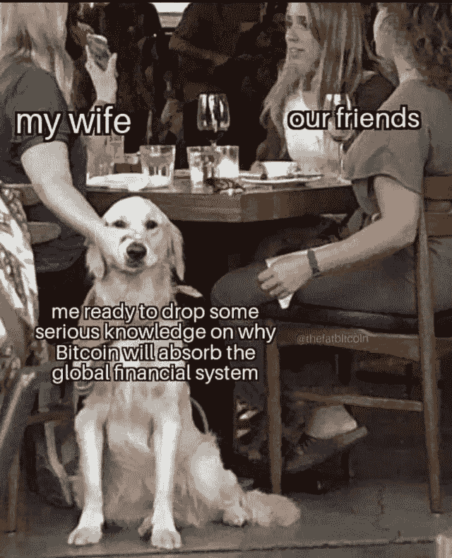
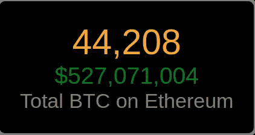

# Samson Mow & Vitalik Buterin /以太坊# supply gate/$ 60 亿美元锁定在 DeFi …

> 原文：<https://medium.com/coinmonks/samson-mow-vitalik-buterin-ethereum-supplygate-6-billion-locked-in-defi-2de15ea9ad23?source=collection_archive---------3----------------------->

## 一百万韩国人获得区块链驾照，Steem vs Tron，比特币突破 12K 美元…

[Source](https://www.reddit.com/r/Bitcoin/comments/hxfxv6/global_financial_system_and_bitcoins/)

了解一下[比特币美元成本平均](https://blog.coincodecap.com/stories/bitcoin-dollar-cost-averaging)到[roundly x](https://www.roundlyx.com/accounts/signup/?utm_source=coincodecapemail&utm_medium=email&utm_campaign=coincodecapemail)**30 秒**。****

**别忘了使用“CoinCodeCap**”**促销代码在 BTC 获得 4 美元。**

****

## **最新消息📰**

*   **一百万韩国人现在拥有[区块链驾照](https://cointelegraph.com/news/one-million-south-koreans-now-have-blockchain-drivers-licenses)**
*   **元掩码[更改](https://decrypt.co/38879/metamask-changes-will-boost-performance-but-could-break-dapps)将提升性能，但可能会破坏 dapps**
*   **BitMEX 宣布[用户验证](https://blog.bitmex.com/announcing-the-bitmex-user-verification-programme/)计划**
*   **随着 DeFi 热潮的持续，比特币被令牌化的速度比它们被开采的速度还要快**
*   **Steem vs Tron :对加密货币帝国的反抗**
*   **ETH2 [Medalla Testnet](https://hackmd.io/@benjaminion/eth2_news/https%3A%2F%2Fhackmd.io%2F%40benjaminion%2Fwnie2_200817) 死了吗？**
*   **包装比特币的竞争对手 renBTC 在不到一周的时间里上涨了 200%,该公司将比特币的价值押在了以太坊区块链上**
*   **“一文不值”的 DeFi token [YFI 的价格](https://decrypt.co/39093/completely-valueless-defi-token-yfis-price-breaks-11000)突破 11000 美元**
*   **JP 摩根， [ConsenSys，& Quorum 的](/coinmonks/jp-morgan-consensys-quorums-future-mexico-s-booming-blockchain-market-doctor-who-enters-300f5756bec8)未来/墨西哥蓬勃发展的区块链市场**

## **播客💽**

*   **为什么 ETH 供应辩论是“愚蠢的”——Andreas Antonopoulos**
*   **萨姆森·莫&维塔利克·布特林**
*   **贝宝、银行和现实生活[基础设施反转](https://letstalkbitcoin.com/blog/post/lets-talk-bitcoin-441-paypal-banks-and-real-life-infrastructure-inversion)**

## **好的读物📑**

*   **区块链验证的[理念](https://vitalik.ca/general/2020/08/17/philosophy.html)**
*   **在定义[前端](/blockchannel/on-defi-frontends-3c87c3661354)上**
*   **去中心化对以太坊意味着什么**
*   **[三个民族](https://bankless.substack.com/p/the-three-nation-problem)的问题**
*   **比特币是[世界上最安全的储备资产](https://blog.knoxcustody.com/bitcoin-safest-reserve-asset/)吗？**
*   **[EPNS](/ethereum-push-notification-service/a-beginners-guide-to-epns-channels-755cc18bff81) 频道初学者指南**
*   **秘密原生保险**
*   **高产农业可以拯救世界**
*   **点对点[能源交易](/coinmonks/integrating-physical-devices-with-iota-peer-to-peer-energy-trading-with-iota-part-2-6c8d481662b0)与 IOTA**
*   **[y 资产](/@monetsupply/ycassets-stable-rates-for-compound-70c033493997):复利稳定率**
*   **分散化的金融，山药的惨败和通往不可持续发展的道路**
*   **在 c-lightning 中实施[多部分支付](/blockstream/all-paths-lead-to-your-destination-bc8f1a76c53d)**
*   **探索流动性挖掘的[设计空间](https://multicoin.capital/2020/08/13/exploring-the-design-space-of-liquidity-mining/?mc_cid=9667c5c493)**
*   **什么是[流动性](/coinmonks/what-is-liquidity-why-does-it-matter-52bcf3c9e2d2) &为什么很重要？**
*   **[CRV，山药，发行费用&游戏](https://doseofdefi.substack.com/p/crv-yam-distribution-costs-and-games)**
*   **工程师的零知识证明**
*   **以太坊[默克尔帕特丽夏](/@chiqing/merkle-patricia-trie-explained-ae3ac6a7e123)特里解释道**
*   **[金钱重塑](https://www.coindesk.com/money-reimagined-how-a-dangerous-idea-could-work):一个危险的想法是如何运作的**
*   **[实值数组](/coinmonks/value-arrays-in-solidity-32ca65135d5b)**
*   **[设置以太坊 2.0 验证器](/coinmonks/how-to-setup-ethereum-2-0-validator-node-lighthouse-meddala-goerli-4f0b85d5c8f)节点，带有 goer Li Meddala 上的灯塔**
*   **[洛伦兹](https://serokell.io/blog/lorentz-haskell-newtypes):用 Haskell Newtypes 实现正确性**
*   **[以以太坊开发者的心态走近 Tezos](/chain-of-insight/approaching-tezos-from-an-ethereum-developers-mindset-our-journey-8bc48b27456e)**
*   **[在纯迈克尔逊中实现 FA1.2 令牌](/@claudebarde/implementing-a-fa1-2-token-in-pure-michelson-part-1-b15e63e0c9b3)**
*   **[最好的区块链分析工具及其工作原理？](https://blog.bitquery.io/best-blockchain-analysis-tools-and-software)**

## **多方面的**

*   **以太坊的 zkRollup 上的一个线程**
*   **被安德里亚斯揭穿的**
*   **使用 Qri CLI 创建、推送和查询社区数据集**
*   **查看[IPFS Java 部署](https://hack.ethglobal.co/showcase/ipfs-deploy-for-java-recy6OKUfckknpvas)**
*   **演示—et h1—eth 2 合并的状态**
*   **[使用基线协议采访可口可乐装瓶商](https://www.youtube.com/watch?v=7nQl3Nqr1JI&feature=youtu.be&t=496)**
*   **[Aave v2](/aave/aave-v2-the-seamless-finance-d52075d97a70) : 1 交易还款、Aave 治理、固定利率存款、更便宜的天然气等**

## **照片说明了一切📷**

****

**[Source](https://btconethereum.com/)**

## **在 Coinmonks 上发布**

**如果你喜欢在 crypto/区块链空间上写教育文章，并且想在 Coinmonks 出版物上发表。只需在***【gaurav@coincodecap.com】****或者 DM 我**[***推特***](https://twitter.com/coinmonks)***

> ****“如果你喜欢读***[*你也可以捐我们*](/coinmonks/monks-need-your-help-7440418d67ec) *。******

> *****[直接在您的收件箱中获得最佳软件交易](https://coincodecap.com?utm_source=coinmonks)*****

**********