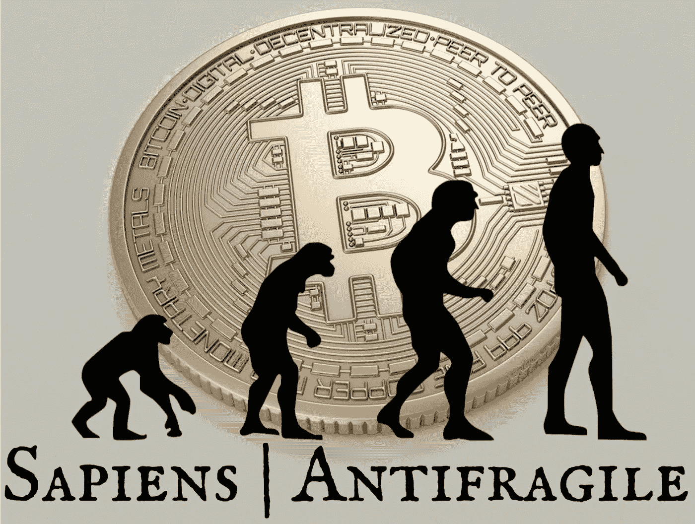

# 智人|抗脆弱性:货币和比特币抗脆弱性简史

> 原文：<https://medium.com/coinmonks/sapiens-antifragile-a-brief-history-of-money-bitcoins-antifragility-14d2edc489bc?source=collection_archive---------2----------------------->

## 比特币已经走上了成为有史以来最脆弱的货币系统的道路

Overlay by [ConexaoCabeca](https://pixabay.com/illustrations/evolution-human-evolution-2780651/), pixabay.com / Photo by [Moose Photos](https://www.pexels.com/@moose-photos-170195), pexels.com

当 Hernán Cortés 和他的人在 500 年前到达今天的墨西哥时，有两个因素使黄金成为珍贵的财富:

*   其稀缺性