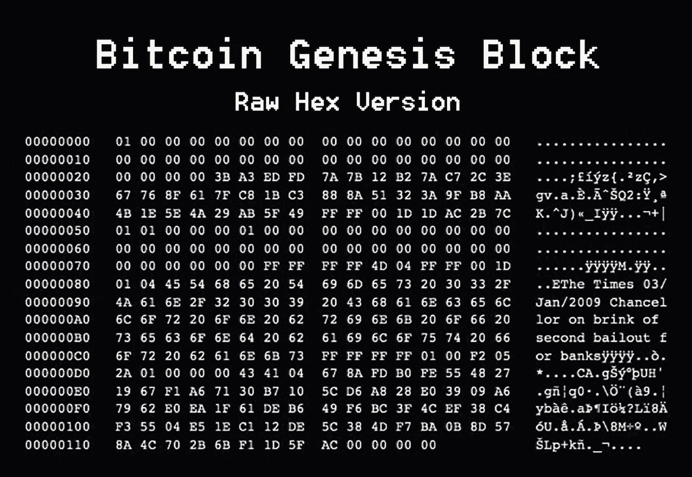
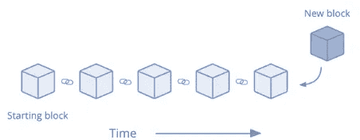
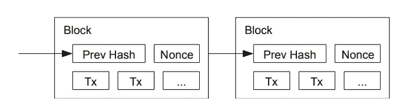
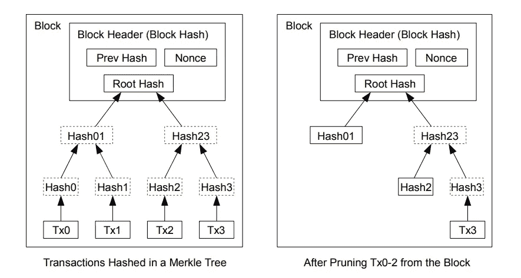
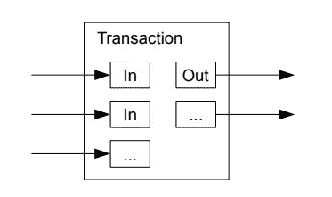
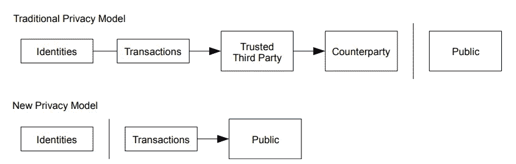

# 中本聪的《傻瓜比特币白皮书》

> 原文：<https://medium.com/coinmonks/satoshi-nakamotos-bitcoin-whitepaper-for-dummies-c8cb89a382e9?source=collection_archive---------4----------------------->

我敢肯定，许多人甚至没有试图阅读 Satoshi 的白皮书。对吗？似乎太难了。对于任何研究比特币工作原理的人来说，中本聪的原始论文仍然值得一读。这就是为什么我决定将加密白皮书的圣杯改写成一篇更容易阅读的文章。如果你没有机会阅读[原始白皮书](https://bitcoin.org/bitcoin.pdf)。这是你的机会！

# 内容

比特币和区块链努力争取的理想状态是“使用电子货币的纯粹买方对卖方交易”。**没有任何第三者的干涉**。数字签名是该解决方案的一部分。以及由链状结构以完美的顺序约束的这些事务的日志。(见下图)这些交易一旦在特定块内确认，就不能更改。该块将始终保持原样。这个街区网络由进行大量计算的计算机控制。世界上任何人都可以加入这个过程。但是区块链需要最强的计算机能力来保持在 50%以下，以避免操纵。然而这是极不可能的。别担心。处理所有交易并将它们添加到区块链的计算机实际上是在“劳动”或“工作”。他们根据这种劳动或工作获得报酬。因此我们称之为**工作证明**方法。

# 定义问题

交易现在完全依赖于金融机构。他们充当可信的第三方。这个系统存在固有的弱点。100%不可逆交易是不可能的。由于交易**是**可逆的，信任的需求增加了。金融机构需要更多来自买家和卖家的信息，因为他们希望完全信任他们。不幸的是，一定比例的**欺诈被认为是不可避免的**。这些不确定因素可以被一个能够在买方和卖方之间进行交易而不需要第三方的系统所涵盖。如果这些交易永远不能改变，防止欺诈。这实际上是比特币和区块链的用例。

# 处理

假设多人有一个钱包。钱包有私钥和公钥。私钥类似于您的秘密 pin 码。公钥类似于你的银行账号。假设斯特凡想向托马斯支付比特币。托马斯想付给伊丽莎白一些比特币。每笔交易都需要前一笔交易的“哈希”和收款方的公共钱包地址。所有者 Stefan 必须声明他想要通过对交易进行数字签名来向 Thomas 的公共钱包地址发送资金。托马斯也会这么做。他将使用以前由 Stefan -> Thomas 事务生成的散列，并将包括他从 Elisabeth 获得的公共钱包地址。使用的软件将涵盖哈希 btw。这点不用担心。

**双倍消费** 那么我们怎么知道托马斯没有把他得到的比特币两次同时花到两个不同的钱包里呢？这可以通过可信的第三方实体来解决，对吗？是啊。这正是我们想要避免的。我们将使用最早提交的交易。其他交易将被视为无效。这样的话，双重支出是不可能的。为了确定提交的第一个事务，我们使用了一个**“时间戳服务器”**。

# 时间戳

通过使用时间戳服务器，所有进行计算的计算机(网络参与者)被迫同意单一历史。

时间服务器提取充满事务的块的散列以公开广播。该散列用作该块在给定时间存在的证据。网络参与者可以确定块的顺序以及何时广播。每个时间戳包含前一个时间戳的时间戳，以便创建一个**事务链**。

# 工作证明

工作证明(PoW)是一种**分散共识机制**，它要求网络成员花费精力解决一个任意的数学难题，以防止任何人利用该系统。工作证明用于验证交易。它使用的是[哈希](https://en.wikipedia.org/wiki/Hash_function)。这是一长串数字。如果你将一组数据通过哈希函数，(比特币使用 [SHA-256](https://en.bitcoinwiki.org/wiki/SHA-256) )它只会生成一个哈希。即使对数据的任何部分进行微小的更改，也会导致完全无法识别的散列。散列总是**相同的长度**。此外，哈希是一个单向函数。您无法检索用于创建哈希的数据。但是您可以用数据创建散列。

**难度** 由于生成上述“哈希”对现代计算机来说太容易了，比特币网络增加了一定的难度。它使用一个[随机数](https://en.bitcoin.it/wiki/Nonce)，该随机数将被添加到哈希函数中以增加难度。我们现在只能说，nonce 只是一组额外的数字，用来增加哈希运算的难度。目标是每 10 分钟生成一个块。一旦块处理得太快或太慢，难度就会自动改变。

A block contains the previous hash, the transactions, and the nonce to increase difficulty.

# 网络

计算机网络必须完成如下任务:

*   需要向所有计算机/节点广播新的事务
*   每个计算机/节点收集一个块的新事务
*   每台计算机/节点都在寻找该块的散列
*   当计算机/节点找到解决方案时，它将该解决方案广播给所有计算机/节点。
*   所有计算机/节点将仅在内部的所有交易都有效且尚未花费的情况下接受该块。
*   计算机/节点将简单地通过使用所接受的块的先前散列开始下一个块来接受块。

计算机/节点会将最长的链视为有效链。他们继续努力延长链条。如果计算机/节点接收到两个不同版本的块。他们将继续研究收到的第一份报告。如果他们将接收任何缓存结果的下一个块，则最长的有效链将被验证，并且他们将继续使用该链。

# 动机

那么为什么计算机/节点要用计算能力来做贡献呢？嗯，很可能是因为用比特币支付的报酬。块中的第一个事务是奖励解决了前一个块的计算机/节点的特殊事务。这增加了支持网络的动力。这也是一种将比特币分配到流通中的方法，因为每解决一个区块，就会有更多的比特币流入活跃流通中。它也鼓励诚实。如果一个贪婪的攻击者能够创建一个比所有诚实的计算机/节点更大的巨大而强大的节点，那么理论上他可以实施欺诈。强大的节点可以选择欺诈或产生更多的比特币。第一种选择会让他的财富大幅缩水。选项 2 更有可能。

# 回收磁盘空间

为了保持区块链压缩的总磁盘空间，将使用压缩方法。可以丢弃旧的失效事务以节省磁盘空间。丢弃这些数据可能会破坏这个链条。因此将使用 [Merkle 树](https://en.wikipedia.org/wiki/Merkle_tree)。

只有根将被包括在块的散列中。旧砌块可以通过基本上砍掉树枝来压实。不需要存储内部散列。这将节省磁盘空间。(在写比特币的时候，区块链有 362.66 千兆字节的数据)

没有事务的块标题大约是 80 字节。如果我们假设每 10 分钟生成一个块，每年 80 字节* 6 * 24 * 365 = 4.2MB。截至 2008 年，计算机系统通常销售 2GB 的 RAM，摩尔定律预测目前每年增长 1.2GB，即使块头必须保留在内存中，存储也不应成为问题。

# 简化支付验证

不需要完整的网络节点来验证支付。您只需要最长的工作证明链的块头(以前的 hash + nonce + Merkle root)。这可以从其他网络节点下载并处理，直到他确信他有最长的(有效的)可用链。不可能检查交易，但通过将它们链接到链内的某个位置，可以看到交易已被接受。这些块在确认网络接受了它们之后。

只要诚实的计算机/节点运行网络，验证就是可靠的。理论上，通过控制超过 50%的网络容量的过功率节点来欺骗网络是可能的。通过发送虚构的交易，系统可以被愚弄。防止伪造事务的策略是，当网络节点检测到无效块时，接受来自网络节点的警报。(因为他们有所有交易历史)

# 组合和分割值

事务包含多个输入和输出。为转账中的每一分钱单独交易是没有意义的。通常会有来自较大的先前交易的单个输入或组合较小金额的多个输入，以及最多两个输出:一个用于支付，一个将找零(如果有的话)返回给发送者。(如果不是所有东西都花光了)

# 隐私

传统银行系统实现隐私的方式只能通过限制对隐私敏感数据的访问来实现。然而，许多利益攸关方将会向其咨询。使用交易链，只公布公钥。公钥是匿名的，因此隐私得到了维护。这可以与证券交易所发布的信息水平相比较。

如果你想达到更高层次的隐私，你可以使用多个钱包来分离某些交易。否则，交易可能会因为来自同一个所有者而相互关联。

# 计算

我们将计算攻击者能够比诚实者更快地生成替代链的概率。即使这能够实现，也几乎不会损失什么。正如我们已经了解到的，节点不会接受无效的事务。诚实的区块永远不会接受重复消费交易的区块。攻击者可能只能收回他自己花掉的钱。实现这种能力需要一大笔钱。所以，这种情况发生的概率很小。

可以计算潜在攻击者能够创建最长链的风险。这场到达终点的比赛可以被描述为二项式随机漫步。(忽略这个)

考虑诚实链成功地产生了一个新的块，并将其作为+1 添加到链中。(增加领先)
考虑攻击者链成功产生一个新的区块，并将其添加到链中作为-1。(缩小差距)

我们实际上可以使用[赌徒的毁灭](https://en.wikipedia.org/wiki/Gambler%27s_ruin)问题来解释或确定攻击者获得欠款的机会。假设一个赌徒拥有无限的信用。他从诚实链后面开始，但是他可以做无数次尝试来达到收支平衡。我们可以计算攻击者达到收支平衡水平或者甚至赶上诚实链的可能性。

跳过这里的困难方程式。:-)

如果我们假设诚实链比攻击者更快地找到下一个块。攻击者成功创建更长有效链的概率呈指数下降。他的机会实际上微乎其微。所以现在我们要检查接收者需要多长时间来确保交易不能再被更改。我们假设攻击者转发了交易。他想让接收者相信他支付了一段时间，但现在想偿还资金。网络将警告接收者。但是这是准时还是太晚了？接收方生成新的密钥对，并将公钥转发给发送方。这将在签署过程之前不久完成。这实际上阻止了发送者预先工作来创建假块的链，并发送它们来创建最长的链。一旦交易被转发，攻击者就可以开始在包含替代交易的伪造链上工作。攻击者能够赶上诚实链的概率可以使用聪明人使用的各种方程来再次计算。

又跳过这里的难方程了。:-)

如果你想了解更多关于攻击者成功的可能性[，请阅读此](https://www.apriorit.com/dev-blog/578-blockchain-attack-vectors)。

# 结论

我们已经提出了一个不依赖信任的电子交易系统。对所有权的强烈控制。防止重复消费的问题已经解决。这将由计算机/节点的对等网络使用工作证明来完成，以记录所有交易和那些交易到链的历史。控制交易有效性的方法可以通过使用计算模型来实现。似乎 CPU 能够解决存储链上的事务的散列。诚实的节点总是赢家，因为它们控制了 CPU 的大部分能力。节点可以独立工作。他们可以匿名。这使得网络健壮而简单。节点可以随意加入或离开网络。用 CPU 能力投票，基本就是接受有效块，拒绝无效块。任何需要的规则和激励都可以通过这种共识机制来实施。

# 参考

satoshin@gmx.com
[比特币:一个点对点的电子现金系统由中本聪](https://bitcoin.org/bitcoin.pdf)

# 欣赏

如果你喜欢这篇文章，表明你的欣赏。这会让我看到我的文章是否有趣，是否被需要。你可以通过喜欢这篇文章或者在 [Twitter](https://twitter.com/Jaap_NL_) 或者 [Medium](/@jaapsh) 上关注我。谢谢！

# 我也在推特上。我喜欢你关注:-)

在推特上关注我:[https://twitter.com/Jaap_NL_](https://twitter.com/Jaap_NL_)

> 加入 Coinmonks [电报频道](https://t.me/coincodecap)和 [Youtube 频道](https://www.youtube.com/channel/UCbyDhTbOiKh2iUMKBi4-4Zg)了解加密交易和投资

## 另外，阅读

*   [什么是保证金交易](https://blog.coincodecap.com/margin-trading) | [美元成本平均法](https://blog.coincodecap.com/dca)
*   [BigONE 交易所评论](/coinmonks/bigone-exchange-review-64705d85a1d4) | [电网交易 Bot](https://blog.coincodecap.com/grid-trading)
*   最佳[密码交易机器人](https://blog.coincodecap.com/best-crypto-trading-bots) | [购买索拉纳](https://blog.coincodecap.com/buy-solana) | [矩阵导出审查](https://blog.coincodecap.com/matrixport-review)
*   [Coldcard 评论](https://blog.coincodecap.com/coldcard-review) | [BOXtradEX 评论](https://blog.coincodecap.com/boxtradex-review)|[uni swap 指南](https://blog.coincodecap.com/uniswap)
*   [印度的加密交易所](/coinmonks/bitcoin-exchange-in-india-7f1fe79715c9) | [比特币储蓄账户](/coinmonks/bitcoin-savings-account-e65b13f92451)
*   [OKEx vs KuCoin](https://blog.coincodecap.com/okex-kucoin) | [摄氏替代品](https://blog.coincodecap.com/celsius-alternatives) | [如何购买 VeChain](https://blog.coincodecap.com/buy-vechain)
*   [币安期货交易](https://blog.coincodecap.com/binance-futures-trading)|[3 commas vs Mudrex vs eToro](https://blog.coincodecap.com/mudrex-3commas-etoro)
*   [如何购买 Monero](https://blog.coincodecap.com/buy-monero) | [IDEX 评论](https://blog.coincodecap.com/idex-review) | [BitKan 交易机器人](https://blog.coincodecap.com/bitkan-trading-bot)
*   [CoinDCX 评论](/coinmonks/coindcx-review-8444db3621a2) | [加密保证金交易交易所](https://blog.coincodecap.com/crypto-margin-trading-exchanges)
*   [Bookmap 评论](https://blog.coincodecap.com/bookmap-review-2021-best-trading-software) | [美国 5 大最佳加密交易所](https://blog.coincodecap.com/crypto-exchange-usa)
*   [如何在 FTX 交易所交易期货](https://blog.coincodecap.com/ftx-futures-trading) | [OKEx vs 币安](https://blog.coincodecap.com/okex-vs-binance)
*   [CoinLoan 评论](https://blog.coincodecap.com/coinloan-review) | [YouHodler 评论](/coinmonks/youhodler-4-easy-ways-to-make-money-98969b9689f2) | [BlockFi 评论](https://blog.coincodecap.com/blockfi-review)
*   [CoinFLEX 评论](https://blog.coincodecap.com/coinflex-review) | [AEX 交易所评论](https://blog.coincodecap.com/aex-exchange-review) | [UPbit 评论](https://blog.coincodecap.com/upbit-review)
*   [AscendEx 保证金交易](https://blog.coincodecap.com/ascendex-margin-trading) | [Bitfinex 赌注](https://blog.coincodecap.com/bitfinex-staking) | [bitFlyer 点评](https://blog.coincodecap.com/bitflyer-review)
*   [AscendEx Staking](https://blog.coincodecap.com/ascendex-staking)|[Bot Ocean Review](https://blog.coincodecap.com/bot-ocean-review)|[最佳比特币钱包](https://blog.coincodecap.com/bitcoin-wallets-india)
*   [在印度利用加密套利赚取被动收入](https://blog.coincodecap.com/crypto-arbitrage-in-india)
*   [霍比审核](https://blog.coincodecap.com/huobi-review) | [OKEx 保证金交易](https://blog.coincodecap.com/okex-margin-trading) | [期货交易](https://blog.coincodecap.com/futures-trading)
*   [麻雀交换评论](https://blog.coincodecap.com/sparrow-exchange-review) | [纳什交换评论](https://blog.coincodecap.com/nash-exchange-review)
*   最好的[加密税务软件](/coinmonks/best-crypto-tax-tool-for-my-money-72d4b430816b) | [硬币追踪评论](/coinmonks/cointracking-review-a-reliable-cryptocurrency-tax-software-5114e3eb5737)
*   [Stackedinvest 评论](https://blog.coincodecap.com/stackedinvest-review) | [北海巨妖评论](/coinmonks/kraken-review-6165fc1056ac) | [期货交易机器人](/coinmonks/futures-trading-bots-5a282ccee3f5)
*   最佳[加密借贷平台](/coinmonks/top-5-crypto-lending-platforms-in-2020-that-you-need-to-know-a1b675cec3fa) | [杠杆令牌](/coinmonks/leveraged-token-3f5257808b22)