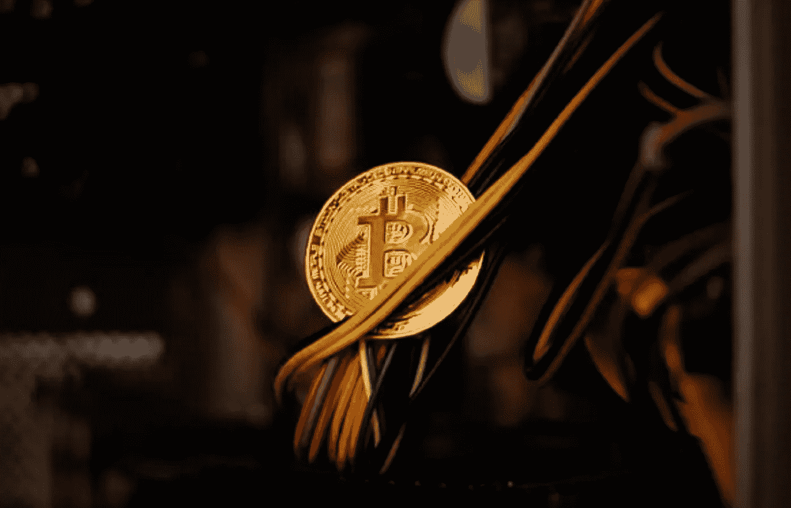

# Satoshi 的游戏:中央银行和社会契约

> 原文：<https://medium.com/coinmonks/satoshis-game-central-banks-and-the-social-contract-c00698f8779e?source=collection_archive---------1----------------------->

比特币的运作方式很难定义:监管机构不确定将其归类为货币、商品、证券还是财产。

不同的力量在起作用，这意味着比特币作为一个动词可能会更准确:语言可以优先考虑行动，而不是为代理人找到静态的、可驾驭的顶点。

# 定义社会契约

一个[社会契约](https://en.wikipedia.org/wiki/Social_contract)，像任何其他类型的【契约】，几乎不可能明确规定到这种程度:必须有人来决定包含什么，排除什么，以及如何执行。

最好把社会契约理解为一个普遍的参数，通过它我们可以相处。

在宏观经济学的背景下，中央银行使用这种方法将变量(通货膨胀)合理化并传达给广泛的目标和价格稳定、繁荣和增长的强制原则。

在理想的形式下，在全球范围内，这种合同不会有解释问题。

# 纳什的理想货币和聪的比特币

约翰·纳西的[理想货币](http://personal.psu.edu/gjb6/nash/money.pdf)和中本聪的[比特币](https://bitcoin.org/bitcoin.pdf)在它们的创造者描述国际和非政治货币标准的稳定性和可移植性方面具有可比性:

> “这个指数可以通过计算一个移动平均数来构建…”约翰·纳西，[理想货币](https://www.jstor.org/stable/1061553?read-now=1&seq=6#page_scan_tab_contents)，2002

> “…工作验证难度由以每小时平均块数为目标的移动平均值决定。”[中本聪](https://satoshi.nakamotoinstitute.org/quotes/difficulty/)，2008 年

> “黄金形成了一种非常有效的可移动媒介，用于一种价值与其他价值的交换……然而，现在铂甚至比黄金更好，因为它的单位重量价值更高。”约翰·纳西，[理想货币](https://www.jstor.org/stable/1061553?read-now=1&seq=5#page_scan_tab_contents)，2002 年

> “作为一个思想实验，想象有一种像黄金一样稀缺的贱金属，但具有以下特性:—颜色单调灰暗——不是良好的电导体——不是特别坚固，但也没有延展性或易延展性——没有任何实用或装饰用途，还有一个特殊的、神奇的特性:—可以通过通信信道传输……”[中本聪](https://satoshi.nakamotoinstitute.org/quotes/economics/)，2010 年

# 结盟和双曲线增长的游戏

Nash 观察到货币带来了可转移效用游戏的存在——在这种游戏中，不管结果如何，所有参与者平均都有收益——在这种游戏中，*“好货币”*成为一种标准，可以允许比较合同(主权发行),在这种情况下，容易引用的价格是有价值和方便的。

有趣的是，纳什还观察到一种货币可能*太好了*，在那里它创造了一个*“保险箱奇点”*，虽然纳什指出货币的历史并不知道这是一个问题，但如果这种理论上的好货币*被给予稳定和恒定的通货膨胀率，以至于它可以被用作投资渠道，这样的问题是可以避免的。*

在这方面，Satoshi 将比特币描述为一个*现金系统*和一个*版本*的现金 *—* 而不是现金*本身—* 提供了一种可能性，即比特币是更好的货币，因为它象征着一个平行的【和理想的】网络，通过计算结算(点对点)不需要可信的主体，因此中介成本不会切断小额的偶然交易。

结果避免了由合同翻译争议引起的问题，允许这种不信任的好处形成主要货币之间趋同的基础，因为它们表达了对这种偏好的偏好。

一些 Satoshi 没有时间解释的事情，也是我们讨价还价的习惯。

> [直接在您的收件箱中获得最佳软件交易](https://coincodecap.com/?utm_source=coinmonks)

