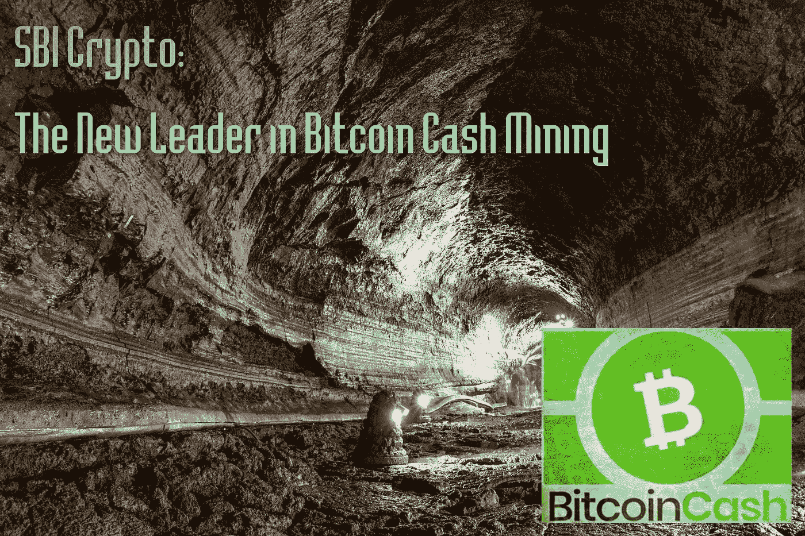
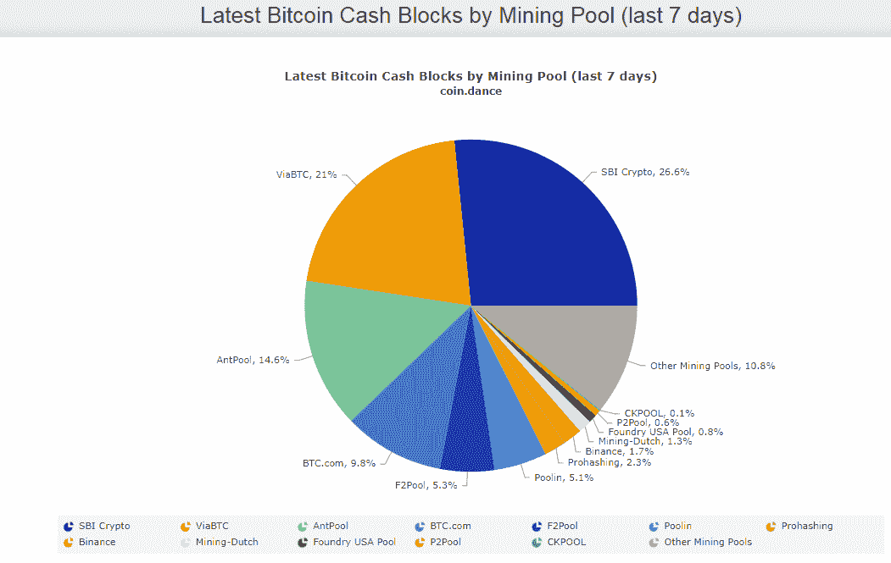
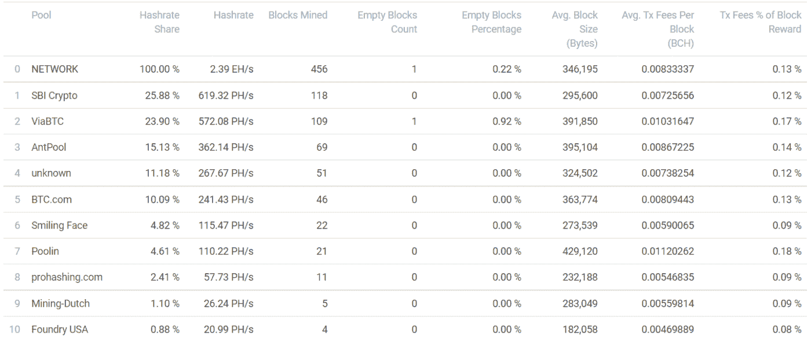

# SBI 加密:比特币现金挖掘的新领导者

> 原文：<https://medium.com/coinmonks/sbi-crypto-the-new-leader-in-bitcoin-cash-mining-473e3ecc91af?source=collection_archive---------9----------------------->

银行业巨头、日本最大的经纪商 SBI 控股公司于今年九月宣布选择五种加密货币，这将有助于其扩大加密投资。

**SBI 将比特币现金作为一种资产**提供给寻求加密敞口的日本投资者，还在其加密基金中包括另外四种加密货币。(阅读更多: [*比特币现金被 SBI 银行选为日本首只加密基金*](https://read.cash/@Pantera/bitcoin-cash-was-selected-by-sbi-bank-for-the-first-crypto-fund-in-japan-049ea9b7) )。

[**SBI 加密**](https://sbicrypto.com/) ，SBI 控股旗下子公司，自 2017 年开始运营加密货币开采业务，开采比特币现金、BTC、BSV。

SBI 加密池提供了 1%的 BTC 哈希码(目前达到了大约 Exahash 的计算能力)，最近它还增加了对比特币现金的哈希码贡献。

SBIcrypto 是一家利用今年 5 月开始的中国矿业整治行动获利的矿商，自那以来，该公司大幅扩大了采矿业务。SBIcrypto [在 2021 年 3 月公开发布了它的挖掘池](https://www.theblockcrypto.com/linked/98788/japan-sbi-crypto-bitcoin-mining-pool-open-for-public)，从那以后它的散列率翻了一倍多。在那之前，它是自我挖掘的。

一个在加密货币开采领域经验丰富的老玩家，最近开始变得越来越重要。

# SBI 加密是目前领先的 BCH 矿工

*Source:* [*Coin Dance*](https://cash.coin.dance/blocks/thisweek)

乍看之下，过去七天的采矿地图清楚地显示出采矿活动日益分散。前几年，BTC 不同矿池之间的 hashrate 分布更差，比特大陆相关矿池曾经超过 hashpower 的 50%。

***Source****:* [*btc.com*](https://bch.btc.com/stats/pool)

SBI 加密公司正在为比特币现金网络生产 **619 Petahash** 的计算能力，并在过去 7 天内挖掘了 25%的区块。

虽然 SBIcrypto 正在挖掘 BTC、比特币现金和 BSV，但自 2017 年以来，它在 BTC 或 BCH 的 hashpower 中所占份额并不大。不过，最近我们看到了对挖掘比特币现金的浓厚兴趣。

我们可以猜测原因，因为比特币现金的平均利润略高，但或许也有人倾向于增加 SBI 持有的比特币现金资产份额。

由于 SBI 有一个盈利的矿业部门，它可能认识到比特币现金的未来潜力，并寻求在 BCH 矿业中获得战略份额。

我们可以怀疑 SBI 正在利用其加密部门挖掘和控制 BCH，因为它正在探索并向其客户提供加密货币投资。

# 比特币现金安全可靠

在过去，BTC 叙事机器经常泄露比特币现金处于 51%攻击边缘的假新闻，这不是真的。当然，像所有的网络一样，尝试过，但总是不成功。

Hayden Otto(在 2020 年 bitcoinbch.com 的这篇文章中)解释了为什么对比特币现金网络的 51%的攻击在 T2 是非常不可能的。

一个重要的日期是 2019 年 5 月 15 日，海登·奥托写道:

> hard fork 升级引入了检索发送到 BTC SegWit 地址的比特币现金的功能。
> 
> 升级后，一个未知的矿工试图要求超过 3000 BCH，这是以前被卡在 SegWit 地址。作为回应，**诚实的矿工 BTC。托普和 BTC.com 能够孤立未知的矿工区块，并将比特币现金返还给他们的预期接收者。**
> 
> 矿工有保护他们投资的东西的天然动机；只要比特币现金的价值继续增长，矿工们就会继续保护它。
> 
> **来源:** [**比特币现金 51%攻击说法是明目张胆的假新闻**](https://bitcoinbch.com/blog/bitcoin-cash-51-percent-attack-fake-news)

我们经常看到一些评论，甚至是来自那些被认为在加密货币领域获得了大量知识的个人的评论，声称比特币现金容易受到 51%的攻击。不可能比这更错了。

**比特币现金的哈希值在所有加密货币中排名第二。**

如果比特币现金曾经遇到过麻烦，那么所有的战俘网络也是如此。比特币现金矿工也是 BTC 矿工，作为企业，他们不会试图伤害让他们获利的网络。

比特币现金网络，自分叉以来，一直是可操作的，完全安全的。所有来自比赛的明显虚假的论点都是没有根据的，误导了新来者。

# 最后

我们今天看到，像 SBI 加密这样的新挖掘池带来了更多的多样性，并增加了比特币现金挖掘操作的分散性。这是另一个积极的迹象，增强了比特币现金的形象，增加了所有参与者和投资者对网络的信心。

中国对加密货币开采的打击对该行业产生了不同的影响。最初，市场的反应是恐慌。虽然批评者经常提到采矿集中在一个国家的问题。BTC、比特币现金、以太坊和大多数其他基于工作证明的网络过去主要在中国开采，因为能源价格低廉，ASIC 制造商的整个开采基础设施行业。

中国政府的决定总是在意料之中，一些矿商搬迁到其他国家，而其他人则出售设备，停止业务。一些人变得不守规矩，中国政府仍在取缔这个行业，直到彻底根除那些剩余的。

比特币现金看起来甚至更好，因为它有一个更加多样化的 hashrate，由不同的资金池产生，没有明确的领导者。然而，比特币现金的安全性始终是重中之重，比其他区块链(LTC、以太坊等)的安全性更高。)就是证明**BCH 的网络** **的安全一向稳健**。

Writing at the following websites: ● [ReadCash](https://read.cash/@Pantera) ● [NoiseCash](https://noise.cash/u/Pantera99) ● [Medium](/@panterabch) ● [Hive](https://hive.blog/@pantera1) ● [Steemit](https://steemit.com/@pantera1) ●[Vocal](https://vocal.media/authors/pantera) ● [Minds](https://www.minds.com/pantera99/) ● [Twitter](https://twitter.com/Panterabch) ● [LinkedIn](https://www.linkedin.com/in/panterabch/) ● [email](https://read.cash/@Pantera/localcryptos-p2p-exchange-is-now-offering-bitcoin-cash-trading-06637230#bad-link)

**备注:**

> **免责声明**:本内容中发布的所有材料均用于娱乐和教育目的，并符合公平使用准则。无意侵犯版权。如果您是或代表本文所用材料的版权所有者，并且对所述材料的使用有疑问，请发送[电子邮件](https://read.cash/@Pantera/cryptouknowns-battlegrounds-the-crypto-battle-royal-part-i-0ca762da#bad-link)。这篇文章或我发表的任何文章都不是金融建议，但包含与投资研究相关的信息。

***支持内容创作者。***

如果你喜欢这个故事，就订阅吧！

*原载于*[*https://read . cash*](https://read.cash/@Pantera/sbi-crypto-the-new-leader-in-bitcoin-cash-mining-d84e533d)*。*

> 加入 Coinmonks [电报频道](https://t.me/coincodecap)和 [Youtube 频道](https://www.youtube.com/c/coinmonks/videos)了解加密交易和投资

## 另外，阅读

*   [MoonXBT vs Bybit vs 币安](https://blog.coincodecap.com/bybit-binance-moonxbt) | [硬件钱包](/coinmonks/hardware-wallets-dfa1211730c6)
*   [火币交易机器人](https://blog.coincodecap.com/huobi-trading-bot) | [如何购买 ADA](https://blog.coincodecap.com/buy-ada-cardano) | [Geco。一次复习](https://blog.coincodecap.com/geco-one-review)
*   [币安 vs 比特邮票](https://blog.coincodecap.com/binance-vs-bitstamp) | [比特熊猫 vs 比特币基地 vs Coinsbit](https://blog.coincodecap.com/bitpanda-coinbase-coinsbit)
*   [如何购买 Ripple (XRP)](https://blog.coincodecap.com/buy-ripple-india) | [非洲最好的加密交易所](https://blog.coincodecap.com/crypto-exchange-africa)
*   [非洲最佳加密交易所](https://blog.coincodecap.com/crypto-exchange-africa) | [胡交易所评论](https://blog.coincodecap.com/hoo-exchange-review)
*   [eToro vs robin hood](https://blog.coincodecap.com/etoro-robinhood)|[MoonXBT vs Bybit vs Bityard](https://blog.coincodecap.com/bybit-bityard-moonxbt)
*   [有哪些交易信号？](https://blog.coincodecap.com/trading-signal) | [比特斯坦普 vs 比特币基地](https://blog.coincodecap.com/bitstamp-coinbase)
*   [ProfitFarmers 回顾](https://blog.coincodecap.com/profitfarmers-review) | [如何使用 Cornix Trading Bot](https://blog.coincodecap.com/cornix-trading-bot)
*   [如何在势不可挡的域名上购买域名？](https://blog.coincodecap.com/buy-domain-on-unstoppable-domains)
*   [印度的加密税](https://blog.coincodecap.com/crypto-tax-india) | [altFINS 审核](https://blog.coincodecap.com/altfins-review) | [Prokey 审核](/coinmonks/prokey-review-26611173c13c)
*   [Blockfi vs 比特币基地](https://blog.coincodecap.com/blockfi-vs-coinbase) | [BitKan 点评](https://blog.coincodecap.com/bitkan-review) | [Bexplus 点评](https://blog.coincodecap.com/bexplus-review)
*   [南非的加密交易所](https://blog.coincodecap.com/crypto-exchanges-in-south-africa) | [BitMEX 加密信号](https://blog.coincodecap.com/bitmex-crypto-signals)
*   [MoonXBT 副本交易](https://blog.coincodecap.com/moonxbt-copy-trading) | [阿联酋的加密钱包](https://blog.coincodecap.com/crypto-wallets-in-uae)
*   [雷米塔诺审查](https://blog.coincodecap.com/remitano-review)|[1 英寸协议指南](https://blog.coincodecap.com/1inch)