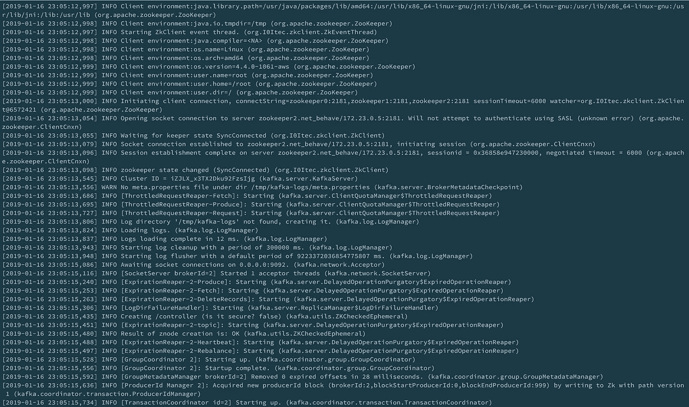

# 带有 akka actors 的 Scala hyperledger 结构客户端

> 原文：<https://medium.com/coinmonks/scala-hyperledger-fabric-client-bce18b6ca0bf?source=collection_archive---------2----------------------->

## Akka + Hlf -天作之合

# 快乐分类器:)

这是我的 hyperledger fabric 博客系列的第二部分- `Happyledger`博客系列:)。在这篇文章中，我将讲述如何编写基于`scala`的 hyperldger fabric 客户端应用程序。大多数 hyperledger fabric 客户端应用程序都使用`node sdk`来编写。用基于 jvm 的语言尝试一下也是值得的。所以我编写了基于`scala`的客户端来与光纤网络交互。我的应用程序的完整源代码可从 gitlab 资源库获得，在[这里](https://gitlab.com/rahasak-labs/hlf-peez)。请克隆它并按照下面的步骤操作。

# 1.启动结构网络

在我之前的[帖子](/@itseranga/hyperledger-fabric-setup-with-multiple-peers-and-orderers-with-kafka-542023787a6d)中，我展示了如何用多个订购者和 kafka 建立 hyperledger fabric 网络。在这篇文章中，我将用它来建立网络。如果你按照前面的帖子，并在网络上，你将结束以下运行的服务

1.  一个`ca`集装箱
2.  三个`orderer`容器
3.  三个`peer`容器
4.  三个`zookeeper`容器
5.  四个`kafka`容器
6.  一个`cli`容器

# 2.添加结构依赖性

为了让 scala 客户端与 hlf 网络`build.sbt`进行交互，需要拥有`hyperledger-fabric-java-sdk`依赖关系。下面是`build.sbt`文件依赖关系(它还有一些其他的依赖关系)。

# 3.实施结构用户

为了与 hlf 网络交互，我们的客户需要有 fabric 用户(`admin`和`normal`用户)。所以在我们的应用程序中，我们需要定义一个实现`org.hyperledger.fabric.sdk.User`接口的用户。所以我创建了一个带有`case class`的`PeezUser`。

现在我们可以创建这个用户的实例，并与 hlf 网络对等体进行交互。

# 4.创建 CA 客户端

hlf 网络中的所有用户都需要有自己的证书材料。因为我们已经运行了`ca`服务，我们可以用它来为我们的用户生成加密材料。这就是拥有 ca 服务的优势。所有的用户密码资料都可以通过与 ca 服务通信来生成。

为了与 ca 服务交互，我们需要一个 ca 客户端。Fabric `java-sdk`提供了`HFCAClient`，我们可以使用它在 scala 应用程序中实例化一个 ca 客户端。这个函数将 `ca service uri`作为一个参数。在我们的例子中，我们在本地机器的`7054`端口上运行 ca 服务。

# 5.注册用户

现在我们的 ca 客户端已经创建好了，所以我们可以通过生成加密材料来将用户注册到网络中。

hlf 中有两类用户，`admin`和`normal user`。在这里，我有两个函数来注册不同的用户类型。`enrollAdmin`登记管理员用户。注册管理员用户时，it 用户管理员用户凭证在 docker-compose `ca service command`部分中定义。函数`enrollUser`注册普通用户(注意，要注册普通用户，我们需要管理员用户)。

注册用户时，ca 客户端返回包含用户私钥和证书的`enrollment object`。在这里，我使用 java 对象序列化将注册对象保存在本地文件系统中。因此，当注册用户时，它首先检查给定用户是否已经通过`UserStore.get(userId)`功能注册。如果用户已经注册，我们采用注册用户(`UserStore`管理从文件系统保存和加载用户)。

# 6.创建结构客户端

接下来是创建`HFClient`中的 hyperledger fabric 客户端。该客户端通过 hlf 网络执行所有的事务处理、频道发现等。

# 7.连接到频道

现在，我们可以使用之前创建的客户端连接到通道。当连接到通道时，我们需要定义`peer`、`orderer`和`channel name`。hlf 中的所有对等点和订单都公开了`GRPC`端点(对等点和订单都有自己的 GRPC 端点可以对话)。我们需要如下定义对等点和订购点的 GRPC 端点，并连接到通道。

# 8.执行查询事务

有两种类型的交易可以在结构链代码中执行，`query`和`invoke`。以下是在安装在我们光纤网络上的`mycc`链码上执行`query`交易的功能。

有一个 builder 自带`ChaincodeID`。我们可以用这个生成器设置`chaincode name`、`function`和`arguments`并执行查询。

# 9.执行调用事务

以下是在安装在我们光纤网络上的`mycc`链码上执行`invoke`交易的功能。

在这里，我们需要首先向网络发送`TransactionProposal`。然后它将返回`ProposalResponse`列表。如果所有的响应都是正确的，我们可以用`sendTransaction`将交易发送到网络。

`sendTransaction`函数返回带有`TransactionEvent`的`CompletableFuture`。我们可以处理未来并获得`TransactionEvent`来决定交易是否成功(交易是否包含在一个块中)。

# 9.阿卡演员交流

最后，我创建了`akka actor`来与上面定义的函数交互。它消耗`Init`和`Exec`消息。当`Init`消息到来时，演员设置`ca client`、`hlf client`和`channel`。当`ExecQuery`消息到来时，它执行对总账的查询交易。对于`ExecInvoke`消息，它执行对分类帐的调用事务。

# 参考

1.  [https://medium . com/@ itseranga/hyperledger-fabric-setup-with-multiple-peers-and-orders-with-Kafka-542023787 a6d](/@itseranga/hyperledger-fabric-setup-with-multiple-peers-and-orderers-with-kafka-542023787a6d)
2.  [https://medium . com/@ lkolisko/hyperledger-fabric-SDK-Java-basics-tutorial-a 67 B2 b 898410](/@lkolisko/hyperledger-fabric-sdk-java-basics-tutorial-a67b2b898410)
3.  [https://code burst . io/a-concise-tutorial-on-working-with-hyperledger-fabric-Java-SDK-a6 F11 d 8 bb 5b 0](https://codeburst.io/a-concise-tutorial-on-working-with-hyperledger-fabric-java-sdk-a6f11d8bb5b0)

> [直接在您的收件箱中获得最佳软件交易](https://coincodecap.com/?utm_source=coinmonks)

