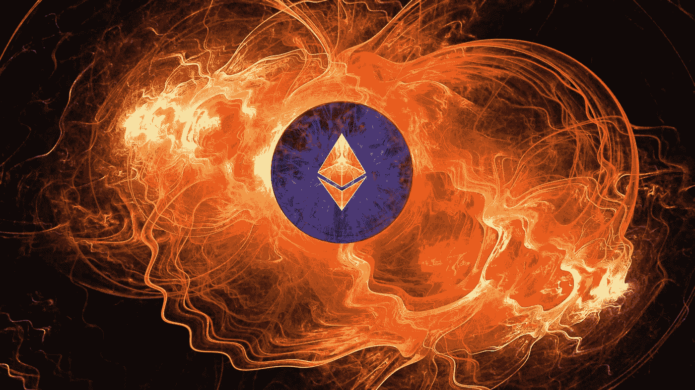

# 以太坊上的扩展解决方案解释

> 原文：<https://medium.com/coinmonks/scaling-solutions-on-ethereum-explained-d970b66e28e5?source=collection_archive---------2----------------------->

在本帖中，我们将讨论以太坊基金会和其他机构目前正在研究的扩展解决方案。

首先，我将解释以太坊区块链(以及所有公共去中心化的区块链)目前面临的普遍问题。然后我会描述一下这个问题的一些解决方案，特别是分片，雷电，等离子。

这篇文章是基于我关于这个主题的演讲的讲义。这就是为什么句子简短但直截了当的原因。你可以在这里找到演示文稿。

# 以太坊区块链的问题

目前，以太坊每秒只能处理 15 笔交易，而 Visa 每秒大约处理 45，000 笔交易。

在过去的一年中，一些应用程序(如 Cryptokitties 或 big ICOs)已经足够流行，可以“减慢”网络速度并提高油价，如果你想进行交易，你必须支付这笔费用。

如果我们想要建立拥有数百万用户的分散式应用程序(比如分散式社交网络),我们将需要每秒多得多的事务。

目前的问题是，以太坊区块链上发生的每一项操作，如支付、Cryptokitty 的诞生或智能合同的部署，都必须由网络中的每一个节点并行执行。这意味着区块链不能处理比单个节点更多的事务。

这就是我们需要扩展解决方案的原因！

# 为什么这对我们很重要？

我指的是对这项技术感兴趣并想在此基础上构建东西的人！所有想颠覆整个行业的人。

我们只有有限的时间和资源，这就是为什么思考这个问题是重要的。因为每秒 15 次交易，我们没有机会扰乱任何行业。我们希望看到，如果有机会，这是可行的，并且有解决这个问题的好办法，否则我们就不需要在这个问题上花费我们有限的时间。

# 以太坊上的缩放

目前，我们通常有两种方法可以解决这个问题:

1.  我们建立了一个区块链，其中每个节点不必处理每个操作。

→称为第 1 层解决方案(或链上解决方案)，如分片

2.我们从以太坊的现有容量中挤出更多有用的操作

→称为第 2 层解决方案(或链外解决方案)，例如状态通道、等离子体

第 1 层解决方案通常需要区块链的硬分叉，另一方面，第 2 层解决方案通常不需要硬分叉，因为它们可以作为智能合约来实现。

# 分片

分片并不是新概念。在数据库的常规软件开发中，我们已经有了这个概念几十年了。

方法是我们建立一个区块链，其中每个节点不必处理每个操作。**我们怎么做？**

我们将网络的整个状态分割成称为**分片、**的分区，它们包含各自独立的状态和事务历史。这个碎片也可以有子碎片。每个节点只需验证其碎片中的事务。

现在有几个“级别”的节点可以存在，例如一个超级完整的节点(完全下载每个分片的每个排序)，顶级节点，单分片节点，轻型节点。

现在我们来看看分片的一些挑战:

**单碎片接管攻击:**

如果攻击者在一个单独的碎片中接管了大部分的整理器，那该怎么办呢？

对于一个 PoW 区块链，你不能阻止矿工在一个给定的碎片上应用他们的工作，这就是为什么你只需要 1%的总哈希功率来接管一个碎片→这就是为什么 PoS 对碎片非常重要。

以太坊想用一种叫做随机抽样的东西来解决这个问题。这基本上意味着验证者不能选择他们想要处理的碎片，并且验证者不能提前知道他们将处理哪个碎片，这可以通过碎片的重新洗牌来解决。

**交叉分片通信:**

如果我们只在一个碎片里做交易，是没有问题的。但是我们如何在不同的碎片之间进行交易呢？例如，您在一个碎片中有一个地址，并希望向某人发送一个地址在另一个碎片中的事务。对于这个问题，你需要一个困难的新协议。

# 国家频道

国家渠道的做法是，并非每笔支付都需要全球同意。我们只需要参与的双方都同意，并有他们之间的资产转移的证明。这给我们带来了对共识的不同看法。→我们可以使用参与者之间的本地共识，而不是全球共识。

它是如何工作的？

要进行离线交易，你必须创建一个支付渠道。支付通道的打开和关闭必须在链上进行，这需要正常的费用和正常的时间(以太坊大约 20 秒)。为了确保参与者偿还债务，在支付渠道的整个生命周期内，必须在智能合同中锁定令牌作为担保。转让不能高于链上押金。当双方完成交易时，最终账户余额记录在区块链上。

你不必为你想与之交易的特定人打开一个通道，你可以打开一个单个通道，其中一个节点连接到一个更大的通道网络，这使你能够以非常低的费用向连接到同一网络的任何其他人付款。这意味着每个参与者只需要打开几个频道，但仍然能够转移到任何其他参与者。

**国家频道的优点:**

你的交易链外是:更快，不可见的共享账本，不花费汽油。因此，对于要在很长一段时间内交换许多状态更新的双方来说，这是非常有用的，因为创建通道是“昂贵的”,但是一旦部署了通道，进行交易的成本就非常低。此外，国家频道有很强的隐私属性。这是因为在一个频道“内部”发生的一切都不会被记录在以太坊的主链上。只有期初和期末交易必须是公开的。

**缺点:**

国家频道依赖于可用性。例如，如果一个连接到大型节点网络的节点失去了他的互联网连接，那么许多人就无法通信，直到他们打开一个新的支付通道。此外，这可能导致集中化，因为一些节点会有很多支付渠道，而其他节点只有几个(我们可以在目前的[比特币闪电网络](https://lnmainnet.gaben.win/)上看到这一点)。

# 雷电网络

雷电网络是以太坊的国家通道实现。这非常类似于比特币社区目前正在开发的闪电网络。

Raiden 是一个链外传输网络，但通常只用于以太坊 ERC20 令牌(这是大多数 ico 正在使用的 ERC 标准令牌)。它是由一家名为 brainbot 的公司开发的。

他们也在开发一种叫做[的东西。它旨在用于多对一支付设置，比如用户与 Dapp 交互。尽管它只能单向工作。μRaiden 已经在以太坊主网上上线了，你今天就可以开始用它来构建东西了！](https://raiden.network/micro.html)

他们还在开发一种名为 Raidos (Raiden 2.0)的东西，它不仅仅限于 ERC20 令牌，还可以处理所有可能的离线智能合约。

# 血浆

等离子体的想法是你可以创造附属于“主”以太坊区块链的“子”区块链。这些子链可以有自己的子链，他们可以创建自己的子链等等。这使得我们能够在子链级别执行许多复杂的操作→我们可以运行拥有成千上万用户的整个应用程序，只需与以太坊主链进行最少的交互。

例如，如果我们想建立一个分散的赌博游戏。我们将首先创建一些智能合同，将基本规则放在以太坊主链上，这里称为根链。然后我们创建我们的子链，它甚至可以有自己的一致算法(也是一个不同于 PoW 或 PoS 的算法)。现在我们在子链上部署实际的游戏应用程序 smart-contracts，它包含所有的游戏逻辑和规则。重要的是，使用我们 dapp 的用户只与子链交互，因为我们想要良好的用户体验。子链的区块生产者(例如矿工)将必须向等离子体根链发布承诺，即他已经开采了一个区块。

通过将更多的操作从主链转移到子链上，显然我们可以执行更多的操作。但是现在的问题是它有多安全？

简而言之，即使在我们使用 PoW 算法创建一个子链的场景中，其中一个实体拥有 100%的散列能力(这将是非常集中的)，Plasma 也会为您提供一个基本保证，即您可以随时将资金和资产撤回到主链上。因此，如果这一个实体开始变坏，可能发生的最糟糕的事情就是你被迫离开这个子链。

# 其他扩展解决方案

另一个扩展解决方案是我们创建更大的块。例如，比特币大约每 10 分钟就有 1MB 的块。然后就出现了比特币现金的分叉，因为他们想用 8MB 的块。很明显，如果您创建更大的块，您可以在一个块中放置更多的事务，这是某种扩展解决方案。这种方法的缺点是，如果我们将块的大小增加一倍，这意味着每个节点在处理每个块时必须做双倍的工作。但这不利于去中心化，因为功能较弱的计算机不能成为网络的一部分。如果数据块变大，网络将开始完全依赖运行区块链的极少数超级计算机。此外，区块链的大小会增加得更快，这对只有小内存的设备也是不利的。我个人认为这个解决方案不可能是问题的唯一答案。但是也许有人有不同的意见，我们可以讨论一下。

> "将乙醚分解成 100 枚硬币"

这是另一种称为多链的扩展解决方案。方法是，我们不扩展一个区块链，例如以太坊，而是创建数百个其他加密货币。这种扩展解决方案的缺点是显而易见的，因为我们会分割安全性(即以 hashpower 或 stake 衡量)。我们也会因为跨链互换而产生摩擦。

我只展示了几个，但我认为最重要的扩展解决方案还有很多。一些扩展解决方案听起来很有趣，但我没有时间准备，例如 [TrueBit](https://truebit.io/) 和 [Plasma Cash](https://karl.tech/plasma-cash-simple-spec/) 。如果有很高的兴趣，我会在另一篇文章中讨论这两个问题。:)

# 关于作者

我是 Johannes Hagemann，来自德国的计算机专业学生，区块链爱好者和软件程序员。

您可以在此找到/联系我:

 [## 约翰内斯·哈格曼——首席执行官——first blink UG(haftungsbeschrnkt)|领英

### 查看约翰内斯·哈格曼在全球最大的职业社区 LinkedIn 上的个人资料。约翰内斯有两份工作…

www.linkedin.com](https://www.linkedin.com/in/johannes-hagemann-393b72142/)  [## 约翰内斯·哈格曼(@约翰内斯 _ 哈格)|推特

### 约翰内斯·哈格曼的最新推文(@约翰内斯 _ 哈格)。FirstBlink 的创始人/首席执行官●开发者●订阅我的…

twitter.com](https://twitter.com/johannes_hage) 

本文基于我关于证据和扩展解决方案的演示文稿。您可以在此处找到幻灯片:

对于这个演示的利害关系部分的证据，请在这里查看我的帖子。

 [## 股份证明(卡斯帕以太坊)解释

### 在这篇文章中，我们将讨论与以太坊的 Casper 协议一起出现的 Stake 算法证明…

medium.com](/@johanneshage97/proof-of-stake-casper-ethereum-explained-682d663440d5) 

# 来源

以下是我使用的资料来源(您可以查看它们以获得更多信息):

 [## 了解以太坊的第 2 层扩展解决方案:状态通道、等离子体和 Truebit

### 对于以太坊来说，2018 年是基础设施年。今年，早期采用将会检验…

medium.com](/l4-media/making-sense-of-ethereums-layer-2-scaling-solutions-state-channels-plasma-and-truebit-22cb40dcc2f4)  [## 以太坊/维基

### 维基-以太坊维基-

github.com](https://github.com/ethereum/wiki/wiki/Sharding-FAQ)  [## 雷电网解说:延续区块链革命——coinjoker.com

### 比特币的前景——从本质上说，也是大多数其他区块链技术的前景——很简单。比特币…

coinjoker.com](https://coinjoker.com/raiden-explained/) 

[https://raiden . network/101 . html](https://raiden.network/101.html)