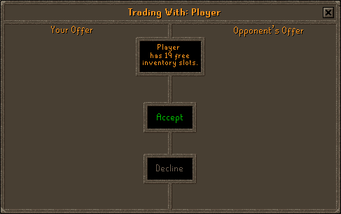
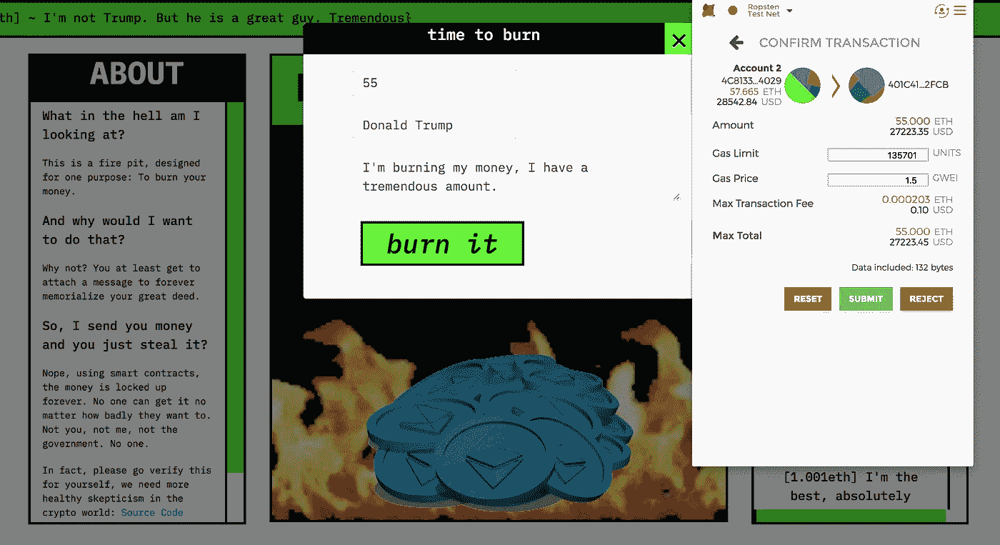
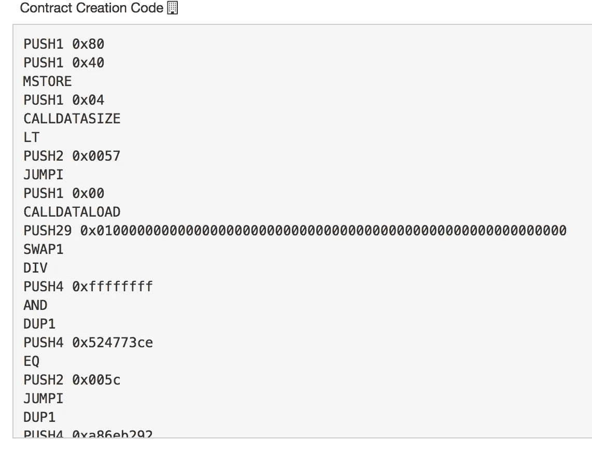
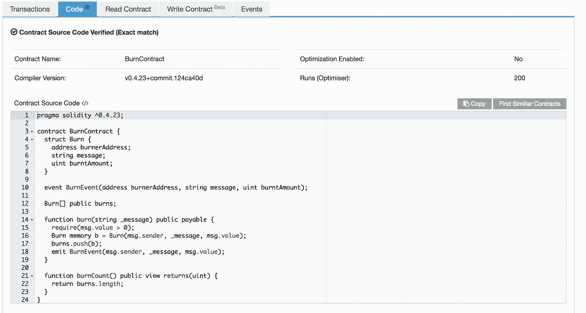
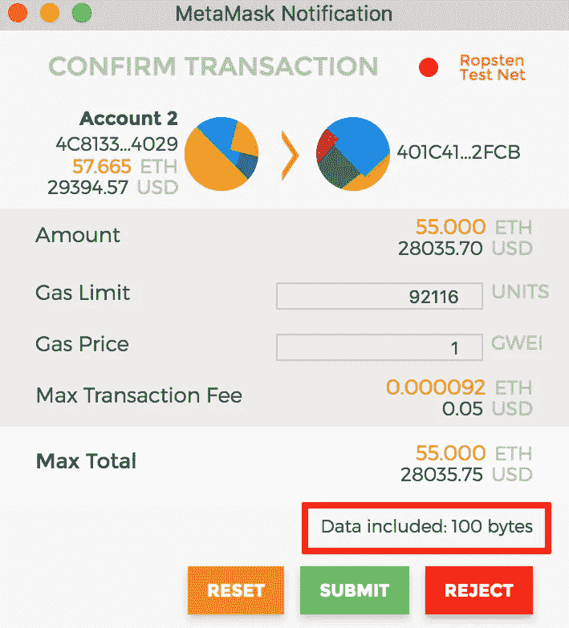

# 以太坊的诈骗很容易

> 原文：<https://medium.com/coinmonks/scamming-in-ethereum-is-easy-56aba1a6d985?source=collection_archive---------7----------------------->

## 如何避免陷入简单的以太坊骗局

Oldest trick in the book

## 介绍

以太坊目前正处于可用性的最早期阶段。交易成本高，网络受制于 kitty 猫的 DDOS，大部分工具的 ui 糟糕透顶。然而，该协议未来面临的最大风险之一是诈骗的容易程度。

加密货币的一大卖点是能够在没有集中中间人的情况下汇款或参与可证明可执行的合同。为了实现这一点，交易必须是永久的和不可逆的。一旦你把钱寄给一个人，即使这是一个错误，你也无法收回。没有信用卡公司可以退款，没有 1-800 号码可以打电话投诉。

坏演员表演骗局有一百万种简单的方法，但我将重点关注以太坊中一种特定类型的骗局。

## 设置

当您在以太坊中与智能合约交互时，您正在调用包含在该合约中的一个函数，并且可以选择向该函数发送资金。(如果是“应付”)。

一般来说，你可以通过访问一个名为 dApp(分布式应用)的网站来实现这一点，这个网站也是由合同开发者建立的。您可以使用该网站和 Metamask 之类的工具与部署在区块链上的智能合约进行交互。

Screenshot from eth.rip : a dApp for burning ETH while writing a message to the blockchain

盲目签署 dApp 提供给你的交易是一个容易损失很多钱的方法。不仅山寨或钓鱼网站很容易建立，而且“合法以太坊公司”也可能只是一个花哨的营销网站，目的是窃取资金。

## 简单的骗局

正如你在上面的截图中看到的，当与 dApp 交互时，Metamask 会向你显示一些交易细节，并要求你通过提交来确认它们。每次提交交易时，你应该做的几件事是三次检查**金额**和**目的账户。**书中最简单的技巧之一是告诉一个人他们正在向真正的**CryptoGiraffes 网站汇款，然后只需简单地将目的地地址改为他们自己的个人诈骗账户。您应该在每次签署交易时检查这一点，永远不要盲目签署交易，**永远不要**。**

## **骗局二:Github 链接并不能证明什么**

**一个更复杂，但仍然非常容易欺骗一个人的方法是发布 Github 的链接，声称合同地址的源代码与这个开源回购协议中的相同。不要简单地相信一段代码片段或 github repo，将其作为给定代码部署在实际契约地址的证明。**

**我见过无数次人们在审查或审计公司智能合同代码时没有检查实际的智能合同代码。*绝对不能保证发布到 Github 的代码就是部署到区块链上的实际代码。***

**幸运的是，有一种方法可以验证实际部署了什么代码。**

## **Etherscan 上的代码验证如何工作**

**当智能合约代码被部署到区块链时，开发人员将高级人类可读语言(Solidity、Vyper 等)编译成 EVM(以太坊虚拟机)代码。这使得一个人很难破译到底发生了什么。**

****

**EVM instructions: Good luck auditing my smart contract**

**然而，开发者仍然有办法证明他们发布的 Solidity 源代码实际上部署在给定的以太坊地址。很简单，开发者提供他们声称产生给定 EVM 代码的代码，你可以通过**实际编译源代码**来验证这一点，并确保它产生与部署相同的 EVM 代码。Etherscan 让开发者和消费者都可以轻松地做到这一点。(如果你特别偏执于在自己的机器上自己编译，那就加分了)**

****

**Etherescan’s interface for showing “Exact Match” for the uploaded code.**

**当你与以太坊智能合约交互时，**要求**开发者提供实际的源代码，并确保提供的源代码与部署的 EVM 代码相匹配。这对于开发人员来说是非常容易做到的，没有任何理由反对这样做。**

## **为什么这还不够**

**因此，我们现在知道，在向区块链签署交易之前，要确保在目的地验证金额、目的地地址和实际源代码。然而，这还不足以完全确定你知道将要发生什么。**

**在上面我的站点 [http://eth.rip](http://eth.rip) 的例子中，我只有一个可调用的付费函数，即“burn()”。然而，如果我想厚着脸皮，我可以很容易地在智能合同中添加另一个名为“stealYourMoney()”的可支付函数，该函数接收您发送的钱，而不是永久锁定(烧掉)，我允许自己撤回它。**

**如果您正在使用 Geth 这样的客户端创建自己的事务，那么您可以确保调用了正确的函数。然而，99%的以太坊用户在他们的浏览器中使用类似 Metamask 的东西。目前，Metamask 在通知用户交易细节的方式上有一个致命的缺陷。**

****

**100 bytes of scam city**

**元掩码**只有**告诉你**事务有多少**字节！它不会告诉你是在调用“burn()”还是“thanksForYourMoneyIdiot()”。在短期合约中存在明显欺诈功能的情况下，这似乎不是一个大问题。但是想象一下，一个智能合同有几千行代码，其中隐藏着一个邪恶的功能。知道自己没有调用这个函数是非常重要的，但是目前用户没有办法用元掩码来验证他们调用的是哪个函数。**

## **Metamask 需要尽快完成这项工作**

**幸运的是，Metamask 有一个公开的问题，看起来他们正在试图解决这个问题:[https://github.com/MetaMask/metamask-extension/issues/2847](https://github.com/MetaMask/metamask-extension/issues/2847)**

**我知道 Metamask 是一个新产品，但令人震惊的是，有多少事务在没有验证正在调用哪个函数的情况下就被盲目地发送出去。区块链的全部意义在于允许我们建立不可信的系统，并根除单点故障，如集中式服务和中间人。**

**虽然我已经指出了区块链世界目前存在的许多问题，**我对我们正在建设的未来很乐观**，以至于我全力以赴。为了实现这种去中心化的未来，我们需要确保我们是怀疑的，并且总是在质疑。当组织告诉我们“相信我们”时，我们有权说“代码或 GTFO”。**

## **去烧一些 ETH(目前在 Ropsten 测试网上)**

**正如本文中所提到的，我构建了一个 dApp，可以证明你可以刻录你的 ETH，同时附加一个不朽的消息。这就是一个很好的需要掀起人家 BS 米的索赔例子！去亲自检查一下，并验证代码实际上做了我所说的事情:**

**[http://www.eth.rip](http://www.eth.rip)**

 **[## Ropsten 帐户、地址和合同

### 以太坊区块链浏览器、API 和分析平台

ropsten.etherscan.io](https://ropsten.etherscan.io/address/0x401c415c843681de15c0909e225b14e545762fcb#code)** 

**和我一起做梦: [www.dream.associates](http://www.dream.associates)**