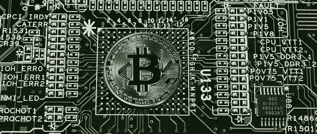

# 施诺尔签名和比特币 101

> 原文：<https://medium.com/coinmonks/schnorr-signatures-bitcoin-101-e8a45ca5a7fd?source=collection_archive---------1----------------------->

## 让我们尝试在高层次上分析比特币交易是如何构建的，以及 Schnorr 数字签名是如何工作的

正如上一篇关于比特币及其可能的未来的文章中所解释的，**网络的大多数用户即将采用的 bip(比特币改进提案)之一是 Schnorr** …