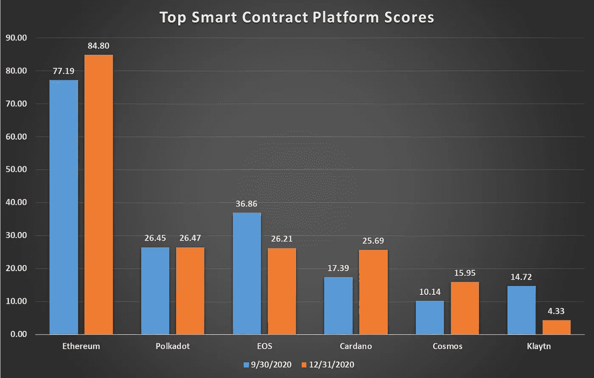
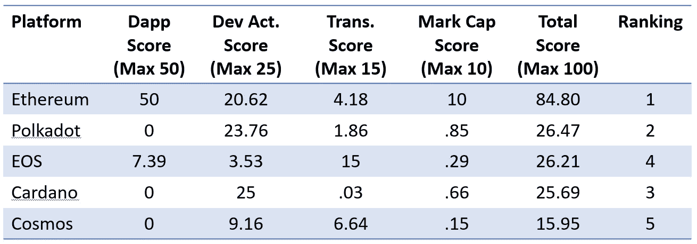
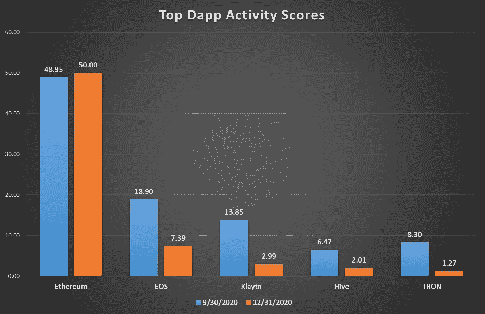
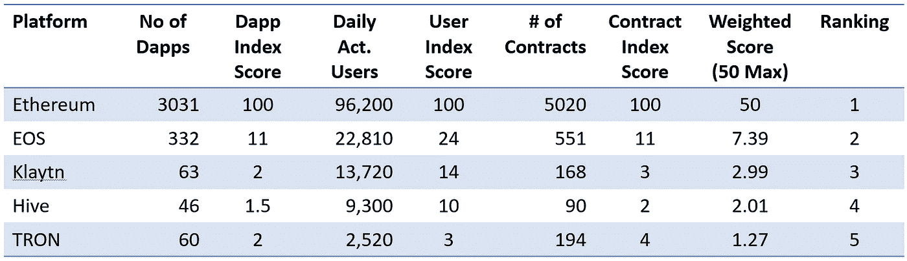
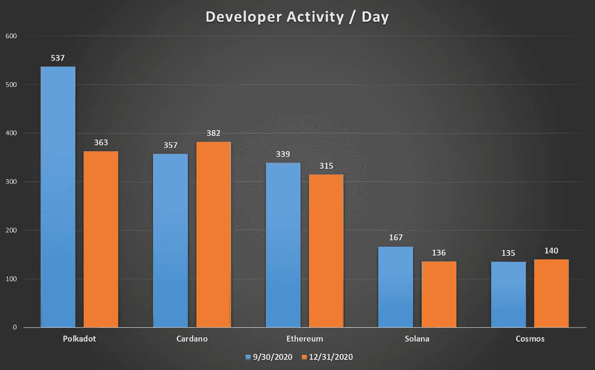
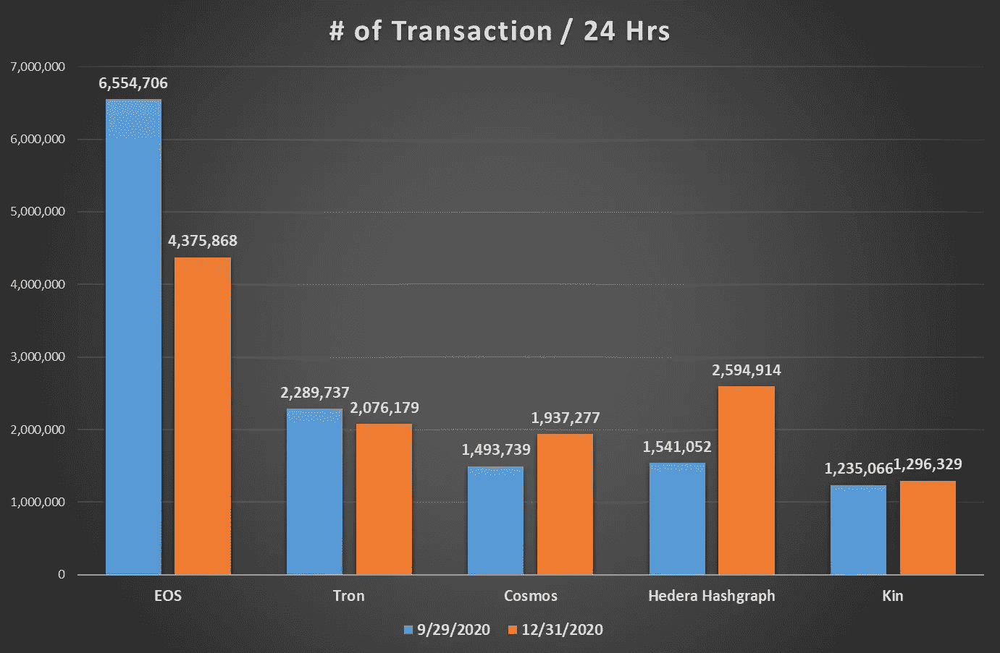
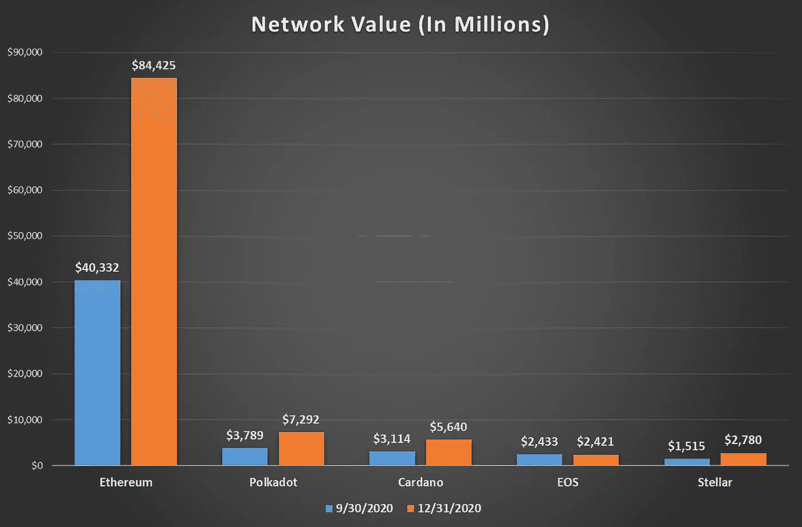
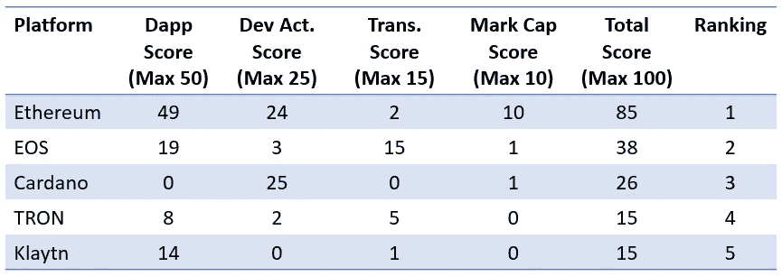
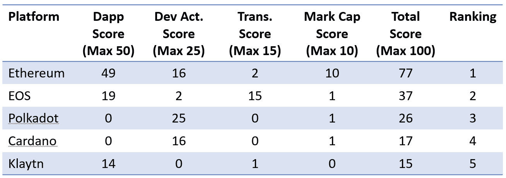
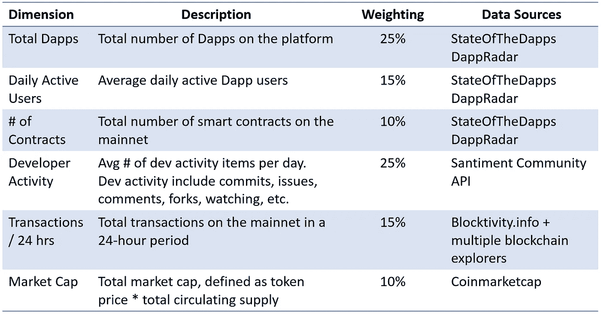

# 为区块链抢地盘打分——2020 年第 4 季度报告

> 原文：<https://medium.com/coinmonks/scoring-the-blockchain-land-grab-2020-q4-report-a51ad11557f2?source=collection_archive---------4----------------------->

## 区块链议定书

## 哪些智能合约平台胜出了，赢了多少？

智能合约战争一如既往地激烈，承诺在 2021 年发生更大的 Defi 爆炸，过去两个月加密价格大幅上涨。早在 10 月份，[我发表了一篇博客](/coinmonks/scoring-the-blockchain-land-grab-28fd70569495)，采用定量方法对截至 2020 年第三季度的第 1 层智能合约平台进行了评分。随着开发者生态系统疯狂地增强平台，我将每个季度重新审视我的得分，因此是时候看看截至 2020 年第四季度的最新得分了。

在我 10 月份的分析中，以太坊凭借其先发优势遥遥领先，而 Polkadot、Cosmos、Solana 和 Cardano 等知名竞争对手刚刚推出他们的 mainnets。过去 3 个月有什么变化吗？**的确如此。**

提醒一下，我的定量分析比较了第 1 层智能合约平台的四个不同标准:

*   **Dapp 活动(50%权重)** —总 Dapp、每日活跃用户和合同数量，通过最终用户交互显示当前使用情况
*   **开发者活动(25%权重)** —显示潜在的未来用途，因为空间仍然是临时的
*   **(15%权重的)交易数量** —按 24 小时交易活动显示原始使用情况
*   **网络价值(10%权重)** —显示基于本地令牌需求的兴趣

我的模型的更详细的分解在这篇文章的结尾被描述。现在，看看结果！

# 截至 2020 年第四季度的顶级智能合约平台

## 2020 年第三季度的主要变化

汽油费和可扩展性问题并没有阻止以太坊成为事实上的标准智能合约平台。事实上，由于 Dapp 和每日 Dapp 活动的增加以及最近 ETH 价格的飙升，以太坊的得分有所上升。其他显著变化:

*   **Cosmos** 在第四季度进入前五名，获得第五名，将 Klaytn 挤出。这就是为什么你会在上图中看到 6 个平台。
*   **Polkadot、Cardano 和 Cosmos**——这三个知名的、资金充足的、最近推出的平台现在严格地说是前五名，因为它们的开发者活动、交易计数和网络价值。如果这些平台通过可靠的 Dapp 活动获得牵引力，它们可能会开始蚕食以太坊的领先地位。
*   **EOS** —该平台的得分下降主要是由于第三季度和第四季度之间 Dapp 活动的减少，而同期以太坊 Dapp 活动却大幅增加。结果分数从 19 降到了 7。

## 波尔卡多特的时代到了吗？

Polkadot 是一个有趣的项目。在某些方面，它不是以太坊的直接竞争对手，而更像是以太坊的表亲，具有执行特定用例的副链和运行本机 Solidity 代码的底层 EVM。也许这就是为什么它的代币价格、开发者活动和交易数量保持强劲，从而产生一致的得分。一旦我们在 Polkadot 上获得可靠的 Dapp 数据，我们可能会从这个平台上看到一些有趣的东西。

## 总计前 5 名得分明细

以下是截至 2020 年第 4 季度前 5 大平台的指数得分明细:

# 每个标准的前 5 个平台

## Dapp 活性(50%权重)

关于 Dapp 活动的思考:

*   正如我在我的原始帖子中所说，我认为 Dapp 活动是最重要的指标，因此获得了 50%的权重(25%用于 Dapp 数量，15%用于每日活跃用户，10%用于合同数量)。
*   以太坊独领风骚，2020 年第四季度满分 50。日活跃用户数量从 9 月份的大约 23，000 增长到 12 月份的超过 90，000，使所有其他平台相形见绌。以太坊在他们的平台上也有超过 3000 个 Dapps，几乎是紧随其后的竞争对手 EOS 的 10 倍。
*   正如我之前提到的，我的分析中最大的漏洞仍然是访问 Dapp 统计数据。大部分信息来自 Stateofthedapps 和 Dappradar。然而，在我分析的大约 29 个协议中，我只能找到其中 11 个的可靠 Dapp 信息。

## Dapp 活动的前 5 名评分明细

以下是截至 2020 年第 4 季度前 5 大平台的指数得分明细:

## 开发者活动(25%的权重)

关于开发者活动的想法:

*   我决定将草间弥生上的开发者活动与波尔卡多特结合起来，因为草间弥生是波尔卡多特的测试平台。在我的第三季度和第四季度分析中，这使得 Polkadot 一跃成为前五大平台。
*   所有知名平台都拥有最大的持续每日开发者活动量。尽管受到的关注不如前五名中的其他人，但卡尔达诺的活动仍然很活跃。
*   如果这些平台的开发者活动继续保持这种速度，那么期待他们打破常规，建立自己和以太坊的主要智能合约第 1 层替代品。
*   开发人员活动包括提交、发布、拉请求和对存储库的其他操作。大多数数据来自 Santiment 的社区 API，但我不得不直接查看 Github insights 中的其他数据

## 交易数量(15%的权重)

关于交易活动的思考:

*   尽管 EOS 仍然拥有最多的交易活动，但从 9 月到 12 月，每天的交易数量急剧下降，降幅约为三分之一。随着各项标准的数字停滞不前，尽管 2017 年筹集了大量资金，EOS 仍在苦苦挣扎。
*   这是唯一一个以太坊不在前 5 名的类别。但是正如我在第一篇文章中提到的，我并不热衷于这种度量，因为每个协议都有不同的阻塞时间和大小。然而，它是使用的一个代理，这就是为什么我在我的模型中给它一个名义上的(15%)权重。
*   大多数数据来自 Blocktivity.info。由于他们没有我评估的所有协议的数据，我补充了来自 Coinmetrics 社区 API 的信息。

## 网络价值(10%权重)

关于网络价值的思考:

*   甚至在过去两个月价格上涨之前，以太坊就统治了这个类别。该分析考虑了以太坊截至 12 月 31 日的价值，但在撰写本文时，它已经飙升了 70%!
*   以太坊的代币价值掩盖了波尔卡多特和卡尔达诺令人印象深刻的表演。这两种代币的价格都大幅上涨。
*   不甘示弱的 Stellar 在 12 月 31 日和本文撰写之时之间价格暴涨，价值几乎翻了三倍，超过 6bb 美元，是前 5 大代币中价格涨幅最大的。

# 注意:为什么第三季度的分数与我之前的帖子有所不同？

我的原帖有以下 5 大平台的评分:

然而，我最新的分析修正了 Polkadot 的第三季度开发者活动数据，加入了草间弥生的活动。Polkadot 和 Kusama 上的开发者活动使其成为该类别中的第一平台，极大地影响了 Tron 和 Ethereum 在该类别中的分数。结果是以太坊的第三季度得分下降，Tron 完全退出了前五名。

# 评分方法和数据来源

任何衡量不同变量的模型都会有一定程度的基于权重的主观性。我的模型更加强调协议上 Dapp 活动的数量，因为在我看来，智能合约平台需要证明社区关心它的一般计算能力。如果他们只是想传输令牌，有很多第 1 层协议只关注这一点。

让我们看看每个维度及其各自的权重:

我的模型的维度和数据源

我查看了 29 个不同的协议——如果你关心所有的细节，这里有我的完整评分电子表格的链接:

[https://1drv.ms/x/s!AodJqOJ6VKmj93LlKHXsEXgQqM6n?e=QDRKTZ](https://1drv.ms/x/s!AodJqOJ6VKmj93LlKHXsEXgQqM6n?e=QDRKTZ)

## 另外，阅读

*   [学习以太坊和 Web3 开发](http://blog.coincodecap.com/go/learn)
*   最好的[密码交易机器人](/coinmonks/crypto-trading-bot-c2ffce8acb2a)
*   [3 商业评论](/coinmonks/3commas-review-an-excellent-crypto-trading-bot-2020-1313a58bec92)
*   [Pionex 审查](/coinmonks/pionex-review-exchange-with-crypto-trading-bot-1e459d0191ea)
*   [AAX 交易所评论](/coinmonks/aax-exchange-review-2021-67c5ea09330c) |推荐代码、交易费用、利弊
*   [德里比特评论](/coinmonks/deribit-review-options-fees-apis-and-testnet-2ca16c4bbdb2) |选项、费用、API 和 Testnet
*   [FTX 密码交易所评论](/coinmonks/ftx-crypto-exchange-review-53664ac1198f)
*   [n 零审核](/coinmonks/ngrave-zero-review-c465cf8307fc)
*   [Bybit 交换审查](/coinmonks/bybit-exchange-review-dbd570019b71)
*   [3Commas vs Cryptohopper](/coinmonks/3commas-vs-pionex-vs-cryptohopper-best-crypto-bot-6a98d2baa203)
*   最好的比特币[硬件钱包](/coinmonks/the-best-cryptocurrency-hardware-wallets-of-2020-e28b1c124069?source=friends_link&sk=324dd9ff8556ab578d71e7ad7658ad7c)
*   [密码本交易平台](/coinmonks/top-10-crypto-copy-trading-platforms-for-beginners-d0c37c7d698c)
*   [莱杰 nano s vs x](https://blog.coincodecap.com/ledger-nano-s-vs-x)
*   [Vauld Review](https://blog.coincodecap.com/vauld-review)
*   最好的[加密税务软件](/coinmonks/best-crypto-tax-tool-for-my-money-72d4b430816b)
*   最佳[加密贷款平台](/coinmonks/top-5-crypto-lending-platforms-in-2020-that-you-need-to-know-a1b675cec3fa)
*   [莱杰纳米 S vs 特雷佐 one vs 特雷佐 T vs 莱杰纳米 X](https://blog.coincodecap.com/ledger-nano-s-vs-trezor-one-ledger-nano-x-trezor-t)
*   [block fi vs Celsius](/coinmonks/blockfi-vs-celsius-vs-hodlnaut-8a1cc8c26630)vs Hodlnaut
*   Bitsgap 评论——一个轻松赚钱的加密交易机器人
*   为专业人士设计的加密交易机器人
*   [共同追踪审查](/coinmonks/cointracking-review-a-reliable-cryptocurrency-tax-software-5114e3eb5737)
*   [优霍德勒评论](/coinmonks/youhodler-4-easy-ways-to-make-money-98969b9689f2)
*   [埃利帕尔泰坦评论](/coinmonks/ellipal-titan-review-85e9071dd029)
*   [赛克斯·斯通评论](https://blog.coincodecap.com/secux-stone-hardware-wallet-review)
*   [BlockFi 审查](/coinmonks/blockfi-review-53096053c097) |赚取高达 8.6%的加密利息
*   [Coinrule 评论](https://blog.coincodecap.com/coinrule-review-a-perfect-trading-bot)
*   [DEX Explorer](https://explorer.bitquery.io/ethereum/dex) 和[区块链 API](https://explorer.bitquery.io/graphql)
*   [加密套利](/coinmonks/crypto-arbitrage-guide-how-to-make-money-as-a-beginner-62bfe5c868f6)指南:新手如何赚钱
*   最佳[加密制图工具](/coinmonks/what-are-the-best-charting-platforms-for-cryptocurrency-trading-85aade584d80)
*   了解比特币的[最佳书籍有哪些？](/coinmonks/what-are-the-best-books-to-learn-bitcoin-409aeb9aff4b)

> [直接在您的收件箱中获得最佳软件交易](/coinmonks/newsletters/coinmonks)

