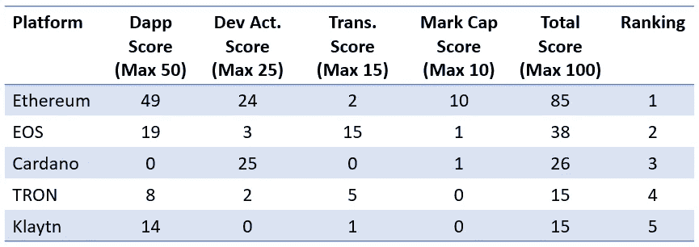

# 得分区块链抢地

> 原文：<https://medium.com/coinmonks/scoring-the-blockchain-land-grab-28fd70569495?source=collection_archive---------4----------------------->

## 哪些智能合约平台胜出？

Blockchain is the new Wild West

# 介绍

随着以太坊向以太坊 2.0 进军，Defi 在夏季的爆发增加了平台上的天然气费用。如果有一个时间来寻找能够扩展的替代品，那就是现在。尽管人们都在谈论“以太坊杀手”，但尽管 ico 知名度很高，知名度也很高，替代平台仍未能获得关注。

为什么？大多数人指出以太坊的先发优势和网络效应。其他平台指出，我们仍处于早期阶段，还没有进入零和游戏。备受期待的协议，如 Polkadot 和 Dfinity，要么刚刚推出，要么即将推出他们的 mainnets，所以在我们宣布任何赢家之前，还有很多比赛要打。这个游戏很重要，因为它为我们去中心化的未来的大规模采用奠定了基础。

如果以太坊领先，领先多少？这篇文章的目的是使用一个量化模型来比较第 1 层智能合约平台，该模型通过不同的“使用”维度对它们进行加权和评分。按照用法，我查看了以下内容:

*   **Dapp 活动(50%权重)** —总 Dapp、每日活跃用户和合同数量，通过最终用户交互显示当前使用情况
*   **开发者活动(25%权重)** —显示潜在的未来用途，因为空间仍然是临时的
*   **(15%权重的)交易数量** —按 24 小时交易活动显示原始使用情况
*   **市值(10%权重)** —显示基于本地令牌需求的兴趣

# 五大智能合约平台

如果您对评分方法感兴趣，下面列出了它。每个平台都得到了一个从 0 到 100 的指数分数。要达到 100 分，平台需要在每个维度都有最高分。结果如下:

Top 5 Index Scores from My Model

## 毫无疑问，以太坊是第一名

虽然以太坊领先并不令人惊讶，但领先的幅度却令人惊讶。该协议的多年领先优势和网络效应使其确立了绝对领先地位，得分是第二名平台 EOS 的两倍多。这告诉我以太坊要被超越还需要很多时间，这给了它大量的时间来推出以太坊 2.0。

## 大牌竞争对手在哪里？

Polkadot、Cosmos、Solana——名单上的大牌在哪里？我把它们包括在我的分析中，但是给它们打分还为时过早。尽管到处寻找，我还是找不到任何关于 Dapp 数量、每日活跃 Dapp 用户和合同数量的可靠信息。如果我使用这些维度的平均得分，波尔卡多特、索拉纳和宇宙将连续排名第 4、5 和 6。如果任何人有关于 Dapps 和这些平台上的活动的可靠数据，请给我发电子邮件。

## 等等，卡尔达诺？

Cardano 在夏季推出了 Shelley mainnet，在 Goguen 今年晚些时候推出之前，他们无法托管智能合约。他们的 mainnet 上运行的事务最少，Dapp 活动为零，所以他们在列表中排名第三。因为我给了开发者活跃度 25%的权重，而 Cardano 在这一类别中拥有最多的活跃度，所以该平台的得分达到了所有平台争夺总分第三的同一水平。

## 克莱顿是什么？

大多数人认为以太坊、EOS 和 TRON 是 Dapps 的主要协议。但是克莱顿是谁，这个平台怎么能和更知名的创相提并论呢？第一，两个平台都有相同的 15 的低分，几乎比以太坊低 6 倍。但是克莱顿拥有大量的日活跃 Dapp 用户(22300)，非常接近以太坊。Klaytn 是由韩国 Kakao 公司创建的平台，在该协议上运行大量聊天和加密交换应用程序。

# 每个维度的前 5 大平台

## Dapp 活性(50%权重)

Dapp Usage as of 9/29/2020

关于 Dapp 活动的思考:

*   在我看来，Dapp 活动是最重要的指标，这就是为什么我给了它 50%的权重(25%表示 Dapp 数量，15%表示每日活跃用户，10%表示合同数量)。
*   以太坊在 Dapps 活动总数上遥遥领先，加权得分比排名第二的 EOS 高出约 2.5 倍。
*   EOS 每个应用的日活跃用户数非常高，这表明粘性很大。
*   Dapp 活动指标很难获得——大部分信息来自 Stateofthedapps 和 Dappradar。然而，在我分析的大约 29 个协议中，我只能找到其中 11 个的可靠 Dapp 信息。
*   随着我们在 Cosmos、Polkadot、Cardano 和 Solana 等后起平台上获得更可靠的 Dapp 指标，它们显然会以更高的指数得分上升。

## 开发者活动(25%的权重)

Avg Daily Dev Activity in Sept 2020 from Santiment

关于开发活动的想法:

*   我给予开发活动仅次于 Dapp 活动的最高权重(25%)，因为这是一个很好的领先指标，表明未来平台在仍处于早期阶段的竞争中的使用情况。
*   有趣的是，Cardano 拥有最多的开发人员活动，考虑到它是在夏天上线的，没有像 Dfinity、Polkadot 和 Cosmos 这样的项目那么多的品牌认知度。
*   前 5 名主要是最近才推出的知名协议。看看这些平台是否会取代竞争对手如 TRON、EOS 和 Klayton，这将是一件有趣的事情。
*   大多数数据来自 Santiment 的社区 API，但我不得不直接查看 Klaytn、Hedera Hashgraph、Steem 和 IOST 的 Github insights。

## 交易数量(15%的权重)

20 Hour Transaction Activity on 9/29/2020

关于交易数量的思考:

*   总的来说，我不太喜欢这个指标，因为事务计数受阻塞时间的影响。虽然这是一个很好的活动衡量标准，但它通常不是苹果与苹果的比较，所以我只给了它 15%的权重。
*   大多数数据来自 Blocktivity.info。由于他们没有我评估的所有协议的数据，我补充了来自 Coinmetrics 社区 API 的信息。
*   虽然 Blocktivity 强调操作，但我坚持使用事务计数，因为这是唯一的 Coinmetrics 跟踪指标，并且我需要跨数据源进行等价的比较。

## 市值(10%权重)

Market Cap from Coinmetrics on 9/29/2020

关于市值的思考:

*   虽然我不认为市值与平台活动有很大的相关性，但它确实表明了人们对平台的兴趣，因为本地令牌需求。这就是为什么我只给它 10%的权重。
*   虽然 Polkadot 最近才推出他们的 mainnet，但它的市值仅次于以太坊，位居第二，这预示着未来的潜在增长。
*   与卡尔达诺相似；据我所知，它在夏季推出，没有任何现场 Dapps，但其象征性的价格使其成为市值第三大最有价值的协议。

# 评分方法和数据来源

任何衡量不同变量的模型都会有一定程度的基于权重的主观性。我的模型更加强调协议上 Dapp 活动的数量，因为在我看来，智能合约平台需要证明社区关心它的一般计算能力。如果他们只是想传输令牌，有很多第 1 层协议只关注这一点。

让我们看看每个维度及其各自的权重:

Dimensions and Data Sources for my Model

我查看了 29 个不同的协议——如果你关心所有的细节，这里有我的完整评分电子表格的链接:

[https://1drv.ms/x/s!AvTKSsyaojbohn8DdnDwBhGdeQvW?e=LPw5yo](https://1drv.ms/x/s!AvTKSsyaojbohn8DdnDwBhGdeQvW?e=LPw5yo)

## 另外，阅读

*   最好的[密码交易机器人](/coinmonks/crypto-trading-bot-c2ffce8acb2a)
*   [密码本交易平台](/coinmonks/top-10-crypto-copy-trading-platforms-for-beginners-d0c37c7d698c)
*   最好的[加密税务软件](/coinmonks/best-crypto-tax-tool-for-my-money-72d4b430816b)
*   [最佳加密交易平台](/coinmonks/the-best-crypto-trading-platforms-in-2020-the-definitive-guide-updated-c72f8b874555)
*   最佳[密码借贷平台](/coinmonks/top-5-crypto-lending-platforms-in-2020-that-you-need-to-know-a1b675cec3fa)
*   [最佳区块链分析工具](https://bitquery.io/blog/best-blockchain-analysis-tools-and-software)
*   [加密套利](/coinmonks/crypto-arbitrage-guide-how-to-make-money-as-a-beginner-62bfe5c868f6)指南:新手如何赚钱
*   最佳[加密制图工具](/coinmonks/what-are-the-best-charting-platforms-for-cryptocurrency-trading-85aade584d80)
*   [莱杰 vs 特雷佐](/coinmonks/ledger-vs-trezor-best-hardware-wallet-to-secure-cryptocurrency-22c7a3fd391e)
*   了解比特币的[最佳书籍有哪些？](/coinmonks/what-are-the-best-books-to-learn-bitcoin-409aeb9aff4b)
*   [3 商业评论](/coinmonks/3commas-review-an-excellent-crypto-trading-bot-2020-1313a58bec92)
*   [AAX 交易所审核](/coinmonks/aax-exchange-review-2021-67c5ea09330c) |推荐代码、交易费用、利弊
*   [Deribit 审查](/coinmonks/deribit-review-options-fees-apis-and-testnet-2ca16c4bbdb2) |选项、费用、API 和 Testnet
*   [FTX 密码交易所评论](/coinmonks/ftx-crypto-exchange-review-53664ac1198f)
*   [n 零审核](/coinmonks/ngrave-zero-review-c465cf8307fc)
*   [Bybit 交换审查](/coinmonks/bybit-exchange-review-dbd570019b71)
*   [3Commas vs Cryptohopper](/coinmonks/cryptohopper-vs-3commas-vs-shrimpy-a2c16095b8fe)
*   最好的比特币[硬件钱包](/coinmonks/the-best-cryptocurrency-hardware-wallets-of-2020-e28b1c124069?source=friends_link&sk=324dd9ff8556ab578d71e7ad7658ad7c)
*   最佳 [monero 钱包](https://blog.coincodecap.com/best-monero-wallets)
*   [莱杰纳米 s vs x](https://blog.coincodecap.com/ledger-nano-s-vs-x)
*   [bits gap vs 3 commas vs quad ency](https://blog.coincodecap.com/bitsgap-3commas-quadency)
*   [莱杰纳米 S vs 特雷佐 one vs 特雷佐 T vs 莱杰纳米 X](https://blog.coincodecap.com/ledger-nano-s-vs-trezor-one-ledger-nano-x-trezor-t)
*   [block fi vs Celsius](/coinmonks/blockfi-vs-celsius-vs-hodlnaut-8a1cc8c26630)vs Hodlnaut
*   Bitsgap 评论——一个轻松赚钱的加密交易机器人
*   为专业人士设计的加密交易机器人
*   [PrimeXBT 审查](/coinmonks/primexbt-review-88e0815be858) |杠杆交易、费用和交易
*   [埃利帕尔泰坦评论](/coinmonks/ellipal-titan-review-85e9071dd029)
*   [赛克斯·斯通评论](https://blog.coincodecap.com/secux-stone-hardware-wallet-review)
*   [BlockFi 审查](/coinmonks/blockfi-review-53096053c097) |赚取高达 8.6%的加密利息