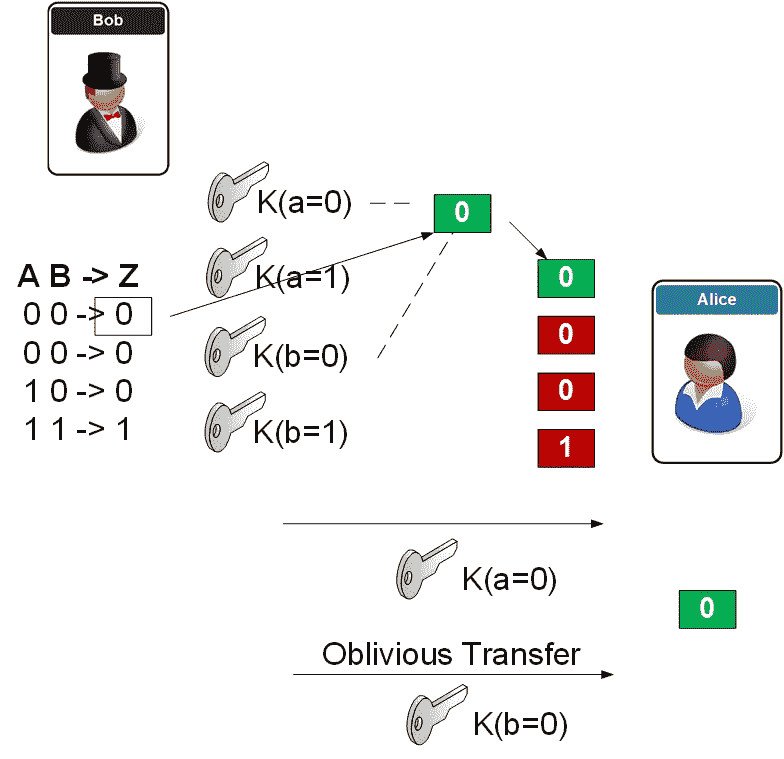

# 混乱的电路——带有不经意传输的 SFE

> 原文：<https://medium.com/coinmonks/scrambled-circuits-sfe-with-oblivious-transfer-47255a04f9d2?source=collection_archive---------6----------------------->

本文所用方法的演示是[这里是](https://asecuritysite.com/encryption/obf)。

## 介绍

在网上你能真正信任谁？基本上…没有人！

那么，为什么我们为了回答简单的问题而放弃这么多数据呢？为了证明我们拥有一个银行账户，我们必须给出我们的 CVS 号码，这样任何人听到后都可以…