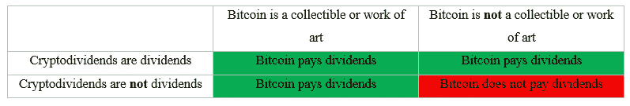

# 寻找黑天鹅——浅析纳西姆·塔勒布的《比特币黑纸》

> 原文：<https://medium.com/coinmonks/searching-for-a-black-swan-a-brief-analysis-of-nassim-talebs-bitcoin-blackpaper-f67ba4ede4a?source=collection_archive---------1----------------------->

纳西姆·塔勒布是我们这个时代最有影响力的作家之一，所以我认为有必要仔细看看他最近发表的，据称是谴责“比特币黑纸”的文章。

让我们从他的两个主要结论开始:比特币既不是一种可靠的货币(毫无价值)，也不是一种伟大的技术。由于第二个结论是基于对第一个结论的争论，让我们首先考虑什么是合理的货币。

经济学家普遍认为货币应该有三个功能。它应该作为一个“价值仓库”运作，这意味着它在未来或多或少会保持其购买力。它应该作为一个“记账单位”或一个合理的价值衡量标准，以便对成本、价格和利润进行有意义的解释。它应该作为一种“交换媒介”发挥作用，这意味着它可以很容易地被商品和服务所交换。

Taleb 使用定量金融方法和经济论据来证明比特币在这三个方面都失败了。

为了提供一个总结，我在下面列出了我认为是他的论点(我的话用的是**粗体字**，Taleb 的*斜体字*)。我将这些论点分为两组——第一组论点是他认为比特币价值为零的主要假设，第二组论点是得出这一结论所不必要的，但支持比特币作为一种交换媒介和记账单位并不好的观点。

## 主要参数

1.  **比特币未能成为一种价值存储，因为它存在吸收障碍，包括矿商灭绝、技术过时和用户拒绝**(*)“……如果我们预计，在未来的任何时候，矿商灭绝时，价值将为零，技术过时，后代进入其他类似的“资产”,比特币对他们失去吸引力，那么现在价值必须为零。”*)
2.  **比特币也无法储存价值，因为它支付零分红** ( *“如果任何非分红资产遇到吸收障碍的概率最小，那么它的现值必须是 0。”*)

## 次要参数

1.  **由于购买力的易变性，比特币未能成为一种交易媒介** ( *“为了能够定期购买以比特币计价的商品……它要求比特币与美元的平价具有足够低的易变性，以至于可以承受，而变化则无关紧要。”*)
2.  **比特币未能成为一种交易媒介，因为交易昂贵而缓慢** ( *“比特币的交易比电汇或其他模式，或其他加密货币的交易要昂贵得多，比信用卡公司使用的标准商业系统慢几个数量级。”*)
3.  **比特币未能成为记账单位，因为它几乎没有定价** ( *“一个真正的计价单位必须是相对于任意一篮子商品和服务方差最小的单位。”*)
4.  **比特币是一种糟糕的通胀对冲工具，因为它是一种失败的记账单位**(*)“…我们可以将通胀对冲视为最小方差计价单位的模拟。”*)。

在我的回答中，我把重点放在主要的论点上，因为我认为这些论点比其他论点更有可能毁掉比特币的未来。第二个论点被这样一个事实削弱了，即比特币是一种正在快速资本化的资产，因此在它被采用的生命周期早期，波动是可以预期的，因此我们不应该指望它会有太多的定价。

# 一阶假设

塔勒布用数学证明来支持他的比特币价值为零的观点。但是，这个证据基于两个关键假设:(a)吸收壁垒和(b)零股息。应该仔细检查这些假设，因为如果其中任何一个是无效的，那么任何基于它们的推论也是无效的。

我将从“零股息”开始，因为这是一个自由度更少的更直接的论点。

# 零股息

我的第一反应是，比特币借贷呢？你可以通过出借比特币进行[保证金交易](https://www.gemini.com/earn)来赚取利息，因为许多交易对都是以比特币计价的。你也可以通过在同样受益于流动性提供者的 DeFi 应用中出借比特币来赚取利息。

我的第二个回应与塔勒布在定义无股息收益资产时所做的声明有关:

> “我们将收藏品排除在这一类别之外，因为它们具有审美效用，在某种程度上，就好像人们以相当于股息的费用出租它们——与易腐消费品没有什么不同。”

在我眼里，比特币从诞生到现在都是收藏品。2009 年比特币问世时，它的价值为零。对于那些看到其技术前景的密码朋克和极客来说，除了作为收藏品之外，它没有任何价值。一年后的今天，它仍然不值一分钱。现在，我们有了五位数的比特币，但我不认为它已经失去了作为收藏品的地位。拥有 2100 万枚比特币中的一枚或多枚会有一定的诱惑力。比特币甚至可以被视为[艺术](https://www.epsilontheory.com/in-praise-of-bitcoin/)。

但与塔勒布不同，我不会暗示我的观点是事实。你可能同意比特币的股息为零，但你会认为(a)加密股息不是股息,( b)比特币不是收藏品或艺术品，因此与 Taleb 一样位于下面的红色象限:

如果塔勒布正在就什么构成“显性收益”进行某种法律论证，那将是一回事。但如果我们对风险下的决策感兴趣，这将更有意义，那么主观性应该被考虑在内。

为此，如果有非零概率的个人在红色象限之外，那么比特币也有非零概率支付股息。

我们还应该考虑到实际上还有第五个“我不知道”群体。鉴于比特币仍处于早期采用阶段，世界上大多数人很可能属于这第五类。然后，即使我们把其他四组的几率放在 Taleb 这边，我们仍然可以得出比特币的预期股息大于 0 的结论。然后，塔勒布认为比特币一文不值的论点将被推翻，即使他关于吸收壁垒的观点是正确的。让我们转向下一个。

# 吸收障碍，遍历性，累积破产

Taleb 认为，有像黄金这样更安全的遍历性资产(时间平均=期望值)，也有像比特币这样风险更大的“非遍历性”资产(时间平均≠期望值)。他断言，比特币不是遍历的，因为它将被某些在未来某个时候肯定会发生的灭绝事件(吸收障碍)弄得永远一文不值(毁了)。另一方面，根据塔勒布的说法，黄金没有吸收障碍:

> 黄金和其他贵金属基本上是免维护的，不会随着历史的推移而退化，也不需要维护来更新它们的物理属性

关于吸收壁垒的争论本身基于遍历性经济学，这是一个新兴的经济学领域，挑战主流经济模型，但仍有许多问题需要解决。让我们简单讨论一下。

## 遍历性问题

遍历性最初是在 19 世纪的物理学中发展起来的，当时路德维希·玻尔兹曼建议使用整体平均值(在一个时间内许多相同系统的平均值)而不是时间平均值(单个系统在许多时间内的平均值)来模拟流体的宏观特征，如压力和温度。在它有效的地方，动态描述可以被不需要建模时间的更简单的概率描述所取代。

举例来说，想象一枚硬币翻转 10000 次。因为抛硬币是遍历性的，所以正面和反面的分布和同时抛 10，000 个硬币差不多。因此，在模拟投掷硬币的平均时间时，可以忽略时间。

现代经济理论将遍历性假设扩展到财富模型。但是，财富并不像抛硬币那样，因为它会随着时间的推移而演变——财富会增长。一些人认为这代表了主流经济学基础的一个缺陷。遍历经济学的著名学者 Ole Peters 在他的 2019 *自然物理学* [论文](https://www.nature.com/articles/s41567-019-0732-0#:~:text=Ergodicity%20economics%2C%20in%20contrast%2C%20computes,actions%20of%20our%20younger%20selves.)中指出:

> “为了做出经济决策，我经常想知道在不同的情景下，我的个人财富增长有多快。这需要确定在某种财富模型中随着时间的推移会发生什么。但由于错误地假设了遍历性，在计算增长之前，财富经常被其期望值所取代。因为财富不是遍历性的，所以会出现无意义的预测。”

他继续批评整个主流经济学，但也许这是没有根据的。这篇[反驳文章](https://www.researchgate.net/publication/346621008_Economists'_views_on_the_ergodicity_problem)的作者提出了一些我们在过度延伸遍历经济学有用之处之前应该考虑的评论。例如，对实际的人类偏好建模:

> “……一些遍历预测似乎忠实于偏好，而另一些则不然。一个人会喜欢一个在三轮后将财富从 10，000 美元减少到 0.5 美分的过程，而不是一个产生 10，000，000 美元的概率为 99.9%，否则为 0 美元的过程吗？”

以及时间是否总是人类实际决策中最重要的方面:

> 虽然我们对经济商品的消费确实会随着时间的推移而增长，但时间并不是我们所有决策中最重要的方面。对于我们的许多决策来说，其他同样普遍存在的方面，如风险、战略和利弊平衡，更为重要。”

那么，当比特币适合多方面的投资策略时，将它的价值定在零以上，或者仅根据时间就断定它的价值为零，这真的是荒谬的吗？

与 Taleb 不同，我看不出如何客观地将资产分类为具有或不具有吸收障碍。所有的资产都是可破坏的人类构造，没有任何东西有内在价值。客观地说，它们只是有某种能量形式。考虑资产价值基础设施不可逆转地崩溃(“吸收”)的连续风险似乎更合理。对于黄金来说，在正常情况下发生变异或降解的可能性很低，但在未来的某个时候，人们可能会对黄金失去储存价值的兴趣，或者在工业用途中被一种更好的材料取代。  对于比特币来说，其价值基础设施崩溃的几率有多大？让我们看看塔勒布有什么要说的，然后考虑一些替代的观点。

# 矿工灭绝

> "一个核心属性是，比特币永久依赖于此类矿工的存在."

首先，这种说法在技术层面似乎存在一些问题。Procurius 的创始人 Bert Slagter，[反对 Taleb 混淆媒体的信息:](https://twitter.com/bslagter/status/1407067692222369793)

> “这不是书的问题，而是文本的问题。不是 CD，而是音乐。不是区块链，而是 UTXO[未用事务输出]集。  不是挖掘，而是协议……比特币-资产(或 UTXO set)不依赖于任何具体的技术实现。”

信息和媒介的融合对遍历性论证提出了挑战。Slagter 指出，当您考虑区块链和协议支持 UTXO (as)集的适应性时，诸如矿工、黑客和 bug 的安全预算不足等风险实际上并不重要:

> “生态系统可以集体决定转换数据结构、算法或共识机制。并完全康复。”

因此，从技术上讲，miner 消光既不是吸收的充分条件，也不是吸收的必要条件。

作为这种技术适应性的证据，市值第二大的加密货币以太坊(Ethereum)已经在将其协议从工作证明转变为股权证明，有效地彻底消除了采矿，从而防止了矿工的灭绝，同时保留了矿工的功能:订购交易和创建新区块。

第二，PayPal 首席工程师丹尼尔·布莱恩(Daniel Brain)认为，Taleb 混淆了比特币开采的因果关系:

> “比特币要灭绝，真正的原因必须是交易量减少。只要有交易和费用，就会有矿工；比特币的区块规则和难度调整机制保证了这种确定性。”

但是比特币的交易会减少吗？大脑回复:

> “除非网络在获得采用方面停滞不前。这是已知的；没有人认为，无论是否被采用，比特币都会成功。”

鉴于最近的发展，很难证明采用会很快失败，比如 DeFi 的爆炸式增长，包括 PayPal 和 Robinhood 在内的数十亿美元金融科技公司开设比特币交易所和托管服务，以及机构采用和便利化的浪潮。此外，尽管只有 12 岁，但据估计，截至 2021 年 1 月，超过 7000 万人拥有比特币，每天有超过 10 万人加入网络。

第三，怀俄明大学哲学教授、比特币研究团体 Resistance Money 的创始成员[Bradley Rettler 认为，Taleb 的结论因遗漏和不足的论据而被削弱:](https://twitter.com/rettlerb/status/1406964755525521415)

> “没有增加‘没有矿工’或‘没有矿工时价值会变为零’，这两个说法也没有任何争议。因此，与其说这是一场反对比特币的争论，不如说这是一个关于预期价值的普遍观点。”

我还觉得奇怪的是，塔勒布声称“当矿工灭绝时”，比特币将变得一文不值，却没有讨论这种可能性何时或有多大。实际上，对于许多比特币所有者来说，比特币无限期保值并不重要，重要的是它可以帮助他们在有生之年保持或增加财富。此外，最终的比特币预计要到 2140 年才会被开采。到那时，比特币将比现在的法定美元还要老 80 多年。

对于那些寻求长期价值储存的人来说，认为比特币将持续几代人以上并不荒谬，特别是考虑到内置的基础设施适应性。例如，比特币的协议使用了一种基于区块时间的难度调整机制，这种机制可以保持区块时间恒定、通胀可预测，并激励矿工。一个预先确定的时间表已经到位，以逐步过渡到使用交易费作为矿工足够的安全预算。此外，正如斯拉格特所指出的，无论如何，比特币在技术上并不永远依赖于矿工的存在。相反，比特币依赖于一种可以适应未来条件的不可信共识机制。

# 技术过时

> “技术往往会被其他技术取代，其脆弱性与其过去的生存时间成比例(99%以上的新技术会被更新的技术取代)，而黄金和白银等物品已被证明具有抗灭绝性。”

在信息时代，比特币并不新鲜。如果互联网有一个 26 岁的孩子，比特币现在应该是它 12 岁的青少年。 [⁴](#c5f1) 另外，我不知道塔勒布是如何得到他的“> 99%”替代数字的，也不知道它实际上与比特币有多大关系，但我敢打赌，比特币比它所包含的大部分技术都要长寿。

除此之外，至少有两个相关的主题 Taleb 在这里没有涉及:(a)技术适应和(b)技术分层。

塔勒布通过将比特币与 *gettoni* 进行微弱的类比，揭示了他对技术适应性的忽视，gettoni 是意大利的国家电话令牌，在 20 世纪 70 年代作为货币被接受，但随着通信变得更便宜，电话被先进的技术取代，它变得过时了。将比特币这个“活的”多层信息网络比作一块压制的青铜是没有意义的。

互联网和比特币之间有更好的相似之处。像互联网的 IP/TCP 网络和传输层一样，比特币的网络和交易层自适应地解决了限制和漏洞。我们大多数人不担心 IP/TCP 层的吸收障碍。当我们在互联网上存储任何有价值的东西或投资互联网技术和平台时，我们完全信任它的基础设施和适应性。为什么我们不能为比特币做同样的事情呢？

或者*什么时候*我们应该相信比特币的基础设施和适应性？我不能说，但塔勒布也不能。这取决于个人的风险偏好。

至于技术分层，Brain 指出:

> Taleb 还忽略了成功的技术通常是建立在其他技术之上的。以比特币为基础的互联网是一个世纪或更长时间以来计算机科学的顶峰。他说计算机科学是建立在几个世纪以前的科学和创新之上的。所以，让我们假设一个世纪后会有比特币的继承者。如果这位继任者继续使用比特币及其现有的价值储存手段作为基础，我不会感到惊讶。”

从某种意义上来说，比特币可能只有 12 年的历史，但它的技术基础设施可以说要古老得多。在这种情况下，塔勒布所指的林迪效应(Lindy effect)——或者用存在时间来判断技术的稳健性——将预示着相当长的保质期。

## 关于交易

> *“比特币的交易比电汇或其他方式，或其他加密货币的交易要昂贵得多，而且比信用卡公司使用的标准商业系统慢几个数量级。”*

Taleb 似乎暗示比特币的交易成本和速度是技术过时的一个原因。但是，将第三层信用卡网络与第一层最终结算网络进行比较没有多大意义。此外，正如 Brain 指出的:

> “这个论点完全忽略了闪电网络，它作为一个交易层位于比特币之上，是即时的，几乎没有感觉。比特币旨在充当其下的价值储存和结算层。因此，我们可以完全忽略这一论点。”

塔勒布[反驳](https://twitter.com/nntaleb/status/1408689235968856065)声称闪电网络不存在。但事实是，确实如此。只是还没有被广泛采用。作为一个实验性的第二层解决方案，这并不奇怪。此外，随着最近的发展，牵引力似乎更有可能增加而不是减少，例如 2020 年 [Bitfinex](https://ln.bitfinex.com/) (目前以 24 小时流量排名第四的 CEX)和今年[北海巨妖(第八大 CEX)](https://blog.kraken.com/post/7225/a-need-for-speed-kraken-to-launch-bitcoin-lightning-%E2%9A%A1%EF%B8%8F-integration-in-2021/)采用 Lightning。Strike 还在萨尔瓦多部署了一款[比特币闪电支付应用](https://www.coindesk.com/strike-launches-bitcoin-lightning-payment-app-in-el-salvador-full-eu-support-is-next)，该国上个月将比特币作为法定货币。

此外，当他的论点建立在未来的可能性上时，塔勒布很快驳回了“现在不存在的东西 [⁵](#c71a) ”这不是很讽刺吗？

# 用户拒绝

> “我们不能指望账本上的一个条目需要感兴趣和受激励的人积极维护，以在任何这样的时间内保持它的物理存在，这是货币价值的一个条件——当然，我们也不确定未来几代人的兴趣、心态和偏好。”

让我们深入了解一下塔勒布在这里究竟假设了什么。比特币“存在”于流经互联网的二进制数据和代码中。要真正摧毁它，你需要擦除分散网络中所有 80，000 多个比特币完整节点的数据，或者摧毁互联网。但像互联网一样，比特币网络的设计没有单点故障，所有数据都流经该网络，比特币客户端为可能的分段或中断做好了准备。

那么，塔勒布的意思是，用户的兴趣不仅会减弱，而且肯定会在全球范围内一致拒绝比特币，导致永久的数据丢失。当以这种方式陈述时，它确实让我怀疑塔勒布是否在滥用遍历性经济学来诱导恐惧(FUD)，而他本可以将他的智力用于更有用的讨论，即从那些仅仅是可能的风险中分离出可能的风险。

如果塔勒布转而辩称，人们对比特币的兴趣可能会有消长的风险，没人会对此进行辩论。但它也不会构成吸收屏障。事实是，即使绝大多数比特币用户对其失去兴趣，比特币也会保值，人们会挖掘和交易它。

但是为了塔勒布，让我们假设这个假设是真的。比特币完全被遗忘了。它的价值会变为零吗？是的，价值是人类的产物。它的价值能从零恢复吗？是的，只要 UTXO 集没有被不可挽回地摧毁。有可能吗？我不这么认为。

要理解为什么，我们应该考虑比特币的技术和社交网络层的强度。

## 新兴组织

虽然比特币的技术方面令人惊叹，比如它的区块链，但它的人性方面受到的关注要少得多，即使它可以说增加了可以与区块链相媲美的稳健性。

作为一个社会物种，人类创造了超越个体的新兴组织——从朋友和家人到城市和文明的结构。从我们的基因到我们的大脑和身体，我们的生物学已经进化到支持这些新兴结构，因为它们促进的社会行为帮助我们生存和繁殖。历史表明，这种向更大规模和可进化性的合作组织的进化进程是不可阻挡的。

以比特币为例，其去中心化的网络层催生了一个全球货币联盟，该联盟在游戏中拥有超过 6000 亿美元的皮肤，并通过区块链的分布式信任而团结在一起。正如《掌握比特币的 T2》一书的作者 Andres Antonopoulos 解释的那样:

> “比特币是一个高度复杂的分散式信任网络，可以支持无数的金融流程……许多节点之间的互动是导致复杂行为出现的原因，而不是任何内在的复杂性或对任何单个节点的信任。”

就像基因层面的利己主义一样，比特币的节点操作者层面的利己主义不会阻止合作和可进化性的增加。正是比特币的设计让自身利益强化了网络。运行完整节点为您提供了完整的分类账，因此您不需要向第三方查询，通过使网络更加强健来保护您的比特币投资，提高您的区块链查询速度，并最大限度地保护您的隐私。还有一个可选的信号价值，当它[推动](https://www.researchgate.net/publication/228355728_Why_do_people_write_for_Wikipedia_Incentives_to_contribute_to_open-content_publishing)像维基百科这样的在线社区的激励经济增长时，这一点不应该被忽视。正是区块链的这些特点，让我怀疑中央集权的政权在反对比特币或比特币的某种演变方面是否占了上风。

虽然 Antonopoulos 倾向于比特币的技术方面，但这意味着比特币是通过机器和人类的融合而获得生命的，这是一种分散的技术结构，由支持分散的社交网络激活。他写道:

> “一个拥有数百万成员的蚁群所表现出的高度智能和复杂的行为，是社会网络中个体互动的一种自然属性。《自然》表明，分散的系统可以是有弹性的，可以产生涌现的复杂性和难以置信的复杂性，而不需要中央权威、等级制度或复杂的部分。”

随着比特币社区的发展，根据进化理论，它的适应性弹性也在增长，根据网络效应，它对个体成员和非成员的价值也在增长。换句话说，网络驱动的自我强化很可能与增加而不是减少回报(更不用说完全贬值)的[齐头并进。](https://allenfarrington.medium.com/the-complex-markets-hypothesis-44c2b2b191d2)

# 结论

总而言之，我认为阻碍塔勒布观点的是，它过于依赖比特币现状的快照来预测它将会变成什么样，就好像信息技术和黄金一样不可改变。它忽略了比特币的来源和未来。不要被框架中的东西所迷惑，要明智地看待被遗漏的东西。

更好的估值应该考虑到参与比特币的人的相互进化和比特币本身的技术基础设施——这两者对比特币的价值基础设施都至关重要。如果我们忽视其中任何一个，我们就有可能因为假设微小或遥远的可能性是必然的而扭曲我们对未来的看法。我们高估了风险，低估了风险发生的时间。或者更糟，我们把婴儿和洗澡水一起倒掉。

如果人们对发行法定货币的政府失去信心，法定货币就会变得毫无用处。像土地和房屋这样的财产会被自然灾害或战争摧毁。珠宝和收藏品会失去它们的美学效用。

UTXO 集充当构建比特币交易时所有可用可消费输出的全局数据库。整个 UTXO 集由比特币完全节点跟踪，以确保用户不能花费已经花费的比特币，防止重复花费。

当尼克松总统在 1971 年将美元与黄金脱钩时，美元从代表货币转变为法定货币，这使得法定美元有了大约 50 年的历史。20 年后，比特币的年龄将是法定美元的一半。

⁴1983 年 1 月 1 日，阿帕网和国防数据网正式采用 TCP/IP 标准，允许所有前身网络作为互联网互联，互联网由此诞生。

⁵即使塔勒布对这个要求很固执，他也不应该忽视已经有大量的交易所作为事实上的二级交易层，每天以网络速度处理价值数十亿美元的比特币。

**查询:0x1844@protonmail.com(开放上班)**