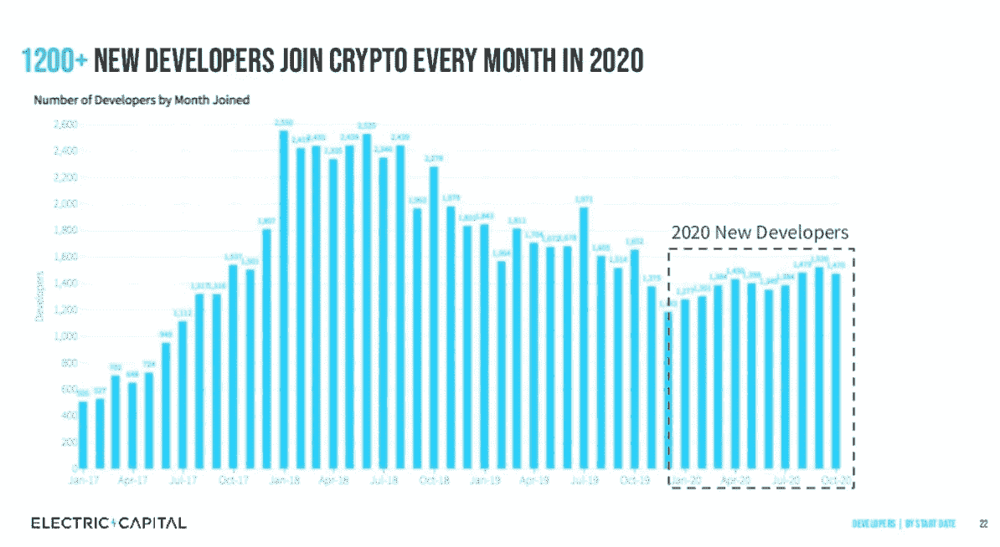

# 美国证券交易委员会开设数字资产办公室/史蒂夫·沃兹尼亚克启动 Efforce / Paxos & BitPay 申请成为银行

> 原文：<https://medium.com/coinmonks/sec-opens-digital-assets-office-steve-wozniak-launches-efforce-paxos-bitpay-filing-to-be-ac99c45e9972?source=collection_archive---------2----------------------->

Photo by [Seth Doyle](https://unsplash.com/@sethdoylee?utm_source=unsplash&utm_medium=referral&utm_content=creditCopyText) on [Unsplash](https://unsplash.com/?utm_source=unsplash&utm_medium=referral&utm_content=creditCopyText)

*2020 年 12 月 12 日*

*对于风景来说，这是多么美好的一周啊！我们看到了几篇 2020 年年终总结(* ***电资*** *，* ***区块链资本*** *、DApps)和****2021****预测，显见性* ***梅萨里的*** *海量 134 页论文(链接)。然而,* ***SEC(证券交易委员会)*** *和最近的银行章程给了我们所有人，甚至更多，去思考 2021 年。美国证券交易委员会***宣布了其创新和金融科技的战略中心，名为 FinHub，致力于数字资产和区块链。道琼斯* *计划在 2021 年推出加密指数。紧随* ***BitPay 的*** *备案之后，****Pax OS****发布了成为美国联邦监管银行的计划****Stripe****宣布嵌入式商业银行服务 Stripe Treasury。****mass mutual****买入 1 亿美元的比特币(BTC)，而****MicroStrategy****也决定上调其 BTC 配置！Spotify 正在调查加密支付。* ***苹果*** *联合创始人* ***史蒂夫·沃兹尼亚克*** *正在创办第二家公司，****Efforce****，在 13 分钟内吸引 9.5 亿美元！* ***天秤座*** *更名为“****Diem****”以期待 2021 年的上市。* ***世界经济论坛(WEF)*** *和****chain link****正在提出 Oracles 的开源标准。**

*我们已经获得了新一轮的融资，包括并购活动、DApps 围捕、研究等等！再加上 ***以太坊 2.0*******meta mask*******霓虹区*******勇者*******春晚游戏*******雅达利*尽情享受吧！**********

## *🏢 [SEC 宣布成立新的独立办公室，专门负责数字资产和区块链](https://www.forbes.com/sites/jasonbrett/2020/12/04/sec-announces-new-standalone-office-dedicated-to-digital-assets-and-blockchain/)*

*美国证券交易委员会(SEC)宣布，创新和金融技术的战略中心，通常被称为 FinHub，将成为一个独立的办公室，专门负责数字资产和区块链。Valerie A. Szczepanik 将继续领导 FinHub，担任该办公室的第一任主任，直接向 SEC 主席报告。这一组织转变将有助于该机构识别和分析新兴新技术(尤其是金融技术)的机遇，并随着技术的发展吸引每个市场参与者……[阅读更多信息](https://www.forbes.com/sites/jasonbrett/2020/12/04/sec-announces-new-standalone-office-dedicated-to-digital-assets-and-blockchain/)*

**相关:📊* [*S & P 道琼斯指数 2021 年推出加密指数*](https://www.brecorder.com/news/40037988/sp-dow-jones-indices-to-launch-cryptocurrency-indexes-in-2021)*

**相关:💸SEC 的 Hester Peirce 说，DeFi 和 Eth2 对监管者来说是全新的**

## *🏦axos 成为最新一家申请联邦银行执照的加密公司*

*根据周三发布的日期为 12 月 8 日的公开文件， [Paxos](https://medium.com/u/f2ac5c463d5b?source=post_page-----ac99c45e9972--------------------------------) 正在寻求创建 Paxos 国家信托，向货币监理署(OCC)提交申请。它加入了加密支付公司 [BitPay](https://medium.com/u/ec0207055232?source=post_page-----ac99c45e9972--------------------------------) 寻求联邦特许作为银行运营。该银行将在纽约州经营……[阅读更多信息](https://www.coindesk.com/paxos-becomes-latest-crypto-firm-to-file-for-federal-bank-charter)*

**相关:*🏦[*比特币支付初创公司 BitPay 欲在格鲁吉亚创建一家国家银行*](https://www.theblockcrypto.com/linked/87175/bitpay-bitcoin-bank-occ-filing)*

**相关:*🏦[*富达数码以持有比特币为抵押进行现金贷款*](https://www.bloomberg.com/news/articles/2020-12-09/fidelity-digital-to-hold-bitcoin-as-collateral-for-cash-loans)*

# *🚨2020 年 EOY 和行业报告:*

*又到了一年中我们开始回顾去年并预测明年的时候了。这里有一份年底必读的清单。*

*📚[**2021 年的加密论文**](https://messari.io/crypto-theses-for-2021)**——[梅萨里](https://medium.com/u/7cf93d3c3400?source=post_page-----ac99c45e9972--------------------------------)的[瑞安·塞尔基斯](https://medium.com/u/6ea4a7e0c022?source=post_page-----ac99c45e9972--------------------------------)***

***📚 [**电资开发商报告**](/electric-capital/electric-capital-developer-report-2020-9417165c6444) — ⚡ [电资](https://medium.com/u/3cc66c573073?source=post_page-----ac99c45e9972--------------------------------)旗下[沈](https://medium.com/u/e7b6d27948ad?source=post_page-----ac99c45e9972--------------------------------)***

******

***[Source](/electric-capital/electric-capital-developer-report-2020-9417165c6444)***

***📚 [2020 年回顾](/blockchain-capital-blog/2020-year-in-review-9979ecdedb60)——[区块链资本](https://medium.com/u/9737c5ab2ab1?source=post_page-----ac99c45e9972--------------------------------)的[金哈尔·沙阿](https://medium.com/u/80ca7c5643d?source=post_page-----ac99c45e9972--------------------------------)。***

***📚[分散式应用(DApps)2020 年第四季度](https://www.topionetworks.com/markets/dapps-stack-landscape-5de8d07eb9abe453e04203f8/media/decentralized-apps-dapps-state-of-the-industry-q4-2020-5fc95986843bac512215ac11) —我，凯尔·埃利科特:)***

# ***本周的更多内容:***

***🏦 [MassMutual 购买 1 亿美元比特币](https://www.coindesk.com/massmutual-buys-100m-bitcoin-bets-on-institutional-adoption-with-5m-nydig-stake)***

***🏦 [Stripe 宣布推出嵌入式商业银行服务 Stripe Treasury](https://techcrunch.com/2020/12/03/stripe-announces-embedded-business-banking-service-stripe-treasury/)***

***🇰🇪 [下一个 M-Pesa 会是区块链的应用吗？](https://www.coindesk.com/index.php?p=553415)***

***👕[西班牙时尚品牌 Desigual 推出区块链供应链解决方案](https://www.ledgerinsights.com/spanish-fashion-brand-disigual-blockchain-supply-chain/)***

***💿[音频流媒体巨头 Spotify 正在调查加密支付](https://cointelegraph.com/news/audio-streaming-giant-spotify-is-looking-into-crypto-payments)***

***🌎[苹果联合创始人史蒂夫·沃兹尼亚克正在创办第二家公司 Efforce](https://www.cnbc.com/2020/12/04/apple-co-founder-steve-wozniak-is-starting-a-second-company-efforce.html)***

***🌎[区块链联盟推出可交易碳信用令牌](https://www.coindesk.com/blockchain-coalition-launches-tradable-carbon-credit-token)***

***♎ [Libra 更名为“Diem ”,预计于 2021 年发布](https://www.coindesk.com/libra-diem-rebrand)***

***🏦[中国建设银行区块链债券计划有了新方向](https://cointelegraph.com/news/china-construction-bank-s-blockchain-bond-efforts-take-a-new-direction)***

***💸 [Lil Yachty 在 21 分钟的代币销售中卖出了 375，000 美元，售价为$YACHTY](https://decrypt.co/51092/lil-yachty-token-sale-sold-out?amp=1)***

***🏦[富达数码将持有比特币作为现金贷款的抵押品](https://www.bloomberg.com/news/articles/2020-12-09/fidelity-digital-to-hold-bitcoin-as-collateral-for-cash-loans)***

# ***💸首都 Update️:***

***从投资到新基金，再到 M&A，这一切都凸显了最近的风险投资公告。***

***💸[收益率提高 490 万美元以简化赤字](https://www.coindesk.com/yield-defi-funding-round)——[收益率](https://medium.com/u/248cb6cd9b32?source=post_page-----ac99c45e9972--------------------------------)***

***💸标准普尔领投加密数据初创公司 Lukka 1500 万美元***

***💸[与 Foundry 的核心科学合作伙伴获得了 2300 万美元的采矿设备融资](https://www.theblockcrypto.com/linked/87219/core-scientific-foundry-mining-financing)***

***💸 [Swivel Finance 完成 115 万美元的种子融资，将利率衍生品引入 DeFi](https://swivel.substack.com/p/swivel-finance-closes-115m-seed-round)***

# ***DApps(分散式应用)手表:***

## ***🌐[以太坊 2.0: ETH 加密货币网络开始大升级](https://www.cnbc.com/2020/12/01/ethereum-2point0-eth-cryptocurrencys-network-starts-a-major-upgrade.html)***

***世界第二大加密货币“以太坊 2.0”正在对其基础网络进行拖延已久的升级，预计将使其更快、更安全。以太坊的支持者表示，计划中的升级可以让每秒钟发生数千次交易。升级后，[以太坊](https://medium.com/u/d626b3859bc9?source=post_page-----ac99c45e9972--------------------------------)区块链将过渡到“股份证明”模式。引入的另一项升级是分片，它将把网络分成许多可以处理事务的并行链，以加速网络……[阅读更多信息](https://www.cnbc.com/2020/12/01/ethereum-2point0-eth-cryptocurrencys-network-starts-a-major-upgrade.html)***

****相关:*💸[*北海巨妖交易所为开源以太坊项目提供首批资助*](https://www.coindesk.com/kraken-match-150k-grants-ethereum-developers)***

## ***🌎 [Chainlink，世界经济论坛希望将加密预言标准化](https://decrypt.co/50910/chainlink-world-economic-forum-standardize-crypto-oracles)***

***世界经济论坛(WEF)和 Chainlink，即分散的 oracle 网络，今天提出了一个将数据源连接到区块链智能合同的开源标准。这篇论文由最大的去中心化甲骨文网络 [ChainLink](https://medium.com/u/87d28920d977?source=post_page-----ac99c45e9972--------------------------------) 的联合创始人 Sergey Nazarov 和 WEF 区块链项目负责人 Punit Shukla 撰写，概述了一个开源框架，以帮助非区块链系统与智能合同对话。论文[“跨越治理鸿沟:区块链和遗留系统的互操作性”](http://www.wef.ch/interopblockchain)，支持像 Chainlink 这样的服务… [阅读更多](https://decrypt.co/50910/chainlink-world-economic-forum-standardize-crypto-oracles)***

## ***🎮[春晚游戏与勇者达成协议，为区块链游戏铺路](https://venturebeat.com/2020/12/04/gala-games-paves-path-for-blockchain-games-in-a-deal-with-brave-browser/)***

***春晚游戏与勇者达成协议，为区块链游戏铺平了道路。这笔交易显示了区块链游戏公司生存甚至繁荣的机会，因为它们在等待大量观众和热门产品的到来。区块链技术似乎很酷，但它带来了新游戏玩家的挑战，因为大多数游戏玩家不明白它是如何工作的。该伙伴关系旨在通过在质量和影响之间建立平衡来应对这一挑战。… [阅读更多信息](https://venturebeat.com/2020/12/04/gala-games-paves-path-for-blockchain-games-in-a-deal-with-brave-browser/)***

****相关:*🦊[*以太坊钱包 MetaMask 追逐机构 DeFi 市场*](https://decrypt.co/50975/ethereum-wallet-metamask-goes-after-institutional-defi-market)***

***⚒️ [对波尔卡多特的定义:生态系统概述](https://www.parity.io/defi-on-polkadot-an-ecosystem-overview/) — [波尔卡多特](https://medium.com/u/3e5a7d431699?source=post_page-----ac99c45e9972--------------------------------)***

***🎮[霓虹区](https://medium.com/u/9c59515ce072?source=post_page-----ac99c45e9972--------------------------------) [:第一季之路](/blockadegames/neon-district-the-road-to-season-one-648fccce7c9f)***

***⚒️ [WordPress 添加官方以太坊广告插件](https://cointelegraph.com/news/wordpress-adds-official-ethereum-ad-plugin)***

***🎮[雅达利希望开发者使用其品牌构建区块链游戏](https://decrypt.co/51043/atari-wants-developers-use-brand-build-blockchain-games)***

***🎥 [Theta Labs 推出区块链视频交付平台测试版](https://www.coindesk.com/theta-labs-beta-blockchain-video-content)***

# ***📺VCTV 的知识点滴:***

***本周，我想分享我最近在 VCTV 与区块链投资者的对话，内容是关于 2021 年风险投资将走向哪些机会领域的最新行业活动。尽情享受吧！***

***Source: [YouTube](https://youtu.be/Dk7WcqN7j6k)***

# ***🎙️研究:2020 年区块链和 DApps 状况:***

******

***Source: [Topio Networks](https://www.topionetworks.com/markets/dapps-stack-landscape-5de8d07eb9abe453e04203f8)***

****现已上市，免费赠送的是我最新研究的去中心化应用或* [***DApp“叠”景观图***](https://www.topionetworks.com/rep/dapps-stack-landscape-december-2020-5fc76545843bac77a3825d57)**—Q4 2020 版。这张地图提供了新兴 DApps 行业的全面概述和分类，突出了在构建下一代应用程序中发挥重要作用的 400 多家全球公司。作为奖励，我包括了一些生态系统玩家和团体，当你准备发布你的应用时，你需要熟悉它们。如果这是你看到的第一个版本，那就把它当作你进一步理解不仅仅是这个行业，而且是构建一个完全或部分去中心化的应用程序所需的所有核心技术的指导性路线图(DApp)。*****

********

****Source: [Topio Networks](https://s3.amazonaws.com/spoke-profiles-prod-assets/uploads/9312f9408ba3ef581b818c797cc7137d829d8a04/original/Blockchain_26th_Aug.pdf)****

****我们正在向完全数字化的经济转型，2020 年区块链行业的活动比以往任何时候都更能证明这一点。现在 w/**1100 多家公司**建设& **资金(300 亿美元以上！构成这种新经济的基础设施层。[的全面细分](https://s3.amazonaws.com/spoke-profiles-prod-assets/uploads/6b002da229bbc3453d3e903499d5671567703fb6/original/Q3_2020_Update_Blockchain_Landscape.pdf)现已发布，包括对前景的[深入概述](https://youtu.be/eE6XZ1RVblA)，新类别&商业模式，机会领域，新兴类别，用例，以及对 2020 年剩余时间到 2021 年的展望。******

****📣*想要了解区块链、DApps、DeFi 和 FinTech 行业的所有头条新闻、投资、深度研究和最新动态吗？* [***订阅***](https://www.topionetworks.com/newsletters) *并关注我* [***推特***](https://twitter.com/kyleellicott) *获取每周更新及更多！*****

## ****另外，阅读****

*   ****最好的[密码交易机器人](/coinmonks/crypto-trading-bot-c2ffce8acb2a)****
*   ****[Deribit 审查](/coinmonks/deribit-review-options-fees-apis-and-testnet-2ca16c4bbdb2) |选项、费用、API 和 Testnet****
*   ****[FTX 密码交易所评论](/coinmonks/ftx-crypto-exchange-review-53664ac1198f)****
*   ****[Bybit 交换审查](/coinmonks/bybit-exchange-review-dbd570019b71)****
*   ****最好的比特币[硬件钱包](/coinmonks/the-best-cryptocurrency-hardware-wallets-of-2020-e28b1c124069?source=friends_link&sk=324dd9ff8556ab578d71e7ad7658ad7c)****
*   ****[密码本交易平台](/coinmonks/top-10-crypto-copy-trading-platforms-for-beginners-d0c37c7d698c)****
*   ****[bits gap vs 3 commas vs quad ency](https://blog.coincodecap.com/bitsgap-3commas-quadency)****
*   ****最好的[加密税务软件](/coinmonks/best-crypto-tax-tool-for-my-money-72d4b430816b)****
*   ****[最佳加密交易平台](/coinmonks/the-best-crypto-trading-platforms-in-2020-the-definitive-guide-updated-c72f8b874555)****
*   ****最佳[密码借贷平台](/coinmonks/top-5-crypto-lending-platforms-in-2020-that-you-need-to-know-a1b675cec3fa)****
*   ****[莱杰纳米 S vs 特雷佐 one vs 特雷佐 T vs 莱杰纳米 X](https://blog.coincodecap.com/ledger-nano-s-vs-trezor-one-ledger-nano-x-trezor-t)****
*   ****[block fi vs Celsius](/coinmonks/blockfi-vs-celsius-vs-hodlnaut-8a1cc8c26630)vs Hodlnaut****
*   ****[Bitsgap 评论](/coinmonks/bitsgap-review-a-crypto-trading-bot-that-makes-easy-money-a5d88a336df2)——一个轻松赚钱的加密交易机器人****
*   ****为专业人士设计的加密交易机器人****
*   ****[PrimeXBT 审查](/coinmonks/primexbt-review-88e0815be858) |杠杆交易、费用和交易****
*   ****[HaasOnline 评论](/coinmonks/haasonline-review-d8d1a3400419)享受九折优惠****
*   ****[埃利帕尔泰坦评论](/coinmonks/ellipal-titan-review-85e9071dd029)****
*   ****[SecuX Stone 评论](https://blog.coincodecap.com/secux-stone-hardware-wallet-review)****
*   ****[BlockFi 评论](/coinmonks/blockfi-review-53096053c097) |从您的密码中赚取高达 8.6%的利息****
*   ****[开发人员的最佳加密 API](/coinmonks/best-crypto-apis-for-developers-5efe3a597a9f)****
*   ****[最佳区块链分析工具](https://bitquery.io/blog/best-blockchain-analysis-tools-and-software)****
*   ****[加密套利](/coinmonks/crypto-arbitrage-guide-how-to-make-money-as-a-beginner-62bfe5c868f6)指南:新手如何赚钱****
*   ****顶级[比特币节点](https://blog.coincodecap.com/bitcoin-node-solutions)提供商****
*   ****最佳[加密制图工具](/coinmonks/what-are-the-best-charting-platforms-for-cryptocurrency-trading-85aade584d80)****
*   ****了解比特币的[最佳书籍有哪些？](/coinmonks/what-are-the-best-books-to-learn-bitcoin-409aeb9aff4b)****

> ****[直接在您的收件箱中获得最佳软件交易](/coinmonks/newsletters/coinmonks)****

********