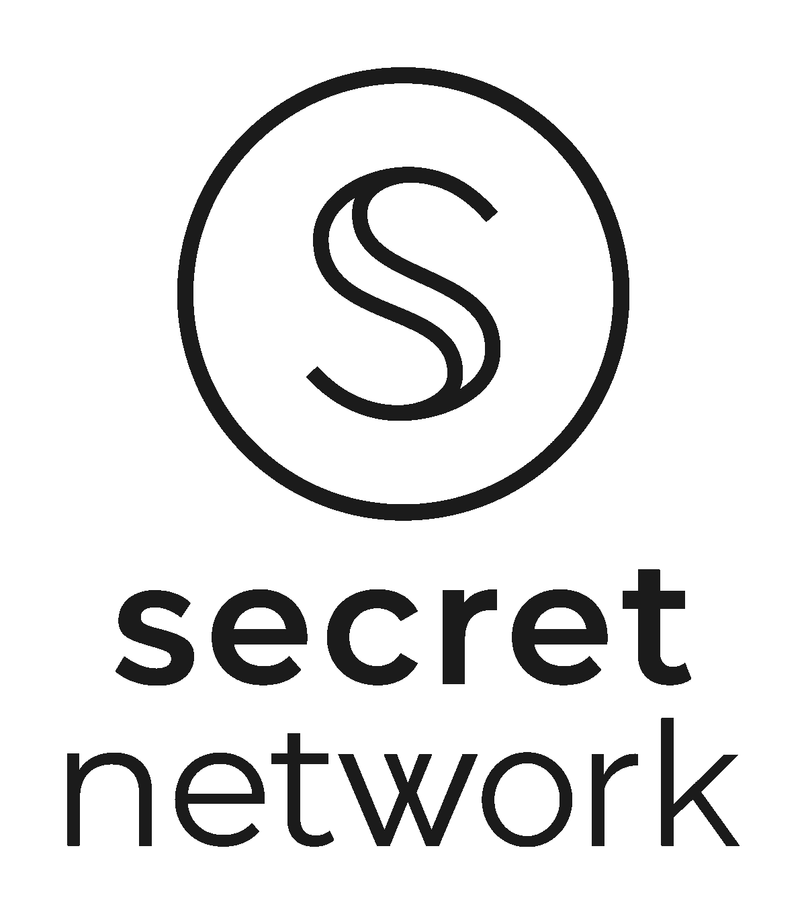
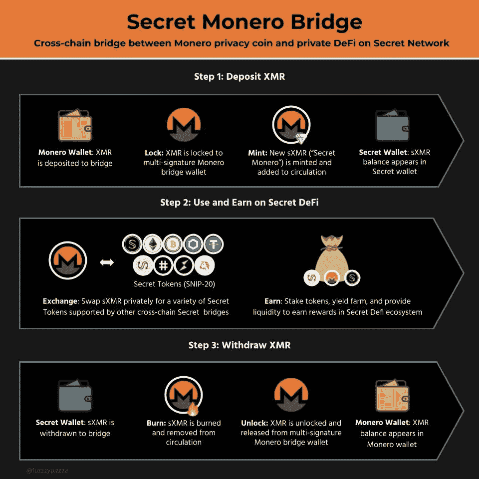

# 秘密网络更新

> 原文：<https://medium.com/coinmonks/secret-network-updates-5f4b7e92b552?source=collection_archive---------7----------------------->

## 对注重隐私的区块链及其如何改善 DeFi 和 NFTs 的新看法

Source: scrt.network

自从我[上次在三月份写](https://ampersandninja.medium.com/what-is-secret-network-d4e73013116c)关于[秘密网络](https://scrt.network/)以来，网络上已经不缺少进展了。专注于隐私的加密货币背后的团队一直在努力改善他们平台的许多方面。

尽管整个加密货币市场仍在试图从最近的“崩溃”中恢复，但尽管货币价值有所损失，项目仍在继续进行。这对于 crypto 整体来说是很好的，因为它显示了项目在面对大量疑问时的弹性。

## **secret WAP 更新**

这无疑是我认为生态系统中最有希望的部分。SecretSwap 是第一个进入私有 DeFi 的项目，在过去的几个月里已经取得了相当大的进展。SecretSwap 本身拥有超过 5000 万美元的流动性，其中超过 1 亿美元的以太坊资产正在投入使用。

v2 上周才发布，它拥有相当大的 UX 改进以及一些性能和稳定性变化。v2 可以在这里找到给那些有兴趣看到变化的人。用户界面仍然非常熟悉，但是与上一个版本相比更加精简了。另一个受欢迎的变化是增加了黑暗模式。

虽然 v2 是一个受欢迎的变化，但还有一些更令人兴奋的变化在进行中。目前，mainnet 提供了以太坊桥的访问，将 ETH 带到 SecretSwap。币安智能链和波尔卡多桥也在建设中。但是对于一个非常注重隐私的社区来说，有一个更好的选择即将出现:Monero 桥。

How the Monero Bridge works. (Source: scrt.network)

通过为 Monero 用户提供一个入口，现在有了一种自始至终私下参与平台的方式。由于 Monero 本质上是私有的，在入口点没有很多可识别的数据。从那里开始，当在平台上使用 sXMR 时，秘密契约接管并保留隐私。一旦用户想要将现金返还给 XMR，当它回到他们的 XMR 钱包时，隐私仍然会被保留。

这是我非常兴奋的事情，因为它将两个最私密的加密货币选项捆绑在了一个包中。我一直认为 Monero，XMR 是一个伟大的项目，并希望看到它蓬勃发展。我认为未来对这种加密的支持将有助于采用，并将志同道合的社区带入秘密网络生态系统。更多关于桥梁内部运作的信息可以在[这里](https://scrt.network/blog/secret-monero-bridge-is-live-on-testnet)找到。

## **秘密 NFTs**

另一个被取笑了一段时间的更新是在平台中包含了 NFTs。利用秘密契约和令牌的所有功能，不可替代的令牌现在很容易获得。Secret Network 通过积极开发用于 NFTs 的 [SNIP-721](https://github.com/SecretFoundation/SNIPs/blob/master/SNIP-721.md) 标准，走在了 NFT 发展曲线的前面。

SNIP-721 有助于构建一个开箱即用的可互操作的区块链，而无需在未来提供任何重大更新来实现这一目标。除了额外的互操作性和固有的私密性，它们的功能和其他 NFT 一样。它们仍然是唯一的标记，可以表示所有预期的属性和项目。更多关于秘密 NFT 的信息可以在[这里](https://scrt.network/blog/secret-nfts)找到。它还涵盖了该平台上未来 NFT 的一些实验性想法。

*秘密英雄*是开创 NFTs 的项目。这是一款关于区块链的超级英雄游戏。用户可以利用他们的 SCRT 和铸币厂英雄，然后在竞技场战斗。铸造英雄有独特的皮肤和技能。技能有随机生成的属性。一旦英雄被铸造并准备投入战斗，他们将与其他用户的英雄战斗。他们将根据战斗的结果获得或失去统计数据。

它很好地展示了 NFT 如何在这个平台上发展。《秘密英雄》于 5 月 11 日推出，它的推出号称网络上第二高的气体使用量，仅次于《秘密 wap 上的 SEFI》的推出。这是社区对游戏兴趣的一个很好的指标，即使在发布后，它仍然显示出有希望的数字。

## **最终想法**

抛开图表不谈，这是尝试参与秘密网络的绝佳时机。尽管最近价格回落，Secret Network 的交易量并没有真正放缓。在过去的 24 小时内，它目前的价格为 360 万美元，因此该硬币的交易量相当可观。现在的价格是进入这个平台的一个很好的切入点。截至发稿时，SCRT 的交易价格约为 1.80 美元。尽管在美国很难找到 SCRT，但我相信这个项目，并觉得它是值得的。

我在之前关于秘密网络的文章中提到了更多，但是隐私真的很重要。这就是为什么我发现它的 DeFi 产品比目前可能提供更好的 DeFi 功能的平台更有前途。它还很年轻，每天都在进步，所以我认为 SecretSwap 将来会发展成为令人惊叹的东西。更多桥梁的承诺也将允许更多的社区参与秘密网络。

将 Monero 与 Secret Network 结合起来对我来说几乎是不需要动脑筋的事情，也是我目前最兴奋的事情。随着加密货币继续被采用，隐私将变得更加令人担忧。这是秘密网络将蓬勃发展的地方，我认为随着时间的推移，它的价值只会继续增长。